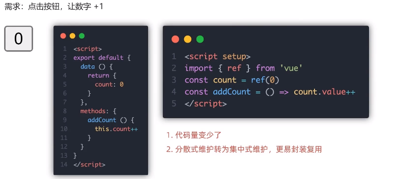
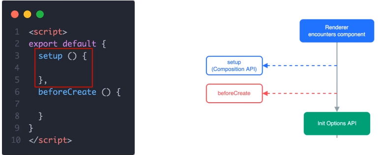
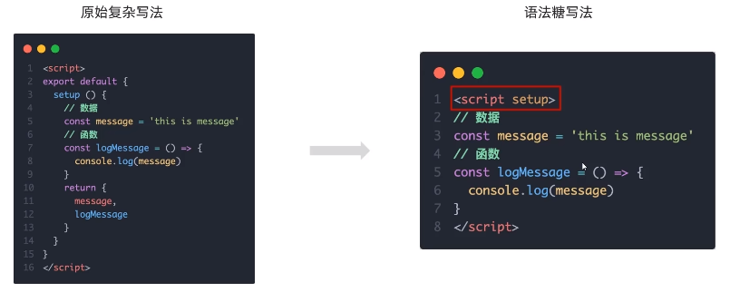
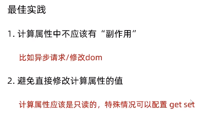

# 黑马程序员day8

## Vue组件库

vant，vue2对应vant2，vue3对应vant4

## vant全部导入和按需导入

推荐按需导入

## 项目中的vw适配

## 路由设计配置

## request模块 - axios封装

## 响应拦截器--统一处理错误提示

## storage存储模块 - vuex持久化处理

## loading效果
请求拦截器中，每次请求，打开loading

响应拦截器中，每次响应，关闭loading

## 页面访问拦截

