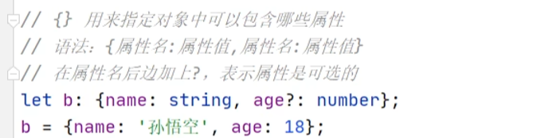

# 基础知识

## 与JavaScript的区别
typescript是JavaScript的超集，扩展了JavaScript的语法，因此现有的 JavaScript 代码可与 TypeScript 一起工作无需任何修改，TypeScript 通过类型注解提供编译时的静态类型检查。


typescript增加了：


## typescript安装
`tsc`
```
npm install -g typescript
```

`app.ts`：
```ts
// Greets the world.
console.log("Hello world!");
```

通过运行typescript包安装的命令tsc来检查：
```bash
tsc app.ts
```

得到了一些文件输出。tsc 编译或转换为纯 JavaScript 文件后 app.ts 文件的输出`app.js`。


使用node命令执行app.js文件：

```bash
node app.js
# Hello world!
```


## 数据类型

- string、number和boolean

- 数组
> number[];

- 字面类型
> 除了通用类型string和number之外，还可以在类型位置引用特定的字符串和数字
> 
> let x: "hello" = "hello";
> 
> 变量只能有一个值并没有多大用处，但是通过将字面组合成联合，可以表达一个更有用的概念
> 
> function printText(s: string, alignment: "left" | "right" | "center") {...}
> 
> printText("Hello, world", "left");
> 
> printText("G'day, mate", "centre");
> 


- any
> 不希望某个特定的值导致类型检查错误时，可以使用any
> 
> let obj:any={x:0};
> 
> 存在的问题：污染问题
> 
> 会“污染”其他变量。它可以赋值给其他任何类型的变量（因为没有类型检查），导致其他变量出错。
> 
```ts
let x:any = 'hello';
let y:number;

y = x; // 不报错

y * 123 // 不报错
y.toFixed() // 不报错

// 变量x的类型是any，实际的值是一个字符串。变量y的类型是number，表示这是一个数值变量，但是它被赋值为x，这时并不会报错。然后，变量y继续进行各种数值运算，TypeScript 也检查不出错误，问题就这样留到运行时才会暴露。
```


- unknown
> 与any含义相同，表示不确定，可能是任意类型，但使用不如any自由，可以视作严格版的any
>
> 所有类型的值都可以分配给unknown类型，但使用有几个限制
>
>1、unknown类型的变量，不能直接复制给其他类型的变量（除了any和unknown）
>
>2、不能直接调用unknown类型变量的方法和属性
>
>3、unknown类型变量能够进行的运算是有限的，只能进行比较运算（运算符==、===、!=、!==、||、&&、?）、取反运算（运算符!）、typeof运算符和instanceof运算符这几种，其他运算都会报错
>
>要使用unknown类型，只有经过“类型缩小”，就是缩小unknown变量的类型范围
>
>let a:unknown = 1;
>
>if (typeof a === 'number') {
> 
>  let r = a + 10; // 正确
> 
>}
> 
> 

- never
> “空类型”，即该类型为空，不包含任何值
> 
> 类型是never，就不可能赋给它任何值，否则都会报错
> 
> never类型的一个重要特点是，可以赋值给任意其他类型
> 


- null和underfunded
> 是两个独立类型，各自只有一个值
> 
> undefined表示未定义（即还未给出定义，以后可能会有定义）
> 
> null表示为空（即此处没有值）
> 

- 枚举

- bigint

- symbol

- 对象类型
> 要定义对象类型，只需要列出其属性及其类型
> 
> function printCoord(pt:{x:number; y:number}){}
> 
> printCoord({x:3,y:7});

`可选属性`：对象类型还可以指定它们的部分或全部属性是可选的，在属性名称后添加`?`即可
> 
> function printName(obj: { first: string; last?: string }) {}

- 联合类型
> 
> 联合类型是由两种或多种其他类型组成的类型，表示可能是这些类型中的任何一个值。这些类型中的每一种都称为联合的成员。使用符号`|`表示。
>  
> `使用时只需要提供与联合的任何成员匹配的类型即可`
> 
> function printId(id: number | string) {}
> 
> printId(101);
> 
> printId("202");
> 
>如果一个变量有多种类型，读取该变量时，往往需要进行“类型缩小”（type narrowing），`区分该值到底属于哪一种类型`，然后再进一步处理
>

```ts
function printId(
  id:number|string
) {
    console.log(id.toUpperCase()); // 报错
}
// 参数变量id可能是数值，也可能是字符串，这时直接对这个变量调用toUpperCase()方法会报错，因为这个方法只存在于字符串，不存在于数值

// 解决方法就是对参数id做一下类型缩小，确定它的类型以后再进行处理
function printId(
  id:number|string
) {
  if (typeof id === 'string') {
    console.log(id.toUpperCase());
  } else {
    console.log(id);
  }
}
```

- 交叉类型
> 
> 指多个类型组成的一个新类型，使用符号`&`表示
> 
> `A&B`，必须同时属于A和B类型，才属于交叉类型`A&B`
> 
> `let x:number&string;`
> 
> 变量x同时是数值和字符串，这当然是不可能的，所以 TypeScript 会认为x的类型实际是never
> 
> 交叉类型的主要用途是表示对象的合成
> 
> let obj:
>  { foo: string } &
>  { bar: string };
> 
> 交叉类型常常用来为对象类型添加新属性
> 
> type A = { foo: number };
>
> type B = A & { bar: number };

### type命令
type命令用来定义一个类型的别名

### typeof 运算符
JavaScript 语言中，typeof 运算符是一个一元运算符，返回一个字符串，代表操作数的类型

JavaScript 里面，typeof运算符只可能返回八种结果，而且都是字符串
```js
typeof undefined; // "undefined"
typeof true; // "boolean"
typeof 1337; // "number"
typeof "foo"; // "string"
typeof {}; // "object"
typeof parseInt; // "function"
typeof Symbol(); // "symbol"
typeof 127n // "bigint"
```

TypeScript 将typeof运算符移植到了类型运算，它的操作数依然是一个值，但是`返回的不是字符串，而是该值的 TypeScript 类型`

```ts
const a = { x: 0 };

type T0 = typeof a;   // { x: number }
type T1 = typeof a.x; // number
```


### 字面推理
当使用对象初始化变量时，typescript假定该对象的属性可能会在以后更改值。
```ts
declare const someCondition: boolean;

const obj = { counter: 0 };
if (someCondition) {
  obj.counter = 1;
}
```
TypeScript 不假定将 1 分配给先前具有 0 的字段是错误的。 另一种说法是 obj.counter 必须具有 number 类型，而不是 0，因为类型用于确定读取和写入行为

```ts
declare function handleRequest(url: string, method: "GET" | "POST"): void;

const req = { url: "https://example.com", method: "GET" };
handleRequest(req.url, req.method);

// req.method 被推断为 string，而不是 "GET"。因为可以在 req 的创建和 handleRequest 的调用之间评估代码，这可以将一个新的字符串（如 "GUESS" 分配给 req.method），TypeScript 认为此代码有错误

// 可以通过在任一位置添加类型断言来更改推理：
declare function handleRequest(url: string, method: "GET" | "POST"): void;

// Change 1:
const req = { url: "https://example.com", method: "GET" as "GET" };
// Change 2
handleRequest(req.url, req.method as "GET");

// 可以使用 as const 将整个对象转换为类型字面
declare function handleRequest(url: string, method: "GET" | "POST"): void;

const req = { url: "https://example.com", method: "GET" } as const;
handleRequest(req.url, req.method);
```


<!-- 
变量声明：
```ts
let a:number;
a=1;
// 需要指定变量类型，以后使用过程中只能是该类型
let c=false;
// 如果声明完变量直接进行赋值，ts可以自动对变量进行类型检测

function sum(a:number,b:number){
    return a+b;
}

// 指定返回值类型
function sum(a:number,b:number):number{
    return a+b;
}
``` -->


<!--  -->
<!--  -->

<!--  -->
<!--  -->
<!--  -->

<!--  -->

<!--  -->
<!--  -->

<!--  -->

<!--  -->
<!--  -->

<!--  -->

<!-- 枚举： -->
<!--  -->

<!--  -->

<!--  -->

### 类型别名  type
```ts
type Point = {
  x: number;
  y: number;
};

function printCoord(pt: Point) {
  console.log("The coordinate's x value is " + pt.x);
  console.log("The coordinate's y value is " + pt.y);
}

printCoord({ x: 100, y: 100 });

type ID = number | string;
```
### 接口  interface
接口声明是命名对象类型的另一种方式：

```ts
interface Point {
  x: number;
  y: number;
}

function printCoord(pt: Point) {
  console.log("The coordinate's x value is " + pt.x);
  console.log("The coordinate's y value is " + pt.y);
}

printCoord({ x: 100, y: 100 });
```

#### 类型别名和接口的区别
interface的几乎所有功能都在type中可用，主要区别在于无法重新打开类型以添加新属性，而接口始终可扩展

```ts
// 扩展接口
interface Animal{
  name:string
}

interface Bear extends Animal{
  honey:boolean
}

// 通过交集扩展类型
type Animal={
  name:string
}

type Bear=Animal & {
  honey:boolean
}

// 向现有接口添加新字段
interface Window {
  title: string
}

interface Window {
  ts: TypeScriptAPI
}

const src = 'const a = "Hello World"';
window.ts.transpileModule(src, {});


// 类型创建后无法更改
type Window = {
  title: string
}

type Window = {
  ts: TypeScriptAPI
}
 // Error: Duplicate identifier 'Window'.
```

### 类型断言
有时候会得到TypeScript无法知道类型的信息，typescript进行类型推断的结果未必是开发者想要的

可以使用类型断言来指定更具体的类型，告诉编译器此处的值是什么类型，typescript一旦发现存在类型断言，就不再对该值进行类型推断，而是直接采用断言给出的类型

实质上是允许开发者在某个位置绕过编译器的类型推断，让本来通不过的类型检查代码能够通过，避免编译器报错。

这样虽然削弱了typescript类型系统的严格性，但为开发者带来了方便

**as**
```ts
const myCanvas = document.getElementById("main_canvas") as HTMLCanvasElement;

type T='a'|'b'|'c'

let foo='a'
let bar:T=foo as T;
```

**尖括号语法**
```ts
const myCanvas = <HTMLCanvasElement>document.getElementById("main_canvas");
```

尖括号语法会跟JSX语法冲突，使用时必须关闭Typescript的react支持，否则会无法识别，所以一般使用as语法

#### 类型断言的条件
值是实际类型与断言的类型必须满足一个条件
```ts
expr as T
```

expr是实际的值，T是类型断言，必须满足的条件是：expr是T的子类型，或者T是expr的子类型

也就是说，类型断言要求实际的类型与断言的类型兼容，实际类型可以断言一个更加宽泛的类型（父类型），也可以断言为一个更加精确的类型（子类型），但不能断言为一个完全无关的类型。

但断言成一个完全无关的类型，也是可以做到的，连续进行两次类型断言，先断言成unknown类型或者any类型，然后再断言成目标类型。

#### as const断言
如果没有声明变量类型，let命令声明的变量，会被类型推断为typescript内置的基本类型之一；const声明的变量，则被推断为值类型常量

相当于 const 命令有更强的限定作用，可以缩小变量的类型范围。

有些时候，let 变量会出现一些意想不到的报错，变更成 const 变量就能消除报错。

```ts
let s = 'JavaScript';

type Lang =
  |'JavaScript'
  |'TypeScript'
  |'Python';

function setLang(language:Lang) {
  /* ... */
}

setLang(s); // 报错

// 原因是函数setLang()的参数language类型是Lang，这是一个联合类型。但是，传入的字符串s的类型被推断为string，属于Lang的父类型。父类型不能替代子类型，导致报错。

// 一种解决方法就是把 let 命令改成 const 命令。
const s = 'JavaScript';

// 另一种解决方法是使用类型断言。TypeScript 提供了一种特殊的类型断言as const，用于告诉编译器，推断类型时，可以将这个值推断为常量，即把 let 变量断言为 const 变量，从而把内置的基本类型变更为值类型。

let s = 'JavaScript' as const;
setLang(s);  // 正确
```

使用了as const断言以后，let 变量就不能再改变值了。

as const断言只能用于字面量，不能用于变量。

as const也不能用于表达式。

```ts
let s = 'JavaScript';
setLang(s as const); // 报错

let s = ('Java' + 'Script') as const; // 报错
```

as const也可以写成前置的形式。
```ts
// 后置形式
expr as const

// 前置形式
<const>expr
```

as const断言可以用于整个对象，也可以用于对象的单个属性，这时它的类型缩小效果是不一样的

#### 非空断言运算符（后缀！）
可以在不进行任何显式检查的情况下从类型中删除null和undefined，在任何表达式之后写`!`实际上是一个类型断言，该值不是null或undefined

```ts
function liveDangerously(x?:number | null){
  console.log(x!.toFixed());
}
```

非空断言有时可以省去一些额外的判断

非空断言会造成安全隐患，只有在确定一个表达式的值不为空时才能使用

非空断言还可以用于赋值断言。TypeScript 有一个编译设置，要求类的属性必须初始化（即有初始值），如果不对属性赋值就会报错

```ts
class Point {
  x:number; // 报错
  y:number; // 报错

  constructor(x:number, y:number) {
    // ...
  }
}

// 可以使用非空断言，表示这两个属性肯定会有值，这样就不会报错了
class Point {
  x!:number; // 正确
  y!:number; // 正确

  constructor(x:number, y:number) {
    // ...
  }
}
```

#### 断言函数

断言函数是一种特殊函数，用于保证函数参数符合某种类型

如果函数参数达不到要求，就会抛出错误，中断程序执行；如果达到要求，就不进行任何操作，让代码按照正常流程运行。

```ts
function isString(value:unknown):void {
  if (typeof value !== 'string')
    throw new Error('Not a string');
}
```

传统的断言函数isString()的写法有一个缺点，它的参数类型是unknown，返回值类型是void（即没有返回值）。单单从这样的类型声明，很难看出isString()是一个断言函数。

为了更清晰地表达断言函数，TypeScript 3.7 引入了新的类型写法。

```ts
function isString(value:unknown):asserts value is string {
  if (typeof value !== 'string')
    throw new Error('Not a string');
}
```

## 编译选项

### 自动编译文件
编译文件时，使用 -w 指令后，TS编译器会自动监视文件的变化，并在文件发生变化时对文件进行重新编译。

```bash
tsc xxx.ts -w
```

### 自动编译整个项目

- 直接使用tsc指令，可以自动将当前项目下的所有ts文件编译为js文件

- 直接使用tsc命令的前提是，在项目根目录下创建一个ts的配置文件tsconfig.json


配置选项：

- include

  - 定义希望被编译文件所在的目录

  - 默认值：["\*\*/\*"]

  - 示例：

    - ```json
      "include":["src/**/*", "tests/**/*"]
      ```

    - 上述示例中，所有src目录和tests目录下的文件都会被编译

- exclude

  - 定义需要排除在外的目录

  - 默认值：["node_modules", "bower_components", "jspm_packages"]

  - 示例：

    - ```json
      "exclude": ["./src/hello/**/*"]
      ```

    - 上述示例中，src下hello目录下的文件都不会被编译

- extends

  - 定义被继承的配置文件

  - 示例：

    - ```json
      "extends": "./configs/base"
      ```

    - 上述示例中，当前配置文件中会自动包含config目录下base.json中的所有配置信息

- files

  - 指定被编译文件的列表，只有需要编译的文件少时才会用到

  - 示例：

    - ```json
      "files": [
          "core.ts",
          "sys.ts",
          "types.ts",
          "scanner.ts",
          "parser.ts",
          "utilities.ts",
          "binder.ts",
          "checker.ts",
          "tsc.ts"
        ]
      ```

    - 列表中的文件都会被TS编译器所编译

  - compilerOptions

    - 编译选项是配置文件中非常重要也比较复杂的配置选项

    - 在compilerOptions中包含多个子选项，用来完成对编译的配置

      - 项目选项

        - target

          - 设置ts代码编译的目标版本

          - 可选值：

            - ES3（默认）、ES5、ES6/ES2015、ES7/ES2016、ES2017、ES2018、ES2019、ES2020、ESNext

          - 示例：

            - ```json
              "compilerOptions": {
                  "target": "ES6"
              }
              ```

            - 如上设置，我们所编写的ts代码将会被编译为ES6版本的js代码

        - lib

          - 指定代码运行时所包含的库（宿主环境）

          - 可选值：

            - ES5、ES6/ES2015、ES7/ES2016、ES2017、ES2018、ES2019、ES2020、ESNext、DOM、WebWorker、ScriptHost ......

          - 示例：

            - ```json
              "compilerOptions": {
                  "target": "ES6",
                  "lib": ["ES6", "DOM"],
                  "outDir": "dist",
                  "outFile": "dist/aa.js"
              }
              ```

        - module

          - 设置编译后代码使用的模块化系统

          - 可选值：

            - CommonJS、UMD、AMD、System、ES2020、ESNext、None

          - 示例：

            - ```typescript
              "compilerOptions": {
                  "module": "CommonJS"
              }
              ```

        - outDir

          - 编译后文件的所在目录

          - 默认情况下，编译后的js文件会和ts文件位于相同的目录，设置outDir后可以改变编译后文件的位置

          - 示例：

            - ```json
              "compilerOptions": {
                  "outDir": "dist"
              }
              ```

            - 设置后编译后的js文件将会生成到dist目录

        - outFile

          - 将所有的文件编译为一个js文件

          - 默认会将所有的编写在全局作用域中的代码合并为一个js文件，如果module制定了None、System或AMD则会将模块一起合并到文件之中

          - 示例：

            - ```json
              "compilerOptions": {
                  "outFile": "dist/app.js"
              }
              ```

        - rootDir

          - 指定代码的根目录，默认情况下编译后文件的目录结构会以最长的公共目录为根目录，通过rootDir可以手动指定根目录

          - 示例：

            - ```json
              "compilerOptions": {
                  "rootDir": "./src"
              }
              ```

        - allowJs

          - 是否对js文件编译

        - checkJs

          - 是否对js文件进行检查

          - 示例：

            - ```json
              "compilerOptions": {
                  "allowJs": true,
                  "checkJs": true
              }
              ```

        - removeComments

          - 是否删除注释
          - 默认值：false

        - noEmit

          - 不对代码进行编译
          - 默认值：false

        - sourceMap

          - 是否生成sourceMap
          - 默认值：false

          

      - 严格检查

        - strict
          - 启用所有的严格检查，默认值为true，设置后相当于开启了所有的严格检查
        - alwaysStrict
          - 总是以严格模式对代码进行编译
        - noImplicitAny
          - 禁止隐式的any类型
        - noImplicitThis
          - 禁止类型不明确的this
        - strictBindCallApply
          - 严格检查bind、call和apply的参数列表
        - strictFunctionTypes
          - 严格检查函数的类型
        - strictNullChecks
          - 严格的空值检查
        - strictPropertyInitialization
          - 严格检查属性是否初始化

      - 额外检查

        - noFallthroughCasesInSwitch
          - 检查switch语句包含正确的break
        - noImplicitReturns
          - 检查函数没有隐式的返回值
        - noUnusedLocals
          - 检查未使用的局部变量
        - noUnusedParameters
          - 检查未使用的参数

      - 高级

        - allowUnreachableCode
          - 检查不可达代码
          - 可选值：
            - true，忽略不可达代码
            - false，不可达代码将引起错误
        - noEmitOnError
          - 有错误的情况下不进行编译
          - 默认值：false


## 参考链接

[https://www.runoob.com/typescript/ts-tutorial.html](https://www.runoob.com/typescript/ts-tutorial.html)

[https://nodejs.cn/typescript/handbook/](https://nodejs.cn/typescript/handbook/)


