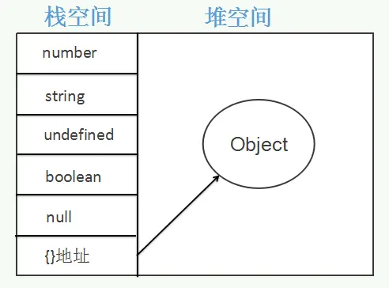

# JS 执行上下文和执行栈

## 执行上下文的类型

总共由三个类型：

1、全局执行上下文：只有一个，浏览器中的全局对象就是 window 对象，this 指向这个全局对象

2、函数执行上下文：存在无数个，只有在函数被调用的时候才会被创建，每次调用函数都会创建一个新的执行上下文

3、Eval 函数执行上下文：指的是运行在 eval 函数中的代码，很少用而且不建议使用

## 执行栈

执行栈，也叫调用栈，具有 LIFO（后进先出）结构，用于存储在代码执行期间创建的所有执行上下文

首次运行 JS 代码时，会创建一个`全局执行上下文`并 push 到当前的执行栈中。每当发生函数调用，引擎都会为该函数创建一个`新的函数执行上下文`并 push 到当前执行栈的栈顶

根据执行栈 LIFO 规则，当栈顶函数运行完成后，其对应的函数执行上下文将会从执行栈 Pop 出，上下文控制权将移到当前栈的下一个执行上下文

另一种描述：

> 可以把执行栈认为是一个存储函数调用的栈结构，遵循先进后出的原则，当开始执行JS代码时，根据先进后出的原则，后执行的函数会先弹出栈

## 执行上下文的创建

### 创建阶段

1、确定 this 的值，也被称为 This Binding

2、LexicalEnvironment(词法环境)组件被创建

3、VariableEnvironment(变量环境)组件被创建

```js
// 伪码
ExecutionContext={
    ThisBinding=<this value>, //确定this
    LexicalEnvironment={ ... }, //词法环境
    VariableEnvironment= { ... }, //变量环境
}
```

#### This Binding

- 全局执行上下文，this 指向全局对象，浏览器中是 window 对象，nodejs 中是文件的 module 对象

- 函数执行上下文中，this 取决于函数的调用方式。（[this 的绑定](https://qwangry.github.io/%E5%89%8D%E7%AB%AF%E9%9D%A2%E8%AF%95/JavaScript/%E6%B1%87%E6%80%BB1#%E9%BB%98%E8%AE%A4%E7%BB%91%E5%AE%9A%E8%A7%84%E5%88%99)）

##### 词法环境

有两个组成部分：

1、环境记录：存储变量和函数声明的实际位置

2、对外部环境的引用：可以访问其外部词法环境

两种类型：

1、全局环境：是一个没有外部环境的词法环境，外部环境引用为 null。拥有一个全局对象（window 对象）及其关联的方法和属性（例如数组方法）以及任何用户自定义的全局变量，this 的值指向这个全局对象。

2、函数环境：用户在函数中定义的变量被存储在环境记录中，包含了 arguments 对象。对外部环境的引用可以是全局环境，也可以是包含内部函数的外部函数环境。

```js
GlobalExectionContext = {  // 全局执行上下文
  LexicalEnvironment: {    	  // 词法环境
    EnvironmentRecord: {   		// 环境记录
      Type: "Object",      		   // 全局环境
      // 标识符绑定在这里
      outer: <null>  	   		   // 对外部环境的引用
  }
}

FunctionExectionContext = { // 函数执行上下文
  LexicalEnvironment: {  	  // 词法环境
    EnvironmentRecord: {  		// 环境记录
      Type: "Declarative",  	   // 函数环境
      // 标识符绑定在这里 			  // 对外部环境的引用
      outer: <Global or outer function environment reference>
  }
}
```

#### 变量环境

变量环境也是一个词法环境，因此它具有上面定义的词法环境的所有属性

在 ES6 中，`词法环境`和 `变量环境`的区别在于前者用于存储**函数声明和变量（ let 和 const ）绑定，而后者仅用于存储变量（ var ）**绑定。

```js
let a = 20;
const b = 30;
var c;

function multiply(e, f) {
 var g = 20;
 return e * f * g;
}

c = multiply(20, 30);

// 执行上下文
GlobalExectionContext = {

  ThisBinding: <Global Object>,

  LexicalEnvironment: {
    EnvironmentRecord: {
      Type: "Object",
      // 标识符绑定在这里
      a: < uninitialized >,
      b: < uninitialized >,
      multiply: < func >
    }
    outer: <null>
  },

  VariableEnvironment: {
    EnvironmentRecord: {
      Type: "Object",
      // 标识符绑定在这里
      c: undefined,
    }
    outer: <null>
  }
}

FunctionExectionContext = {

  ThisBinding: <Global Object>,

  LexicalEnvironment: {
    EnvironmentRecord: {
      Type: "Declarative",
      // 标识符绑定在这里
      Arguments: {0: 20, 1: 30, length: 2},
    },
    outer: <GlobalLexicalEnvironment>
  },

  VariableEnvironment: {
    EnvironmentRecord: {
      Type: "Declarative",
      // 标识符绑定在这里
      g: undefined
    },
    outer: <GlobalLexicalEnvironment>
  }
}
```

变量提升的原因：在创建阶段，函数声明存储在环境中，而变量会被设置为 undefined（在 var 的情况下）或保持未初始化（在 let 和 const 的情况下）。所以这就是为什么可以在声明之前访问 var 定义的变量（尽管是 undefined ），但如果在声明之前访问 let 和 const 定义的变量就会提示引用错误的原因。这就是所谓的变量提升。

### 执行阶段

此阶段，完成对所有变量的分配，最后执行代码。

如果 Javascript 引擎在源代码中声明的实际位置找不到 let 变量的值，那么将为其分配 undefined 值。

## JS 变量

- 基本类型（undefined、null、Boolean、number、string）——原始值（原始值代表了原始的数据类型）。基本类型在内存中占据空间小、大小固定，它们的值保存在栈空间，是按值来访问

- 引用类型（object，function，array 等）——引用值。引用类型占据空间大、大小不固定，栈内存中存放地址指向堆内存中的对象，是按引用访问的



### 堆栈内存

1、内存大概分为 4 块

- 栈内存：存放基本变量和对象的引用

> 由系统自动分配和释放
> 
> undefined，null，boolean，number，string


- 堆内存存放对象

> 栈内存中的引用指向堆内存对应的对象
>
> 动态分配的内存，大小不定也不会自动释放

- 静态变量区，存放静态变量

- 程序区，存放系统程序

2、堆栈的优缺点

- 栈的优势是，存取速度比堆要快，仅次于直接位于 CPU 中的寄存器，但缺点是，在栈中的数据大小与生存期必须是确定的，缺乏灵活性。另外，栈数据可以共享。

- 堆的优势是可以动态地分配内存大小，生存期也不必事先告诉编译器，但缺点是，由于要在运行时动态分配内存，存取速度较慢。

## 内存的生命周期

1、分配所需要的内存

2、使用分配到的内存（读、写）

3、不需要时将其释放/归还

## JS 的内存分配

1、值的初始化

- JavaScript 在定义变量时就完成了内存分配

```js
var n = 123; // 给数值变量分配内存
var s = "azerty"; // 给字符串分配内存

var o = {
  a: 1,
  b: null,
}; // 给对象及其包含的值分配内存
```

- 通过函数调用的内存分配

有些函数调用结果是分配对象内存

```js
var d = new Date(); // 分配一个 Date 对象

var e = document.createElement("div"); // 分配一个 DOM 元素
```

有些方法分配新变量或者新对象：

```js
var s = "azerty";
var s2 = s.substr(0, 3); // s2 是一个新的字符串
// 因为字符串是不变量，
// JavaScript 可能决定不分配内存，
// 只是存储了 [0-3] 的范围。

var a = ["ouais ouais", "nan nan"];
var a2 = ["generation", "nan nan"];
var a3 = a.concat(a2);
// 新数组有四个元素，是 a 连接 a2 的结果
```

2、值的使用

使用值的过程实际上是对分配内存进行读取与写入的操作，读取与写入可能写入一个变量或者一个对象的属性值，甚至传递函数的参与

3、内存不再需要使用时释放

## 垃圾回收

一个方法执行时，每个方法都会建立自己的内存栈，在这个方法内定义的变量将会逐个放入这些栈存里，随着方法的执行结束，这个方法的栈存也将自然销毁了，因此，所有在方法中定义的变量都是放在栈内存中的

在程序创建一个对象时，这个对象被保存到运行时数据区中，一遍反复利用，这个运行时数据区就是堆内存。堆内存中的对象不会随着方法的结束而销毁，即使方法结束后，这个对象还可能被另一个引用变量所引用，则这个对象依然不会被销毁。只有当一个对象没有任何引用变量引用它时，系统的垃圾回收机制才会在核实的时候回收它


### 分代策略

脚本中，绝大多数对象的生存期很短，只有某些对象的生存期较长，为利用这一特点，v8将堆进行了分代。

对象起初会被分配在`新生区`，在新生区的内存分配非常容易，只需要保有一个指向内存区的指针，不断根据新对象的大小对其进行递增即可。

当该指针达到新生区的末尾，就会有一次清理（小周期），清理掉新生区中不活跃的死对象

对于活跃`超过两个小周期`的对象，则需要将其移动至`老生区`

在老生区则使用标记清除算法进行垃圾回收

V8通过分别对新生代对象和老生代对象使用不同的垃圾回收算法来提升垃圾回收的效率

这就是所谓的`分代策略`

> 默认情况下，64位环境下V8引擎的新生代内存大小32MB、老生代内存大小为1400MB，而32位则减半，分别为16MB和700MB

根据分代策略，V8将堆空间进行了分隔：

- 新生区
>大多数对象被分配在这里，新生区是一个很小的区域，垃圾回收在这个区域非常频繁，与其他区域相独立

- 老生指针区
> 包含大多数可能存储指向其他对象的指针的对象，大多数在新生区存活了一段时间（2个周期）的对象都会被挪到这里

- 老生数据区
> 这里存放只包含原始数据的对象，这些对象没有执行其他对象的指针，例如字符串、数字数组等，它们在新生区存活了一段时间后会被移动到这里

- 大对象区
> 每一个区域都是由一组内存页构成的。除大对象区的内存页较大之外，每个区的内存页都是1MB大小，且按1MB内存对齐。对象超过一定大小时就会被放置到这个区，垃圾回收期从不移动这个区域的对象

- 代码区
> 代码对象，也就是包含JIT之后指令的对象，会被分配到这里。这里是唯一拥有执行权限的内存区（如果代码对象因过大而被放到大对象区，则该大对象所对应的内存也是可执行的）

- Cell区、属性Cell区、Map区
> 这些区域存放Cell，属性Cell和Map，每个区域因为都是存储相同大小的元素，因此内存结构很简单

node-v4.x之后，区域进行了合并位：新生区、老生区、大对象区、Map区、Code区

对于一个对象所占的内存空间，也涉及两个概念：shallow size和retained size

- shallow size就是对象本身占用内存的大小，不包含其引用的对象。常规对象（非数组）的shallow size有其成员变量的数量和类型决定。

- retained size：是该对象自己的shallow size，加上从该对象能直接或间接访问到对象的shallow size之和，换句话说，retained size是该对象被GC之后所能回收到内存的总和


垃圾回收释放的内存就是retained size的大小

### 新生区的半空间分配策略

新生代使用半空间（Semi-space）分配策略，其中新对象最初分配在新生代的活跃半空间内。一旦半空间已满，一个Scavenge操作将活跃对象移出到其他半空间中，被认为是长期驻存的对象，并被晋升为老生代。一旦活跃对象已被移出，则在旧半空间中剩下的任何死亡对象被丢弃。

具体来说，内存空间被分为两部分：From和To，所有内存从To空间被分配出去，当To满时，开始触发GC

当To为ABC分配内存之后，只剩一小块内存未分配，此时From所有的内存都空闲

当此时为D分配内存时，D需要的大小超出To未分配的内存，就会触发GC，页面停止执行

接着From和To进行对换，即原来的To空间被标志位From，From被标志为To，并且把获得变量值（B）标志出来，而垃圾（A、C）未被标志，将被清掉

活跃的B会被复制到To，而垃圾A、C被回收，同时D被分配到To空间

GC完成，此过程页面会阻塞，所以要尽可能快

#### 对象的晋升

当一个新生代的对象在满足一定条件下，会从新生代被移到老生代，这就是对象的晋升，具体的移动标准有两种：

1、对象从From复制到To，会检查它的内存地址判断这个对象是否经历过一次新生代的清理结果，如果是，则赋值到老生代中，否则，赋值到To空间中

2、对象从From复制到To，如果To已经被使用了超过25%，那么这个对象直接被复制到老生代


### 老生代：V8采用Mark-Sweep和Mark-compact相结合的垃圾回收策略


### 引用

垃圾回收算法主要依赖于引用（reference）的概念。在内存管理的环境中，一个对象如果有访问另一个对象的权限（隐式或者显式），叫做一个对象引用另一个对象。

#### 引用计数垃圾收集

这是最简单的垃圾收集算法。此算法把“对象是否不再需要”简化定义为“对象有没有其他对象引用到它”。如果没有引用指向该对象（零引用），对象将被垃圾回收机制回收。

限制：循环引用

```js
var o = {
  a: {
    b: 2,
  },
};
// 两个对象被创建，一个作为另一个的属性被引用，另一个被分配给变量o
// 很显然，没有一个可以被垃圾收集

var o2 = o; // o2变量是第二个对“这个对象”的引用

o = 1; // 现在，“这个对象”的原始引用o被o2替换了

var oa = o2.a; // 引用“这个对象”的a属性
// 现在，“这个对象”有两个引用了，一个是o2，一个是oa

o2 = "yo"; // 最初的对象现在已经是零引用了
// 他可以被垃圾回收了
// 然而它的属性a的对象还在被oa引用，所以还不能回收

oa = null; // a属性的那个对象现在也是零引用了
// 它可以被垃圾回收了
```

### 标记-清除算法

这个算法把“对象是否不再需要”简化定义为“对象是否可以获得”

这个算法假定设置一个叫做根 root 的对象（JavaScript 中，根是全局对象）。

定期的，垃圾回收器将从根开始，找所有从根开始引用的对象，然后找这些对象引用的对象……从根开始，垃圾回收器将找到所有可以获得的对象和所有不能获得的对象。

从 2012 年起，所有现代浏览器都使用了标记-清除垃圾回收算法。所有对 JavaScript 垃圾回收算法的改进都是基于标记-清除算法的改进，并没有改进标记-清除算法本身和它对“对象是否不再需要”的简化定义。

限制: 那些无法从根对象查询到的对象都将被清除

**标记阶段**

所有堆上活跃的对象都会被标记，每个内存页有一个用来标记对象的位图，位图的每一位对应的内存页中的一个字，这个位图需要占据一定的空间，另外还有两位用来标记对象的状态：

- 如果一个对象为白对象，表示还未被垃圾回收器发现

- 如果一个对象为灰对象，表示已经被垃圾回收器发现，但其邻接对象尚未处理

- 如果一个对象为黑对象，表示已被垃圾回收器发现，其邻接对象已全部处理


### Compact整理

标记清除的问题是进行一次标记清除后，内存空间往往是不连续的，会出现很多的内存碎片，如果后续需要分配一个需要内存空间较多的对象时，如果所有的内存碎片都不够用，将会使得V8无法完成这次分配，提前触发垃圾回收

标记整理就是为了解决标记清除带来的内存碎片问题，标记整理在标记清除的基础进行修改，将其的清除阶段变为紧缩阶段，在整理的过程中，将活着的对象向内存区的一段移动，移动完成后直接清理掉边界外的内存，紧缩过程涉及对象的移动，所以效率并不是太好，但是能保证不会生成内存碎片

## 内存优化

就全局变量而言，JavaScript 不能确定它在后面不能够被用到，所以它会从声明之后就一直存在于内存中，直至手动释放或者关闭页面/浏览器，这就导致了某些不必要的内存消耗

### 使用立即执行函数

```js
(function () {
  // 你的代码
})();
// 或者
(function (window) {
  // 你的代码
})(window);
```

### 手动解除变量的引用

```js
var obj = { a: 1, b: 2, c: 3 };
obj = null;
```

### 使用回调

JavaScript 中，闭包是最容易产生内存问题的，可以使用回调函数代理闭包来访问内部变量。

使用回调的好处就是（针对访问的内部变量是原始类型的值，因此在函数传参的时候传的是值），在执行完后会自动释放其中的变量，不会像闭包一样一直将内部变量存在于内存中（但如果是引用类型，那么这个被引用的对象依旧在内存中）

```js
function fn_a() {
  var value = "hello world";
  return function () {
    return value;
  };
}
var getValue = fn_a();
var v = getValue(); // --> "Hello World"
// 在上面的代码中，虽然函数已经执行完毕，但是对于函数中变量value的引用还在，所以垃圾回收机制不会将函数中的value清理。
```

```js
function fn_a(callback) {
  var value = "hello world";
  return callback(value);
}

function fn_b(arg) {
  return arg;
}

var v = fn_a(fn_b);
```

需要注意，使用回调将会导致异步

并不是说明这样做就一定比闭包好，闭包也有其好处，只是需要我们分清何时何地去使用才是恰当的。

## 内存泄漏

### 意外的全局变量

1、未声明的变量：在函数中给一个变量赋值但没有声明它，此时相当于是 window 对象下的一个变量，全局变量很难被垃圾回收

2、使用 this 创建的变量：函数中使用 this.xx 赋值，但此时 this 指向的是 window

避免此情况的解决办法是`在JavaScript文件头部或者函数的顶部加上 use strict`，开启严格模式，使得 this 的指向为 undefined

### 被遗忘的计时器或回调函数

1、定时器引起：当定时器里面的数据不再需要时，定时器依旧只想这些数据

2、对象观察者：(未销毁的事件监听器)

```js
var btn = document.getElementById("btn");
function onClick(element) {
  element.innerHTMl = "I'm innerHTML";
}
btn.addEventListener("click", onClick);
```

对于上面观察者的例子，一旦它们不再需要（或者关联的对象变成不可达），明确地移除它们非常重要。老的 IE 6 是无法处理循环引用的。因为老版本的 IE 是无法检测 DOM 节点与 JavaScript 代码之间的循环引用，会导致内存泄漏。

但是，现代的浏览器（包括 IE 和 Microsoft Edge）使用了更先进的垃圾回收算法（标记清除），已经可以正确检测和处理循环引用了。即回收节点内存时，不必非要调用 removeEventListener 了。

### 脱离 DOM 的引用

如果把 DOM 存成字典（JSON 键值对）或者数组，此时，同样的 DOM 元素存在两个引用：一个在 DOM 树中，另一个在字典中。那么将来需要把两个引用都清除。

### 闭包

闭包的关键就是匿名函数能够访问父级作用域中的变量

## 参考

[https://wuch886.gitbooks.io/front-end-handbook/content/jszhong-de-nei-cun-guan-li-ff08-zhan-he-dui-ff09.html](https://wuch886.gitbooks.io/front-end-handbook/content/jszhong-de-nei-cun-guan-li-ff08-zhan-he-dui-ff09.html)

[https://muyiy.cn/blog/1/1.1.html#%E6%89%A7%E8%A1%8C%E6%A0%88](https://muyiy.cn/blog/1/1.1.html#%E6%89%A7%E8%A1%8C%E6%A0%88)

[https://juejin.cn/post/6844904038064979981?searchId=2024091122154056F941DE48ADB1B375BE](https://juejin.cn/post/6844904038064979981?searchId=2024091122154056F941DE48ADB1B375BE)

[https://segmentfault.com/a/1190000006104910](https://segmentfault.com/a/1190000006104910)