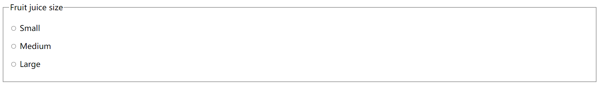
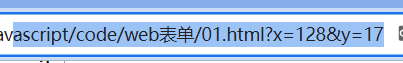
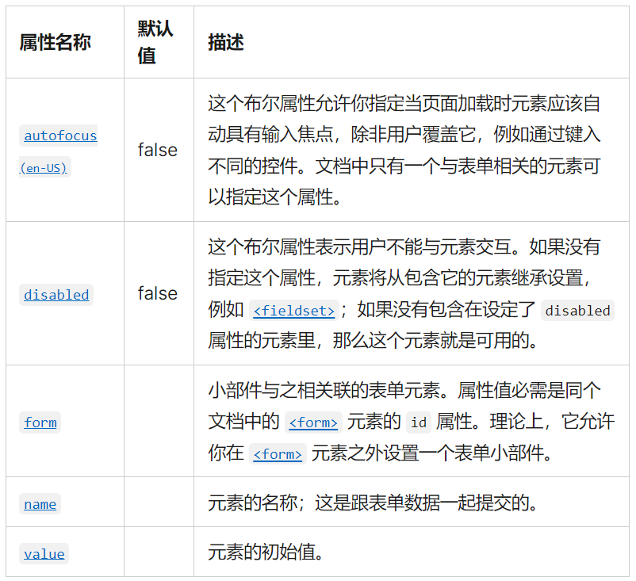
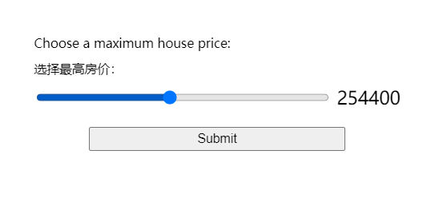
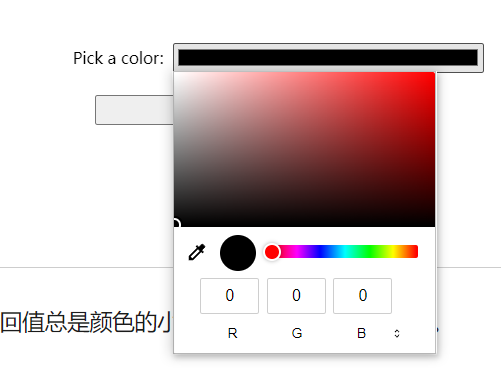
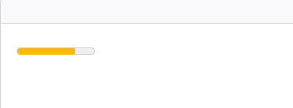
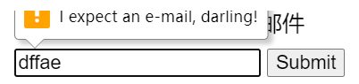

# web表单

## 第一个表单
```html
    <form action="/my-handling-form-page" method="post">
        <ul>
            <li>
                <label for="name">Name:</label>
                <input type="text" id="name" name="user_name" />
            </li>
            <li>
                <label for="mail">E-mail:</label>
                <input type="email" id="mail" name="user_email" />
            </li>
            <li>
                <label for="msg">Message:</label>
                <textarea id="msg" name="user_message"></textarea>
            </li>
            <li class="button">
                <button type="submit">Send your message</button>
            </li>
        </ul>
    </form>
```

其中`<label>`标签使用for属性，是将标签链接到表单控件的一种正规方式。这个属性引用对应的表单控件的id。

`<input>`的默认值使用value属性。
```html
<input type="text" value="by default element is filled with this text"/>
```
`<textarea>`默认值是在元素开始和结束标记之间放置默认值。
```html
<textarea>
by default this element is filled with this text
</textarea>
```

## 表单的元素

### `<from>`元素

`<form>` 元素按照一定的格式定义了表单和确定表单行为的属性。当想要创建一个 HTML 表单时，都必须从这个元素开始，然后把所有内容都放在里面。

### `<fieldset>` 和 `<legend>` 元素

`<fieldset>`元素是一种方便的用于创建具有相同目的的小部件组的方式，出于样式和语义目的

可以在`<fieldset>`开口标签后加上一个 `<legend>`元素来给`<fieldset>` 标上标签。

 `<legend>`的文本内容正式地描述了`<fieldset>`里所含有部件的用途。

示例：
```html
<form>
  <fieldset>
    <legend>Fruit juice size</legend>
    <p>
      <input type="radio" name="size" id="size_1" value="small" />
      <label for="size_1">Small</label>
    </p>
    <p>
      <input type="radio" name="size" id="size_2" value="medium" />
      <label for="size_2">Medium</label>
    </p>
    <p>
      <input type="radio" name="size" id="size_3" value="large" />
      <label for="size_3">Large</label>
    </p>
  </fieldset>
</form>
```

效果图：


当有一组单选按钮时，应该将它们嵌套在`<fieldset>`元素中。

还有其他用例，一般来说，`<fieldset>`元素也可以用来对表单进行分段。

### `<label>`元素

`<label>` 元素是为 HTML 表单小部件定义标签的正式方法。
```html
<label for="name">Name:</label> <input type="text" id="name" name="user_name" />
```
`<label>` 标签与 `<input>` 通过他们各自的for 属性和 id 属性正确相关联（label 的 for 属性和它对应的小部件的 id 属性）

**标签也可点击**
正确设置标签的另一个好处是可以在所有浏览器中单击标签来激活相应的小部件。

**多个标签**
在多个标签的情况下，应该将一个小部件和它的标签嵌套在一个`<label>`元素中。

```html
<p>Required fields are followed by <abbr title="required">*</abbr>.</p>

<!--这样写：-->
<div>
  <label for="username">Name:</label>
  <input type="text" name="username" />
  <label for="username"><abbr title="required">*</abbr></label>
</div>

<!--但是这样写会更好：-->
<div>
  <label for="username">
    <span>Name:</span>
    <input id="username" type="text" name="username" />
    <abbr title="required">*</abbr>
  </label>
</div>

<!--但最好的可能是这样：-->
<div>
  <label for="username">Name: <abbr title="required">*</abbr></label>
  <input id="username" type="text" name="username" />
</div>
```

### 用于表单的通用HTML结构

用`<div>`元素包装标签和它的小部件是很常见的做法。

`<p>`元素也经常被使用，HTML列表也是如此

除了`<fieldset>`元素之外，使用HTML标题如`<h1>`,`<h2>`和分段如`<section>`来构造一个复杂的表单也是一种常见的做法

## 原生表单部件

### 文本输入框
通用规范：

- 可以被标记为readonly（用户不能修改输入值）、disabled（输入中永远不会与表单数据的其余部分一起发送）

- 可以有一个 placeholder；这是文本输入框中出现的文本，用来简略描述输入框的目的。

- 可以使用 size （框的物理尺寸）和 maxlength（可以输入的最大字符数）进行限制。

- 如果浏览器支持，可以拼写检查（spellcheck属性）


可以通过设置`type`属性，来接收多种类型的数据。

- 设置为`text`。单行文本框。不设置type或设置成浏览器中位置的值，也会回落到text。如果输入带有换行符的文本，浏览器会在发送数据之前删除这些换行符。

- 设置为`password`。密码框。会模糊输入到字段中的值（例如，用点或星号）。

- 设置为`hidden`。隐藏内容。用于创建对用户不可见的表单部件，但在发送表单时，会与其他的表单数据一起被发送到服务器。

- 设置为`checkbox`。复选框。相关的复选框元素应该使用具有相同值的name属性。包含checked属性使复选框在页面加载时自动被选中。点击复选框或其相关联的标签也将自动翻转复选框的状态（选中、取消选中）。

```html
<fieldset>
  <legend>Choose all the vegetables you like to eat</legend>
  <ul>
    <li>
      <label for="carrots">Carrots</label>
      <input
        type="checkbox"
        id="carrots"
        name="vegetable"
        value="carrots"
        checked />
    </li>
    <li>
      <label for="peas">Peas</label>
      <input type="checkbox" id="peas" name="vegetable" value="peas" />
    </li>
    <li>
      <label for="cabbage">Cabbage</label>
      <input type="checkbox" id="cabbage" name="vegetable" value="cabbage" />
    </li>
  </ul>
</fieldset>
```

- 设置为`radio`。单选按钮。几个单选按钮可以连接在一起。如果它们的 name 属性共享相同的值，那么它们将被认为属于同一组的按钮。同一组中只有一个按钮可以同时被选；这意味着当其中一个被选中时，所有其他的都将自动未选中。如果没有选中任何一个，那么整个单选按钮池就被认为处于未知状态，并且没有以表单的形式发送任何值。

### 按钮

HTML表单中，有三种按钮：

- Submit。将表单数据发送到服务器。对于 `<button>` 元素，省略 type 属性（或是一个无效的 type 值）的结果就是一个提交按钮。

```html
<button type="submit">This is a <strong>submit button</strong></button>

<input type="submit" value="This is a submit button" />
```

- Reset。将所有表单小部件重新设置为它们的默认值。

```html
<button type="reset">This is a <strong>reset button</strong></button>

<input type="reset" value="This is a reset button" />
```

- Anonymous。没有自动生效的按钮，但是可以使用 JavaScript 代码进行定制。

```html
<button type="button">This is an <strong>anonymous button</strong></button>

<input type="button" value="This is an anonymous button" />
```

### 图像按钮

渲染的方式与 `` 几乎完全相同。只是在用户点击它时，图像按钮的行为与提交（submit）按钮相同。

图像按钮是使用 type 属性值设置为 image 的 `<input>` 元素创建的。这个元素支持与 `` 元素相同的属性，和其他表单按钮支持的所有属性。

```html
<input type="image" alt="Click me!" src="my-img.png" width="80" height="30" />
```

如果使用图像按钮来提交表单，不会提交它的值；而是提交在图像上单击处的 X 和 Y 坐标（坐标是相对于图像的，这意味着图像的左上角表示坐标 (0, 0)），坐标被发送为两个键/值对：

- X 值键是 name 属性的值，后面是字符串“.x”。

- Y 值键是 name 属性的值，后面是字符串“.y”。

```html
    <form method="get">
        <input type="image" alt="Click me!" src="../images/pic2.jpg" width="80" height="30" />
    </form>
```



### 文件选择器
可以将`<input>`元素的type属性设置为file。

被接受的文件类型可以使用accept属性来约束。

如果想让用户选择多个文件，可以通过添加multiple属性来实现。

```html
<input type="file" name="file" id="file" accept="image/*" multiple />
```

在一些移动终端上，文件选择器可以访问由设备相机和麦克风直接获取的图片、视频、音频。只需要设置accept属性即可。

```html
<input type="file" accept="image/*;capture=camera" />
<input type="file" accept="video/*;capture=camcorder" />
<input type="file" accept="audio/*;capture=microphone" />
```

### 通用属性


## HTML5的输入类型
### E-mail 地址字段
将 type 属性设置为 email 就可以使用这种控件
```html
<input type="email" id="email" name="email" />
```

当使用了这种 type 类型时，用户需要输入一个合法的电子邮件地址，任何其他输入都会使得浏览器在表单提交时显示错误信息。

可以搭配使用 multiple (en-US) 属性，以允许在同一个 email 输入框中输入多个电子邮件地址，以英文逗号分隔

```html
<input type="email" id="email" name="email" multiple />
```

### 客户端验证

email 与其他较新的 input 类型一样，提供了内置的客户端错误验证，在数据被发送到服务器之前由浏览器执行。它是引导用户准确填写表格的一个有用的辅助工具，可以节省时间：可以立即知道数据是否正确，而不需要等待服务器返回结果。

注意，在默认限制条件下，a@b 也是一个合法的电子邮件地址，因为 email input 类型默认也允许内部网络的电子邮件地址。

为了实现不同的验证行为，可以使用 pattern 属性，而且可以自定义错误信息

### 查询字段
查询字段（Search fields）旨在用于在页面和应用程序上创建搜索框。将 type 属性设置为 search 就可以使用这种控件

```html
<input type="search" id="search" name="search" />
```

text 字段和 search 字段的主要区别是浏览器赋予它们的外观显示。

search 字段的值可以自动地保存下来，在同一网站的自动完成框中复用输入，这样的特性倾向于在大多数现代浏览器中自动进行。

### 电话号码字段
在 type 属性中使用 tel 值，即可创建一个专门用于输入电话号码的文本域

```html
<input type="tel" id="tel" name="tel" />
```

### URL 字段
在 type 属性值中使用 url，即可创建一个用于输入网址的文本字段

```html
<input type="url" id="url" name="url" />
```

它为字段添加了特殊的验证约束。浏览器会在没有协议（例如 http:）输入或网址格式不对的情况下报告错误。

### 数字字段

用于输入数字的控件可以由 type 为 number 的 `<input>` 元素创建。这个控件外观与文本域类似，但只允许浮点数输入，并通常以旋转器（spinner）的形式提供按钮来增加和减少控件的值。

使用 number input 类型，可以使用 min 和 max 属性控制允许输入的最小值和最大值。


也可以使用 step 属性来设定每次按下 spinner 按钮增加或减少的值。默认情况下，number input 类型只允许整数值输入，为了允许浮点数输入，要指定 `step="any"`。如果省略了此值，step 会默认为 1，意味着只有自然数是有效的输入。

```html
<input type="number" name="age" id="age" min="1" max="10" step="2" />
<input type="number" name="change" id="pennies" min="0" max="1" step="0.01" />
```

### 滑块控件

另外一种选择数字的方式是使用滑块（slider）。



从使用上来说，滑块的准确性不如文本字段。因此，它们被用来挑选精确值不一定那么重要的数字。

在 `<input>` 元素中使用 `range` 作为属性 type 的值，就可以创建一个滑块，滑块可以通过鼠标、触摸，或用键盘的方向键移动。

正确配置滑块组件非常重要。推荐分别配置 `min` 、`max`  和 `step`  属性来设置滑块的最小值、最大值和增量值。

```html
<label for="price">Choose a maximum house price: </label>
<input
  type="range"
  name="price"
  id="price"
  min="50000"
  max="500000"
  step="100"
  value="250000" />
<output class="price-output" for="price"></output>
```

使用滑块的一个问题是，它们不提供任何种类的视觉反馈来说明当前的值是什么。这是我们附加了一个包含当前值输出的 `<output>` 元素的原因。你可以在任何元素内显示一个输入值或一个计算的输出值，但是 `<output>` 是特殊的，就像 `<label>` 那样，它可以指定 for 属性，允许你将它与输出值来自的一个或多个元素联系起来。

要真正显示当前值，并在其变化时更新，必须使用 JavaScript:
```js
const price = document.querySelector("#price");
const output = document.querySelector(".price-output");

output.textContent = price.value;

price.addEventListener("input", () => {
  output.textContent = price.value;
});
```

### 日期和时间选择器

日期和时间控件可由 `<input>` 元素和一个合适的 type 属性值来创建，该值取决于要收集的类型（日期、时间、还是以上全部）。

在浏览器不支持的情况下会自动回退为 `<select>` 元素

**datetime-local**
`<input type="datetime-local">` 创建了显示和选择一个没有特定时区信息的日期和时间的控件。
```html
<input type="datetime-local" name="datetime" id="datetime" />
```

**month**
`<input type="month">` 创建了显示和选择带有年份信息的某个月的控件。
```html
<input type="month" name="month" id="month" />
```

**time**
`<input type="time">` 创建了显示和选择时间的控件。时间可能会以 12 小时制显示，但一定会以 24 小时制形式返回。
```html
<input type="time" name="time" id="time" />
```

**week**
`<input type="week">` 创建了显示和选择一年中特定编号周的控件。

一周以周一开始，一直运行到周日结束。另外，每年的第一周总会包含那一年首个星期四，其中可能不包括当年的第一天，也可能包括前一年的最后几天。
```html
<input type="week" name="week" id="week" />
```

**限制日期/时间值**
所有的日期和时间控件总可以由 min  和 max 属性控制，可由 step 属性进一步做控制，具体值随着 input 类型的不同而产生变化。
```html
<label for="myDate">When are you available this summer?</label>
<input
  type="date"
  name="myDate"
  min="2013-06-01"
  max="2013-08-31"
  step="7"
  id="myDate" />
```


### 颜色选择器控件

用于输入颜色的控件可以由 type 为 color 的 `<input>` 元素创建

```html
<input type="color" name="color" id="color" />
```
在支持的情况下，点击一个颜色控件将倾向于显示操作系统的默认颜色选择功能，以便真正做出选择。



## 其他表单控件
### 多行文本域

多行文本域使用 `<textarea>` 元素指定，而不是使用 `<input>` 元素。

```html
<textarea cols="30" rows="8"></textarea>
```

`<textarea>` 元素和普通的单行文本域的主要区别是，用户可以在要提交的数据中包含硬换行（如按下回车键产生）。

**控制多行渲染**
`<textarea>` 接受三种属性来控制其多行渲染行为：

- cols
指定文本控件的可见宽度（列），单位为字符的宽度。这实际上是起始宽度，因为它可以通过调整 `<textarea> `的大小来改变，也可以用 CSS 重写。如果没有指定，默认值是 20。

- rows
指定文本控件的可见行数。这实际上是起始高度，因为它可以通过调整 `<textarea> `的大小来改变，也可以用 CSS 重写。如果没有指定，默认值是 2。

- wrap
指定如何控制文本换行。取值可能为 soft（默认值），意味着提交的文字没有换行，而浏览器中渲染的文字有换行；hard（使用此属性必须指定 cols 的值），意味着提交的文字和浏览器中渲染的文字都有换行；和 off，停止任何换行行为。

**控制文本域可缩放性**
`<textarea>` 的缩放能力由 CSS resize 属性控制，其可能的值如下：

- both：默认值——允许横向和纵向缩放行为。
- horizontal：只允许横向水平缩放行为。
- vertical：只允许纵向竖直缩放行为。
- none：不允许缩放行为。
- block 和 inline：实验性的值，仅允许以 block 或 inline 方向缩放，如何变化取决于文字的方向，请参阅处理不同文字方向以了解更多内容。

### 下拉控件

下拉菜单是一种简单地让用户从许多不同选项中进行选择的控件，不占用用户界面太多空间。HTML 有两种下拉内容：一种是选择框、另外一种是自动补全框。这两种情况下的交互是相同的——一旦被激活，浏览器就会显示可供用户选择的值的列表。


**选择框**
一个简单的选择框是由 `<select>` 元素及一个或多个 `<option>` 子元素构成的，每个子元素指定了选择框的可能取值。

```html
<select id="simple" name="simple">
  <option>Banana</option>
  <option selected>Cherry</option>
  <option>Lemon</option>
</select>
```

如果需要的话，选择框的默认值可以由要指定默认值的 `<option>` 元素中的 selected 属性设置，这样在页面加载后，该选项可以预先选中。

**使用 optgroup**
`<option>` 元素可以嵌套在 `<optgroup>` 元素中，以在视觉上关联一组取值：

```html
<select id="groups" name="groups">
  <optgroup label="fruits">
    <option>Banana</option>
    <option selected>Cherry</option>
    <option>Lemon</option>
  </optgroup>
  <optgroup label="vegetables">
    <option>Carrot</option>
    <option>Eggplant</option>
    <option>Potato</option>
  </optgroup>
</select>
```

在 `<optgroup>` 元素中，label 属性的值在嵌套选项之前显示。浏览器往往在视觉上将它们与选项分开（如，将其粗体并显示于不同的嵌套级别），以避免它们与实际选项混淆。

**使用 value 属性**
如果一个 `<option>` 元素明确设置了 value 属性，当表单提交时也会提交那个选项对应的值。如果像上面的例子那样省略了 value 属性，`<option> `元素的内容会作为提交的值。所以 value 属性并不是必需的，但可能需要向服务器中发送与视觉所见相比缩短或者改变过的值。

```html
<select id="simple" name="simple">
  <option value="banana">Big, beautiful yellow banana</option>
  <option value="cherry">Succulent, juicy cherry</option>
  <option value="lemon">Sharp, powerful lemon</option>
</select>
```

默认情况下，选择框的高度足以显示单个值。可选的 size 属性控制在选择框不处于聚焦状态时，可见选项的数量。

**多选选择框**
默认情况下，选择框只允许用户选择单个值。通过向`<select>` 元素添加 multiple 属性，可以允许用户使用操作系统提供的机制选择多个值（如按下 Cmd/Ctrl 并先后单击多个值）。

```html
<select id="multi" name="multi" multiple size="2">
  <optgroup label="fruits">
    <option>Banana</option>
    <option selected>Cherry</option>
    <option>Lemon</option>
  </optgroup>
  <optgroup label="vegetables">
    <option>Carrot</option>
    <option>Eggplant</option>
    <option>Potato</option>
  </optgroup>
</select>
```

### 自动补全框
可以通过`<datalist>`元素中的一些显示的`<option>`子元素为表单项提供推荐的自动补全值。`<datalist>`元素需要指定一个id。

数据列表会使用list属性绑定至一个`<input>`元素，该属性的取值就是要绑定的数据列表的id值。

```html
<label for="myFruit">What's your favorite fruit?</label>
<input type="text" name="myFruit" id="myFruit" list="mySuggestion" />
<datalist id="mySuggestion">
  <option>Apple</option>
  <option>Banana</option>
  <option>Blackberry</option>
  <option>Blueberry</option>
  <option>Lemon</option>
  <option>Lychee</option>
  <option>Peach</option>
  <option>Pear</option>
</datalist>
```

### 其他表单功能

**进度条**
```html
<progress max="100" value="75">75/100</progress>
```

**计量器**
计量器代表了一个由max和min限定范围内的固定值。
这个值在视觉上呈现为一个条形，为了了解这个条形的样子，将这个值与其他一些设定的值进行比较：

- low 和 high 将范围分为了三个部分：

1.下半部分范围在 min 和 low 值之间，包含端点值。

2.中间部分范围在 low 和 high 值之间，不包含端点值。

3.上半部分范围在 high 和 max 值之间，包含端点值。

- optimum 值定义了 `<meter>` 元素的最佳值，它与 low 和 high 值一同定义了首选的范围部分：

1.如果 optimum 在下半部分范围内，下半部分范围被认为是首选部分，中间部分范围被认为是平均部分，而上半部分范围被认为是最差的部分。

2.如果 optimum 在中间部分范围内，下半部分范围被认为是平均部分，中间部分范围被认为是首选部分，而上半部分范围也被认为是平均部分。

3.如果 optimum 在上半部分范围内，下半部分范围被认为是最差的部分，中间部分范围被认为是平均部分，而上半部分范围被认为是首选部分。

所有实现了 `<meter>` 元素的浏览器使用这些值来改变计量器的颜色：

- 如果当前值位于首选范围，则计量器显示为绿色。
- 如果当前值位于平均范围，则计量器显示为黄色。
- 如果当前值位于最差范围，则计量器显示为红色。

```html
<meter min="0" max="100" value="75" low="33" high="66" optimum="50">75</meter>
```


## 表单数据校验

当向web应用输入数据时，应用会验证输入的数据是否是正确的。

如果验证通过，应用允许提交这些数据到服务器并存储到数据库中

如果验证未通过，则web应用会提示有哪些错误的数据，并且一般都会明确指出错误发生在哪里

不同类型的表单数据校验：

- 客户端校验：

发生在浏览器端，表单数据被提交到服务器之前，这种方式相较于服务器端校验来说，用户体验更好，能实时的反馈用户的输入校验结果，这种类型的校验可以进一步细分成以下几种：

1、JavaScript校验，自定义实现方式

2、HTML5内置校验，不需要JavaScript，而且性能更好，但不能像JavaScript那样可自定义

- 服务器端校验：

发生在浏览器提交数据并被服务器端程序接收之后，通常服务器端校验发生在将数据写入数据库之前，如果数据没通过校验，则会直接从服务器端返回错误消息，并且告诉浏览器端发生错误的具体位置和原因，服务器端校验不像客户端校验那样有好的用户体验，因为它直到整个表单都提交后才能返回错误信息。但是服务器端校验是你的应用对抗错误/恶意数据的最后防线，在这之后，数据将被持久化至数据库。当今所有的服务端框架都提供了数据校验与清洁功能（让数据更安全）。

### 内置表单数据校验
通过表单元素的`校验属性`实现的，这些属性可以定义一些规则，用于限定用户的输入

当一个元素校验通过时：

- 该元素可以通过CSS伪类`:valid`进行特殊的样式化

- 如果用户尝试提交表单，如果没有其他的控制来阻止该操作，那么该表单的数据会被提交

如果一个元素未校验通过：

该元素将可以通过 CSS 伪类 `:invalid` 进行特殊的样式化；
如果用户尝试提交表单，浏览器会展示出错误消息，并停止表单的提交。

**input属性校验**

**require属性**
 如果要使输入成为必需的，则可以使用此属性标记元素。当设置此属性时，如果输入为空，该表单将不会提交（并将显示错误消息），输入也将被视为无效。

```html
<form>
  <label for="choose">Would you prefer a banana or cherry?</label>
  <input id="choose" name="i_like" required />
  <button>Submit</button>
</form>
```

```css
input:invalid {
  border: 2px dashed red;
}

input:valid {
  border: 2px solid black;
}
```

**正则表达式校验**
使用`pattern`属性，正则表达式

```html
<form>
  <label for="choose">Would you prefer a banana or a cherry?</label>
  <input id="choose" name="i_like" required pattern="banana|cherry" />
  <button>Submit</button>
</form>
```

**限制输入的长度**

`<input>`或`<textarea>`都可以使用`minlength`和`maxlength`属性来限制长度，如果输入长度不在两者之间则无效。

在`<input type="number">`中，`min`和`max`属性同样提供校验约束。

```html
<form>
  <p>
    <fieldset>
      <legend>Title<abbr title="This field is mandatory">*</abbr></legend>
      <input type="radio" required name="title" id="r1" value="Mr"><label for="r1">Mr.</label>
      <input type="radio" required name="title" id="r2" value="Ms"><label for="r2">Ms.</label>
    </fieldset>
  </p>
  <p>
    <label for="n1">How old are you?</label>
    <!-- 这里的 pattern 属性可以用作不支持 number 类 input 浏览器的备用方法
         请注意当与数字输入框一起使用时，支持 pattern 属性的浏览器会使它沉默失效。
         它仅仅是在这里用作备用 -->
    <input type="number" min="12" max="120" step="1" id="n1" name="age"
           pattern="\d+">
  </p>
  <p>
    <label for="t1">What's your favorite fruit?<abbr title="This field is mandatory">*</abbr></label>
    <input type="text" id="t1" name="fruit" list="l1" required
           pattern="[Bb]anana|[Cc]herry|[Aa]pple|[Ss]trawberry|[Ll]emon|[Oo]range">
    <datalist id="l1">
      <option>Banana</option>
      <option>Cherry</option>
      <option>Apple</option>
      <option>Strawberry</option>
      <option>Lemon</option>
      <option>Orange</option>
    </datalist>
  </p>
  <p>
    <label for="t2">What's your e-mail?</label>
    <input type="email" id="t2" name="email">
  </p>
  <p>
    <label for="t3">Leave a short message</label>
    <textarea id="t3" name="msg" maxlength="140" rows="5"></textarea>
  </p>
  <p>
    <button>Submit</button>
  </p>
</form>
```
```css
body {
  font: 1em sans-serif;
  padding: 0;
  margin: 0;
}

form {
  max-width: 200px;
  margin: 0;
  padding: 0 5px;
}

p > label {
  display: block;
}

input[type="text"],
input[type="email"],
input[type="number"],
textarea,
fieldset {
  /* 需要在基于 WebKit 的浏览器上对表单元素进行恰当的样式设置 */
  -webkit-appearance: none;

  width: 100%;
  border: 1px solid #333;
  margin: 0;

  font-family: inherit;
  font-size: 90%;

  -moz-box-sizing: border-box;
  box-sizing: border-box;
}

input:invalid {
  box-shadow: 0 0 5px 1px red;
}

input:focus:invalid {
  outline: none;
}
```

**自定义错误信息**

html5提供api来检测和自定义表单元素的状态，也可以改变错误的文本

```html
<form>
  <label for="mail">I would like you to provide me an e-mail</label>
  <input type="email" id="mail" name="mail" />
  <button>Submit</button>
</form>
```
在JavaScript中调用`setCustomValidity()`方法：
```javascript
var email = document.getElementById("mail");

email.addEventListener("input", function (event) {
  if (email.validity.typeMismatch) {
    email.setCustomValidity("I expect an e-mail, darling!");
  } else {
    email.setCustomValidity("");
  }
});
```


<!-- ### javascript校验表单 -->

## 发送表单数据
`<form>`中的两个重要属性：`action`和`method`

- action属性：
定义发送数据要去的位置。它的值必须是一个有效的URL。

```html
<form action="http://foo.com">…</form>
```

使用相对的URL：
```html
<form action="/somewhere_else">…</form>
```

在没有属性的情况下，数据被发送到表单出现的相同页面上：

```html
<form>...</form>
```

- method属性：
定义了如何发送数据。

HTTP 协议提供了几种执行请求的方法；HTML 表单数据可以通过许多不同的方法进行数据传输，其中最常见的是GET方法和POST方法。

### 常见的安全问题

**XSS和CSRF**
跨站脚本 (XSS) 和跨站点请求伪造 (CSRF) 是常见的攻击类型，它们发生在当你将用户发送的数据显示给这个用户或另一个用户时。

XSS 允许攻击者将客户端脚本注入到其他用户查看的 Web 页面中。攻击者可以使用跨站点脚本攻击的漏洞来绕过诸如同源策略之类的访问控制。这些攻击的影响可能从一个小麻烦到一个重大的安全风险。

CSRF 攻击类似于 XSS 攻击，因为它们以相同的方式开始攻击——向 Web 页面中注入客户端脚本——但它们的目标是不同的。CSRF 攻击者试图将权限升级到特权用户 (比如站点管理员) 的级别，以执行他们不应该执行的操作 (例如，将数据发送给一个不受信任的用户)。

XSS 攻击利用用户对 web 站点的信任，而 CSRF 攻击则利用网站对其用户的信任。

**SQL注入**
SQL 注入是一种试图在目标 web 站点使用的数据库上执行操作的攻击类型。这通常包括发送一个 SQL 请求，希望服务器能够执行它（通常发生在应用服务器试图存储由用户发送的数据时）。这实际上是攻击网站的主要途径之一。

**HTTP数据头注入和电子邮件注入**

这种类型的攻击出现在当你的应用程序基于表单上用户的数据输入构建 HTTP 头部或电子邮件时。这些不会直接损害你的服务器或影响你的用户，但它们会引发一个更深入的问题，例如会话劫持或网络钓鱼攻击。
