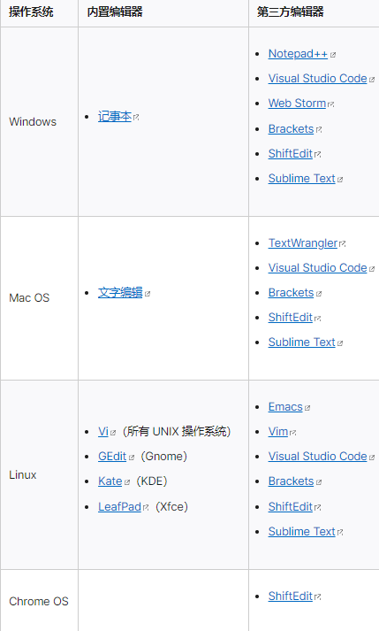
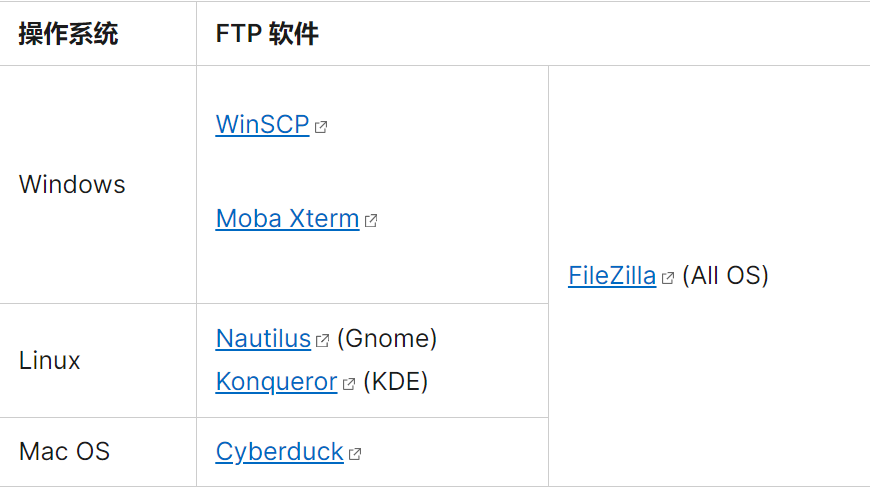

# 构建网站的工具

## 创建和编辑网页

**文本编辑器**
创建并修改无格式的文本文件

第三方工具通常包含了额外的功能，包括句法填色[syntax coloring]，代码补全[auto-completion]，可折叠区间[collapsible sections]，以及代码搜索[code search]。

## 上传文件到网络
购买服务器

使用FTP客户端上传到服务器

## 浏览页面

Apple Safari 在 iOS 和 Mac OS 上运行，而 Internet Explorer 则只在 Windows 上运行。这时候最好利用像是 Browsershots 或者 Browserstack 之类的服务。Browsershots 提供你的网站的截图，就如同它会在不同浏览器中所看到那样。Browserstack 实际上给予你完全远程访问虚拟机的权限，所以你可以在最普遍的环境中测试你的网站。或者，可以设置自己的虚拟机。
