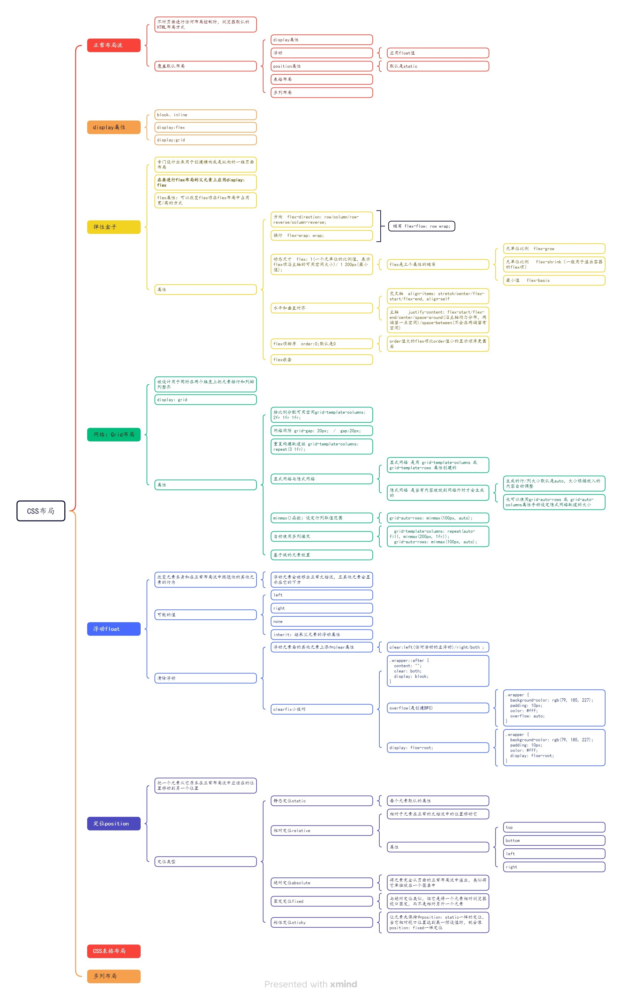
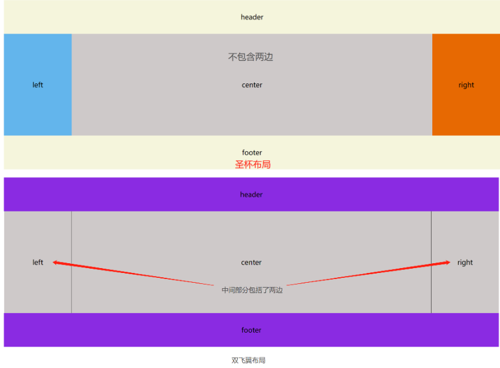

# CSS布局

## CSS布局



## 十种布局方式

[https://www.cnblogs.com/zxlh1529/p/17226718.html](https://www.cnblogs.com/zxlh1529/p/17226718.html)

### 静态布局
>常见于PC端，是给页面设定固定的宽高且居中布局，web网站开发的单位一般用px

特点：不管页面多大，始终都是用初始的值，一般是定宽，相当于min-width

优点：简单，没有兼容性问题。

缺点：不会随着屏幕大小的变化而变化。


### 浮动布局
>是调用浮动属性来使得元素向左或向右移动从而共享一行，直到碰到包含框或者另一个浮动框。浮动元素是脱离文档流的，不占据页面空间，但不脱离文本流，且浮动会将行内元素和行内块元素转化为块元素。

特点：

1、脱离标准普通流的控制（浮）移动到指定位置（动），俗称脱标

2、浮动的盒子不再保留原先的位置，会一行内显示并且元素顶部对齐

3、浮动的元素会具有行内块元素的特性

优点：

1、排版友好

2、兼容性好

缺点：

需要调整网站布局对代码改动很大，页面的宽度不够会影响布局。浮动是脱标的，无法撑起父元素造成的塌陷。

```html
<!DOCTYPE html>
<html lang="en">

	<head>
		<meta charset="utf-8">
		<title>浮动布局</title>
		<style>
			.box{
				width: 520px;
				overflow: hidden;
				border: 2px solid paleturquoise;
				padding: 10px;
				margin: 20px auto;
				border-radius: 5px;
			}
			.box_left {
				float: left;
				width: 150px;
				margin-right: 15px;
				padding: 1em;
				border-radius: 5px;
				background-color: blueviolet;
				min-height: 150px;
				color: white;
				text-align: center;
				line-height: 150px;
			}
		</style>
	</head>

	<body>
		<div class="box">
			<div class="box_left">向左浮动</div>
			<p>浮动布局是调用浮动属性来使得元素向左或者向右移动从而共享一行，直到碰到包含框或者另一个浮动框。浮动元素是脱离文档流的，不占据页面空间，但不脱离文本流，且浮动会将行内元素和行内块元素转化为块元素。
			</p>
			<div style="clear: both;"></div>
			<p>浮动布局是调用浮动属性来使得元素向左或者向右移动从而共享一行，直到碰到包含框或者另一个浮动框。浮动元素是脱离文档流的，不占据页面空间，但不脱离文本流，且浮动会将行内元素和行内块元素转化为块元素。</p>
		</div>
	</body>

</html>
```

:::tip
要知道清除浮动的方式
:::

### 定位布局
>是给元素设置position属性从而控制元素显示在不规则的位置，偏向于单个元素定位操作

position有五个选项值：

1、static静态定位。页面元素定位的默认值，出现在正常流中；

2、fixed固定定位。元素相对于页面窗口是固定位置的，即使窗口滚动也不会移动。fixed属性是脱离文档流的，不会占据空间，但会重叠其他元素之上；

3、relative相对定位。以自身作为参照物，对象不可层叠、不脱离文档流，移动相对定位元素，但它原本所占的空间不会改变。通过top,bottom,left,right定位；

4、absolute绝对定位。选择最近一个设置有相对定位的父元素进行绝对定位，若没有则以body的坐标原点为参照。与其他元素重叠，脱离文档流，不占空间。通过top,bottom,left,right定位；

5、sticky粘性定位。基于滚动位置来定位，在 relative 和 fixed 之间切换，当超出页面目标区域时，就是 fixed 固定在目标位置，否则为 relative；元素定位表现为在跨越特定阈值前为相对定位，之后为固定定位。须指定 top, right, bottom 或 left 四个阈值其中之一，才可使粘性定位生效，否则其行为与相对定位相同。

特点：定位布局中不同的属性有各自的特点，最明显的是使用定位的元素独立开来。

优点：无需考虑元素的显示方式和位置，直接独立定位，方便控制。

缺点：很难预测各元素之间是否有影响，例如重叠覆盖等。

### 栅格布局
>也被称为网格布局。栅格布局是二维的，包括行和列，与弹性布局相似。

特点：重视比例、秩序、连续感和现代感。以及对存在于版面上的元素进行规划、组合、保持平衡或者打破平衡，以便让信息可以更快速、更便捷、更系统和更有效率的读取；另外最重要的一点是，负空间的规划（即：留白）也是栅格系统设计当中非常重要的部分 ---wiki

优点：

1、提高网页的规范性和可重用性

2、基于栅格的设计，可以让整个网站各个页面的布局保持一致

3、将多个项目放入网页单元格区域中，可以部分重叠

缺点：兼容性不好

```html
<!DOCTYPE html>
<html lang="en">

<head>
    <meta charset="UTF-8">
    <title>栅格布局</title>
    <style>
        main {
            border: solid 5px gray;
            display: inline-grid;
            grid-template-rows: repeat(3, 100px);
            grid-template-columns: repeat(3, 100px);
        }

        main div {
            background: burlywood content-box;
            padding: 10px;
            border: 1px black dashed;
            text-align: center;
            line-height: 80px;
            color: #fff;
        }
    </style>
</head>

<body>
    <main>
        <div>1</div>
        <div>2</div>
        <div>3</div>
        <div>4</div>
        <div>5</div>
        <div>6</div>
        <div>7</div>
        <div>8</div>
        <div>9</div>
   </main>
</body>

</html>
```

### table布局
>栅格布局，只是 div 进行各种处理。table 布局是在父元素使用 display:table; 子元素使用 display:table-row或 display:table-cell; 子元素会默认自动平均划分父元素的空间。

特点：如果设置其中一个子元素table-cell为固定宽度，其余子级容器会自动平分宽度占满父容器

优点：兼容性好

缺点：

1、比其他html标签占更多的的字节。造成下载时间延迟，占用服务器更多的流量资源

2、渲染不友好，阻碍浏览器渲染引擎的渲染顺序，等内容全部加载完成再显示表格，会延迟页面的生成速度，让用户等待时间更久

3、灵活性差，一旦设计确定会变死，后期很难通过 CSS 改变新的面貌，且不能自适应

4、不利于搜索引擎抓取信息，直接影响网站排名

```html
<!DOCTYPE html>
<html lang="en">

	<head>
		<meta charset="UTF-8">
		<title>table布局</title>
		<style>
			.box {
				width: 600px;
				height: 100px;
				display: table;
			}
			
			.a,
			.b,
			.c,
			.d {
				display: table-cell;
			}
			
			.a {
				background: blueviolet;
			}
			
			.b {
				background: aqua;
			}
			
			.c {
				background: palevioletred;
			}
			
			.d {
				background: hotpink;
			}
		</style>
	</head>

	<body>
		<div class="box">
			<div class="a"></div>
			<div class="b"></div>
			<div class="c"></div>
			<div class="d"></div>
		</div>
	</body>

</html>
```

### 弹性（flex）布局
>flexible 模型又被称为 flexbox，它不像栅格布局可以同时处理行跟列，只能处理单行或者单列，是一维的布局模型。它可以简便、完整且适应的实现页面各种布局，web网站页面一般用 em 或者 rem 单位(1em = 16px, 1rem = 10px)，小程序一般用 rpx 单位(1px = 2rpx)进行相对布局，特别的是字体能够放缩方便且自适应。

特点：能够调整其子元素在不同的屏幕分辨率下用最适合的方法填充合适的空间。

优点：适应性强，容易上手，且很简便的完成很多页面布局效果，后期维护容易，若需求细微度不高，那么是很好的选择。

缺点：兼容性差，在低版本的浏览器有可能渲染不出效果（ie9及以上）。

注：弹性容器外及弹性子元素内是正常渲染的。弹性盒子只定义了弹性子元素如何在弹性容器内布局。弹性子元素通常在弹性盒子内一行显示。默认情况每个容器只有一行。

```html
<!DOCTYPE html>
<html lang="en">
<head>
    <meta charset="UTF-8">
    <title>flex布局</title>
    <style>
        .flexbox {
            width: 500px;
            background: bisque;
            display: flex;
            flex-direction: row;
            justify-content: space-around;
            align-items: center;
            padding: 10px;
        }
        .flexbox div {
            width: 100px;
            height: 100px;
            background-color: yellowgreen;
            border: 1px solid #fefefe;
            margin: 5px;
        }
    </style>
</head>
<body>
    <div class="flexbox">
        <div>1</div>
        <div>2</div>
        <div>3</div>
        <div>4</div>
    </div>
</body>
</html>
```

### 圣杯布局


>圣杯布局要求头部跟尾部要有固定的高，宽则占满屏幕；中间是一个三栏布局，比头尾高度要高，两侧宽度不变，中间自动充满区域。圣杯布局可以用浮动、flex 和 grid 三种实现。

特点：中间主要部分放在文档流前面保证先行渲染。

优点：布局简单，缩到最小也不会变形。

缺点：浏览器兼容性不是很友好。当浏览器无限放大的时候圣杯会破碎掉，而当 center 部分宽小于 两边或者单边就会发生布局混乱。

使用浮动实现示例：
```html
<!DOCTYPE html>
<html>
 
<head>
  <meta charset="utf-8">
  <title>圣杯布局</title>
</head>
<style>
  body {
    min-width: 600px;
    font-size: 20px;
  }
 
  #header, #footer {
    background-color: blueviolet;
    text-align: center;
    height: 100px;
    line-height: 100px;
  }
  #footer {
    clear: both;
  }
 
  #center {
    padding-left: 200px; 
    padding-right: 200px;  
    overflow: hidden;
  }
 
  #center .column {
    position: relative;
    float: left;
    text-align: center;
    height: 300px;
    line-height: 300px;
  }
 
  #content {
    width: 100%;
    background: rgb(206, 201, 201);
  }
 
  #nav {
    width: 200px;           
    right: 200px;         
    margin-left: -100%;
    background: rgba(95, 179, 235, 0.972);
  }
 
  #aside {
    width: 200px;         /*  */
    margin-left: -200px;  
    right: -200px;
    background: rgb(231, 105, 2);
  }
 
</style>
 
<body>
  <header id="header">header</header>
  <div id="center">
    <section id="content" class="column">content</section>
    <nav id="nav" class="column">nav</nav>
    <aside id="aside" class="column">aside</aside>
  </div>
  <footer id="footer">footer</footer>
 
 
</body>
 
</html>
```

### 自适应布局
>创建多个静态布局，每个布局对应一个屏幕的分辨率范围，每个静态布局页面的元素大小不会因为窗口的改变而变化，除非从一个静态布局变到另外一个布局，不然在同一设备下还是固定的布局。常用的方式有使用 CSS 的 @media 媒体查询，也有高成本的 JS 进行设计开发，或者使用第三方开源框架 bootstrap，这个能够很好的支持多个浏览器。

特点：自适应多端，不同的分辨率下为固定布局，不会使元素大小发生变化。

优点：

1、对网站的复杂程度兼容性大。

2、测试容易，代码执行效率高，降低了开发者的页面开发成本代价。

3、在一定宽度范围内提供了稳定的视觉体验，增加用户体验。

缺点：对老旧或者非标准的浏览器兼容性较差，当对一个页面作出修改时，同时需要改变多种尺寸的布局，流程相对变得繁琐。

### 流式布局
>流式布局也叫百分比布局（也有叫非固定像素布局），是页面中的元素根据屏幕分辨率自动进行适配调整，页面元素大小会发生变化，但是整体布局不会发生变化，始终都是满屏显示。它使用的是百分比定义宽，但高一般会被固定住，这种布局在早期是为了适应不同尺寸的PC屏幕，但现在在移动端比较常见。

特点：适配，页面元素的宽度按照屏幕分辨率进行适配调整，但整体布局不变。

优点：通过设置百分比宽度适应不同尺寸的屏幕。

缺点：高度和文字大小都是固定的，所以当屏幕尺寸过大或者过小时某些元素会被拉伸拉扁（高度、文字大小不变），无法正常显示，显得不协调，带来不好的用户体验。

>常用的流式布局有：
>左侧固定，右侧自适应
>右侧固定，左侧自适应
>左右两侧固定，中间自适应（圣杯布局）
>等分布局

### 响应式布局
>自适应布局是一套静态页面内容布局对应一个分辨率范围，位置会变但是大小不变，需要多套界面布局；响应式通过检测视口分辨率判断是pc端、平板还是手机，针对不同的客户端在客户端做处理，来展示不同的布局和内容从而达到令人满意的效果，屏幕大小的变化会导致元素的位置和大小都改变，可以说是流式布局和自适应布局的结合体，一套界面布局即可适应所有不同的尺寸和终端，设计考虑的比自适应复杂的多。

特点：创建多个流式布局对应不同的分辨率范围，即每个屏幕分辨率下面会有一个布局样式，元素位置和大小都会变。

优点：面对不同分辨率设备灵活性强，能够快速的解决多设备显示适应问题，如果有足够耐心去设计考虑，那么可以达到很理想的效果。

缺点：

1、限制于内容布局、框架并不复杂的网站。

2、需要匹配足够多的屏幕分辨率，效率低下。

3、无用代码多，加载时间加长。

4、只能适应主流的宽高。
