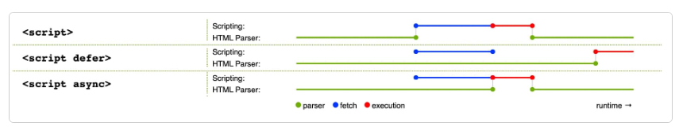

# JavaScript

> JavaScript 是一门完备的动态编程语言。当应用于 HTML 文档时，可为网站提供动态交互特性。

```html
<script src="scripts/main.js" defer></script>
```

## 可以做什么？

- 在变量中存储有用的值
- 操作一段文本
- 运行代码以响应网页中发生的特定事件

JavaScript 语言核心之上所构建的功能——**应用程序接口（application programming interface，API）**

### API

API 是已经建立好的一套代码组件，可以让开发者实现原本很难甚至无法实现的程序。

API 通常分为两类：

### 浏览器 API

1、`浏览器API`：内建于 web 浏览器中，可以将数据从周边计算机环境中筛选出来，还可以做实用的复杂工作。

#### 常见的浏览器 API

- **操作文档的 API**内置于浏览器中。如 DOM API，允许操作 HTML 和 CSS 的创建、移除以及修改 HTML，动态地将新样式应用到页面等等。

- **从服务器获取数据的 API**用于更新网页的一小部分。如 XMLHttpRequest 和 Fetch API，Ajax 等。

- **用于绘制和操作图形的 API**允许以编程方式更新包含在 HTML `<canvas>`元素中的像素数据以创建 2D 和 3D 场景的 Canvas 和 WebGL。

- **音频和视频 API**如 HTMLMediaElement、Web Audio API 和 WebRTC 允许使用多媒体来做一些非常有趣的事情，比如创建用于播放音频和视频的自定义 UI 控件，显示字幕字幕和视频，从网络摄像机抓取视频，通过画布操纵（见上），或在网络会议中显示在别人的电脑上，或者添加效果到音轨（如增益、失真、平移等） 。

- **设备 API**基本上是以对网络应用程序有用的方式操作和检索现代设备硬件中的数据的 API。

- **客户端存储 API**在 Web 浏览器中的使用变得越来越普遍 - 如果想创建一个应用程序来保存页面加载之间的状态，甚至让设备在处于脱机状态时可用，那么在客户端存储数据将会是非常有用的。例如使用 Web Storage API 的简单的键 - 值存储以及使用 IndexedDB API 的更复杂的表格数据存储。

### 第三方 API

2、`第三方API`：一般从网上取得代码和信息。

- Twitter API、新浪微博 API
- 谷歌地图 API、OpenStreeMap API、高德地图 API

### API 工作原理

- API 是基于对象的

API 使用一个或多个 JavaScript objects 在代码中进行交互，这些对象用作 API 使用的数据（包含在对象属性中）的容器以及 API 提供的功能

- 有可识别的入口点

使用 API 时，应确保知道 API 入口点的位置

文档对象模型 DOM API 有一个简单的入口点，它的功能往往被发现挂在 Document 对象，或任何想影响的 HTML 元素的实例

```JavaScript
var em = document.createElement("em"); // create a new em element
var para = document.querySelector("p"); // reference an existing p element
em.textContent = "Hello there!"; // give em some text content
para.appendChild(em); // embed em inside para
```

- 使用事件来处理状态的变化

当事件触发时，允许运行函数的处理程序属性通常在单独的“Event handlers”（事件处理程序）部分的参考资料中列出。

- 在适当的地方有额外的安全机制

WebAPI 功能受到与 JavaScript 和其他 Web 技术（如同源策略）相同的安全考虑，但有时会有额外的安全机制

一旦调用 web API 请求，用户就可以在代码中启用一些权限

### 理一下关系

- JavaScript——一种内置于浏览器的高级脚本语言，可以用来实现 Web 页面/应用中的功能。

- 客户端 API——内置于浏览器的结构程序，位于 JavaScript 语言顶部，帮助更容易实现功能。

- 第三方 API——置于第三方普通的结构程序，可以在自己的 web 页面中使用那些平台的某些功能。

- JavaScript 库——通常是包含具有特定功能的一个或多个 JavaScript 文件，把这些文件关联到 web 页以快速或授权编写常见的功能。

- JavaScript 框架——从库开始的下一步，JavaScript 框架视图把 HTML, CSS, JavaScript 和其他安装的技术打包在一起，然后用来从头编写一个完整的 web 应用

## 在页面上做了什么？

通过文档对象模型动态修改 HTML 和 CSS，以更新用户界面

## 浏览器安全

大多数情况，每个标签页中的代码完全独立运行，不相互影响。

## 运行次序

从上往下的顺序执行代码

## 解释代码 vs 编译代码

- 解释 interpret

> 解释型语言中，代码自上而下运行，实时返回运行结果。代码在由浏览器执行前，不需要将其转化为其他形式。代码直接以文本格式被接收和处理

- 编译 compile

> 编译型语言需要先将代码转化（编译）成另一种形式才能运行。

JavaScript 是轻量级解释型语言。浏览器接受到 JavaScript 代码，并以代码自身的文本格式运行它。

技术上，几乎所有 JavaScript 转换器都运用了一种叫做即时编译（just-in-time compiling）的技术；当 JavaScript 源代码被执行时，它会被编译成二进制的格式，使代码运行速度更快。

尽管如此，JavaScript 仍然是一门解释型语言，因为编译过程发生在代码运行中，而非之前。

## 服务器端代码 vs 客户端代码

`客户端代码`是在用户的电脑上运行的代码，在浏览一个网页时，它的客户端代码就会被下载，然后由浏览器来运行并展示。

`服务器端代码`在服务器上运行，然后运行结果才由浏览器下载并展示出来。

流行的服务器端 web 语言包括：PHP、Python、Ruby、ASP.NET，还有 JavaScript，如 Node.js

## 动态代码 vs 静态代码

动态：是指通过`按需生成`新内容来更新 web 页面或应用，使不同环境下可以显示出不同内容。

没有动态更新内容的网页叫做静态页面，所显示的内容不会改变

## 内联 JavaScript 处理器

```html
<button onclick="createParagraph()">点我！</button>
```

内联的`onclick`处理器，这会使 JavaScript 污染了 HTML，而且效率低下

## 脚本调用策略

HTML 元素是按照其在页面中出现的次序调用的，如果用 JavaScript 来管理页面上的元素，若 JavaScript 加载要操作的 HTML 元素之前，代码将出错。

页面中的`内部JavaScript`

```js
document.addEventListener("DOMContentLoaded", () => {});
```

这是一个事件监听器，监听浏览器的`DOMContentLoaded`事件，标志着 HTML 文档体完全加载和解析。

`外部JavaScript`

```js
<script src="script.js" defer></script>
```

`defer`属性，告知浏览器遇到`<script>`元素时继续下载 HTML 内容

### JS 的加载方式

1、正常模式

会阻塞 DOM 渲染，浏览器必须等待 js 加载和执行完成后才能去做其他事情

```js
<script src="index.js"></script>
```

2、async 模式

js 加载是异步的，加载结束会立即执行

```js
<script async src="index.js"></script>
```

使用场景：js 资源与 DOM 无依赖关系，也不会产生其他资源所需要的数据时，如埋点统计

3、defer 模式

js 加载是异步的，defer 是有顺序的加载

```js
<script defer src="index.js"></script>
```

4、module 模式

浏览器会对其内部的 import 引用发起 HTTP 请求，获取模块内容

script 的行为会像 defer 一样，在后台加载，并且等待 DOM 解析

```js
<script type="module">import {a} from './a.js'</script>
```

5、preload

link 的 preload 属性，用于提前加载一些需要的依赖，这些资源会优先加载

```js
<link rel="preload" as="script" href="index.js">

```

特点：

1、加载的资源是在浏览器渲染机制之前处理的，不会阻塞 onload 事件；

2、加载的 JS 脚本 加载和执行的过程是分离的，即 preload 会预加载相应的脚本代码，待到需要时自动调用

6、prefetch

利用浏览器的空闲事件，加载页面将来可能会用到的资源的一种机制

通常可以用于加载其他页面(非首页)所需要的资源，以便加快后续页面的打开速度

```js
<link rel="prefetch" as="script" href="index.js">
```

特点：

1、加载的资源可以获取非当前页面所需要的资源，并且将其放入到缓存至少 5 分钟（无论资源是否可以缓存）

2、当页面跳转时，未完成的 prefetch 请求不会被中断

#### 总结

async、defer 是 script 标签的专属属性，对应网页中的其他资源，可以通过 link 的 preload、prefetch 属性来预加载

现代框架已经将 preload、prefetch 添加到打包流程中了，通过灵活的配置去使用这些预加载的功能

### async 和 defer

- 浏览器遇到 async 脚本时`不会阻塞`页面渲染，而是直接下载然后运行。但`一旦下载完成，脚本就会执行，从而阻止页面渲染`。脚本的运行次序无法控制。当页面脚本之间彼此独立，且不依赖于本页面的其他任何脚本时，`async`是理想的选择。

- 使用`defer`属性加载的脚本将按照它们在页面上出现的顺序加载。在`页面内容全部加载完毕之前，脚本不会运行`，如果脚本依赖于 DOM 的存在（例如，脚本修改了页面上的一个或多个元素），这一点非常有用。



示例：

```html
<script async src="js/vendor/jquery.js"></script>

<script async src="js/script2.js"></script>

<script async src="js/script3.js"></script>
```

三者的调用顺序是不确定的。jquery.js 可能在 script2 和 script3 之前或之后调用，如果这样，后两个脚本中依赖 jquery 的函数将产生错误，因为脚本运行时 jquery 尚未加载。

`async` 应该在有大量后台脚本需要加载，并且只想尽快加载到位的情况下使用。例如，可能需要加载一些游戏数据文件，这在游戏真正开始时是需要的，但现在只想显示游戏介绍、标题和大厅，而不想被脚本加载阻塞。

解决这一问题可使用 `defer` 属性，脚本将按照在页面中出现的顺序加载和运行

```html
<script defer src="js/vendor/jquery.js"></script>

<script defer src="js/script2.js"></script>

<script defer src="js/script3.js"></script>
```
