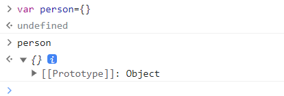
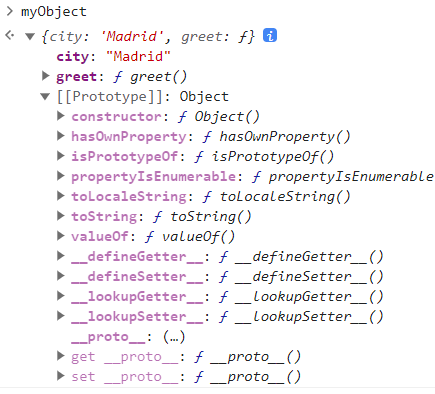
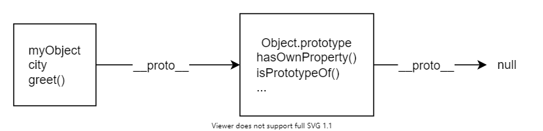
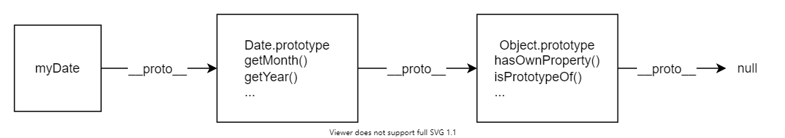

# js对象

## 对象介绍
对象是一个包含相关数据和方法的集合（通常由一些变量和函数组成，称之为对象里面的属性和方法）。

创建一个对象通常先定义初始化变量。
```
var person={}
```


```
var person={
    name:["bob","smith"],
    age:32,
    gender:"male",
    interests:["music","skiing"],
    bio:function(){
        alert(
        this.name[0] +
            " " +
            this.name[1] +
            " is " +
            this.age +
            " years old. He likes " +
            this.interests[0] +
            " and " +
            this.interests[1] +
            ".",
        )
    },
  greeting: function () {
    alert("Hi! I'm " + this.name[0] + ".");
  },
}

person.name[0]
person.age
person.interests[1]
person.bio()
person.greeting()
```

一个对象由许多的成员组成，每个成员都拥有一个名字和一个值，之间用冒号分隔

### 点表示法
person.age

person.bio()

### 子命名空间
可以用一个对象来做另一个成员对象的值
```
var person={
    name:{
        first:'bob',
        last:'smith'
    }
}

person.name.first
person.name.last
```

### 括号表示法
person.age==>person["age"]
person.name.fisrt==>person["name"]["first"]

### 设置对象成员

设置对象成员的值，通过声明要设置的成员

创建新的成员
```
person.age=45
person["name"]["first"]="cra"
person["eyes"]="hazel"
```

:::info
括号表示法一个有用的地方是不仅可以动态的去设置对象成员的值，还可以动态的设置成员的名字。
var myDataName = nameInput.value;
var myDataValue = nameValue.value;

person[myDataName] = myDataValue;
:::


### this
```
greeting: function() {
  alert('Hi! I\'m ' + this.name.first + '.');
}
```

this指向了当前代码运行时的对象，这里的代码即指person对象

## 对象原型
### 原型链
```
const myObject = {
  city: "Madrid",
  greet() {
    console.log(`来自 ${this.city} 的问候`);
  },
};
myObject.greet(); // 来自 Madrid 的问候
```


这里有其他额外的属性。

JavaScript所有的对象都有一个内置属性，称为它的`prototype`（原型）

它本身也是一个对象，所以也会有自己的原型，逐渐构成了`原型链`。

原型链终止于拥有null作为其原型的对象上。

:::tip
指向对象原型的属性并不是prototype，不是标准的，但所有浏览器都使用__proto__，访问对象原型的标准方法是Object.getPrototypeOf()
:::

当访问一个对象的属性时：如果在对象本身中找不到该属性，就会在原型中搜索该属性，如果仍找不到，继续搜索原型的原型，直到找到，或者到达链的末端，返回undefined


有个对象叫 Object.prototype，它是最基础的原型，所有对象默认都拥有它。Object.prototype 的原型是 null，所以它位于原型链的终点：


一个对象的原型并不总是Object.prototype
```
const myDate = new Date();
let object = myDate;

do {
  object = Object.getPrototypeOf(object);
  console.log(object);
} while (object);

// Date.prototype
// Object { }
// null
```
这段代码创建了 Date 对象，然后遍历了它的原型链，记录并输出了原型。
myDate 的原型是 Date.prototype 对象，它（Date.prototype）的原型是 Object.prototype。



### 属性遮蔽

```
const myDate = new Date(1995, 11, 17);

console.log(myDate.getYear()); // 95

myDate.getYear = function () {
  console.log("别的东西！");
};

myDate.getYear(); // '别的东西！'
```
如果在一个对象中定义了一个属性，而在该对象的原型中定义了一个同名的属性，会首先在mydate寻找该属性，如果没有，才检查原型。

这种叫做属性“遮蔽”

### 设置原型
#### Object.create()
创建一个新的对象，并允许指定一个被用作新对象原型的对象
```
const personPrototype = {
  greet() {
    console.log("hello!");
  },
};

const carl = Object.create(personPrototype);
carl.greet(); // hello!
```
#### 构造函数

在 JavaScript 中，所有的函数都有一个名为 prototype 的属性。当调用一个函数作为构造函数时，这个属性被设置为新构造对象的原型（按照惯例，在名为 `__proto__` 的属性中）。

因此，如果设置一个构造函数的 prototype，可以确保所有用该构造函数创建的对象都被赋予该原型：

```
const personPrototype = {
  greet() {
    console.log(`你好，我的名字是 ${this.name}！`);
  },
};

function Person(name) {
  this.name = name;
}

Object.assign(Person.prototype, personPrototype);
// 或
// Person.prototype.greet = personPrototype.greet;
```

### 自有属性
上面的示例中：
name属性，是在构造函数中设置，在person对象中可以直接看到
greet()方法，在原型上设置

直接在对象中定义的属性，被称为`自有属性`，可以使用静态方法Object.hasOwn()检查是否有自由属性

```
const irma = new Person("Irma");

console.log(Object.hasOwn(irma, "name")); // true
console.log(Object.hasOwn(irma, "greet")); // false
```
### 原型与继承

原型使得重用代码和组合对象成为可能。

支持某种意义上的继承
