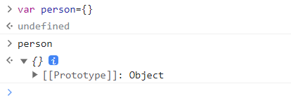
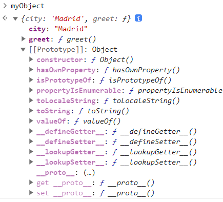
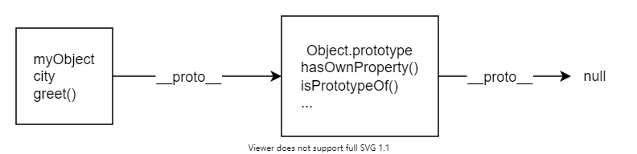

# 数据类型

## 数值`number`

## 字符串`string`
```javascript
let string="this is a test";
string;
```

### 单引号和双引号
两者之间几乎没有区别，根据个人偏好使用

### 连接字符串

使用加号`+`

```js
let one="hello, "
let two="world!"
let joined=one + two 
```

### 数字与字符串
```js
"front"+200 //不会报错
// 数字转字符串
let myNum=123
let myString=myNum.toString()
typeof myString
// 字符串转数字
let myString="123"
let myNum=Number(myString)
typeof myNum
```

### 一些方法
#### 字符串长度
```javascript
let browerType="mozilla"
browerType.length
```
#### 检索特定字符串字符
第一个字符：browerType[0]

#### 查找子字符串并提取
browerTyper.indexOf("zilla")
结果：2

browserType.indexOf("vanilla");
结果：-1

**提取**
browerType.slice(0,3)
结果：moz
提取从第一个位置开始，直到但不包括最后一个位置

browerType.slice(2)
结果：zilla
没有包含第二个参数，返回的子字符串是字符串中的所有剩余字符

#### 转换大小写
`toLowerCase()`

`toUpperCase()`

#### 替换
`replace()`

browserType.replace("moz", "van");

## 布尔值`boolean`
true，false

## `undefined`
表示未定义或不存在

## `null`
表示空值，即此处的值为空

## 对象`object`

各种值组成的集合

> 是最复杂的数据类型，又可以分为三个子类型

### 狭义的对象`object`

对象是一个包含相关数据和方法的集合（通常由一些变量和函数组成，称之为对象里面的属性和方法）。

创建一个对象通常先定义初始化变量。

```js
var person={}
```


```js
var person={
    name:["bob","smith"],
    age:32,
    gender:"male",
    interests:["music","skiing"],
    bio:function(){
        alert(
        this.name[0] +
            " " +
            this.name[1] +
            " is " +
            this.age +
            " years old. He likes " +
            this.interests[0] +
            " and " +
            this.interests[1] +
            ".",
        )
    },
  greeting: function () {
    alert("Hi! I'm " + this.name[0] + ".");
  },
}

person.name[0]
person.age
person.interests[1]
person.bio()
person.greeting()
```

一个对象由许多的成员组成，每个成员都拥有一个名字和一个值，之间用冒号分隔

#### 点表示法
person.age

person.bio()

#### 子命名空间
可以用一个对象来做另一个成员对象的值
```js
var person={
    name:{
        first:'bob',
        last:'smith'
    }
}

person.name.first
person.name.last
```

#### 括号表示法
`person.age==>person["age"]`

`person.name.fisrt==>person["name"]["first"]`

#### 设置对象成员

设置对象成员的值，通过声明要设置的成员

创建新的成员
```js
person.age=45
person["name"]["first"]="cra"
person["eyes"]="hazel"
```

:::info
括号表示法一个有用的地方是不仅可以动态的去设置对象成员的值，还可以动态的设置成员的名字。

var myDataName = nameInput.value;

var myDataValue = nameValue.value;

person[myDataName] = myDataValue;
:::


#### this
```js
greeting: function() {
  alert('Hi! I\'m ' + this.name.first + '.');
}
```

this指向了当前代码运行时的对象，这里的代码即指person对象

#### 对象原型
##### 原型链
```js
const myObject = {
  city: "Madrid",
  greet() {
    console.log(`来自 ${this.city} 的问候`);
  },
};
myObject.greet(); // 来自 Madrid 的问候
```


这里有其他额外的属性。

JavaScript所有的对象都有一个内置属性，称为它的`prototype`（原型）

它本身也是一个对象，所以也会有自己的原型，逐渐构成了`原型链`。

原型链终止于拥有null作为其原型的对象上。

:::tip
指向对象原型的属性并不是prototype，不是标准的，但所有浏览器都使用__proto__，访问对象原型的标准方法是Object.getPrototypeOf()
:::

当访问一个对象的属性时：如果在对象本身中找不到该属性，就会在原型中搜索该属性，如果仍找不到，继续搜索原型的原型，直到找到，或者到达链的末端，返回undefined


有个对象叫 Object.prototype，它是最基础的原型，所有对象默认都拥有它。Object.prototype 的原型是 null，所以它位于原型链的终点：



一个对象的原型并不总是Object.prototype
```js
const myDate = new Date();
let object = myDate;

do {
  object = Object.getPrototypeOf(object);
  console.log(object);
} while (object);

// Date.prototype
// Object { }
// null
```
这段代码创建了 Date 对象，然后遍历了它的原型链，记录并输出了原型。
myDate 的原型是 Date.prototype 对象，它（Date.prototype）的原型是 Object.prototype。


#### 属性遮蔽

```js
const myDate = new Date(1995, 11, 17);

console.log(myDate.getYear()); // 95

myDate.getYear = function () {
  console.log("别的东西！");
};

myDate.getYear(); // '别的东西！'
```

如果在一个对象中定义了一个属性，而在该对象的原型中定义了一个同名的属性，会首先在mydate寻找该属性，如果没有，才检查原型。

这种叫做属性“遮蔽”

#### 设置原型
##### Object.create()
创建一个新的对象，并允许指定一个被用作新对象原型的对象
```js
const personPrototype = {
  greet() {
    console.log("hello!");
  },
};

const carl = Object.create(personPrototype);
carl.greet(); // hello!
```
##### 构造函数

在 JavaScript 中，所有的函数都有一个名为 prototype 的属性。当调用一个函数作为构造函数时，这个属性被设置为新构造对象的原型（按照惯例，在名为 `__proto__` 的属性中）。

因此，如果设置一个构造函数的 prototype，可以确保所有用该构造函数创建的对象都被赋予该原型：

```js
const personPrototype = {
  greet() {
    console.log(`你好，我的名字是 ${this.name}！`);
  },
};

function Person(name) {
  this.name = name;
}

Object.assign(Person.prototype, personPrototype);
// 或
// Person.prototype.greet = personPrototype.greet;
```

#### 自有属性

上面的示例中：

name属性，是在构造函数中设置，在person对象中可以直接看到

greet()方法，在原型上设置

直接在对象中定义的属性，被称为`自有属性`，可以使用静态方法Object.hasOwn()检查是否有自有属性

```js
const irma = new Person("Irma");

console.log(Object.hasOwn(irma, "name")); // true
console.log(Object.hasOwn(irma, "greet")); // false
```
#### 原型与继承

原型使得重用代码和组合对象成为可能。

支持某种意义上的继承

#### 方法
 


### 数组`array`

数组是一个包含了多个值的对象。

#### 创建数组

```js
let test=["bread","milk"]
```

#### 访问和修改数组元素

```js
test[0]
// 修改
test[0]="cheese"
```
#### 获取数组长度
```js
test.length

for (let i=0; i < test.length; i++){
    console.log(test[i])
}
```

#### 一些方法
##### 字符串和数组之间的转换

```js
let myData = "Manchester,London,Liverpool,Birmingham,Leeds,Carlisle";
let myArray = myData.split(",");
myArray;
let myNewString = myArray.join(",");
myNewString;
let dogNames = ["Rocket", "Flash", "Bella", "Slugger"];
dogNames.toString(); //Rocket,Flash,Bella,Slugger
```

##### 添加和删除数组项

在数组末尾添加或删除一个项目，使用`push()`和`pop()`

```js
myArray.push("Cardiff");
myArray;
myArray.push("Bradford", "Brighton");
myArray;
myArray.pop();
let removedItem = myArray.pop();
myArray;
removedItem;
```

`unshift()`和`shift()`功能上和`push()`和`pop()`完全相同，只是分别作用于数组的开始，而不是结尾

##### slice()
从数组提取一个片段，并作为一个新数组返回
```js
let myArray = ["a", "b", "c", "d", "e"];
myArray = myArray.slice(1, 4); // [ "b", "c", "d"]
// 从索引 1 开始，提取所有的元素，直到索引 3 为止
```

##### concat()
连接两个或多个数组并返回一个新的数组
```js
let myArray = ["1", "2", "3"];
myArray = myArray.concat("a", "b", "c");
// myArray 现在是 ["1", "2", "3", "a", "b", "c"]
```

##### at()
返回数组中指定索引处的元素，如果超出范围，返回undefined。主要用于从数组末尾访问元素的负下标
```js
const myArray = ["a", "b", "c", "d", "e"];
myArray.at(-2); // "d"，myArray 的倒数第二个元素
```

##### splice()
从数组移除一些元素，并（可选的）替换它们。返回从数组中删除的元素
```js
const myArray = ["1", "2", "3", "4", "5"];
myArray.splice(1, 3, "a", "b", "c", "d");
// myArray 现在是 ["1", "a", "b", "c", "d", "5"]
// 本代码从 1 号索引开始（或元素“2”所在的位置），
// 移除 3 个元素，然后将后续元素插入到那个位置上。
```

##### reverse()
原地颠倒数组元素的顺序，返回对数组的引用。
```js
const myArray = ["1", "2", "3"];
myArray.reverse();
// 将原数组颠倒，myArray = [ "3", "2", "1" ]
```

##### flat()
返回一个新数组，所有子数组元素递归地连接到其中，直到指定的深度。
```js
let myArray = [1, 2, [3, 4]];
myArray = myArray.flat();
// myArray 现在是 [1, 2, 3, 4]，因为子数组 [3, 4] 已被展平
```

##### sort()
对数组的元素进行适当的排序，并返回对数组的引用
```js
const myArray = ["Wind", "Rain", "Fire"];
myArray.sort();
// 对数组排序，myArray = ["Fire", "Rain", "Wind"]
```

##### indexOf() 
在数组中搜索 searchElement 并返回第一个匹配的索引。

##### lastIndexOf() 
从末尾开始，反向搜索。

##### forEach()
对数组中的每个元素执行callback并返回undefined
```js
const a = ["a", "b", "c"];
a.forEach((element) => {
  console.log(element);
});
// 输出：
// a
// b
// c
```

##### map()
返回由每个数组元素上执行callback的返回值所组成的新数组
```
const a1 = ["a", "b", "c"];
const a2 = a1.map((item) => item.toUpperCase());
console.log(a2); // ['A', 'B', 'C']
```

##### flatMap()
先执行map()，再执行深度为1的flat()
```
const a1 = ["a", "b", "c"];
const a2 = a1.flatMap((item) => [item.toUpperCase(), item.toLowerCase()]);
console.log(a2); // ['A', 'a', 'B', 'b', 'C', 'c']
```

##### filter()
返回一个新数组，其中包含callback返回true的元素
```
const a1 = ["a", 10, "b", 20, "c", 30];
const a2 = a1.filter((item) => typeof item === "number");
console.log(a2); // [10, 20, 30]
```

##### find()
返回callback返回true的第一个元素
```
const a1 = ["a", 10, "b", 20, "c", 30];
const i = a1.find((item) => typeof item === "number");
console.log(i); // 10
```

##### findLast()
callback为true的最后一个元素

##### findIndex()
返回callback返回为true的第一个元素的索引

##### findLastIndex()
callback返回true的最后一个元素的索引

##### every()
如果callback对数组中的每一个元素都返回true，则every()方法返回true
```js
function isNumber(value) {
  return typeof value === "number";
}
const a1 = [1, 2, 3];
console.log(a1.every(isNumber)); // true
const a2 = [1, "2", 3];
console.log(a2.every(isNumber)); // false
```

##### some()
至少一个元素返回true，则some()方法返回true
```
function isNumber(value) {
  return typeof value === "number";
}
const a1 = [1, 2, 3];
console.log(a1.some(isNumber)); // true
const a2 = [1, "2", 3];
console.log(a2.some(isNumber)); // true
const a3 = ["1", "2", "3"];
console.log(a3.some(isNumber)); // false
```

##### reduce()
对数组中的每个值执行callback(accumulator,currentValue,currentIndex,Array)，目的是将列表中的元素减少到单个值。reduce 函数返回 callback 函数返回的最终值。

如果指定了 initialValue，则调用 callback，并将 initialValue 作为第一个参数值，将数组中第一个元素的值作为第二个参数值。

如果没有指定 initialValue，那么 callback 的前两个参数值将是数组的第一个和第二个元素。之后的每一次调用，第一个参数的值将是前一个调用中返回的 callback，第二个参数的值将是数组中的下一个值。

如果 callback 需要访问正在处理的元素的索引，或者访问整个数组，它们可以作为可选参数。
```js
const a = [10, 20, 30];
const total = a.reduce(
  (accumulator, currentValue) => accumulator + currentValue,
  0,
);
console.log(total); // 60
```

##### reduceRight()
类似于reduce，但从最后一个元素开始


#### Array对象
Array对象支持在单个变量名下存储多个元素，并具有执行常见数组操作的成员

数组不是基本类型，而是具有以下特性的Array:

- 可调整大小，可以包含不同数据类型

- 不是关联数组，因此，不能使用任意字符串作为索引访问数组元素，但必须使用非负整数作为索引访问

- 索引从0开始

- 数组复制操作创建浅拷贝

::: info
`浅拷贝`：是属性与拷贝对象的属性共享相同引用的副本。当更改源或副本时，也可能导致其他对象也发生更改。

`深拷贝`：源和副本是完全独立的。

在 JavaScript 中，所有标准的内置对象复制操作（展开语法、Array.prototype.concat()、Array.prototype.slice()、Array.from()、Object.assign() 和 Object.create()）创建的是浅拷贝而不是深拷贝。
:::

#### 索引集合类
按索引值排序的数据集合。包括数组和类数组结构。

##### 创建数组

```js
const arr1 = new Array(element0, element1, /* … ,*/ elementN);
const arr2 = Array(element0, element1, /* … ,*/ elementN);
const arr3 = [element0, element1, /* … ,*/ elementN];
```
element0, element1, …, elementN 是数组元素的值列表。当指定这些值时，数组将用它们作为数组的元素初始化。数组的 length 属性被设置为参数的数量。

括号语法称为“数组字面量”或“数组初始化式”。它比其他形式的数组创建更短，因此通常是首选。

**创建一个长度不为0，但又没任何元素的数组**
```javascript
// 这种方式...
const arr1 = new Array(arrayLength);

// ...与这种方式会形成相同数组
const arr2 = Array(arrayLength);

// 这个效果也一样
const arr3 = [];
arr3.length = arrayLength;
```

如果希望用单个元素初始化一个数组，而这个元素恰好又是 Number，必须使用括号语法。当单个 Number 传递给 Array() 构造函数时，将会被解释为 arrayLength，并非单个元素。

```js
// 创建一个只有唯一元素的数组：数字 42。
const arr = [42];

// 创建一个没有元素的数组，且数组的长度被设置成 42。
const arr = Array(42);

// 上面的代码与下面的代码等价：
const arr = [];
arr.length = 42;
```
也可以使用 Array.of 静态方法来创建包含单个元素的数组。

```javascript
const wisenArray = Array.of(9.3); // wisenArray 只包含一个元素：9.3
```

##### 稀疏数组
数组可以包含“空槽”，这与用值 undefined 填充的槽不一样。空槽可以通过以下方式之一创建：

```javascript
// Array 构造函数：
const a = Array(5); // [ <5 empty items> ]

// 数组字面量中的连续逗号：
const b = [1, 2, , , 5]; // [ 1, 2, <2 empty items>, 5 ]

// 直接给大于 array.length 的索引设置值以形成空槽：
const c = [1, 2];
c[4] = 5; // [ 1, 2, <2 empty items>, 5 ]

// 通过直接设置 .length 拉长一个数组：
const d = [1, 2];
d.length = 5; // [ 1, 2, <3 empty items> ]

// 删除一个元素：
const e = [1, 2, 3, 4, 5];
delete e[2]; // [ 1, 2, <1 empty item>, 4, 5 ]
```

在其他方法，特别是数组迭代方法时，空槽是被跳过的。

```javascript
const mapped = arr.map((i) => i + 1); // [ 2, 3, <2 empty items>, 6 ]
arr.forEach((i) => console.log(i)); // 1 2 5
const filtered = arr.filter(() => true); // [ 1, 2, 5 ]
const hasFalsy = arr.some((k) => !k); // false

// 属性迭代
const keys = Object.keys(arr); // [ '0', '1', '4' ]
for (const key in arr) {
  console.log(key);
}
// 输出：'0' '1' '4'
// 在对象中使用展开，使用属性枚举，而不是数组的迭代器
const objectSpread = { ...arr }; // { '0': 1, '1': 2, '4': 5 }
```

##### 多维数组
数组可以作为一个元素被包含在另外一个数组里面
```javascript
const a = new Array(4);
for (i = 0; i < 4; i++) {
  a[i] = new Array(4);
  for (j = 0; j < 4; j++) {
    a[i][j] = "[" + i + "," + j + "]";
  }
}
```

##### 使用数组存储其他属性
```
const arr = [1, 2, 3];
arr.property = "value";
console.log(arr.property); // "value"
```

##### 类数组对象

一些 JavaScript 对象，如 document.getElementsByTagName() 返回的 NodeList 或 arguments 等 JavaScript 对象，有与数组相似的行为，但它们并不共享数组的所有方法。arguments 对象提供了 length 属性，但没有实现如 forEach() 等数组方法。

不能直接在类数组对象上调用数组方法，但可以通过Function.prototype.call()间接调用

```
function printArguments() {
  Array.prototype.forEach.call(arguments, (item) => {
    console.log(item);
  });
}
```

### 函数`function`
#### 函数的声明
1、function命令

2、函数表达式

3、Function构造函数

```js
// 1
function print(s) {
  console.log(s);
}


// 2
// 匿名
var print = function(s) {
  console.log(s);
};
// 加入函数名，只能在函数体内部使用，指代函数表达式本身
// （1）在函数体内部调用自身；（2）方便排错
var print = function x(){
  console.log(typeof x);
};

x
// ReferenceError: x is not defined

print()
// function

// 3
var add = new Function(
  'x',
  'y',
  'return x + y'
);

// 等同于
function add(x, y) {
  return x + y;
}
```

#### 函数的特点

1、重复声明会覆盖前面的声明

2、函数名提升
> JavaScript引擎将函数名视为变量名，所以采用function命令声明函数时，整个函数会像变量声明一样，被提升到代码头部

```js
f();

function f(){}
```

#### 函数的属性和方法

1、name属性，返回函数的名字
```js
function f1(){}
f1.name // f1
```

2、length属性，返回函数预期传入的参数个数，即函数定义之中的参数个数

3、toString()，返回一个字符串，即函数源码
> 原生函数，返回`function (){[native code]}`
> 
> Math.sqrt.toString()
>
> `// function sqrt() { [native code] }` 

#### 函数作用域
作用域是指变量存在的范围

ES5规范中，JavaScript中有两种作用域：

1、`全局作用域`

2、`函数作用域`

ES6中新增了`块级作用域`

对于顶层函数，函数外部声明的变量就是**全局变量**，可用在函数内部读取；

在函数内部定义的变量，外部无法读取，称为**局部变量**

函数内部定义的变量，会在该作用域内覆盖同名全局变量

对于var命令，局部变量只能在函数内部声明，在其他区块中声明，都是全局变量

var命令声明的变量，不管在什么位置，变量声明都会被提升到函数体的头部

**函数本身的作用域**：函数执行时所在的作用域，是定义时的作用域，而不是调用时所在的作用域

#### 参数

- arguments对象

arguments对象包含了函数运行时的所有参数，只有在函数体内部可以使用

arguments虽然很像数组，但是一个对象，数组专用方法不能再arguments上调用

要想使用数组方法，解决办法是将`arguments`转为真正的数组，常用方法是slice方法和逐一填入新数组

```js
var args = Array.prototype.slice.call(arguments);

// 或者
var args = [];
for (var i = 0; i < arguments.length; i++) {
  args.push(arguments[i]);
}
```

**callee**属性：arguments对象的callee属性，返回它所对应的原函数

```js
var f = function () {
  console.log(arguments.callee === f);
}

f() // true
```

#### 闭包
是定义在一个函数内部的函数

最大的特点是“记住”定义的环境，本质上闭包是将函数内部和函数外部连接起来的桥梁

用处：

1、读取外层函数内部的变量；

2、让这些变量始终保持在内存中，即闭包可用使得它诞生环境一致存在；

3、封装对象的私有属性和私有方法

#### 立即调用的函数表达式(IIFE)
通常，只对匿名函数使用“立即执行的函数表达式”，目的有两个：

1、不必为函数命名，避免污染全局变量；

2、IIFE内部形成了一个单独的作用域，可以封装一些外部无法读取的私有变量

```js
// 写法一
var tmp = newData;
processData(tmp);
storeData(tmp);

// 写法二
(function () {
  var tmp = newData;
  processData(tmp);
  storeData(tmp);
}());
```

#### eval命令
接收一个字符串作为参数，并将这个字符串当作语句执行
```js
eval('var a = 1;');
a // 1
```
如果传入的参数不是字符串，会原样返回

eval没有自己的作用域，都在当前作用域内执行，因此可能会修改当前作用域的变量的值，造成安全问题

## Symbol

## BigInt
