# 正则表达式

## 新建正则表达式方法

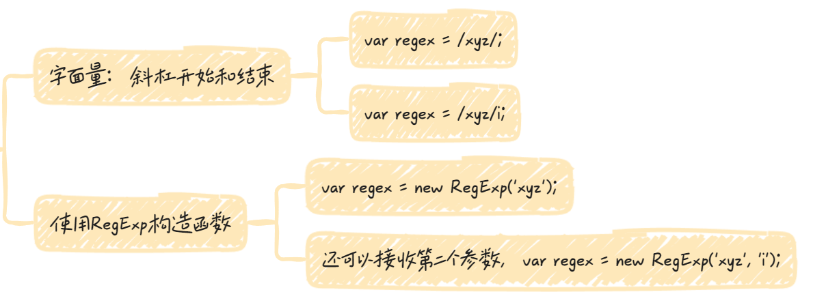

## 正则对象的实例属性

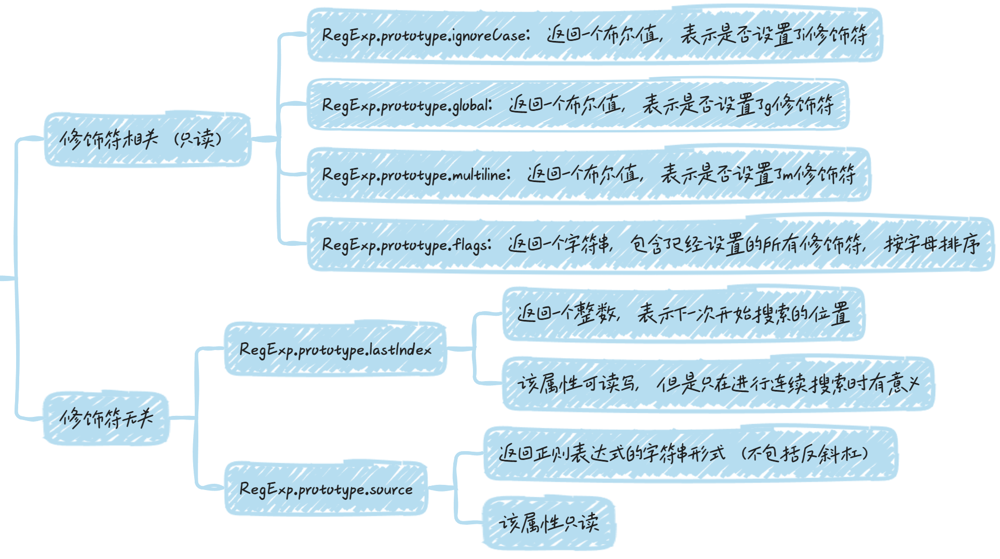

## 正则对象的实例方法

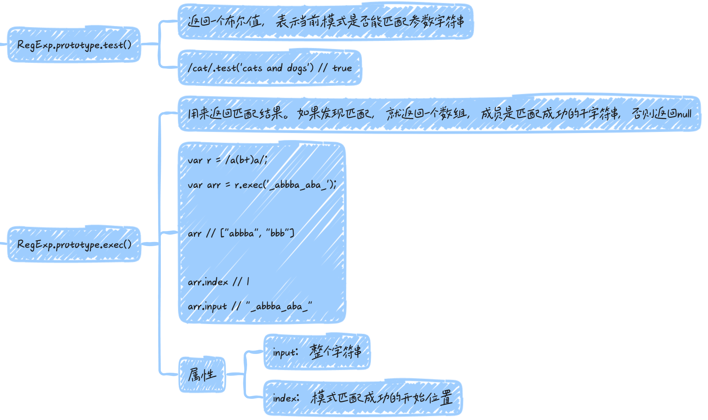


## 字符串相关的方法
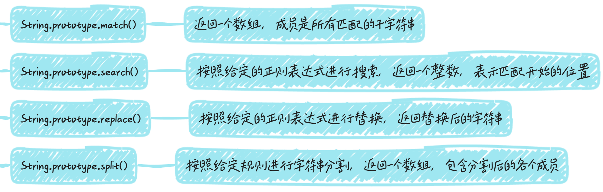

## 匹配规则

### 字面量字符和元字符
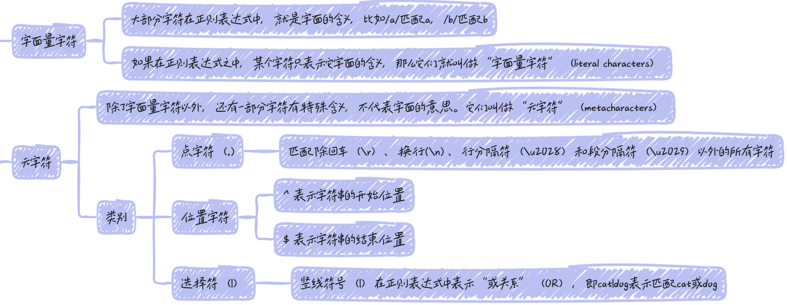

### 转义符
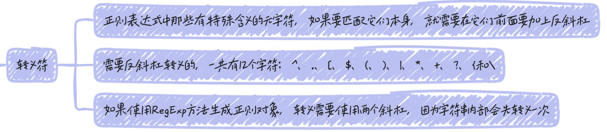

### 字符类
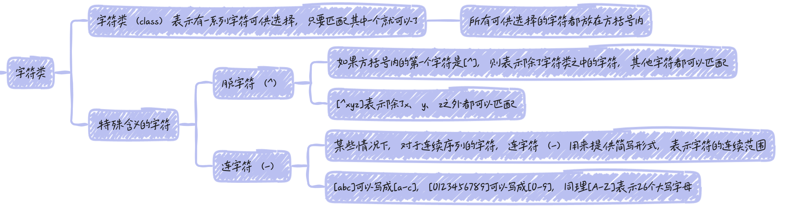

### 特殊字符
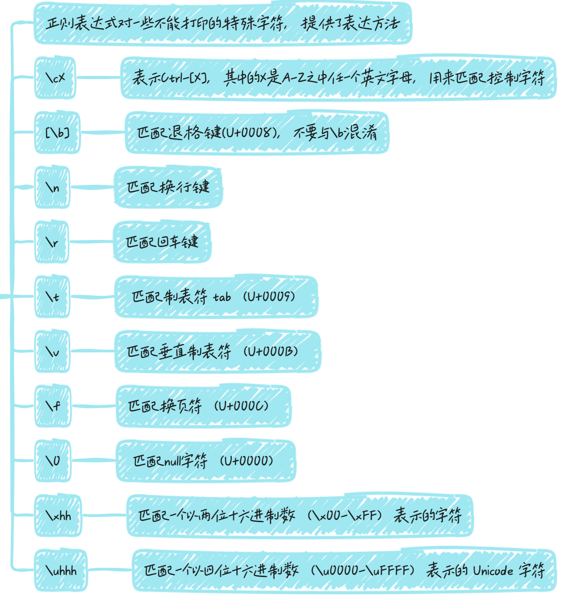

### 预定义模式
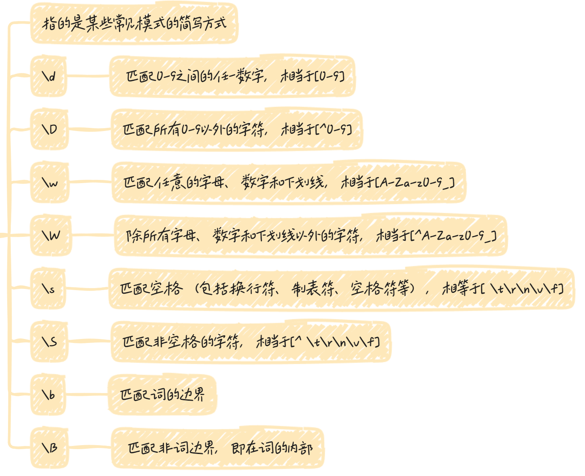

### 重复类
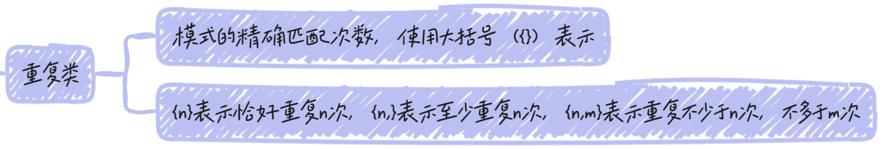


### 量词符
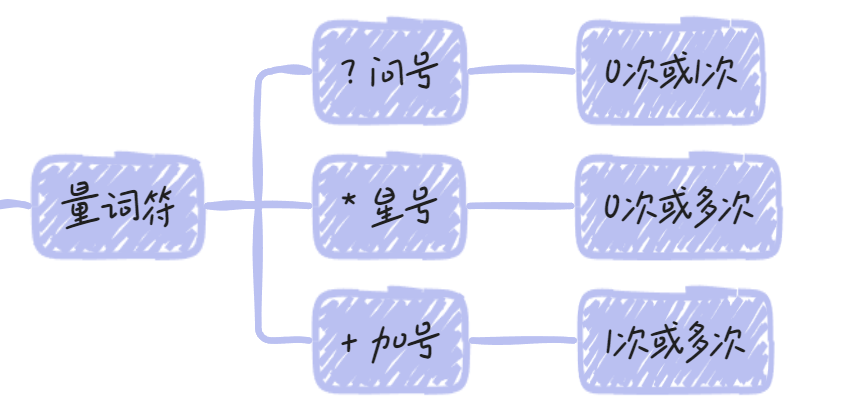

### 贪婪模式
`?`, `+`, `*`默认情况下都是最大可能匹配，即匹配到下一个字符不满足匹配规则为止，这被称为贪婪模式

```js
var s = 'aaa';
s.match(/a+/) // ["aaa"]
```

除了贪婪模式，还有非贪婪模式，即最小可能匹配，只要已发现匹配，就返回结果，不要往下检查。

如果想要将贪婪模式改为非贪婪模式，可以在量词符后面加一个问号

```js
var s = 'aaa';
s.match(/a+?/) // ["a"]
```

非贪婪模式匹配：

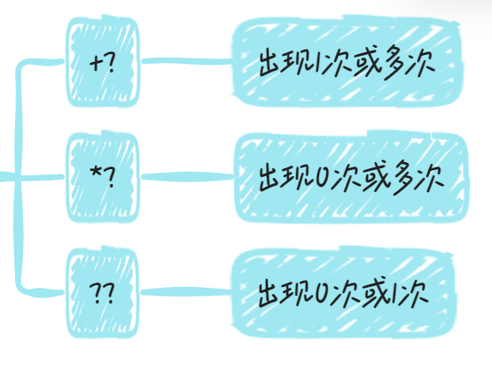


### 修饰符
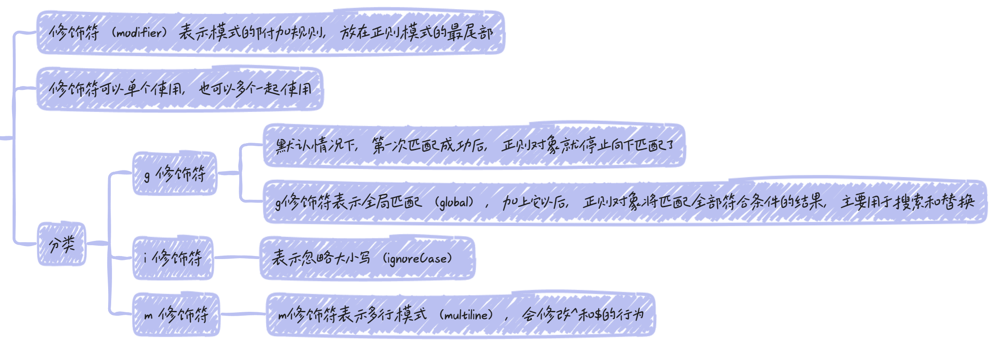

### 组匹配
正则表达式的括号表示分组匹配，括号中的模式可以用来匹配分组的内容

```js
/fred+/.test('fredd') // true
/(fred)+/.test('fredfred') // true
```

使用组匹配时，不宜同时使用g修饰符，否则match方法不会捕获分组的内容

```js
var m = 'abcabc'.match(/(.)b(.)/g);
m // ['abc', 'abc']

// 使用带g修饰符的正则表达式，结果match方法只捕获了匹配整个表达式的部分

// 这时必须使用正则表达式的exec方法，配合循环，才能读到每一轮匹配的组捕获
var str = 'abcabc';
var reg = /(.)b(.)/g;
while (true) {
  var result = reg.exec(str);
  if (!result) break;
  console.log(result);
}
// ["abc", "a", "c"]
// ["abc", "a", "c"]
```

正则表达式内部，还可以用`\n`引用括号匹配的内容，`n`是从`1`开始的自然数，表示对应顺序的括号

```js
/(.)b(.)\1b\2/.test("abcabc")
// true

// \1表示第一个括号匹配的内容（即a），\2表示第二个括号匹配的内容（即c）
```

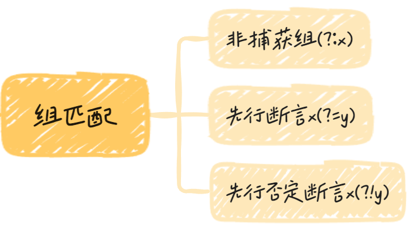

#### 非捕获组

`(?:x)`成为非捕获组（Non-capturing group），表示不返回该组匹配的内容，即匹配的结果中不计入这个括号

假定需要匹配`foo`或者`foofoo`，正则表达式就应该写成`/(foo){1, 2}/`，但是这样会占用一个组匹配。这时，就可以使用非捕获组，将正则表达式改为`/(?:foo){1, 2}/`，它的作用与前一个正则是一样的，但是不会单独输出括号内部的内容

```js
var m = 'abc'.match(/(?:.)b(.)/);
m // ["abc", "c"]

// 一共使用了两个括号。其中第一个括号是非捕获组，所以最后返回的结果中没有第一个括号，只有第二个括号匹配的内容
```

```js
// 正常匹配
var url = /(http|ftp):\/\/([^/\r\n]+)(\/[^\r\n]*)?/;

url.exec('http://google.com/');
// ["http://google.com/", "http", "google.com", "/"]

// 非捕获组匹配
var url = /(?:http|ftp):\/\/([^/\r\n]+)(\/[^\r\n]*)?/;

url.exec('http://google.com/');
// ["http://google.com/", "google.com", "/"]
```

#### 先行断言
`x(?=y)`称为先行断言（Positive look-ahead），`x`只有在`y`前面才匹配，`y`不会被计入返回结果。

比如，要匹配后面跟着百分号的数字，可以写成`/\d+(?=%)/`

**“先行断言”中，括号里的部分是不会返回的。**

```js
var m = 'abc'.match(/b(?=c)/);
m // ["b"]
```

#### 先行否定断言

`x(?!y)`称为先行否定断言（Negative look-ahead），`x`只有不在`y`前面才匹配，`y`不会被计入返回结果。

比如，要匹配后面跟的不是百分号的数字，就要写成`/\d+(?!%)/`

```js
/\d+(?!\.)/.exec('3.14')
// ["14"]
```

**“先行否定断言”中，括号里的部分是不会返回的。**

```js
var m = 'abd'.match(/b(?!c)/);
m // ['b']
```

## 参考
[https://wangdoc.com/javascript/stdlib/regexp#%E5%AD%97%E9%9D%A2%E9%87%8F%E5%AD%97%E7%AC%A6%E5%92%8C%E5%85%83%E5%AD%97%E7%AC%A6](https://wangdoc.com/javascript/stdlib/regexp#%E5%AD%97%E9%9D%A2%E9%87%8F%E5%AD%97%E7%AC%A6%E5%92%8C%E5%85%83%E5%AD%97%E7%AC%A6)