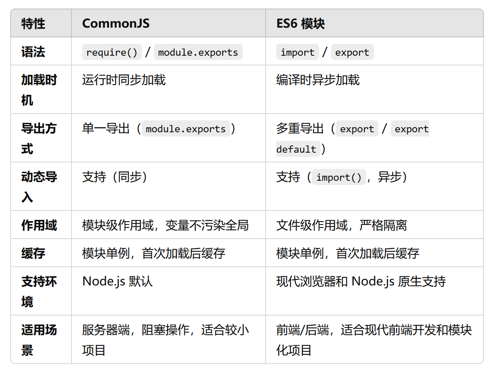
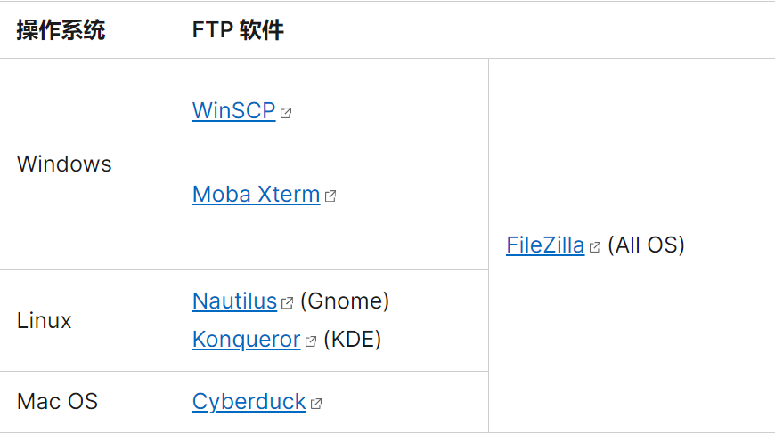
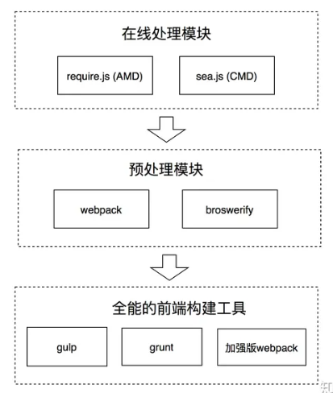

# 前端模块化
[https://mp.weixin.qq.com/s/t0l_TrQguO0ARoir3D-yEw](https://mp.weixin.qq.com/s/t0l_TrQguO0ARoir3D-yEw)

模块：

- 外部的模块：引入前端工程的某个外部的包（package），可能由多个JS文件组成，但会通过入口暴露给项目调用；

- 内部的模块：自己的工程项目中编码的最小单元，即单个的JS文件。

时间线：

Node.js         2009

NPM             2010

requireJS(AMD)  2010

seaJS(CMD)      2011

broswerify      2011

webpack         2012

grunt           2012

gulp            2013

react           2013

vue             2014

angular         2016

redux           2015

vite            2020

snowpack        2020

## 外部模块的管理

### 最开始
去官网下载放到项目中，同时在入口html通过script标签引用。

### NPM

Node.js和自带的模块管理工具NPM（node package manager）

可以用Node.js创建静态资源服务器，实现热重载和跨域代理等功能，同时还能用它源代码中的特殊写法做编译转换处理(JSX/Sass/TypeScript)，将代码翻译成浏览器可以理解的格式(ES5/CSS)


两部分组成：

- 是一个远程的JavaScript代码仓库，所有的可发这都可以向这里提交可共享的模块，并给其他开发者下载和使用

- 还包含一个命令行工具，通过运行`npm publish`把自己写的模块发布到NPM仓库上，通过运行`npm install [模块名]`，可以将别人的模块下载到自己项目根目录中一个叫node_modules的子目录下

每次npm install的时候，都会在package.json这个文件中更新模块和对应的版本信息。

## 内部模块的组织

### 第一阶段：原生JS组织
将不同的JS文件在html中引入，每个文件代表一个模块

通过`模块模式`去组织代码，通过`立即执行函数表达式IIFE`去组织模块，每个模块包裹在一个函数作用域里面执行，最大程度避免污染全局执行环境

### 第二阶段：在线处理阶段
出现许多模块化规范： AMD/CMD/CommonJS/ES6 Module

#### AMD && CMD规范 ==> require.js/Sea.js
“在线处理”模块的方案，也就是等到用户流量web页面下载了对应的require.js和sea.js文件之后，才开始进行模块依赖分析，确定加载顺序和执行顺序，模块组织过程在线上进行。

AMD：define和require

- define定义一个模块，接收数组（表示模块依赖的其他模块）和方法（通过入参的方式将所依赖模块的输出依次取出，并在方法内使用，将返回值传递给依赖它的其他模块使用）
```js
define(['Module1', 'Module2'], function (module1, module2) {
    var result1 = module1.exec();
    var result2 = module2.exec();
    return {
      result1: result1,
      result2: result2
    }
});    
```

- require用于真正执行模块，通常AMD框架会以require方法作为入口，进行依赖关系分析并依次有序地进行加载
```js
// 入口文件
require(['math'], function (math) {
　 math.sqrt(15)
});
```

CMD：接收一个factory函数，包括require（方法标识符，调用它可以动态的获取一个依赖模块的输出），exports（对象，用于对其他模块提供输出接口），module（对象，存储了当前模块相关的一些属性和方法，module.exports属性等同于exports）
```js
// CMD
define(function (requie, exports, module) {
    //依赖就近书写
    var module1 = require('Module1');
    var result1 = module1.exec();
    module.exports = {
      result1: result1,
    }
});

// AMD
define(['Module1'], function (module1) {
    var result1 = module1.exec();
    return {
      result1: result1,
    }
}); 
```

区别：

- AMD依赖前置，通过依赖数组的方式提前声明当前模块的依赖；CMD依赖就近，在编程需要用到的时候通过调用require方法动态引入

- AMD通过返回值的方式对外输出；CMD通过给module.exports赋值的方式对外输出

## 模块源码到目标代码的编译和转换

### ES6模块化风格  ==> CommonJS/ES6
随着Babel等编译工具和webpack等自动化工具的出现，AMD/CMD不再使用

CommonJS && ES6

CommonJS是Node.js使用的模块化方式，而import/export则是ES6提出的模块化规范。

```js
// ES6
import { foo } from './foo'; // 输入
export const bar = 1;        // 输出

// CommonJS
const foo = require('./foo'); // 输入
module.exports = { 。         // 输出
    bar:1
}
```
但在最开始的时候，我们却不能在前端页面中使用它们，因为浏览器并不能理解这种语法。

babel的出现和ES6模块化的推广

babel是一个JavaScript编译器，让我们能够使用符合开发需求的编程风格去编写代码，然后通过babel编译转化成对浏览器兼容良好的JavaScript

babel出现之前，开发和生产的代码并没有明显的区分性，而babel则将开发和生产这两个流程分开了，同时让我们可以用ES6中的import/export进行模块化开发。

#### babel的工作原理
三个阶段：

- Parse（解析）：通过词法分析和语法分析，将源代码解析成抽象语法树AST

- Transform（转换）：对解析出来的抽象语法树做中间转换处理

- Generate（生成）：用经过转换后的抽象语法树生成新的代码

### 第三阶段：预处理阶段

也就是预编译阶段

CMD/AMD的在线编译，也就是等到用户浏览web页面下载了js文件之后，才开始进行模块依赖分析，确定加载顺序和执行顺序，但这样会带来问题：

1、在线组织模块的方式延长前端页面的加载时间，影响用户体验

2、加载过程中发出了海量的http请求，降低页面性能


于是开发者们：

- 开发一个工具，让它把组织模块的工作提前做好，在代码部署上线前就完成，从而节约页面加载时间

- 使用工具进行代码合并，把多个script的代码合并到少数几个script里，减少http请求的数量。



所以一系列模块预处理工具出现了：2011年出现的broswerify和2012年的webpack

最开始都是通过预先打包的方式，把前端项目里面的多个文件打包成单个文件或少数几个文件，这样就可以压缩首次页面访问时的http请求数量，从而提高性能



**broswerify**

```cmd
npm install -g browserify
`

broswerify允许通过CommonJS的规范编写代码，例如下面的入口文件main.js
```js
// main.js
var a = require('./a.js');
var b = require('./b.js');
...     
```

然后可以用broswerify携带的命令行工具处理main.js，它会自动分析依赖关系并进行打包,打包后会生成集合文件bundle.js。

```cmd
browserify main.js -o bundle.js      
```

**webpack**

```cmd
npm install --save-dev webpack     
```

它要求编写一份webpack.config.js的配置文件，并以entry字段和output字段分别表示打包的入口和输出路径

```js
// webpack.config.js
const path = require('path');

module.exports = {
  entry: './src/index.js',
  output: {   
    path: path.resolve(__dirname, 'dist'),
    filename: 'bundle.js'
  }
};   
```
打包完毕，index.html只需要加载bundle.js就可以了
```html
<!doctype html>
<html>
  <head>
    ...
  </head>
  <body>
    ...
    <script src="dist/bundle.js"></script>
  </body>
</html>  
```

**打包工具面临的问题 && 解决方案**

- 打包后代码体积过大的问题

如此一来，首屏加载会消耗很长时间并拖慢速度

webpack于是引入了代码拆分的功能(Code Splitting)来解决这个问题, 从全部打包后退一步：可以打包成多个包

Code Splitting有可分为两个方面的作用：

一是实现第三方库和业务代码的分离：业务代码更新频率快，而第三方库代码更新频率是比较慢的。分离之后可利用浏览器缓存机制加载第三方库，从而加快页面访问速度

这种代码拆分可通过webpack独特的插件机制完成。plugins字段是是一个数组，可接收不同的plugins实例，从而给webpack打包程序附加不同的功能，CommonsChunkPlugin就是一个实现代码拆分的插件。

```js
// webpack.config.js
module.exports = {
  plugins: [
    new webpack.optimize.CommonsChunkPlugin({
      name: 'commons',        // the commons chunk name
      filename: 'commons.js', // the filename of the commons chunk)
      minChunks: 3,           // Modules must be shared between 3 entries
    });
  ]
};          
```
通过上面的配置，webpack在执行打包的时候会把被引用超过3次的依赖文件视为"公共文件"，并单独打包到commons.js中，而不是打包到主入口文件里。

对于React，Redux,lodash这些第三方库，因为引用次数远远超过3次，当然也是会被打包到common.js中去的。


二是实现按需加载: 例如我们经常通过前端路由分割不同页面，除了首页外的很多页面(路由)可能访问频率较低，我们可将其从首次加载的资源中去掉，而等到相应的触发时刻再去加载它们。这样就减少了首屏资源的体积，提高了页面加载速度。

按需加载就是等到需要的时候才加载一部分模块。并不选择将其代码打包到首次加载的入口bundle中，而是等待触发的时机，届时才通过动态脚本插入的方式进行加载: 即创建script元素，添加脚本链接并通过appendChild加入到html元素中

例如我们需要实现一个功能，在点击某个按钮的时候，使用某个模块的功能。这时我们可以使用ES6的import语句动态导入，webpack会支持import的功能并实现按需加载
```js
button.addEventListener('click',function(){
  import('./a.js').then(data => {
    // use data
  })
});
```

### 第四阶段：自动化构建

什么叫自动化构建工具呢？ 简单的说就是： 我们需要这样一个工具，专门为开发过程服务，尽可能满足我们开发的需求，提高开发的效率。

自动化构建工具就是在开发流程中给开发者最大的自由度和便捷性，同时在生产流程中能保证浏览器兼容性和良好性能的工具。而所有的功能已经由插件直接提供，所以被称作“自动化” 构建工具。



**gulp && webpack**

- gulp是编程式的自动化构建工具

- webpack是配置式的自动化构建工具

Gulp基本的风格是编程式的, 它是一种基于流即Node.js 封装起来的 stream 模块的自动化构建工具，一般先通过gulp.src将匹配的文件转化成stream(流)的形式，然后通过一连串的pipe方法进行链式的加工处理处理，对后通过dest方法输出到指定路径。

```
// gulpfile.js
const { src, dest } = require('gulp');
const less = require('gulp-less');
const minifyCSS = require('gulp-csso');

function css() {
  return src('client/templates/*.less')
    .pipe(less())
    .pipe(minifyCSS())
    .pipe(dest('build/css'))
}               
```

webpack的基本风格则是配置式的，它通过loader机制实现文件的编译转化。通过配置一组loader数组，每个loader会被链式调用，处理当前文件代码后输出给下一个loader, 全部处理完毕后进行输出
```
// webpack.config.js
module.exports = {
  module: {
    rules: [
      {
        test: /\.less$/, // 正则匹配less文件
        use: [
          { loader: 'style-loader' }, // creates style nodes from JS strings
          { loader: 'css-loader' },   // translates CSS into CommonJS
          { loader: 'less-loader' },  // compiles Less to CSS
        ],
      },
    ],
  },
};       
```
gulp和webpack在很多方面是类似的,这从它们的相关生态上也可以看得出来

Gulp

gulp-uglify : 压缩js文件;
gulp-less : 编译less;
gulp-sass：编译sass;
gulp-livereload : 实时自动编译刷新;
gulp-load-plugins：打包插件;


Webpack

uglifyjs-webpack-plugin: 压缩js文件;
less-loader: 编译less;
sass-loader： 编译sass;
devServer.hot配置为true: 实时自动编译刷新;
....
