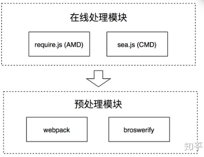
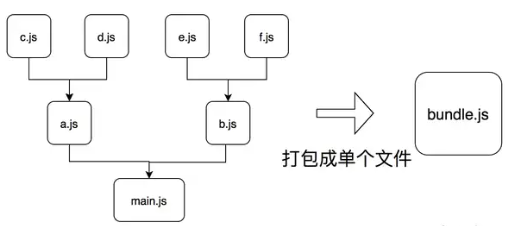
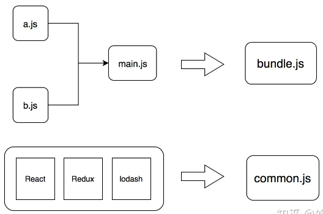

# 前端模块化

[https://mp.weixin.qq.com/s/t0l_TrQguO0ARoir3D-yEw](https://mp.weixin.qq.com/s/t0l_TrQguO0ARoir3D-yEw)

模块：

- 外部的模块：引入前端工程的某个外部的包（package），可能由多个 JS 文件组成，但会通过入口暴露给项目调用；

- 内部的模块：自己的工程项目中编码的最小单元，即单个的 JS 文件。

时间线：

Node.js 2009

NPM 2010

requireJS(AMD) 2010

seaJS(CMD) 2011

broswerify 2011

webpack 2012

grunt 2012

gulp 2013

react 2013

vue 2014

angular 2016

redux 2015

vite 2020

snowpack 2020

## 外部模块的管理

### 最开始

去官网下载放到项目中，同时在入口 html 通过 script 标签引用。

### NPM

Node.js 和自带的模块管理工具 NPM（node package manager）

可以用 Node.js 创建静态资源服务器，实现热重载和跨域代理等功能，同时还能用它源代码中的特殊写法做编译转换处理(JSX/Sass/TypeScript)，将代码翻译成浏览器可以理解的格式(ES5/CSS)

两部分组成：

- 是一个远程的 JavaScript 代码仓库，所有的可发这都可以向这里提交可共享的模块，并给其他开发者下载和使用

- 还包含一个命令行工具，通过运行`npm publish`把自己写的模块发布到 NPM 仓库上，通过运行`npm install [模块名]`，可以将别人的模块下载到自己项目根目录中一个叫 node_modules 的子目录下

每次 npm install 的时候，都会在 package.json 这个文件中更新模块和对应的版本信息。

## 内部模块的组织

### 第一阶段：原生 JS 组织

将不同的 JS 文件在 html 中引入，每个文件代表一个模块

通过`模块模式`去组织代码，通过`立即执行函数表达式IIFE`去组织模块，每个模块包裹在一个函数作用域里面执行，最大程度避免污染全局执行环境

### 第二阶段：在线处理阶段

出现许多模块化规范： AMD/CMD/CommonJS/ES6 Module

#### AMD && CMD 规范 ==> require.js/Sea.js

“在线处理”模块的方案，也就是等到用户流量 web 页面下载了对应的 require.js 和 sea.js 文件之后，才开始进行模块依赖分析，确定加载顺序和执行顺序，模块组织过程在线上进行。

AMD：define 和 require

- define 定义一个模块，接收数组（表示模块依赖的其他模块）和方法（通过入参的方式将所依赖模块的输出依次取出，并在方法内使用，将返回值传递给依赖它的其他模块使用）

```js
define(['Module1'， 'Module2']， function (module1， module2) {
    var result1 = module1.exec();
    var result2 = module2.exec();
    return {
      result1: result1，
      result2: result2
    }
});
```

- require 用于真正执行模块，通常 AMD 框架会以 require 方法作为入口，进行依赖关系分析并依次有序地进行加载

```js
// 入口文件
require(['math']， function (math) {
　 math.sqrt(15)
});
```

CMD：接收一个 factory 函数，包括 require（方法标识符，调用它可以动态的获取一个依赖模块的输出），exports（对象，用于对其他模块提供输出接口），module（对象，存储了当前模块相关的一些属性和方法，module.exports 属性等同于 exports）

```js
// CMD
define(function (requie， exports， module) {
    //依赖就近书写
    var module1 = require('Module1');
    var result1 = module1.exec();
    module.exports = {
      result1: result1，
    }
});

// AMD
define(['Module1']， function (module1) {
    var result1 = module1.exec();
    return {
      result1: result1，
    }
});
```

区别：

- AMD 依赖前置，通过依赖数组的方式提前声明当前模块的依赖；CMD 依赖就近，在编程需要用到的时候通过调用 require 方法动态引入

- AMD 通过返回值的方式对外输出；CMD 通过给 module.exports 赋值的方式对外输出

## 模块源码到目标代码的编译和转换

### ES6 模块化风格 ==> CommonJS/ES6

随着 Babel 等编译工具和 webpack 等自动化工具的出现，AMD/CMD 不再使用

CommonJS && ES6

CommonJS 是 Node.js 使用的模块化方式，而 import/export 则是 ES6 提出的模块化规范。

```js
// ES6
import { foo } from './foo'; // 输入
export const bar = 1;        // 输出

// CommonJS
const foo = require('./foo'); // 输入
module.exports = { 。         // 输出
    bar:1
}
```

但在最开始的时候，我们却不能在前端页面中使用它们，因为浏览器并不能理解这种语法。

babel 的出现和 ES6 模块化的推广

babel 是一个 JavaScript 编译器，让我们能够使用符合开发需求的编程风格去编写代码，然后通过 babel 编译转化成对浏览器兼容良好的 JavaScript

babel 出现之前，开发和生产的代码并没有明显的区分性，而 babel 则将开发和生产这两个流程分开了，同时让我们可以用 ES6 中的 import/export 进行模块化开发。

#### babel 的工作原理

三个阶段：

- Parse（解析）：通过词法分析和语法分析，将源代码解析成抽象语法树 AST

- Transform（转换）：对解析出来的抽象语法树做中间转换处理

- Generate（生成）：用经过转换后的抽象语法树生成新的代码

### 第三阶段：预处理阶段

也就是预编译阶段

CMD/AMD 的在线编译，也就是等到用户浏览 web 页面下载了 js 文件之后，才开始进行模块依赖分析，确定加载顺序和执行顺序，但这样会带来问题：

1、在线组织模块的方式延长前端页面的加载时间，影响用户体验

2、加载过程中发出了海量的 http 请求，降低页面性能

于是开发者们：

- 开发一个工具，让它把组织模块的工作提前做好，在代码部署上线前就完成，从而节约页面加载时间

- 使用工具进行代码合并，把多个 script 的代码合并到少数几个 script 里，减少 http 请求的数量。



所以一系列模块预处理工具出现了：2011 年出现的 broswerify 和 2012 年的 webpack

最开始都是通过预先打包的方式，把前端项目里面的多个文件打包成单个文件或少数几个文件，这样就可以压缩首次页面访问时的 http 请求数量，从而提高性能



**broswerify**

````cmd
npm install -g browserify
`

broswerify允许通过CommonJS的规范编写代码，例如下面的入口文件main.js
```js
// main.js
var a = require('./a.js');
var b = require('./b.js');
...
````

然后可以用 broswerify 携带的命令行工具处理 main.js，它会自动分析依赖关系并进行打包，打包后会生成集合文件 bundle.js。

```cmd
browserify main.js -o bundle.js
```

**webpack**

```cmd
npm install --save-dev webpack
```

它要求编写一份 webpack.config.js 的配置文件，并以 entry 字段和 output 字段分别表示打包的入口和输出路径

```js
// webpack.config.js
const path = require('path');

module.exports = {
  entry: './src/index.js'，
  output: {
    path: path.resolve(__dirname， 'dist')，
    filename: 'bundle.js'
  }
};
```

打包完毕，index.html 只需要加载 bundle.js 就可以了

```html
<!DOCTYPE html>
<html>
  <head>
    ...
  </head>
  <body>
    ...
    <script src="dist/bundle.js"></script>
  </body>
</html>
```

**打包工具面临的问题 && 解决方案**

- 打包后代码体积过大的问题

如此一来，首屏加载会消耗很长时间并拖慢速度

webpack 于是引入了代码拆分的功能(Code Splitting)来解决这个问题， 从全部打包后退一步：可以打包成多个包

Code Splitting 有可分为两个方面的作用：

一是实现第三方库和业务代码的分离：业务代码更新频率快，而第三方库代码更新频率是比较慢的。分离之后可利用浏览器缓存机制加载第三方库，从而加快页面访问速度

这种代码拆分可通过 webpack 独特的插件机制完成。plugins 字段是是一个数组，可接收不同的 plugins 实例，从而给 webpack 打包程序附加不同的功能，CommonsChunkPlugin 就是一个实现代码拆分的插件。

```js
// webpack.config.js
module.exports = {
  plugins: [
    new webpack.optimize.CommonsChunkPlugin({
      name: 'commons'，        // the commons chunk name
      filename: 'commons.js'， // the filename of the commons chunk)
      minChunks: 3，           // Modules must be shared between 3 entries
    });
  ]
};
```

通过上面的配置，webpack 在执行打包的时候会把被引用超过 3 次的依赖文件视为"公共文件"，并单独打包到 commons.js 中，而不是打包到主入口文件里。

对于 React，Redux，lodash 这些第三方库，因为引用次数远远超过 3 次，当然也是会被打包到 common.js 中去的。



二是实现按需加载: 例如我们经常通过前端路由分割不同页面，除了首页外的很多页面(路由)可能访问频率较低，我们可将其从首次加载的资源中去掉，而等到相应的触发时刻再去加载它们。这样就减少了首屏资源的体积，提高了页面加载速度。

按需加载就是等到需要的时候才加载一部分模块。并不选择将其代码打包到首次加载的入口 bundle 中，而是等待触发的时机，届时才通过动态脚本插入的方式进行加载: 即创建 script 元素，添加脚本链接并通过 appendChild 加入到 html 元素中

例如我们需要实现一个功能，在点击某个按钮的时候，使用某个模块的功能。这时我们可以使用 ES6 的 import 语句动态导入，webpack 会支持 import 的功能并实现按需加载

```js
button.addEventListener('click'，function(){
  import('./a.js').then(data => {
    // use data
  })
});
```

### 第四阶段：自动化构建

什么叫自动化构建工具呢？ 简单的说就是： 我们需要这样一个工具，专门为开发过程服务，尽可能满足我们开发的需求，提高开发的效率。

自动化构建工具就是在开发流程中给开发者最大的自由度和便捷性，同时在生产流程中能保证浏览器兼容性和良好性能的工具。而所有的功能已经由插件直接提供，所以被称作“自动化” 构建工具。


**gulp && webpack**

- gulp 是编程式的自动化构建工具

- webpack 是配置式的自动化构建工具

Gulp 基本的风格是编程式的， 它是一种基于流即 Node.js 封装起来的 stream 模块的自动化构建工具，一般先通过 gulp.src 将匹配的文件转化成 stream(流)的形式，然后通过一连串的 pipe 方法进行链式的加工处理处理，对后通过 dest 方法输出到指定路径。

```
// gulpfile.js
const { src， dest } = require('gulp');
const less = require('gulp-less');
const minifyCSS = require('gulp-csso');

function css() {
  return src('client/templates/*.less')
    .pipe(less())
    .pipe(minifyCSS())
    .pipe(dest('build/css'))
}
```

webpack 的基本风格则是配置式的，它通过 loader 机制实现文件的编译转化。通过配置一组 loader 数组，每个 loader 会被链式调用，处理当前文件代码后输出给下一个 loader， 全部处理完毕后进行输出

```
// webpack.config.js
module.exports = {
  module: {
    rules: [
      {
        test: /\.less$/， // 正则匹配less文件
        use: [
          { loader: 'style-loader' }， // creates style nodes from JS strings
          { loader: 'css-loader' }，   // translates CSS into CommonJS
          { loader: 'less-loader' }，  // compiles Less to CSS
        ]，
      }，
    ]，
  }，
};
```

gulp 和 webpack 在很多方面是类似的，这从它们的相关生态上也可以看得出来

Gulp

gulp-uglify : 压缩 js 文件;
gulp-less : 编译 less;
gulp-sass：编译 sass;
gulp-livereload : 实时自动编译刷新;
gulp-load-plugins：打包插件;

Webpack

uglifyjs-webpack-plugin: 压缩 js 文件;
less-loader: 编译 less;
sass-loader： 编译 sass;
devServer.hot 配置为 true: 实时自动编译刷新;
....

## CommonJS 与 ES6

### 语法

- CommonJS

> 使用 module.exports 导出，`require()`导入
>
> 语法是函数式的，运行时调用 require

```js
// 导出
module.exports = {
  name: "CommonJS",
};

// 导入
module.exports = require("./moduleA");
```

- ES6 模块

> 使用 export 和 import 关键字
>
> 语法是声明式的，编译时就能解析模块依赖关系

```js
// 导出
export const name = "ES6 Module";

// 导入
import { name } from "./moduleA.js";
```

### 语法导入

- CommonJS

> 支持动态导入，require()可以在代码执行时动态调用，可以放在条件语句或函数中

```js
if (condition) {
  const moduleA = require("./moduleA");
}
```

- ES6 模块

> 默认情况下 import 语句是静态的，不能在条件中使用。
>
> 可以使用 `import()` 函数实现动态导入，它是一个异步操作，返回 Promise。

```js
if (condition) {
  import("./moduleA").then((module) => {
    console.log(module.name);
  });
}
```

### 模块的导出类型

- CommonJS

> module.exports 只能导出一个对象、函数或值，这意味着你导出的东西通常是一个整体。
>
> 可以通过赋值 module.exports 或 exports 进行导出，exports 是 module.exports 的简写，但两者指向同一个对象，直接赋值时需要谨慎。

```js
module.exports = { name: "CommonJS" };
// 或者
exports.name = "CommonJS";
```

- ES6 模块

> 可以导出多个内容，可以通过 export 导出变量、函数、类等，export default 还允许导出默认的值
>
> 支持 named exports（具名导出）和 default exports（默认导出）

```js
// Named export
export const name = "ES6 Module";

// Default export
export default function () {
  console.log("Default Export");
}
```

### 同步和异步

- CommonJS 模块加载是同步的，因此`require()`是阻塞的，适合服务器端使用，不适合浏览器端直接使用（可能会影响性能）

- ES6 模块：模块加载是异步的，尤其是在浏览器中，import 是非阻塞的，因此前端环境中效率更高（在`编译阶段`处理依赖关系）

### 作用域

CommonJS 模块是运行时加载，每次调用 `require()` 会得到同一个模块的实例（即单例模式）。每个模块都有自己的作用域，模块中的变量不会污染全局作用域

ES6 模块是静态定义的，并且严格遵循文件级作用域，每个文件都有自己的作用域，变量不会污染全局。模块内的变量默认是私有的，只有导出的内容才能被外部访问。

### 模块缓存

CommonJS 模块是单例模式，第一次加载后会被缓存。之后再次 require() 时，不会重新加载模块，而是直接使用缓存中的模块对象。

ES6 模块同样被缓存，但由于是编译时加载的，它在首次导入时就已经加载，后续再 import 时也是直接使用缓存。

### Node.js 与浏览器支持

CommonJS 是 Node.js 的默认模块系统，支持广泛，用于服务器端，在浏览器端使用 CommonJS 需要工具如 Browserify 或 Webpack 来打包

ES6 模块是现代浏览器和 Node.js（自 v12 及以上版本）原生支持的模块系统。大多数现代浏览器支持 `<script type="module">` 标签加载 ES6 模块，Node.js 也逐步支持 ES6 模块

在浏览器中使用 ES6 模块时，可以通过 `<script type="module">` 标签直接导入

## 总结


