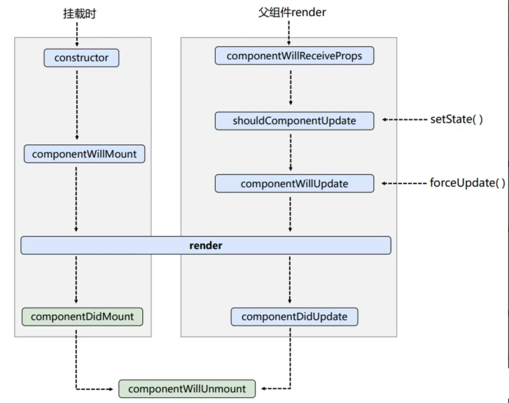
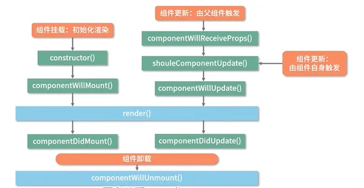
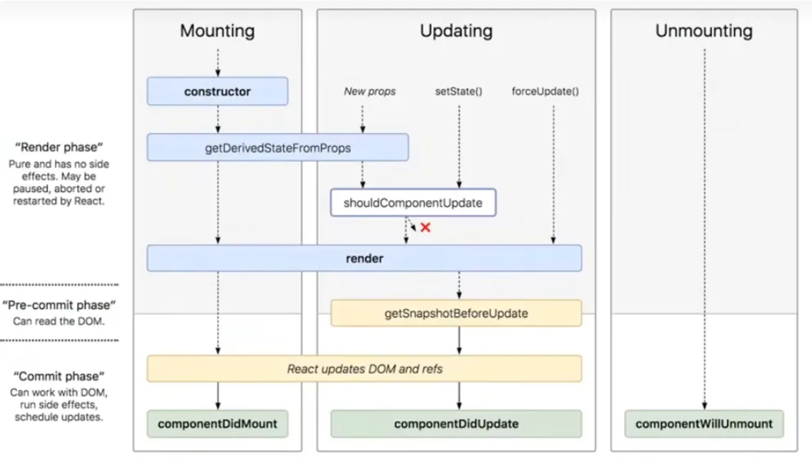

# 生命周期

## 概念

生命周期是指 React 组件从装载至卸载的全过程，这个过程内置多个函数供开发者在组件的不同阶段执行需要的逻辑。

状态组件主要通过 3 个生命周期阶段来管理，分别是 装载阶段 MOUNTING，更新阶段 UPDATING 和卸载阶段 UNMOUNT

从纵向划分，可以划分为 Render 阶段和 Commit 阶段

- Render 阶段：纯净且不包含副作用，可能会被 React 暂停、中止或重新启动

- Commit 阶段：可以使用 DOM，运行副作用，安排更新

## 旧版生命周期

### 装载阶段

`constructor---->componentWillMount---->render---->componentDidMount`

### 更新阶段

`componentWillReceiveProps---->shouldComponentUpdate---->render---->componentDidUpdate`

### 卸载阶段

`componentWillUnmount`

## 新版生命周期

### 挂载阶段

`constructor---->getDerivedStatedFromProps---->render---->componentDidMount`

### 更新阶段

`getDerivedStateFromProps---->shouldComponentUpdate---->render---->getSnapshotBeforeUpdate---->componentDidUpdate`

### 卸载阶段

`componentWillUnmount`

### 新增的生命钩子

#### getDerivedStateFromProps

`derived [di'raivd] 衍生的，派生的`，那么翻译过来，这个钩子的作用其实就是从 props 中获取衍生的 state

#### getSnapshotBeforeUpdate

`snapshot [ˈsnæpʃɒt] 快照`，这个钩子的意思其实就是在组件更新前获取快照，此方法一般结合 componentDidUpdate 使用，getSnapshotBeforeUpdate 中返回的值将作为第三参数传递给 componentDidUpdate

### 废弃的钩子

按照官方的说法，这三个钩子很容易被误解和滥用，而且在未来 react 打算提供异步渲染能力，那么这几个钩子的不稳定很可能被放大，从而带来不可预测的 bug。

#### componentWillMount

#### componentWillReceiveProps

#### componentWillUpdate

## 生命周期函数

### constructor 构造函数

- 语法：constructor(props, context, updater)

> - props：继承 React.Component 的属性方法，它是不可变的，read-only
>
> - context：全局上下文
>
> - updater：包含一些更新方法的对象
>
> this.setState 最终调用的是 this.updater.enqueueSetState
>
> this.forceUpdate 最终调用的是 this.updater.enqueueForceUpdate 方法

- 触发时机：组件初始化的时候触发一次

### static getDerivedStateFromProps

- 语法：static getDerivedStateFromProps(nextProps, prevState)

- 触发实际：组件实例化和重新渲染前调用（生成 VirtualDOM 之后，实际 DOM 挂载之前），意味着无论是`父组件的更新`、props 的变化或通过 setState 更新组件内部的 State，它都会被调用

- 返回值：需要一个返回对象来更新 state，或者返回 null 表示新的 props 不需要更新任何 state

- 新特性：当组件实例化时，该方法替代了 componentWillMount；当接受新的 props 时，该方法替代了 componentWillReceiveProps 和 componentWillUpdate

- 该方法为静态方法，目的是保持该方法的纯粹。通过父组件输入的 props 按需更新 state，这种 state 叫做`衍生state`，返回的对象就是要增量更新的 state，除此之外不应该在里面执行任何操作。并且设计成静态方法，能够限制开发者无法访问 this，也就是实例，这样就不能在里面调用实例方法或者 setState 以破坏生命周期函数的功能

### render 渲染函数

- 返回值：唯一的一定不能省略的函数，必须有返回值。返回 null 或 false 表示不渲染任何 DOM 元素

此渲染函数并不做实际的渲染动作，返回的是一个 JSX 的描述对象（及组件实例），何时进行真正的渲染是由 React 库决定的。

React 肯定是要把所有组件返回的结果综合起来，才能知道如何产生真实的 DOM 树。也就是说，只有 React 库调用所有组件的渲染函数之后，才有可能完成 DOM 装载，这时候才会依次调用 componentDidMount 函数作为装载的收尾。

### componentDidMount 装载成功函数

- 触发时机：组件完全挂载到网页上后触发

- 适用场景：发送网络请求；任何依赖于 DOM 的初始化操作；添加事件监听；如果使用了 Redux 之类的数据管理工具，也能触发 action 处理数据变化逻辑

componentDidMount 通常用于加载外部数据（即发送网络请求），之所以在 componentDidMount 中而不是在构造函数中进行数据请求的原因在于：如果数据加载完毕后，即 props 已经有值了，但是组件还没有渲染出来，会报错。

### shouldComponentUpdate

- 语法：shouldComponentUpdate(nextProps, nextState)

- 触发时机：每次组件因为 state 和 props 变化而更新时，在重新渲染前该生命周期函数都会触发，让 React 知道当前 state 或 props 的改变是否影响组件的输出（渲染）

- 返回值：根据逻辑判断返回 true 表示继续进行组件渲染，否则将停止组件渲染过程。默认返回 true，也就是说，只要组件触发了更新，组件就一定会更新。

使用 React.PureComponent 组件基类能自动实现一个 shouldComponentUpdate 生命周期钩子，可以默认为组件更新校验，但是只会对更新数据进行浅层对照；

此钩子函数在初始化渲染和使用了 forceUpdate 方法的情况下不会被触发，使用 forceUpdate 会强制更新

请勿在此函数中使用 setState 方法，会导致循环调用

### 更新阶段的 render 渲染函数

用于输出 JSX 并经过 React 处理后渲染至浏览器

### getSnapShotBeforeUpdate 保存状态快照

- 语法：getSnapShotBeforeUpdate(prevProps, prevState)

- 触发时机：会在组件即将挂载时触发，在 render 之后。由此可见，render 函数并没有完成挂载操作，而是进行构建抽象 UI（也就是 Virtual DOM）的工作。该生命周期函数执行完毕后就会立即触发 componentDidUpdate 生命周期钩子。

### componentDidUpdate 更新完成函数

- 语法：componentDidUpdate(nextProps,nextState,snapshot)

- 触发时机：组件每次重新渲染后触发，相当于首次渲染（初始化）之后触发 componentDidUpdate

### componentWillUnmount 预卸载函数

- 触发时机：在组件卸载和销毁之前触发。可以利用这个生命周期方法去执行任何清理任务。

在该方法中调用 setState 不会触发 render，因为所有的更新队列，更新状态都被重置为 null

### 捕捉错误

在渲染过程中发生错误时会被触发

#### static getDerivedStateFromError

- 语法：static getDervedStateFromError(error)

- 触发时机：该生命周期函数会在子孙组件抛出错误时执行

- 返回值：它接收抛出的错误作为参数并且需要返回值用于更新 State

#### componentDidCatch

- 语法：componentDidCatch(error, info)

> - error - 抛出的错误对象
>
> - info - 包含有关错误的信息的对象

- 触发时机：该生命周期函数会在子孙组件抛出错误时触发

## 参考

[https://www.cnblogs.com/echolun/p/15668292.html](https://www.cnblogs.com/echolun/p/15668292.html)

[https://tsejx.github.io/react-guidebook/foundation/main-concepts/lifecycle/](https://tsejx.github.io/react-guidebook/foundation/main-concepts/lifecycle/)
