# day6

## 路由的封装抽离
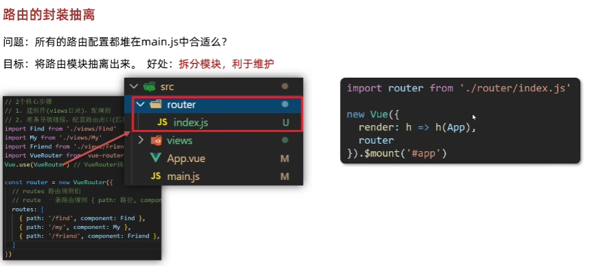

## 声明式导航 - 导航链接
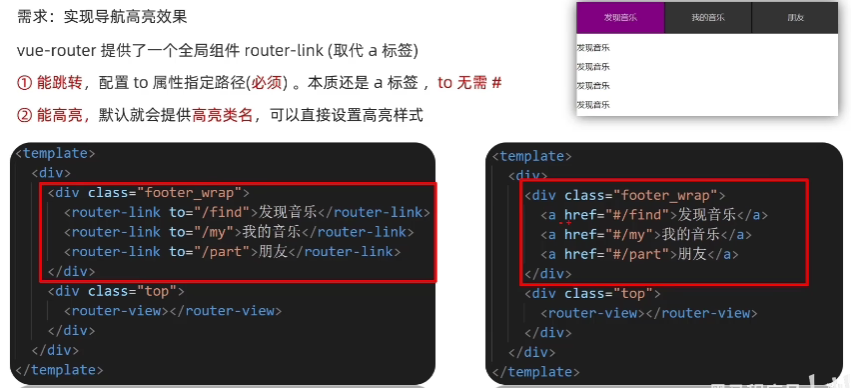

## 声明式导航 - 两个类名
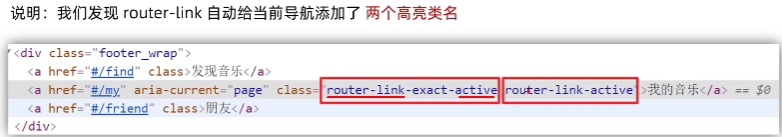

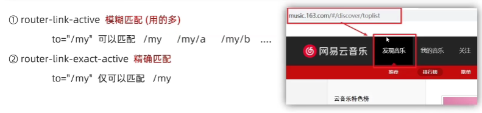

### 定制
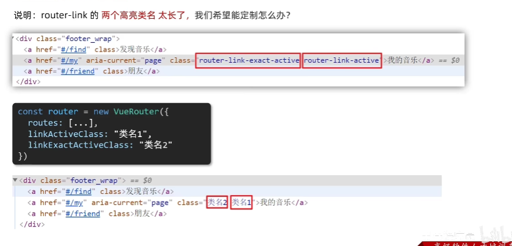

## 声明式导航 - 跳转传参
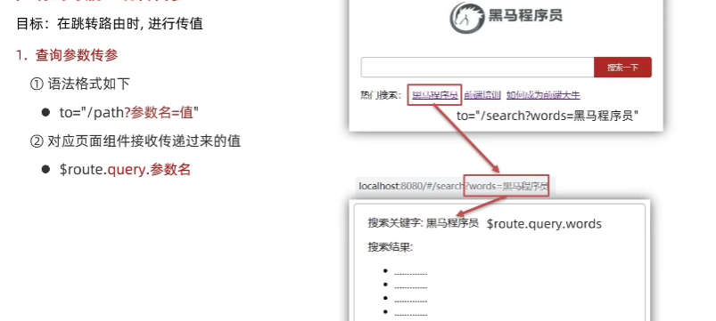

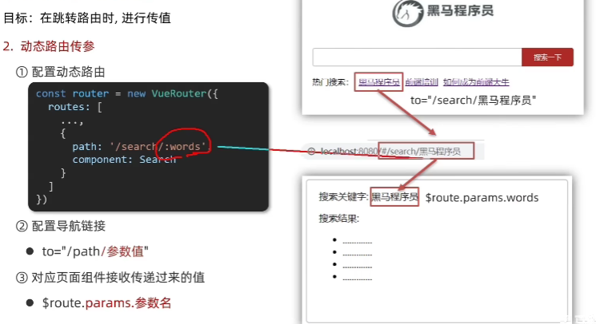

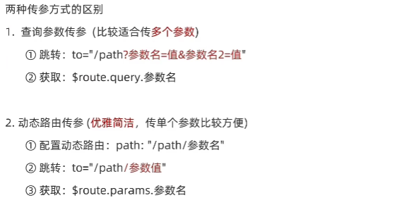

## 动态路由参数可选符
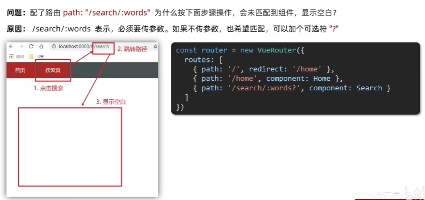

## vue路由 - 重定向
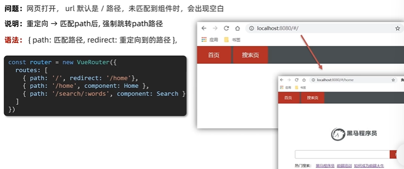

## vue路由 - 404页面
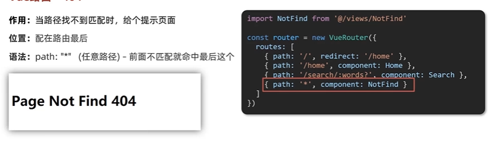

## vue路由 - 模式设置
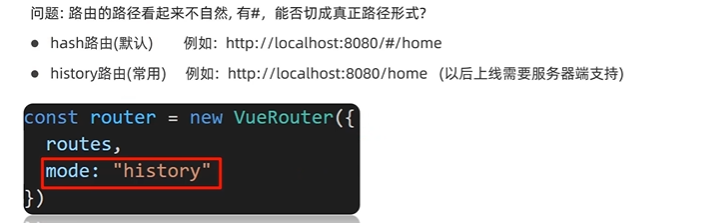

## 编程式导航 - 基本跳转
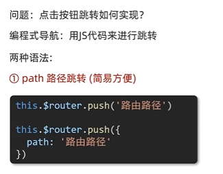

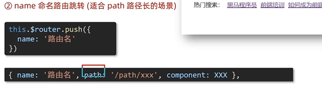

## 编程式导航 - 路由传参
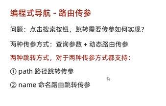

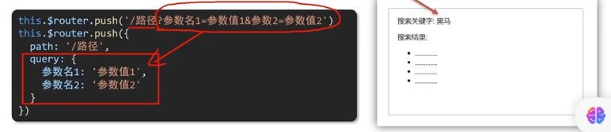
$router.query.参数名

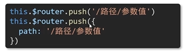
$router.params.参数名

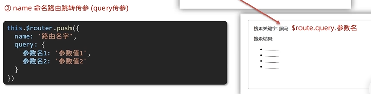

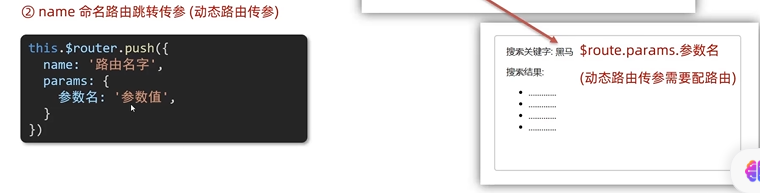

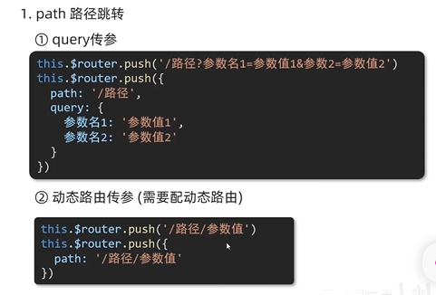

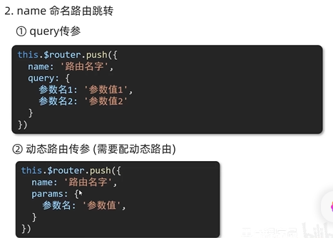

## 二级路由

## 组件缓存 keep-alive
（当从详情页面返回至上一页，希望滚动条还在刚刚访问的位置）

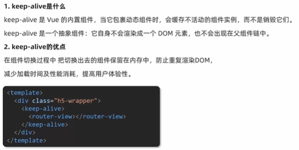
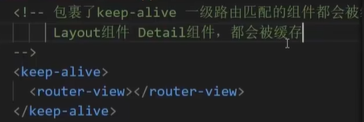
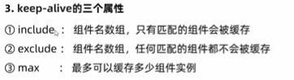

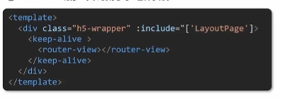

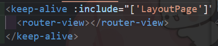

被缓存的组件多两个生命周期：actived、deactived。

组件缓存了，不执行created、mounted、destroyed

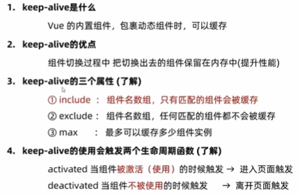

## 自定义创建项目
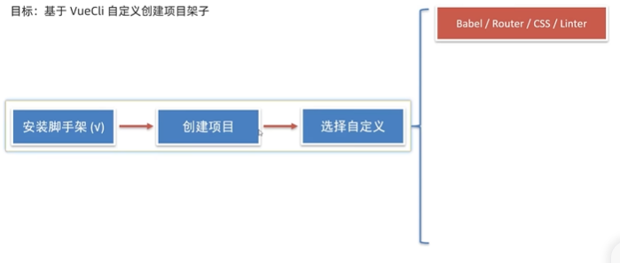

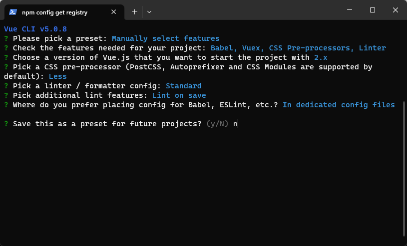

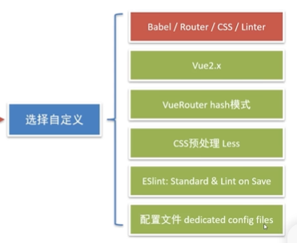

## ESlint代码规范
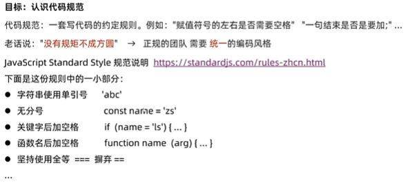
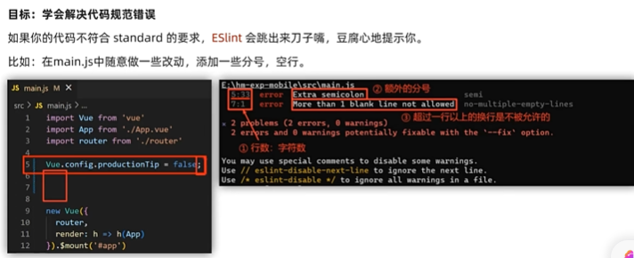

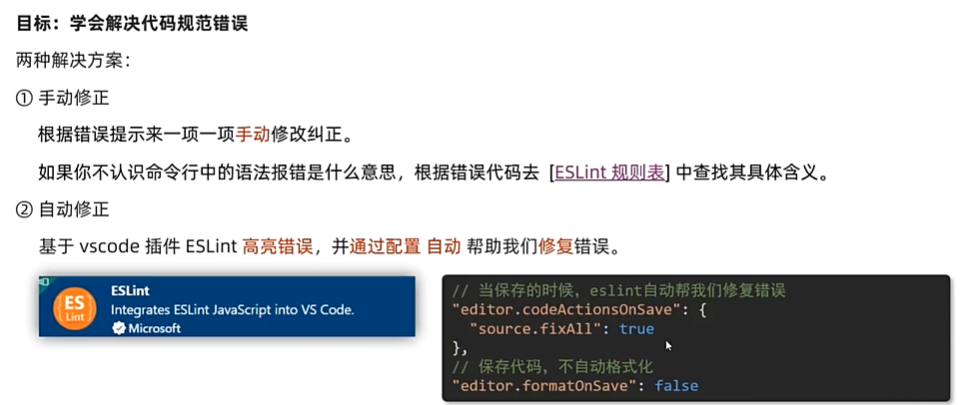
