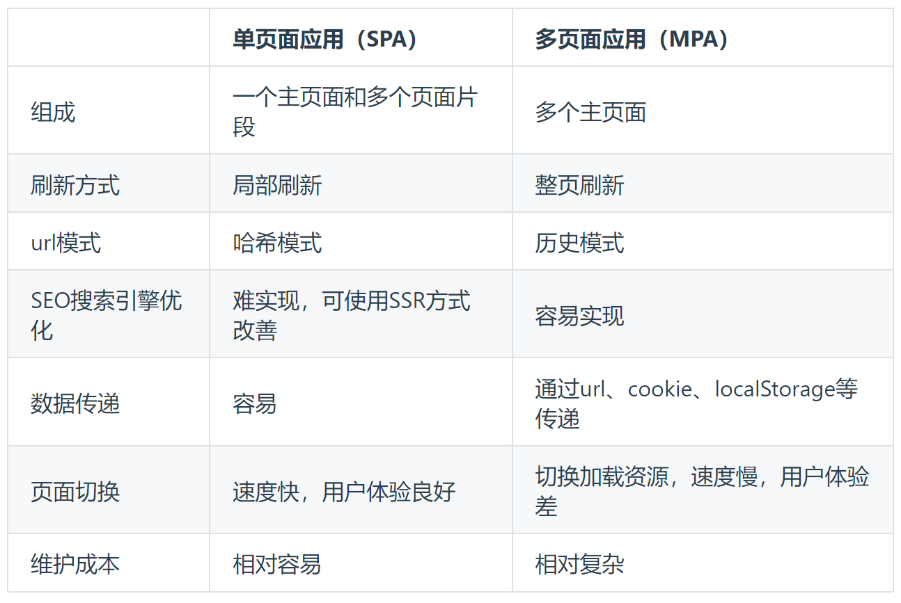
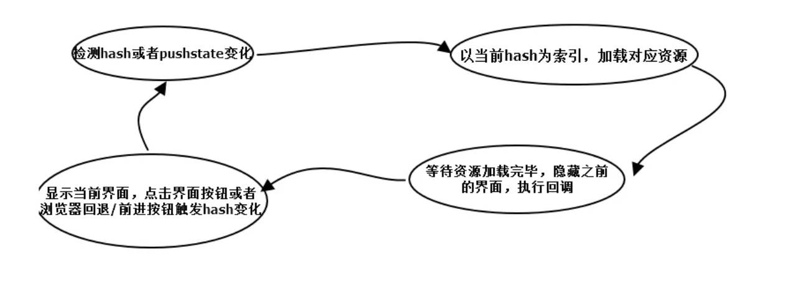

# 前端路由

## 路由

路由就是对应关系，路由分为前端路由和后端路由，前端路由就是 Hash 地址与组件之间的对应关系。

## 多页应用 MPA

`MPA：multi-page application`

在 MPA 中，每个页面都是一个主页面，都是独立的，当访问另一个页面的时候，都需要重新加载 html、css、js 文件，公共文件根据需求按需加载

## SPA 和前端路由

`SPA：single-page application`

SPA 指的是一个 web 网站只有唯一的一个 HTML 页面，所有组件的展示与切换都在这唯一的一个页面内完成。它通过动态重新当前页面来与用户交互，这种方法避免了页面之间切换打断用户体验，在 SPA 中，所有必要的代码都通过单个页面的加载而检索，或者根据需要（通常是响应用户操作）动态装载适当的资源并添加到页面，页面在任何时间点都不会重新加载，也不会将控制转移到其他页面。

此时，不同组件之间的切换需要通过前端路由来实现。

在 SPA 项目中，不同功能之间的切换，要依赖于前端路由来完成。

单页应用的优点：

1、具有桌面应用的即时性、网站的可移植性和可访问性

2、用户体验好、快，内容的改变不需要重新加载整个页面

3、良好的前后端分离，分工更明确

缺点：

1、不利于搜索引擎的抓取

2、首次渲染速度相对较慢

### 单页应用和多页应用的区别



### 给 SPA 做 SEO

1、SSR 服务端渲染

将组件或者页面通过服务器生成 html，再返回给浏览器

2、静态化

主流的静态化主要有两种：

- 通过程序将动态页面抓取并保存为静态页面，这样的页面实际存在于服务器的硬盘中

- 通过 WEB 服务器的 URLRewrite 的方式，原理是通过 web 服务器内部模块按一定规则将外部的 URL 请求转化为内部的文件地址

3、使用`Phantomjs`针对爬虫处理

通过 nginx 配置，判断访问来源是否为爬虫，如果是则搜索引擎的爬虫请求会转发到一个 node server，再通过`Phantomjs`来解析完整的 html，返回给爬虫

## 前端路由实现方式

在单页面 web 网页中， 单纯的浏览器地址改变， 网页不会重载，如单纯的 hash 网址改变网页不会变化，因此`路由主要是通过监听事件，并利用 js 实现动态改变网页内容`

原理：

1、监听地址栏中 hash 变化驱动界面变化

2、用 pushstate 记录浏览器的历史，驱动界面发送变化



### hash 模式

优点：兼容性更好，因为不需要服务器端处理路径。

缺点：`URL`带有`#`不太美观，且在`SEO`优化方面相对较差。

监听浏览器地址 hash 值变化，执行相应的 js 切换网页

使用 window.location.hash 属性及窗口的 onhashchange 事件，可以实现监听浏览器地址 hash 值变化，执行相应的 js 切换网页

```js
// 监听路由change调用相对应的路由回调
window.addEventListener("load"， this.refresh， false);
window.addEventListener("hashchange"， this.refresh， false);
```

- hash指的是地址中`#`号以及后面的字符，也称为散列值，hash也称作锚点，本身是用来做页面跳转定位的

- 散列值不会随请求发送到服务器端的，所以改变hash，不会重新加载页面


#### 触发hashchange事件的几种情况：

1、浏览器地址栏散列值变化，触发window.location.hash值的变化，从而触发onhashchange

2、当浏览器地址栏中URL包含哈希，浏览器发送请求到对应服务器，请求完毕设置散列值，进而触发onhashchange

3、当只改变浏览器地址栏URL哈希部分，按下回车，浏览器不会发送任何请求到服务器，发生的是设置散列值为新修改的哈希值，并触发onhashchange事件

4、`<a>`标签

### history 模式

优点：`URL`更加美观，不带有`#`，更接近传统的网站`URL`。

缺点：后期项目上线，需要服务端配合处理路径问题，否则刷新会有`404`错误。

利用 `history API` 实现 url 地址改变，网页内容改变

相关的 API：

- `history.pushState`，浏览器历史记录添加记录

- `history.replaceState`，修改浏览器历史记录中当前记录

- `history.popState`，当 history 发生变化时触发

window.history 属性指向 History 对象，它表示当前窗口的浏览历史。当发生改变时，只会改变页面的路径，不会刷新页面。

History 对象保存了当前窗口访问过的所有页面网址。

history 致命的缺点就是当改变页面地址后，强制刷新浏览器时，（如果后端没有做准备的话）会报错，因为刷新是拿当前地址去请求服务器的，如果服务器中没有相应的响应，会出现 404 页面。

nginx配置

```
location /{
  try_files $uri $uri/ /index.html;
}
```

apache配置

```
<IfModule mod_rewrite.c>
  RewriteEngine On
  RewriteBase /
  RewriteRule ^index\.html$ - [L]
  RewriteCond %{REQUEST_FILENAME} !-f
  RewriteCond %{REQUEST_FILENAME} !-d
  RewriteRule . /index.html [L]
</IfModule>
```

## React-Router

### BrowserRouter 和 HashRouter/Routers 和 route

- BrowserRouter 使用 history 模式；

- HashRouter 使用 hash 模式

- `<Routes>`都会匹配当前位置的一组子路由

- `Route`用于路径的匹配

> path：匹配路径
>
> element 路由与 URL 匹配时要渲染的 React 元素

```js
import React, { StrictMode } from "react";
import ReactDOM from "react-dom/client";
import { HashRouter } from "react-router-dom";
import App from "./App.jsx";
const root = ReactDOM.createRoot(document.getElementById("root"));

// HashRouter可以更换成普通的BrowserRouter模式

root.render(
  <StrictMode>
    <HashRouter>
      <App />
    </HashRouter>
  </StrictMode>
);
```

```js
import React, { PureComponent } from "react";
import { Route, Routes } from "react-router-dom";
import Home from "./pages/Home";
import About from "./pages/About";
import User from "./pages/User";
export class App extends PureComponent {
  render() {
    return (
      <div className="app">
        <header className="Header">顶部导航栏</header>
        <div className="main">
          主体部分
          <hr />
          展示路由
          <div style={{ border: "1px solid red", height: "200px" }}>
            <Routes>
              <Route path="/home" element={<Home />}></Route>
              <Route path="/about" element={<About />}></Route>
              <Route path="/user" element={<User />}></Route>
            </Routes>
          </div>
        </div>
        <footer className="footer">页脚</footer>
      </div>
    );
  }
}

export default App;
```

### Link 和 NavLink

路径的跳转是使用 Link 组件，最终会被渲染成 a 元素

NavLink 是在 Link 基础之上增加了一些样式的属性

to 属性：Link 中最重要的属性，用于设置跳转到的路径

```js
import { Link, Route, Routes } from "react-router-dom";
//other import
export class App extends PureComponent {
  render() {
    return (
      <div className="app">
        <header className="Header">
          顶部导航栏
          <h1>
            <Link to="/home">首页</Link>
          </h1>
          <h1>
            <Link to="/about">关于</Link>
          </h1>
          <h1>
            <Link to="/user">我的</Link>
          </h1>
        </header>
        {/* other code */}
      </div>
    );
  }
}

export default App;
```

```js
//...
<h3>
  <NavLink
    to="/home"
    style={({ isActive }) => ({ color: isActive ? "black" : "" })}
  >
    {" "}
    首页
  </NavLink>
  <NavLink
    to="/about"
    style={({ isActive }) => ({ color: isActive ? "black" : "" })}
  >
    {" "}
    关于
  </NavLink>
  <NavLink
    to="/user"
    style={({ isActive }) => ({ color: isActive ? "black" : "" })}
  >
    {" "}
    我的
  </NavLink>
</h3>
//...
```

### Navigate 导航

```js
<div style={{ border: "1px solid red", height: "200px" }}>
  <Routes>
    //这里使用方式
    <Route path="/" element={<Navigate to="/home" />}></Route>
    <Route path="/home" element={<Home />}></Route>
    <Route path="/about" element={<About />}></Route>
    <Route path="/user" element={<User />}></Route>
    {/* 这里使用通配符，如果用户子地址栏输入一个不存在的路由地址那么就进行匹配并且渲染element元素进行展示，当然你也可以进行抽离 */}
    <Route path="*" element={<div>页面丢失了</div>}></Route>
  </Routes>
</div>
```

## 参考

[https://vue3js.cn/interview/vue/spa.html#%E4%BA%8C%E3%80%81spa%E5%92%8Cmpa%E7%9A%84%E5%8C%BA%E5%88%AB](https://vue3js.cn/interview/vue/spa.html#%E4%BA%8C%E3%80%81spa%E5%92%8Cmpa%E7%9A%84%E5%8C%BA%E5%88%AB)

[https://juejin.cn/post/7330053771785732108?searchId=20240926140701DE9AE3D63C26B0095F15](https://juejin.cn/post/7330053771785732108?searchId=20240926140701DE9AE3D63C26B0095F15)
