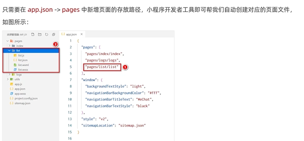
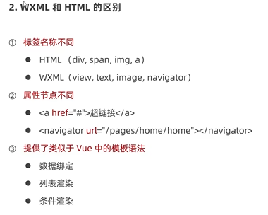
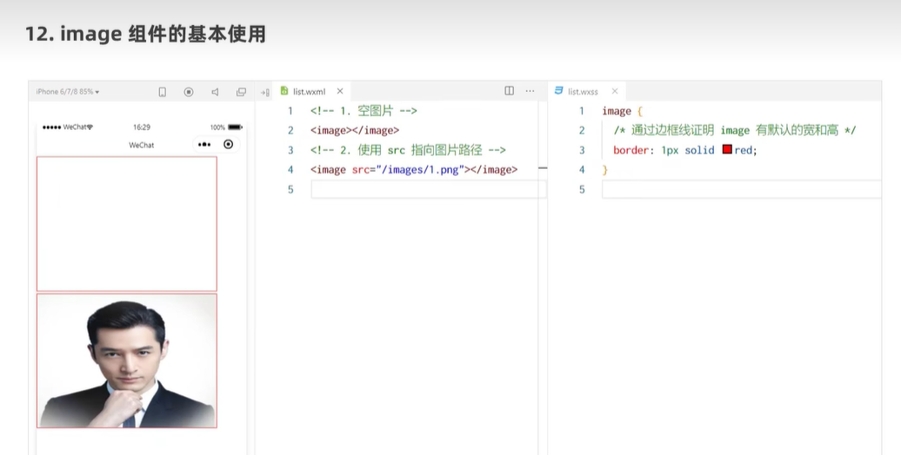

# 黑马程序员day1

## 微信小程序介绍

1、注册账号

2、获取APPID

3、开发者工具

## 项目结构

### json配置文件

1、app.json

2、project.config.json

3、sitemap.json

4、页面的.json配置文件

### 新建小程序页面

### 项目首页

## 小程序代码构成

### WXML模板

### WXSS

### js逻辑交互

#### 小程序.js文件的分类

## 小程序的宿主环境

### 通信模型

1、通信的主体

2、通信模型

### 运行机制
**小程序启动的过程**

**页面渲染的过程**

### 组件

**view组件的基本使用**

**scroll-view组件的基本使用**

**swiper和swiper-item组件的基本使用**

swiper常用属性

**常用的基础内容组件**

**其他常用组件**

### API

## 协同工作和发布
### 协同工作

### 小组成员管理

### 小程序的版本

### 发布上线

### 运营数据

