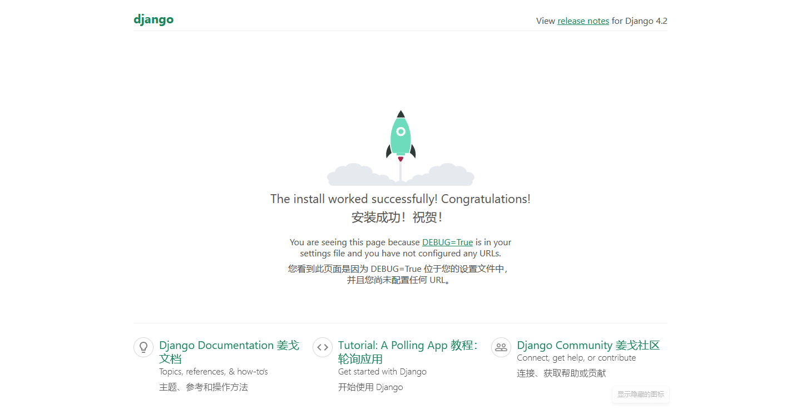

# Django

Django是一个高级的python网络框架，可以快速开发安全和可维护的网站。

## Django代码结构

传统的数据驱动网站中，web应用程序会等待来自web浏览器的HTTP请求。

当收到请求时，应用程序根据URL和可能的POST数据或GET数据中的信息确定需要的内容。
根据需要，可以从数据库读取或写入信息，或执行满足请求所需的其他任务。

然后，该应用程序将返回对web浏览器的响应，通常通过将检索到的数据插入HTML模板中的占位符来动态创建用于浏览器显示的HTML页面。

Django网络应用程序通常将处理每个步骤的代码分组到单独的文件中：


- URLs：URL映射器用于根据请求URL将HTTP请求重定向到相应的视图。还可以匹配出现在URL中的字符串或数组的特定模式，并将其作为数据传递给视图功能

- View：视图。是一个请求处理函数，接收HTTP请求并返回HTTP响应。

- Models：模型。定义应用程序数据结构的python对象，并提供在数据库中管理和查询记录的机制。

- Templates：模板。定义文件的结构或布局的文本文件，用于表示实际内容的占位符。

### urls.py
将请求发送到正确的视图

### views.py
处理请求

查询数据

### models.py
定义数据模型

Django web应用程序通过被称为模型的python对象来管理和查询数据。

模型定义存储数据的结构，包括字段类型以及字段可能的最大值，默认值，选择列表选项，文档帮助文本，表单的标签文本等。

### HTML模板
程序数据

模板系统允许指定输出文档的结构，使用占位符来生成页面时填写的数据。

## 开发环境
Django 本身提供的主要工具是一组用于创建和使用 Django 项目的 Python 脚本，以及可在电脑的 web 浏览器中测试本地 Django web 应用。

Python 3.5 以及更新的版本都可以用来开发

## 设置选项

Django在安装和配置方面非常灵活，Django可以：

- 安装在不同的操作系统上

- 通过源代码、python包索引（PyPi）进行安装

- 配置使用几个数据库之一（PostgreSQL，MySQL，Oracle 和 SQLite）

- 在主系统的python环境或在单独的python虚拟环境中运行

## 安装

### 虚拟环境--Windows

```python
pip3 install virtualenvwrapper-win
```

就可以使用 `mkvirtualenv`命令创建一个新的虚拟环境。

```python
mkvirtualenv my_django_environment
```

常用命令：

- `deactivate`——退出当前的python虚拟环境

- `workon`——列出可用的所有虚拟环境

- `workon name_of_environment`——激活特定的python虚拟环境

- `rmvirtualenv name_of_environment`——移除特定的虚拟环境

### 安装Django
一旦创建虚拟环境，并使用`workon`进入了它，就可以使用pip3来安装

```bash
pip3 install django
```

测试是否安装：
```bash
python -m django --version
```

使用django-admin工具创建一个名为"mytestsite"的新框架站点：
```bash
mkdir django_test
cd django_test
django-admin startproject mytestsite
cd mytestsite
```
管理项目的主要脚本名为`manage.py`

可以在这个文件夹中使用`manager.py`和`runserver`命令运行开发 web 服务器，如下所示。

```bash
python3 manage.py runserver
```

可以通过本地 Web 浏览器打开`http://127.0.0.1:8000/`来查看该站点


