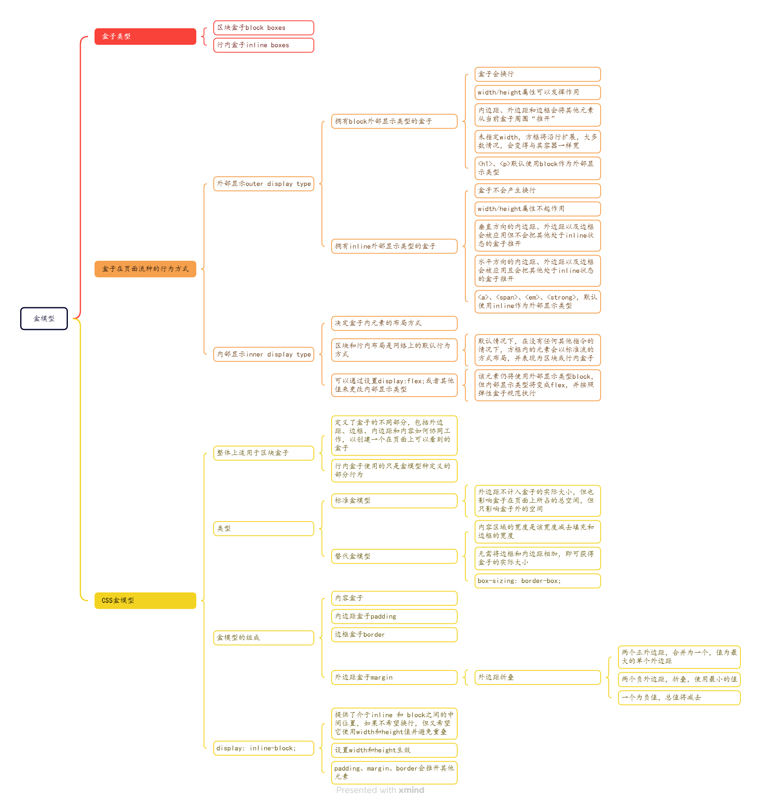

# CSS基础

## CSS构建

### 层叠与继承
与层叠密切相关的概念是优先级，决定在发生冲突的时候应该使用哪条规则。

继承，默认情况，一些CSS属性继承当前元素的父元素上设置的值，有些则不继承。

层叠：样式表层叠——CSS规则的顺序很重要；应用两条同级别的规则到一个元素的时候，写在后面的就是实际使用的规则。

优先级：浏览器根据优先级来决定多个规则有不同选择器对应相同的元素的时候需要使用哪个规则。

继承：一些设置在父元素上的css属性可以被子元素继承，有些则不能。

控制继承：

css为控制继承提供了5个特殊的通用属性值，每个CSS属性都接收这些值。

- inherit：设置该属性会使子元素属性和父元素相同，“开启继承”

- initial：将应用于选定元素的属性值设置为该属性的初始值

- revert：将应用于选定元素的属性值重置为浏览器的默认样式，而不是应用于该属性的默认值。

- revert-layer：将应用于选定元素的属性值重置为在上一个层叠表中建立的值。

- unset：将属性重置为自然值，也就是如果属性是自然继承就是inherit，否则和initial一样

```css
a{
    color:inherit;
}
```

重设所有属性值：简写属性all可以同时将这些继承值中的一个应用于几乎所有属性，它的值可以是上述中任意一个。

```css
.fix-this{
    all:unset
}
```

**理解层叠**

重要性排序[后面的更重要]：

1、资源顺序

2、优先级

一个选择器的优先级可以说是由三个不同的值（或分量）相加，可以认为是百（ID）十（类）个（元素）——三位数的三个位数：

ID：选择器中包含 ID 选择器则百位得一分。

类：选择器中包含类选择器、属性选择器或者伪类则十位得一分。

元素：选择器中包含元素、伪元素选择器则个位得一分。

3、重要程度


内联样式，优先于所有普通的样式，无论其优先级如何

!important：覆盖所有上面所有优先级计算


### CSS选择器
CSS选择器是CSS规则的一部分，是元素和其他部分组合起来告诉浏览器哪个HTML元素应当是被选为应用规则中的CSS属性值的方式。选择器所选择的元素，叫做“选择器的对象”。

#### 类型、类和ID选择器
```css
/* 类型选择器/标签名选择器/元素选择器 */
h1{

}

/* class选择器 */
.box{

}

/* ID选择器 */
#unqiue{

}
```

**全局选择器**
全局选择器是由一个星号(*)代指的，选中了文档中的所有内容
```css
*{
    marigin:0;
}
```

**类选择器**
以`.` 开头，会选择文档中应用了这个类的所有对象
```css
.highlight{
    background-color:yellow;
}
```

指向特定元素的类：
```css
span.highlight{
    background-color:yellow;
}
```

多个类被应用的时候指向一个元素：
```css
.notebox {
  border: 4px solid #666;
  padding: .5em;
}

.notebox.warning {
  border-color: orange;
  font-weight: bold;
}
```
```html
<div class="notebox">
    This is an informational note.
</div>

<div class="notebox warning">
    This note shows a warning.
</div>
```

**ID选择器**
以`#`开头
```css
#one{
    background-color:yellow;
}

h1#heading{
    color:rebeccapurple;
}
```

#### 标签属性选择器

```css
/* 根据一个元素上的某个标签的属性的存在以选择元素的不同方式： */
a[title]{

}

/* 或根据一个特定值的标签属性是否存在来选择 */
a[href="https://example.com"]
{

}
```

**存否和值选择器**
这些选择器允许基于一个元素自身是否存在或者基于各式不同的按属性值的匹配，来选取元素

- [attr] ：匹配带有一个名为attr的属性的元素

- [attr=value] ： 匹配带有一个名为attr的属性的元素，其值正为value

- [attr~=value] ： 匹配带有一个名为attr的属性的元素，其值正为value，或者匹配带有一个attr属性的元素，其值有一个或者更多，至少有一个和value匹配

- [attr|=value] ： 匹配带有一个名为attr的属性的元素，其值可正为value，或者开始为value，后面紧随着一个连字符

**子字符串匹配选择器**
- [attr^=value]	li[class^="box-"]	匹配带有一个名为attr的属性的元素，其值开头为value子字符串。

- [attr$=value]	li[class$="-box"]	匹配带有一个名为attr的属性的元素，其值结尾为value子字符串

- [attr*=value]	li[class*="box"]	匹配带有一个名为attr的属性的元素，其值的字符串中的任何地方，至少出现了一次value子字符串。

**大小写敏感**
如果你想在大小写不敏感的情况下，匹配属性值的话，你可以在闭合括号之前，使用i值。这个标记告诉浏览器，要以大小写不敏感的方式匹配 ASCII 字符。没有了这个标记的话，值会按照文档语言对大小写的处理方式，进行匹配——HTML 中是大小写敏感的。
```css
li[class^="a" i] {
  color: red;
}
```

#### 伪类与伪元素
伪类是选择器的一种，它用于选择处于特定状态的元素，比如当它们是这一类型的第一个元素时，或者是当鼠标指针悬浮在元素上面的时候。它们表现得会像是你向你的文档的某个部分应用了一个类一样，帮你在你的标记文本中减少多余的类，让你的代码更灵活、更易于维护。

伪类就是开头为冒号的关键字：
```css
:pseudo-class-name
```

伪元素以类似方式表现，不过表现得是像你往标记文本中加入全新的 HTML 元素一样，而不是向现有的元素上应用类。伪元素开头为双冒号::。
```css
::pseudo-element-name
```

把伪类和伪元素组合起来，
```css
article p:first-child::first-line{
    font-size:120%;
    font-weight:bold;
}
```

生成带有::before和::after的内容

伪类：

`:active`

`:any-link`

`:blank`

`:checked`

`:current`

`:default`

`:dir`

等等


伪元素：

`::after`

`::before`

`::first-letter`

`::first-line`

`::grammer-error`

`::selection`

等等


```css
/* 包含了伪类，用来样式化一个元素的特定状态 */
a:hover{

}

/* 还可以包含了伪元素，选择一个元素的某个部分而不是元素自己 */
p::first-line{

}
```

#### 关系选择器 运算符
将其他选择器组合起来，更复杂的选择元素
```css
article > p {

}
```

**后代选择器**
用单个空格字符——组合两个选择器。选择器利用后代组合符被称作后代选择器。

```css
body article p
```

**子代关系选择器**
子代关系选择器是个大于号`>`，只会在选择器选中直接子元素的时候匹配。继承关系上更远的后代则不会匹配。

```css
article > p
```

**邻接兄弟**
邻接兄弟选择器`+`用来选中恰好处于另一个在继承关系上同级的元素旁边的对象

```css
p + img
```

**通用兄弟**
如果想选中一个元素的兄弟元素，即使它们不直接相邻，还是可以使用通用兄弟关系选择器`~`

```css
p ~ img
```

**使用关系选择器**
可以将任何选择器组合起来

```css
ul > li[class="a"]{

}
```

### 盒模型
css中有几种类型的盒子，一般分为区块盒子block boxes和行内盒子inline boxes

类型指的是盒子在页面流中的行为方式以及与页面上其他盒子的关系。

盒子有内部显示inner display type和外部显示outer display type两种类型

外部显示类型：

- 拥有 block 外部显示类型的盒子：盒子会产生换行；width和height属性可以发挥作用；内边距、外边距和边框会将其他元素从当前盒子周围“推开”；未指定width，大多数情况，盒子会变得与其容器一样宽，占据可用空间的100%

- 拥有 inline 外部显示类型的盒子：盒子不会产生换行；width和height属性不起作用；垂直方向的内边距、外边距以及边框会被应用但是不会把其他处于inline状态的盒子推开；水平方向的内边距、外边距以及边框会被应用且会把其他处于inline状态的盒子推开

某些 HTML 元素，如 `<a>`、 `<span>`、 `<em>` 以及 `<strong>`，默认使用 inline 作为外部显示类型。

内部显示类型：决定了盒子内元素的布局方式

区块和行内布局是网络上的默认行为方式。默认情况下，在没有任何其他指令的情况下，方框内的元素也会以标准流的方式布局，并表现为区块或行内盒子。

#### CSS盒模型
CSS 盒模型整体上适用于区块盒子，它定义了盒子的不同部分（外边距、边框、内边距和内容）如何协同工作，以创建一个在页面上可以看到的盒子。行内盒子使用的只是盒模型中定义的部分行为。

为了增加复杂性，有一种标准盒模型和一种替代盒模型。默认情况下，浏览器使用标准盒模型。

CSS中组成一个区块盒子：

- 内容盒子

- 内边距盒子：padding

- 边框盒子：border

- 外边距盒子：margin

标准盒模型：

在标准盒模型中，如果在盒子上设置 inline-size和block-size(或width和height)属性值，这些值就定义了内容盒子的 inline-size 和 block-size（水平语言中为 width 和 height）。然后将任何内边距和边框添加到这些尺寸中，以获得盒子所占的总大小。

替代盒模型：

在替代盒模型中，任何宽度都是页面上可见方框的宽度。内容区域的宽度是该宽度减去填充和边框的宽度。无需将边框和内边距相加，即可获得盒子的实际大小。


**display: inline-block**

display: inline-block 是 display 的一个特殊值，它提供了介于 inline 和 block 之间的中间位置。如果不希望项目换行，但又希望它使用 width 和 height 值并避免出现上述重叠现象，请使用它



### 背景与边框
```css
.box{
    background:
        linear-gradient(
            105deg,
            rgba(255,255,255,0.2) 39%,
            rgba(51,56,57,1) 96%
        )
        center center / 400px 200px no-repeat,
        url(big-star.png) center no-repeat,
        rebeccapurple;
}
```

**控制背景平铺background-repeat**
- no-repeat——阻止背景重复平铺。

- repeat-x——仅水平方向上重复平铺。

- repeat-y——仅垂直方向上重复平铺。

- repeat——默认值，在水平和垂直两个方向重复平铺。

**background-size**
- 设置长度或百分比

- cover ：完全覆盖，保持宽高比，可能跳出盒子

- contain：调整到适合的尺寸，可能有空隙

**background-position 背景图像定位**
出现在所应用的盒子上的位置，相对于左上角

- 设置两个值，一个水平，一个垂直

- 使用关键字 top right

**gradient渐变背景**
```css
.a {
  background-image: linear-gradient(18deg, rgb(0 249 255 / 100%) 39%, rgb(51 56 57 / 100%) 96%);
}

.b {
  background-image: radial-gradient(circle, rgb(0 249 255 / 100%) 39%, rgb(51 56 57 / 100%) 96%);
  background-size: 100px 50px;
}
```

**背景附加background-attachment**
- scroll：使元素的背景在页面滚动时滚动。如果`滚动了元素内容，则背景不会移动`。实际上，背景被固定在页面的相同位置，所以它会随着页面的滚动而滚动。

- fixed：使元素的`背景固定在视口上`，这样当页面或元素内容滚动时，它就不会滚动。它将始终保持在屏幕上相同的位置。

- local：将背景`固定在它所设置的元素上`，所以当你滚动该元素时，背景也随之滚动。

#### 边框
```css
.box {
  border: 1px solid black;
}
.box {
  border-radius: 10px;
}
.box {
  border-top-right-radius: 1em 10%;
}
```


### 处理不同的文本方向

#### 书写模式
从左到右（ltr）

从右到左（rtl）

```css
/* 关键字值 */
/* 块流向从上至下，文本方向是横向 */
writing-mode: horizontal-tb;
/* 块流向从右向左，文本方向是纵向 */
writing-mode: vertical-rl;
/* 块流向从左向右，文本方向是纵向 */
writing-mode: vertical-lr;

/* 全局值 */
writing-mode: inherit;
writing-mode: initial;
writing-mode: revert;
writing-mode: revert-layer;
writing-mode: unset;
```

```css
h1 {
  writing-mode: vertical-rl;
}
/* writing-mode: horizontal-tb; */
```


### 溢出的内容overflow

```css
/* 默认可见 */
overflow: visible
overflow: hidden
overflow: scroll
/* 只是想让滚动条在有比盒子所能装下更多的内容的时候才显示，那么使用 overflow: auto */
/* 控制仅在x轴方向滚动 */
overflow-x: scroll
/* 控制仅在y轴方向滚动 */
overflow-y: scroll
/* 可以用 overflow 属性指定 x 轴和 y 轴方向的滚动，同时使用两个值进行传递。如果指定了两个关键字，第一个对 overflow-x 生效而第二个对 overflow-y 生效。否则，overflow-x 和 overflow-y 将会被设置成同样的值。 */
overflow: scroll hidden
```


### 值和单位

- px：像素

- pt：点

- in：英寸

相对长度单位：

- em 和 rem 分别相对于父元素和根元素的`字体大小`。

- vh 和 vw 分别相对于`视口`的高度和宽度。


### 在CSS中调整大小

#### 原始尺寸、固有尺寸
在受 CSS 设置影响之前，HTML 元素有其原始的尺寸。一个直观的例子就是图像。一幅图像的长和宽由这个图像文件自身确定。这个尺寸就是固有尺寸

元素的固有尺寸——由其所包含的内容决定


#### 设置具体的尺寸
当给元素指定尺寸（然后其内容需要适合该尺寸）时，将其称为`外部尺寸`

可以给元素一个具体的 width 和 height 值

使用百分数：指的是父容器宽度/高度的百分数

使用百分比作为元素外边距（margin）或填充（padding）的单位时，值是以包含块的内联尺寸进行计算的，也就是元素的水平宽度。

#### min- 和max- 尺寸
让 CSS 给定一个元素的最大或最小尺寸


#### 视口单位

视口，即在浏览器中看到的部分页面，也是有尺寸的。


### 高级区块效果

#### 盒子阴影box-shadow
```css
.simple {
  box-shadow: 5px 5px 5px rgba(0, 0, 0, 0.7);
}

/* 多个盒子阴影 */
.multiple {
  box-shadow:
    1px 1px 1px black,
    2px 2px 1px black,
    3px 3px 1px red,
    4px 4px 1px red,
    5px 5px 1px black,
    6px 6px 1px black;
}

/* 内部阴影  inset关键字 */
button:active {
  box-shadow:
    inset 2px 2px 1px black,
    inset 2px 3px 5px rgba(0, 0, 0, 0.3),
    inset -2px -3px 5px rgba(255, 255, 255, 0.5);
}
```

#### 滤镜Filters
滤镜真正出色的地方在于，它们作用于盒（box）内内容（content）的确切形状，而不仅仅将盒子本身作为一个大的块。

```css
.filter {
  -webkit-filter: drop-shadow(5px 5px 1px rgba(0, 0, 0, 0.7));
  filter: drop-shadow(5px 5px 1px rgba(0, 0, 0, 0.7));
}
```

在filter属性中通过-webkit-前缀包含了一个版本信息，这被称为一个 Vendor Prefix，有时会被浏览器使用，以在一个新特性完整实现之前，当它与无前缀版本没有冲突的时候支持并实验这个特性。

#### Blend modes（混合模式）
CSS 混合模式允许为元素添加一个混合模式，以当两个元素重叠时，指定一个混合的效果——最终每个像素所展示的颜色将会是原来像素中颜色和其下面一层相组合之后的结果


- background-blend-mode, 用来将单个元素的`多重背景图片和背景颜色`设置混合在一起。

- mix-blend-mode, 用来将一个元素与它覆盖的那些元素各自所设置的背景`（background）和内容 (content)` 混合在一起。

```css
.multiply {
  background-blend-mode: multiply;
}
.multiply-mix {
  mix-blend-mode: multiply;
}
```

#### -webkit-background-clip: text

当与专有 -webkit-text-fill-color: transparent; 特性一起使用时，这允许将背景图像剪贴到元素文本的形状，从而产生一些不错的效果。

```css
.text-clip {
  -webkit-background-clip: text;
  -webkit-text-fill-color: transparent;
}

```

### 浏览器引擎前缀
浏览器厂商们有时会给实验性的或者非标准的 CSS 属性和 JavaScript API 添加前缀，这样开发者就可以用这些新的特性进行试验，同时（理论上）防止他们的试验代码被依赖，从而在标准化过程中破坏 web 开发者的代码。

#### CSS前缀
主流浏览器引擎前缀：

`-webkit-` （谷歌，Safari，新版 Opera 浏览器，以及几乎所有 iOS 系统中的浏览器（包括 iOS 系统中的火狐浏览器）；基本上所有基于 WebKit 内核的浏览器）

`-moz-` （火狐浏览器）

`-o-` （旧版 Opera 浏览器）

`-ms-` （IE 浏览器 和 Edge 浏览器）

```css
-webkit-transition: all 4s ease;
-moz-transition: all 4s ease;
-ms-transition: all 4s ease;
-o-transition: all 4s ease;
transition: all 4s ease;
```
#### API前缀

##### 接口前缀
需要使用大写的前缀修饰接口名：

`WebKit` (谷歌，Safari, 新版 Opera 浏览器，以及几乎所有 iOS 系统中的浏览器 (包括 iOS 系统中的火狐浏览器); 简单的说，所有基于 WebKit 内核的浏览器)

`Moz` (火狐浏览器)

`O` (旧版 Opera 浏览器)

`MS` (IE 浏览器 和 Edge 浏览器)

##### 属性和方法前缀
需要使用小写的前缀修饰属性或者方法

`webkit` (谷歌，Safari, 新版 Opera 浏览器，以及几乎所有 iOS 系统中的浏览器 (包括 iOS 系统中的火狐浏览器); 简单的说，所有基于 WebKit 内核的浏览器)

`moz` (火狐浏览器)

`o` (旧版 Opera 浏览器等)

`ms` (IE 浏览器 和 Edge 浏览器)


```css
window.requestAnimationFrame =
  window.requestAnimationFrame ||
  window.mozRequestAnimationFrame ||
  window.webkitRequestAnimationFrame ||
  window.oRequestAnimationFrame ||
  window.msRequestAnimationFrame;
```
