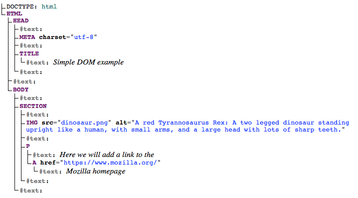
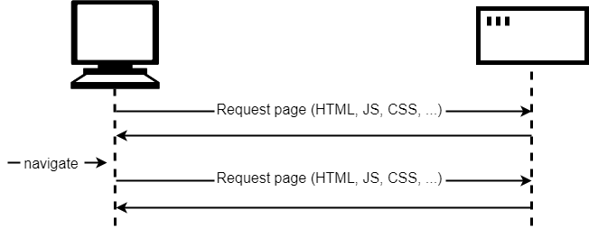
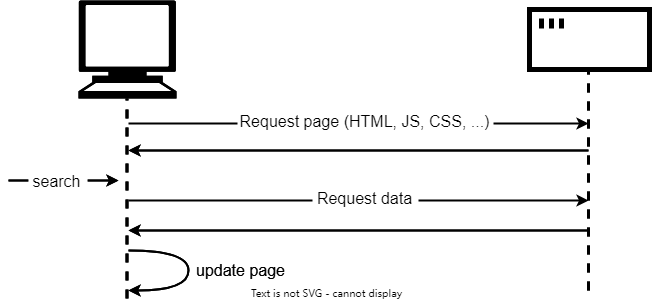
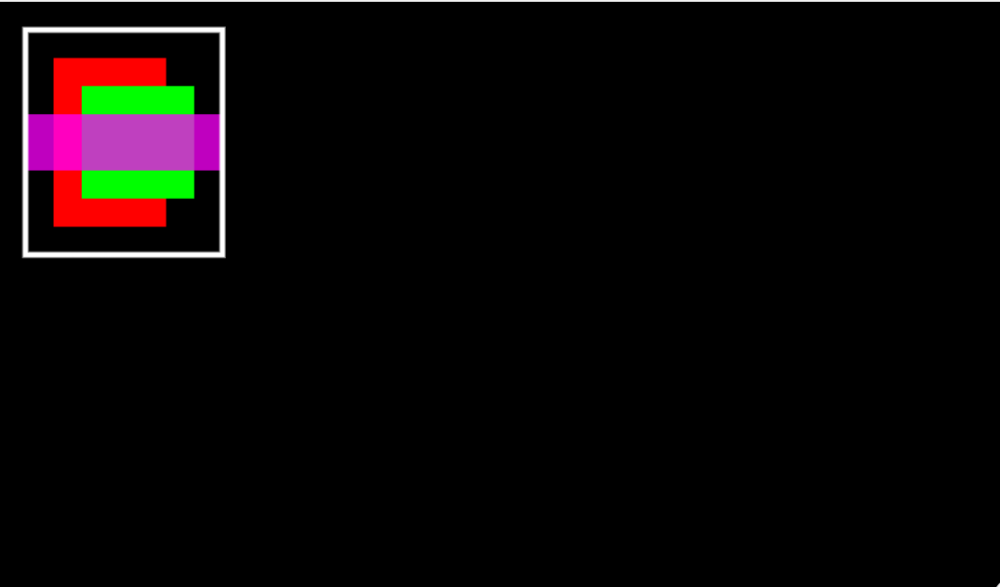
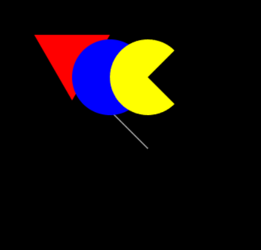
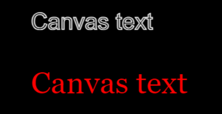
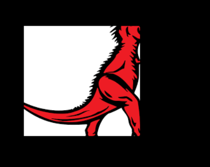
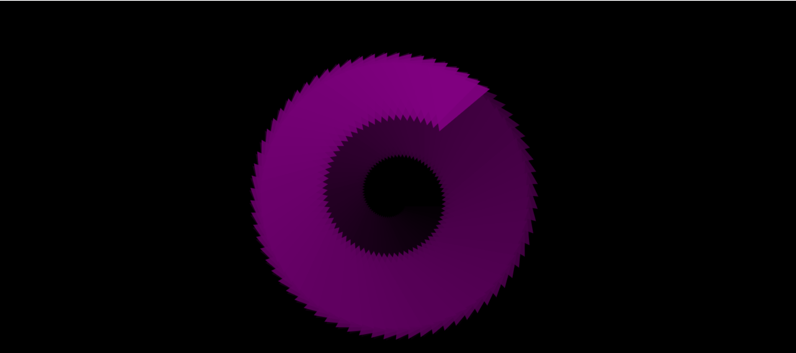

# 客户端WebAPI

应用程序接口（API，Application Programming Interface）是基于编程语言构建的结构，使开发人员更容易地创建复杂的功能。它们抽象了复杂的代码，并提供一些简单的接口规则直接使用。

## 客户端JavaScript中的API
本身并不是JavaScript语言的一部分，却建立在JavaScript语言核心的顶部，为使用JavaScript代码提供额外的超强能力。

分为两类：
1、浏览器API：

内置于web浏览器中，能从浏览器和电脑周边环境中提取数据，并用来做有用的复杂的事情。

2、第三方API：

缺省情况下不会内置于浏览器中，通常必须在web中的某个地方获取代码和信息。

## 理一下关系
- JavaScript——一种内置于浏览器的高级脚本语言，可以用来实现Web页面/应用中的功能。

- 客户端API——内置于浏览器的结构程序，位于JavaScript语言顶部，帮助更容易实现功能。

- 第三方API——置于第三方普通的结构程序，可以在自己的web页面中使用那些平台的某些功能。

- JavaScript库——通常是包含具有特定功能的一个或多个JavaScript文件，把这些文件关联到web页以快速或授权编写常见的功能。

- JavaScript框架——从库开始的下一步，JavaScript框架视图把HTML, CSS, JavaScript和其他安装的技术打包在一起，然后用来从头编写一个完整的web应用


## DOM 操作文档
出于安全考虑，web浏览器许多部件不能由web开发者用JavaScript控制或操纵。

但Web API提供了大量的功能：

- 窗口（window）是载入网页的浏览器标签，在JavaScript中，由window对象表示。使用这个对象方法，可以做一些事情，如返回窗口的大小window.innerWidth和Window.innerHeight，操作加载到窗口的文档，在客户端存储该文档的特定数据，为当前窗口添加事件处理器等

- 导航器navigator在网络上出现时，代表浏览器的状态和身份（即用户代理）。在JavaScript中，由Navigator对象表示，可以用这个对象来检索用户的首选语言、网络摄像头的媒体流等信息

- 文档document，在浏览器中用DOM表示，是加载到窗口的实际页面，在JavaScript中，由Document对象表示，可以使用这个对象来返回和操作构成文档的HTML和CSS信息

### 文档的对象模型

每一个浏览器标签中加载的文档是由一个文档对象模型表示的。这是一个由浏览器创建的“树状结构”表示法，使HTML结构能够被编程语言轻松访问。

DOM树示例：
```html
<!doctype html>
<html lang="en-US">
  <head>
    <meta charset="utf-8" />
    <title>Simple DOM example</title>
  </head>
  <body>
    <section>
      
      <p>
        Here we will add a link to the
        <a href="https://www.mozilla.org/">Mozilla homepage</a>
      </p>
    </section>
  </body>
</html>
```



:::tip
DOM树状图生成网站 [https://software.hixie.ch/utilities/js/live-dom-viewer/](https://software.hixie.ch/utilities/js/live-dom-viewer/)
:::

树上每个条目都被称为节点。一些节点代表元素，另一些代表文本。还有其他类型的节点。

节点通过它们在树中相对于其他节点的位置来指代：

- 根节点：树中顶层节点，在 HTML 的情况下，总是一个 HTML 节点

- 子节点: 直接位于另一个节点内的节点

- 后代节点: 位于另一个节点内任意位置的节点

- 父节点: 里面有另一个节点的节点

- 兄弟节点: DOM 树中位于同一等级的节点

### 基本DOM操作
- 选择一个元素并将其引用存储在一个变量中。Document.querySelector()是推荐的现代方法，允许使用CSS选择器来选择元素

```JavaScript
const link = document.querySelector("a");
```

如果相对多个元素进行匹配和操作，可以使用Document.querySelectorAll()，可以匹配文档中选择与选择器相匹配的每个元素，并将它们的引用存储在一个叫做NodeList的数组中

- 获取元素引用的一些旧方法：

Document.getElementById()，选择一个 id 属性值已知的元素，例如 <p id="myId">My paragraph</p>。ID 作为参数传递给函数，即 const elementRef = document.getElementById('myId')。

Document.getElementsByTagName()，返回页面中包含的所有已知类型元素的数组。如 `<p>`、`<a>` 等。元素类型作为参数传递给函数，即 const elementRefArray = document.getElementsByTagName('p')。

#### 创建并放置新的节点

- Document.createElement()创建新元素
- Node.appendChild()方法在后面追加新的的元素

```JavaScript
const sect=document.querySelector("section");
const para=document.createElement("p");
para.textContent="We hope you enjoyed the ride.";
sect.appendChild(para);
```

#### 移动和删除元素

移动元素可以通过将元素拼接到某个元素后面

删除节点，首先拥有要删除的节点和其父节点的引用，然后使用 Node.removeChild() 即可


```JavaScript
sect.removeChild(linkPara);
```

要删除一个仅基于自身引用的节点，可以使用 Element.remove()

```JavaScript
linkPara.remove();
```

这个方法在旧浏览器不受支持，可使用下面这种：

```JavaScript
linkPara.parentNode.removeChild(linkPara);
```

### 操作样式
过时：可以使用 `Document.stylesheets` 来获得一个附加在文档上的所有样式表的列表，它返回一个包含 CSSStyleSheet 对象的类数组。然后就可以根据需要添加/删除样式

更简单的方法：

1、直接将内联样式添加到想动态样式的元素上

`HTMLElement.style`来实现的

```
para.style.color = "white";
para.style.backgroundColor = "black";
para.style.padding = "10px";
para.style.width = "250px";
para.style.textAlign = "center";
```
:::info
CSS 样式的 JavaScript 属性版本是用小驼峰命名法书写的，而 CSS 版本是连字符的（例如，backgroundColor 对 background-color）
:::

2、`Element.setAttribute()`

接受两个参数：想在元素上设置的属性、要为它设置的值

```
para.setAttribute("class", "highlight");
```

第一种方法需要较少的设置，适合于简单的使用，而第二种方法更纯粹（混合 CSS、JavaScript 和内联样式通常不是一种好的实践，而该方法不会产生这些）。当开始构建更大和更多的应用程序时，可能会更多地开始使用第二种方法

## 从服务器获取数据
- 传统模型

浏览器向服务器发起一个或多个HTTP请求以获取显示网页所需的文件，然后服务器响应请求的文件。


这个过程必须获取并加载整个页面，即使只需要更新页面的一部分也是如此。这是低效的，而且会带来糟糕的用户体验。

- 当前

许多网站使用JavaScript API从服务器请求数据，并在不重新加载页面的情况下更新页面。



这里的API主要是Fetch API，它允许页面中运行的JavaScript向服务器发起HTTP请求来获取特定的资源。当服务器提供了这些资源时，JavaScript可以使用这些数据更新页面。请求的数据通常是json，但也可以是HTML或纯文本

这是数据驱动网站（如 Amazon、YouTube、eBay 等）的常见模式。使用此模型，使得：

- 页面更新更加迅速，你不必等待页面刷新，这意味这网站的体验更加流畅、响应更加迅速。

- 每次更新时下载的数据更少，这意味着浪费的带宽更少。这在使用宽带连接的台式机上可能不是什么问题，但在移动设备或没有高速互联网连接的国家/地区则是一个主要问题。

:::info
 在早期，这种通用技术被称为异步的 JavaScript 与 XML 技术（Ajax），因为倾向于请求 XML 数据。但现在通常不是这种情况（你更有可能请求 JSON），但结果依然相同，并通常依旧使用术语“Ajax”来描述该技术。
:::

为了进一步加快速度，某些网站还会在首次请求时将资源和数据存储在用户的计算机上，这意味这在后续的访问中，会使用这些内容的本地版本，而不是在每次重新加载页面时都下载新的副本。内容仅在更新后才会从服务器重新加载。

### fetch API
```JavaScript
// 调用 `fetch()`，传入 URL。
fetch(url)
  // fetch() 返回一个 promise。当我们从服务器收到响应时，
  // 会使用该响应调用 promise 的 `then()` 处理器。
  .then((response) => {
    // 如果请求没有成功，我们的处理器会抛出错误。
    if (!response.ok) {
      throw new Error(`HTTP 错误：${response.status}`);
    }
    // 否则（如果请求成功），我们的处理器通过调用
    // response.text() 以获取文本形式的响应，
    // 并立即返回 `response.text()` 返回的 promise。
    return response.text();
  })
  // 若成功调用 response.text()，会使用返回的文本来调用 `then()` 处理器，
  // 然后我们将其拷贝到 `poemDisplay` 框中。
  .then((text) => (poemDisplay.textContent = text))
  // 捕获可能出现的任何错误，
  // 并在 `poemDisplay` 框中显示一条消息。
  .catch((error) => (poemDisplay.textContent = `获取诗歌失败：${error}`));
```

```JavaScript
fetch(url)
  .then((response) => {
    if (!response.ok) {
      throw new Error(`HTTP 错误：${response.status}`);
    }
    return response.blob();
  })
  .then((blob) => showProduct(blob, product))
  .catch((err) => console.error(`Fetch 错误：${err.message}`));
```
数据格式 Blob——这个词是“二进制大对象”的缩写，基本上可以用来表示大型类文件对象——比如图像或视频文件。

## 绘图
浏览器包含一些非常强大的图形编程工具，从可缩放矢量图形（Scalable Vector Graphics，简称 SVG）语言到用于在 HTML `<canvas>` 元素上绘制图形的 API（参阅 Canvas API 和 WebGL）。

### canvas

```JavaScript
<canvas width="320" height="240"></canvas>
```
网页中会生成一块 320 × 240 像素的画布。

在 canvas 标签内，可以放置一些反馈信息，如果用户的浏览器不支持画布功能，这些内容就会显示出来。
```JavaScript
<canvas width="320" height="240">
  <p>你的浏览器竟然不支持 canvas！</p>
</canvas>
```

示例一
```HTML
<!DOCTYPE html>
<html lang="en-us">
  <head>
    <meta charset="utf-8" />
    <meta name="viewport" content="width=device-width, initial-scale=1.0" />
    <title>Canvas</title>
    <!--     <script src="script.js" defer></script> -->
    <link href="style.css" rel="stylesheet" />

    <style>
      body {
        margin: 0;
        overflow: hidden;
      }
    </style>
  </head>
  <body>
    <canvas class="myCanvas">
      <p>alt</p>
    </canvas>

    <script>
      var canvas = document.querySelector(".myCanvas");
      var width = (canvas.width = window.innerWidth);
      var height = (canvas.height = window.innerHeight);

      var ctx = canvas.getContext("2d");
      
      //设置填充色
      ctx.fillStyle = "rgb(0,0,0)";
      //覆盖整个区域的矩形，前两个是矩形左上顶点的坐标，后两个参数是矩形的长宽
      ctx.fillRect(0, 0, width, height);
      
      //绘制一个红色的矩形
      ctx.fillStyle="rgb(255,0,0)"
      ctx.fillRect(50,50,100,150)
      
      //添加一个绿色的矩形
      ctx.fillStyle="rgb(0,255,0)"
      ctx.fillRect(75,75,100,100)
      
      ctx.fillStyle = "rgba(255, 0, 255, 0.75)";
      ctx.fillRect(25, 100, 175, 50);
      
      //设置描边颜色
      ctx.strokeStyle = "rgb(255, 255, 255)";
      //调整描边宽度
      ctx.lineWidth = 5;//在上下两行中间才生效
      //绘制矩形的轮廓
      ctx.strokeRect(25, 25, 175, 200);
    </script>
  </body>
</html>
```



#### 绘制路径
可通过绘制路径来绘制比矩形更复杂的图形

路径中至少要包含钢笔运行精确路径的代码以确定图形的形状

画布提供了许多函数用来绘制直线、圆、贝塞尔曲线等等 

```HTML
<!DOCTYPE html>
<html lang="en-us">
  <head>
    <meta charset="utf-8" />
    <meta name="viewport" content="width=device-width, initial-scale=1.0" />
    <title>Canvas</title>
    <!--     <script src="script.js" defer></script> -->
    <link href="style.css" rel="stylesheet" />

    <style>
      body {
        margin: 0;
        overflow: hidden;
      }
    </style>
  </head>
  <body>
    <canvas class="myCanvas">
      <p>alt</p>
    </canvas>

    <script>
      var canvas = document.querySelector(".myCanvas");
      var width = (canvas.width = window.innerWidth);
      var height = (canvas.height = window.innerHeight);

      var ctx = canvas.getContext("2d");
      
      //设置填充色
      ctx.fillStyle = "rgb(0,0,0)";
      //覆盖整个区域的矩形，前两个是矩形左上顶点的坐标，后两个参数是矩形的长宽
      ctx.fillRect(0, 0, width, height);
      
      
      ctx.fillStyle = "rgb(255, 255, 0)";
//       在钢笔当前所在位置开始绘制一条路径。在新的画布中，钢笔起始位置为 (0, 0)。
      ctx.beginPath();
//       将钢笔移动至另一个坐标点，不记录、不留痕迹，只将钢笔“跳”至新位置。
      ctx.moveTo(150, 150);
      ctx.lineTo(200,200)
      // 绘制路径.通过为当前所绘制路径的区域填充颜色来绘制一个新的填充形状
      // ctx.fill();
      ctx.strokeStyle = "rgb(255, 255, 255)";
      ctx.stroke()
//       stroke()：通过为当前绘制路径的区域描边，来绘制一个只有边框的形状
//       路径也可和矩形一样使用 lineWidth 和 fillStyle / strokeStyle 等功能


//      绘制三角形
//       JS 基本上只接受弧度值，而人类更习惯用角度值
      function degToRad(degrees) {
        return (degrees * Math.PI) / 180;
      }

      ctx.fillStyle = "rgb(255, 0, 0)";
      ctx.beginPath();
      ctx.moveTo(50, 50);
      ctx.lineTo(150, 50);
      var triHeight = 50 * Math.tan(degToRad(60));
      ctx.lineTo(100, 50 + triHeight);
      ctx.lineTo(50, 50);
      ctx.fill();

//       画圆
      ctx.fillStyle = 'rgb(0, 0, 255)';
      ctx.beginPath();
//       arc() 函数有六个参数。
      // 前两个指定圆心的位置坐标，
      // 第三个是圆的半径，
      // 第四、五个是绘制弧的起、止角度（给定 0° 和 360° 便能绘制一个完整的圆），
      // 第六个是绘制方向（false 是顺时针，true 是逆时针）
      ctx.arc(150, 106, 50, degToRad(0), degToRad(360), false);
      ctx.fill();
      
//       画弧
      ctx.fillStyle = 'yellow';
      ctx.beginPath();
      ctx.arc(200, 106, 50, degToRad(-45), degToRad(45), true);
      ctx.lineTo(200, 106);
      ctx.fill();
    </script>
  </body>
</html>
```


#### 文本

fillText() ：绘制有填充色的文本。

strokeText()：绘制文本外边框（描边）。

这两个函数有三个基本的参数：需要绘制的文字、文本框（顾名思义，围绕着需要绘制文字的方框）左上顶点的 X、Y 坐标。

还有一系列帮助控制文本渲染的属性：比如用于指定字体族、字号的 font，它的值和语法与 CSS 的 font 属性一致。
```HTML
<!DOCTYPE html>
<html lang="en-us">
  <head>
    <meta charset="utf-8" />
    <meta name="viewport" content="width=device-width, initial-scale=1.0" />
    <title>Canvas</title>
    <!--     <script src="script.js" defer></script> -->
    <link href="style.css" rel="stylesheet" />

    <style>
      body {
        margin: 0;
        overflow: hidden;
      }
    </style>
  </head>
  <body>
    <canvas class="myCanvas">
      <p>alt</p>
    </canvas>

    <script>
      var canvas = document.querySelector(".myCanvas");
      var width = (canvas.width = window.innerWidth);
      var height = (canvas.height = window.innerHeight);

      var ctx = canvas.getContext("2d");
      
      //设置填充色
      ctx.fillStyle = "rgb(0,0,0)";
      //覆盖整个区域的矩形，前两个是矩形左上顶点的坐标，后两个参数是矩形的长宽
      ctx.fillRect(0, 0, width, height);
      
      
      ctx.strokeStyle = "white";
      ctx.lineWidth = 1;
      ctx.font = "36px arial";
      ctx.strokeText("Canvas text", 50, 50);

      ctx.fillStyle = "red";
      ctx.font = "48px georgia";
      ctx.fillText("Canvas text", 50, 150);

    </script>
  </body>
</html>
```


#### 图片

 drawImage() 方法可将图片绘制在画布上。最简单的版本需要三个参数：需要渲染的图片、图片左上角的 X、Y 坐标。

 ```html
 <!DOCTYPE html>
<html lang="en-us">
  <head>
    <meta charset="utf-8" />
    <meta name="viewport" content="width=device-width, initial-scale=1.0" />
    <title>Canvas</title>
    <!--     <script src="script.js" defer></script> -->
    <link href="style.css" rel="stylesheet" />

    <style>
      body {
        margin: 0;
        overflow: hidden;
      }
    </style>
  </head>
  <body>
    <canvas class="myCanvas">
      <p>alt</p>
    </canvas>

    <script>
      var canvas = document.querySelector(".myCanvas");
      var width = (canvas.width = window.innerWidth);
      var height = (canvas.height = window.innerHeight);

      var ctx = canvas.getContext("2d");

      //设置填充色
      ctx.fillStyle = "rgb(0,0,0)";
      //覆盖整个区域的矩形，前两个是矩形左上顶点的坐标，后两个参数是矩形的长宽
      ctx.fillRect(0, 0, width, height);

      var image = new Image();
      image.src =
        "https://cdn.glitch.global/abb0e9f2-a9ae-46d2-8b28-8cbd722f27e4/dinosaur.png?v=1692352868104";
      image.onload = function () {
        // ctx.drawImage(image, 50, 50);
        ctx.drawImage(image, 20, 20, 185, 175, 50, 50, 185, 175);
        // 第一个参数不变，为图片引用。
        // 参数 2、3 表示裁切部分左上顶点的坐标，参考原点为原图片本身左上角的坐标。原图片在该坐标左、上的部分均不会绘制出来。
        // 参数 4、5 表示裁切部分的长、宽。
        // 参数 6、7 表示裁切部分左上顶点在画布中的位置坐标，参考原点为画布左上顶点。
        // 参数 8、9 表示裁切部分在画布中绘制的长、宽。本例中绘制时与裁切时面积相同，你也可以定制绘制的尺寸。
      };
    </script>
  </body>
</html>
```


#### 循环和动画
```html
<!DOCTYPE html>
<html lang="en-us">
  <head>
    <meta charset="utf-8" />
    <meta name="viewport" content="width=device-width, initial-scale=1.0" />
    <title>Canvas</title>
    <!--     <script src="script.js" defer></script> -->
    <link href="style.css" rel="stylesheet" />

    <style>
      body {
        margin: 0;
        overflow: hidden;
      }
    </style>
  </head>
  <body>
    <canvas class="myCanvas">
      <p>alt</p>
    </canvas>

    <script>
      var canvas = document.querySelector(".myCanvas");
      var width = (canvas.width = window.innerWidth);
      var height = (canvas.height = window.innerHeight);

      var ctx = canvas.getContext("2d");

      //设置填充色
      ctx.fillStyle = "rgb(0,0,0)";
      //覆盖整个区域的矩形，前两个是矩形左上顶点的坐标，后两个参数是矩形的长宽
      ctx.fillRect(0, 0, width, height);
      
//       translate()，可用于移动画布的原点
      ctx.translate(width / 2, height / 2);//这会使原点 (0, 0) 从画布左上顶点移动至画布正中心

      function degToRad(degrees) {
        return (degrees * Math.PI) / 180;
      }

      function rand(min, max) {
        return Math.floor(Math.random() * (max - min + 1)) + min;
      }

      var length = 250;
      var moveOffset = 20;

      for (var i = 0; i < length; i++) {
//         设置 fillStyle 为略透明的紫色渐变色。渐变由每次迭代时 length 值的改变实现。随着循环的运行， length 值逐渐变小，从而使连续的三角形颜色逐渐变亮。
        ctx.fillStyle =
          "rgba(" + (255 - length) + ", 0, " + (255 - length) + ", 0.9)";
        ctx.beginPath();
        ctx.moveTo(moveOffset, moveOffset);
        ctx.lineTo(moveOffset + length, moveOffset);
        var triHeight = (length / 2) * Math.tan(degToRad(60));
        ctx.lineTo(moveOffset + length / 2, moveOffset + triHeight);
        ctx.lineTo(moveOffset, moveOffset);
        ctx.fill();

        length--;
        moveOffset += 0.7;
//          rotate() 来旋转整块画布，在绘制下个三角形前画布旋转 5°
        ctx.rotate(degToRad(5));
      }

    </script>
  </body>
</html>
```



## 视频和音频API
HTML5 提供了用于在文档中嵌入富媒体的元素 — `<video>`和`<audio>` — 这些元素通过自带的 API 来控制视频或音频的播放，定位进度等。

```html
<video controls>
  <source src="rabbit320.mp4" type="video/mp4" />
  <source src="rabbit320.webm" type="video/webm" />
  <p>
    Your browser doesn't support HTML5 video. Here is a
    <a href="rabbit320.mp4">link to the video</a> instead.
  </p>
</video>
```
controls属性，它会启用默认的播放设置。如果没有指定该属性，则播放器中不会显示相关控件

可以通过隐藏本地控件（通过删除 controls 属性），然后使用 HTML，CSS 和 JavaScript 编写自己的代码来解决这两个问题

HTMLMediaElement API 提供允许你以编程方式来控制视频和音频播放的功能—例如 HTMLMediaElement.play(), HTMLMediaElement.pause(),等。该接口对`<audio>`和`<video>`两个元素都是可用的，因为在这两个元素中要实现的功能几乎是相同的。

```html

<!DOCTYPE HTML>
<html lang="en-gb">
  <head>
    <meta charset="utf-8">
    <meta name="viewport" content="width=device-width, initial-scale=1.0">
  	<title>Video player example</title>
  	<link rel="stylesheet" type="text/css" href="style.css">
  </head>
  <body>
      <div class="player">
        <video controls>
          <source src="video/sintel-short.mp4" type="video/mp4">
          <source src="video/sintel-short.webm" type="video/webm">
          <!-- fallback content here -->
        </video>
        <div class="controls">
          <button class="play" data-icon="P" aria-label="play pause toggle"></button>
          <button class="stop" data-icon="S" aria-label="stop"></button>
          <div class="timer"><div></div><span aria-label="timer">00:00</span></div>
          <button class="rwd" data-icon="B" aria-label="rewind"></button>
          <button class="fwd" data-icon="F" aria-label="fast forward"></button>
        </div>
      </div>
    <p>Sintel &copy; copyright Blender Foundation | <a href="http://www.sintel.org">www.sintel.org</a>.</p>
    <script src="custom-player.js"></script>
  </body>
</html>
```

```css
body {
  margin: 0;
}

@font-face {
    font-family: 'HeydingsControlsRegular';
    src: url('fonts/heydings_controls-webfont.eot');
    src: url('fonts/heydings_controls-webfont.eot?#iefix') format('embedded-opentype'),
         url('fonts/heydings_controls-webfont.woff') format('woff'),
         url('fonts/heydings_controls-webfont.ttf') format('truetype');
    font-weight: normal;
    font-style: normal;
}

video {
  max-width: 100%;
}

p {
  position: absolute;
  top: 310px;
}

.player {
  position: absolute;
}

.controls {
  visibility: hidden;
  opacity: 0.5;
  width: 400px;
  border-radius: 10px;
  position: absolute;
  bottom: 20px;
  left: 50%;
  margin-left: -200px;
  background-color: black;
  box-shadow: 3px 3px 5px black;
  transition: 1s all;
  display: flex;
}

button, .controls {
  background: linear-gradient(to bottom,#222,#666);
}

.player:hover .controls, .player:focus .controls {
  opacity: 1;
}

button:before {
  font-family: HeydingsControlsRegular;
  font-size: 20px;
  position: relative;
  content: attr(data-icon);
  color: #aaa;
  text-shadow: 1px 1px 0px black;
}

.play:before {
  font-size: 22px;
}


button, .timer {
  height: 38px;
  line-height: 19px;
  box-shadow: inset 0 -5px 25px rgba(0,0,0,0.3);
  border-right: 1px solid #333;
}

button {
  position: relative;
  border: 0;
  flex: 1;
  outline: none;
}

.play {
  border-radius: 10px 0 0 10px;
}

.fwd {
  border-radius: 0 10px 10px 0;
}

.timer {
  line-height: 38px;
  font-size: 10px;
  font-family: monospace;
  text-shadow: 1px 1px 0px black;
  color: white;
  flex: 5;
  position: relative;
}

.timer div {
  position: absolute;
  background-color: rgba(255,255,255,0.2);
  left: 0;
  top: 0;
  width: 0;
  height: 38px;
  z-index: 2;
}

.timer span {
  position: absolute;
  z-index: 3;
  left: 19px;
}

button:hover,button:focus {
  box-shadow: inset 1px 1px 2px black;
}

button:active {
  box-shadow: inset 3px 3px 2px black;
}

.active:before {
  color: red;
}```

```JavaScript
const media = document.querySelector('video');
const controls = document.querySelector('.controls');

const play = document.querySelector('.play');
const stop = document.querySelector('.stop');
const rwd = document.querySelector('.rwd');
const fwd = document.querySelector('.fwd');

const timerWrapper = document.querySelector('.timer');
const timer = document.querySelector('.timer span');
const timerBar = document.querySelector('.timer div');

media.removeAttribute('controls');
controls.style.visibility = 'visible';

play.addEventListener('click', playPauseMedia);
stop.addEventListener('click', stopMedia);
media.addEventListener('ended', stopMedia);
rwd.addEventListener('click', mediaBackward);
fwd.addEventListener('click', mediaForward);
media.addEventListener('timeupdate', setTime);

function playPauseMedia() {
  rwd.classList.remove('active');
  fwd.classList.remove('active');
  clearInterval(intervalRwd);
  clearInterval(intervalFwd);
  if(media.paused) {
    play.setAttribute('data-icon','u');
    media.play();
  } else {
    play.setAttribute('data-icon','P');
    media.pause();
  }
}

function stopMedia() {
  media.pause();
  media.currentTime = 0;
  rwd.classList.remove('active');
  fwd.classList.remove('active');
  clearInterval(intervalRwd);
  clearInterval(intervalFwd);
  play.setAttribute('data-icon','P');
}

let intervalFwd;
let intervalRwd;

function mediaBackward() {
  clearInterval(intervalFwd);
  fwd.classList.remove('active');

  if(rwd.classList.contains('active')) {
    rwd.classList.remove('active');
    clearInterval(intervalRwd);
    media.play();
  } else {
    rwd.classList.add('active');
    media.pause();
    intervalRwd = setInterval(windBackward, 200);
  }
}

function mediaForward() {
  clearInterval(intervalRwd);
  rwd.classList.remove('active');

  if(fwd.classList.contains('active')) {
    fwd.classList.remove('active');
    clearInterval(intervalFwd);
    media.play();
  } else {
    fwd.classList.add('active');
    media.pause();
    intervalFwd = setInterval(windForward, 200);
  }
}

function windBackward() {
  if(media.currentTime <= 3) {
    stopMedia();
  } else {
    media.currentTime -= 3;
  }
}

function windForward() {
  if(media.currentTime >= media.duration - 3) {
    stopMedia();
  } else {
    media.currentTime += 3;
  }
}

function setTime() {
  const minutes = Math.floor(media.currentTime / 60);
  const seconds = Math.floor(media.currentTime - minutes * 60);

  const minuteValue = minutes.toString().padStart(2, '0');
  const secondValue = seconds.toString().padStart(2, '0');

  const mediaTime = `${minuteValue}:${secondValue}`;
  timer.textContent = mediaTime;

  const barLength = timerWrapper.clientWidth * (media.currentTime/media.duration);
  timerBar.style.width = `${barLength}px`;
}
```


## 客户端存储
通常客户端和服务端存储是结合在一起使用的

### 传统方法：cookies
但是对于大多数项目来说，不需要再使用cookie

### 新流派：Web Storage 和 IndexedDB

- Web Storage API 提供了一种非常简单的语法，用于存储和检索较小的、由名称和相应值组成的数据项。当您只需要存储一些简单的数据时，比如用户的名字，用户是否登录，屏幕背景使用了什么颜色等等，这是非常有用的。

- IndexedDB API 为浏览器提供了一个完整的数据库系统来存储复杂的数据。这可以用于存储从完整的用户记录到甚至是复杂的数据类型，如音频或视频文件


#### 存储简单数据——web storage

所有的 web storage 数据都包含在浏览器内两个类似于对象的结构中： sessionStorage 和 localStorage。第一种方法，只要浏览器开着，数据就会一直保存 (关闭浏览器时数据会丢失) ，而第二种会一直保存数据，甚至到浏览器关闭又开启后也是这样

Storage.setItem() 方法允许在存储中保存一个数据项——它接受两个参数：数据项的名字及其值。

Storage.removeItem() 方法接受一个参数——想要删除的数据项的名称——并从 web storage 中删除该数据项

```JavaScript
localStorage.setItem("name", "Chris");

var myName = localStorage.getItem("name");
myName;

localStorage.removeItem("name");
var myName = localStorage.getItem("name");
myName;
```

:::info
web storage 的一个关键特性是：
- 数据在不同页面加载时都存在（甚至是当浏览器关闭后，对 localStorage 的而言）
- 每个域都有一个单独的数据存储区 (每个单独的网址都在浏览器中加载).
:::

#### 存储复杂数据 — IndexedDB

IndexedDB API（有时简称 IDB）是可以在浏览器中访问的一个完整的数据库系统，可以存储复杂的关系数据。其种类不限于像字符串和数字这样的简单值。可以在一个 IndexedDB 中存储视频，图像和许多其他的内容

但使用 IndexedDB 要比 Web Storage API 复杂得多。

### 未来：Cache API

一些现代浏览器支持新的 Cache API。这个 API 是为存储特定 HTTP 请求的响应文件而设计的，它对于像存储离线网站文件这样的事情非常有用，这样网站就可以在没有网络连接的情况下使用。缓存通常与 Service Worker API 组合使用，尽管不一定非要这么做。 Cache 和 Service Workers 的使用是一个高级主题。
