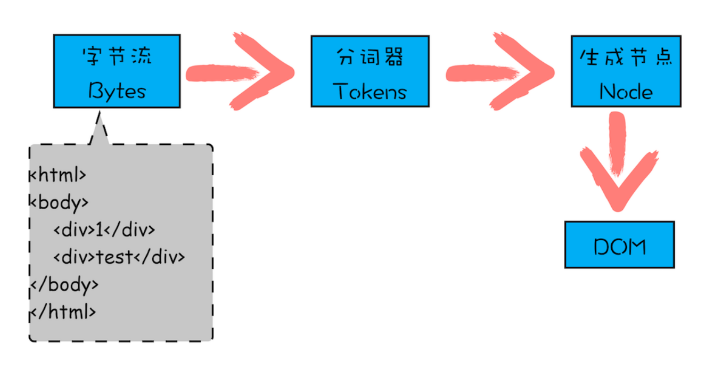
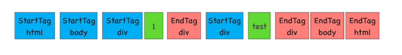

# DOM 树

## 什么是 DOM

从网络传给渲染引擎的 HTML 文件字节流是无法直接被渲染引擎理解的，所以要将其转化为渲染引擎能够理解的内容结构，这个结构就是 DOM

DOM 提供了对 HTML 文档结构化的表述

在渲染引擎中，DOM 有三个层面的作用：

- 页面的视角，DOM 是生成页面的基础数据结构，通过这套接口，JavaScript 可以对 DOM 结构进行访问，从而改变文档的结构、样式和内容

- 安全视角，DOM 是一道安全防护线，一些不安全的内容在 DOM 解析阶段就被拒之门外了

- JavaScript 脚本视角，DOM 提供给 JavaScript 脚本操作的接口，

## DOM 树生成

> 构建 DOM 树：
>
> Tokenizing：根据 HTML 规范将字符流解析为标记
>
> Lexing：词法分析将标记转换为对象并定义属性和规则
>
> DOM construction：根据 HTML 标记关系将对象组成 DOM 树

渲染引擎内部，有一个叫 HTML 解析器（HTMLParser）的模块，它的职责就是负责将 HTML 字节流转换为 DOM 结构

HTML 解析器并不是等整个文档加载完成之后再解析的，而是网络进程加载了多少数据，HTML 解析器便解析多少数据

### 流程

1、网络进程接收到响应头之后，会根据响应头中的 content-type 字段来判断文件的类型，比如 content-type 的值是“text/html”，那么浏览器就会判断这是一个 HTML 类型的文件，然后为该请求选择或者创建一个渲染进程。

2、渲染进程准备好之后，网络进程和渲染进程之间会建立一个共享数据的管道，网络进程接收到数据后就往这个管道里面放，而渲染进程则从管道的另外一端不断地读取数据，并同时将读取的数据（字节流）“喂”给 HTML 解析器。

3、渲染进程的 HTML 解析器，它会动态接收字节流，并将其解析为 DOM



### 第一阶段，通过分词器将字节流转换为 Token

通过分词器先将字节流转换为一个个 Token，分为 Tag Token 和文本 Token，Tag Token 又分 StartTag 和 EndTag



后续的第二个和第三个阶段是同步进行的，需要将 Token 解析为 DOM 节点，并将 DOM 节点添加到 DOM 树中

HTML 解析器维护了一个 Token 栈结构，该 Token 栈主要用来计算节点之间的父子关系，在第一个阶段中生成的 Token 会被按照顺序压到这个栈中

- 如果压入到栈中的是 StartTag Token，HTML 解析器会为该 Token 创建一个 DOM 节点，然后将该节点加入到 DOM 树中，它的父节点就是栈中相邻的那个元素生成的节点

- 如果分词器解析出来是文本 Token，那么会生成一个文本节点，然后将该节点加入到 DOM 树中，文本 Token 是不需要压入到栈中，它的父节点就是当前栈顶 Token 所对应的 DOM 节点

- 如果分词器解析出来的是 EndTag 标签，比如是 EndTag div，HTML 解析器会查看 Token 栈顶的元素是否是 StarTag div，如果是，就将 StartTag div 从栈中弹出，表示该 div 元素解析完成

通过分词器产生的新 Token 就这样不停地压栈和出栈，整个解析过程就这样一直持续下去，直到分词器将所有字节流分词完成

## JavaScript 如何影响 DOM 树

### 内嵌 JavaScript 脚本

```html
<html>
  <body>
    <div>1</div>
    <script>
      let div1 = document.getElementsByTagName("div")[0];
      div1.innerText = "time.geekbang";
    </script>
    <div>test</div>
  </body>
</html>
```

解析到 script 标签时，渲染引擎判断这是一段脚本，此时 HTML 解析器就会暂停 DOM 的解析，因为接下来的 JavaScript 可能要修改当前已经生成的 DOM 结构

执行这段脚本之后，div 节点内容已经修改为 time.geekbang 了。脚本执行完成之后，HTML 解析器恢复解析过程，继续解析后续的内容，直至生成最终的 DOM。

### 页面中引入 JavaScript

```js
//foo.js
let div1 = document.getElementsByTagName("div")[0];
div1.innerText = "time.geekbang";
```

```html
<html>
  <body>
    <div>1</div>
    <script type="text/javascript" src="foo.js"></script>
    <div>test</div>
  </body>
</html>
```

整个执行流程还是一样的，执行到 JavaScript 标签时，暂停整个 DOM 的解析，执行 JavaScript 代码，不过这里执行 JavaScript 时，需要先下载这段 JavaScript 代码

这里需要重点关注下载环境，因为 JavaScript 文件的下载过程会阻塞 DOM 解析，而通常下载又是非常耗时的，会受到网络环境、JavaScript 文件大小等因素的影响。

不过 Chrome 浏览器做了很多优化，其中一个主要的优化是预解析操作。当渲染引擎收到字节流之后，会开启一个预解析线程，用来分析 HTML 文件中包含的 JavaScript、CSS 等相关文件，解析到相关文件之后，预解析线程会提前下载这些文件。

引入 JavaScript 线程会阻塞 DOM，不过也有一些相关的策略来规避，比如使用 CDN 来加速 JavaScript 文件的加载，压缩 JavaScript 文件的体积。另外，如果 JavaScript 文件中没有操作 DOM 相关代码，就可以将该 JavaScript 脚本设置为异步加载，通过 async 或 defer 来标记代码

```js
<script async type="text/javascript" src='foo.js'></script>

<script defer type="text/javascript" src='foo.js'></script>
```

async 和 defer 虽然都是异步的，不过还有一些差异，使用 async 标志的脚本文件一旦加载完成，会立即执行；而使用了 defer 标记的脚本文件，需要在 DOMContentLoaded 事件之前执行。

### 其他情况

```js
<head>
    <style src='theme.css'></style>
</head>

<body>
    <div>1</div>
    <script>
            let div1 = document.getElementsByTagName('div')[0]
            div1.innerText = 'time.geekbang' // 需要 DOM
            div1.style.color = 'red'  // 需要 CSSOM
        </script>
    <div>test</div>
</body>
</html>
```

JavaScript 代码出现了 div1.style.color = ‘red' 的语句，它是用来操纵 CSSOM 的，所以在执行 JavaScript 之前，需要先解析 JavaScript 语句之上所有的 CSS 样式

如果代码里引用了外部的 CSS 文件，那么在执行 JavaScript 之前，还需要等待外部的 CSS 文件下载完成，并解析生成 CSSOM 对象之后，才能执行 JavaScript 脚本。

而 JavaScript 引擎在解析 JavaScript 之前，是不知道 JavaScript 是否操纵了 CSSOM 的，所以渲染引擎在遇到 JavaScript 脚本时，不管该脚本是否操纵了 CSSOM，都会执行 CSS 文件下载，解析操作，再执行 JavaScript 脚本。

JavaScript 脚本是依赖样式表的，这又多了一个阻塞过程

### 总结

JavaScript 会阻塞 DOM 生成，而样式文件又会阻塞 JavaScript 的执行，所以在实际的工程中需要重点关注 JavaScript 文件和样式表文件，使用不当会影响到页面性能的

## CSSOM

> 构建 CSSOM 树：
>
> Tokenizing：字符流转换为标记流
>
> Node：根据标记创建节点
>
> CSSOM：节点创建 CSSOM 树

和 HTML 一样，渲染引擎也是无法直接理解 CSS 文件内容的，所以需要将其解析成渲染引擎能够理解的结构，这个结构就是 CSSOM

CSSOM 也具有两个作用，第一个是提供给 JavaScript 操作样式表的能力，第二个是为布局树的合成提供基础的样式信息。这个 CSSOM 体现在 DOM 中就是 document.styleSheets。

有了 DOM 和 CSSOM，接下来就可以合成布局树了

等 DOM 和 CSSOM 都构建好之后，渲染引擎就会构造布局树。布局树的结构基本上就是复制 DOM 树的结构，不同之处在于 DOM 树中那些不需要显示的元素会被过滤掉，如 display:none 属性的元素、head 标签、script 标签等。复制好基本的布局树结构之后，渲染引擎会为对应的 DOM 元素选择对应的样式信息，这个过程就是样式计算。样式计算完成之后，渲染引擎还需要计算布局树中每个元素对应的几何位置，这个过程就是计算布局。通过样式计算和计算布局就完成了最终布局树的构建。再之后，就该进行后续的绘制操作了。

### 影响页面展示的因素

1、请求发出之后到提交数据阶段

影响因素：网络或服务器处理

2、提交数据之后渲染进程会创建一个空白页面，这段时间称为解析白屏，并等待 CSS 文件和 JavaScript 文件的加载完成，生成 CSSOM 和 DOM，然后合成布局树，最后还要经过一系列的步骤准备首次渲染

3、等首次渲染完成之后，就开始进入完整页面的生成阶段了，然后页面会一点点被绘制出来

### 白屏时间

解析 HTML、下载 CSS、下载 JavaScript、生成 CSSOM、执行 JavaScript、生成布局树、绘制页面一系列操作

通常情况下的瓶颈主要体现在下载 CSS 文件、下载 JavaScript 文件和执行 JavaScript

所以要想缩短白屏时长，可以有以下策略

- 通过内联 JavaScript、内联 CSS 来移除这两种类型的文件下载，这样获取到 HTML 文件之后就可以直接开始渲染流程了。

- 但并不是所有的场合都适合内联，那么还可以尽量减少文件大小，比如通过 webpack 等工具移除一些不必要的注释，并压缩 JavaScript 文件

- 还可以将一些不需要在解析 HTML 阶段使用的 JavaScript 标记上 sync 或者 defer。

- 对于大的 CSS 文件，可以通过媒体查询属性，将其拆分为多个不同用途的 CSS 文件，这样只有在特定的场景下才会加载特定的 CSS 文件

- 通过以上策略就能缩短白屏展示的时长了，不过在实际项目中，总是存在各种各样的情况，这些策略并不能随心所欲地去引用，所以还需要结合实际情况来调整最佳方案

## 参考

[https://blog.poetries.top/browser-working-principle/guide/part5/lesson22.html#%E4%BB%80%E4%B9%88%E6%98%AF-dom](https://blog.poetries.top/browser-working-principle/guide/part5/lesson22.html#%E4%BB%80%E4%B9%88%E6%98%AF-dom)
