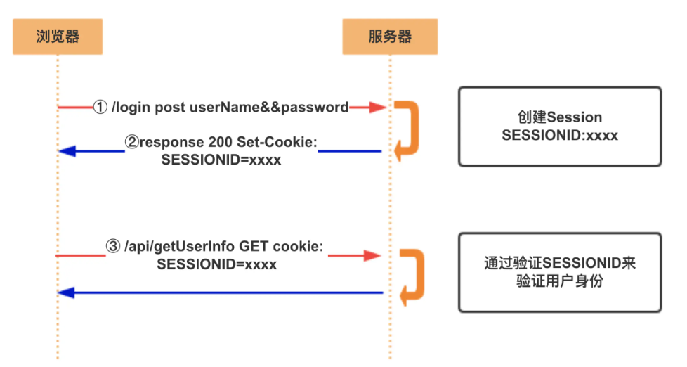
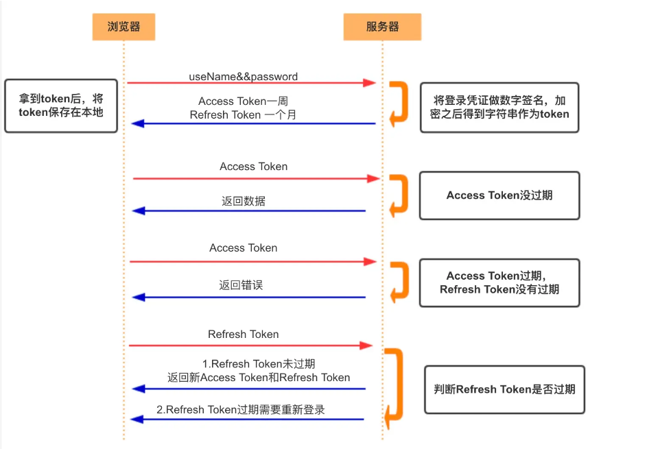

# 浏览器存储

## 浏览器存储

> 浏览器存储是指浏览器在本地计算机上保存数据的方式，以便用户访问网站时能够更快地加载内容，提供更好的用户体验。
>
> 浏览器存储（本地缓存）主要有几种方式：
>
> 1、Cookie
>
> 2、Web Storage
>
> 3、Local Storage
>
> 4、Session Storage
>
> 5、IndexedDB

### Cookie

> cookie 由服务端生成。cookie 就是存放在客户端的一个小文件，也可以存放在本地，例如浏览器关闭后，cookie 也依旧存在

> 如果不设置过期时间，会默认在会话结束后过期，浏览器关闭时过期

#### Cookie 的设置过程

1、客户端向服务器发送 HTTP 请求

2、服务器接收到请求后在响应头添加一个`set-cookie`字段

3、客户端接收到服务器的响应后将 cookie 保存下来，保存到本地的文件夹内

4、之后浏览器的每一次请求都会携带 cookie 发送到服务器

#### 一些属性

- Name

- Value：需要做编码处理

- Expire：cookie 过期时间

- max-age：cookie 失效之前的秒数，`Set-Cookie:Max-Age=604800;`属性值可以是正值，表示持久性的 cookie，负数表示会话的 cookie 在浏览器关闭时就消失，为 0 表示立即删除这个 cookie

  > max-age 和 expire 都存在时，max-age 的优先级更高

- size：cookie 的大小，超过 4kb 会被忽略

- Domain：记录域名信息，但不能跨站点设置域名，不起作用

- path：指定浏览器发出请求时，哪些路径要附带 cookie

- SameSite：限制第三方对 cookie 的携带请求，可以防止 CSRF 攻击

  > 三个重要的属性：
  >
  > `strict`：禁止第三方请求携带 cookie
  >
  > `Lax`：允许部分第三方携带 cookie 值
  >
  > `None`：无论是否跨站都会发送 cookie

- HttpOnly：限定 cookie 只能通过 HTTP 传输，JavaScript 不能读取，防止 XSS 攻击

- Secure：限定了只有 HTTPS 才可以传输 cookie

#### 优缺点

- 弥补了 HTTP 的无状态

- 容量小，只有 4kb

- 不安全，可以随意修改 cookie 内容

- 耗费性能，每一次请求都会携带完整的 cookie

### localStorage

和 cookie 类似，都会存放到同一个域名下，localStorage 可以长期存储，没有时间限制

#### 优缺点

- 扩展 cookie 的大小，可以存放 5M 大小，不同浏览器不同

- 只存储在浏览器，不和服务器通信，解决 cookie 安全和性能消耗问题

- 需要手动删除保存的数据

- 只支持字符串类型，JSON 类型需要通过 JSON.stringify()转换

#### 使用场景

利用 localStorage 可以存放一些稳定的资源和 base64 的图片

### sessionStorage

和 localStorage 一致，但是会话级别存储

且 localStorage 可以在同源环境的不同页面之间共享，但 sessionStorage 中同源下的数据是不能共享的

#### 使用场景

可用于保存一些临时的数据，防止页面消失后数据就没了，比如表单填写和用户的浏览器记录等。

### indexedDB

> 浏览器提供的非关系型数据库，indexedDB 提供大量的接口提供查询功能，还能建立查询

- 同源限制

- 存储空间没有限制

## cookie 和 session

cookie 和 session 的存在是为了解决 HTTP 连接的无状态

### cookie

1、HTTP Request

2、HTTP Response + Set-Cookie

3、HTTP Request + Cookie

4、HTTP Response

### session



客户端在请求服务器时，服务器会将需要保存的状态信息存储在服务器上，然后返回客户端一个 SessionId（通常采用 Set-Cookie 的方式，也就是需要 Cookie 支持）。

客户端拿到 SessionId 后，在后续的请求中携带此数据，这样服务器就能通过 SessionId 拿到对应的状态信息

Seesion 机制是通过核对“客户端明细表”来确认身份

cookie 机制是检查“通行证”来确认身份

#### 优缺点

- 扩展性不好

> 如果是服务器集群，或者是跨域的服务导向架构，就要求 session 数据共享，每台服务器都能读取 session
>
> 解决方案：1、Nginx ip_hash 策略（nginx 代理，把每个请求按访问 IP 的 hash 分配，来自同一 IP 固定访问一个后台服务器，避免了在服务器 A 创建的 session 分发到 B）；2、Session 复制；3、共享 session（将 session id 集中存储到一个地方，所以的机器都来访问这个地方的数据，有点是架构清晰，缺点是工程量大）；4、token


### Token


token 意思是“令牌”，是服务端生成的一串字符串，作为客户端进行请求的一个标识

用户第一次登录后，服务器生成一个 token 并将此 token 返回给客户端，以后客户端只需带上这个 token 前来请求数据即可，无需再次带上用户名和密码

简单的 token 组成：uid(用户唯一的身份标识)、time(当前时间的时间戳)、sign(前面，token 的前几位以哈希算法压缩成一定长度的十六进制字符串，以防止 token 泄露)

这种方式的计数有很多实现，并且有现成的标准可用，这个标准就是 JWT

#### 优缺点

- 支持跨域访问，cookie 不支持跨域访问

- 无状态，session 是有状态

- 更适用移动应用，cookie 不支持手机端访问

- 网络传输性能更好

- 占带宽，正常情况比 session_id 更大

- 无法在服务端注销，难以解决劫持问题

- 性能问题，加密签名需要更多 CPU 开销验证签名

#### JWT (JSON Web Token)

由`.`分隔的三个部分组成：

- Header

> 是一个 JSON 对象

```js
{
  "alg": "HS256", // 表示签名的算法，默认是 HMAC SHA256（写成 HS256）
  "typ": "JWT"  // 表示Token的类型，JWT 令牌统一写为JWT
}
```

- Payload

> 也是 json 对象，用来存放实际需要传递的数据

```js
{
  // 7个官方字段
  "iss": "a.com", // issuer：签发人
  "exp": "1d", // expiration time： 过期时间
  "sub": "test", // subject: 主题
  "aud": "xxx", // audience： 受众
  "nbf": "xxx", // Not Before：生效时间
  "iat": "xxx", // Issued At： 签发时间
  "jti": "1111", // JWT ID：编号
  // 可以定义私有字段
  "name": "John Doe",
  "admin": true
}
```

JWT 默认不加密

- Signature

> 是对前两部分的签名，防止数据被篡改

首先，需要指定一个密钥(只有服务器才知道)，

然后，使用 Header 里面指定的签名算法(默认是 HMAC SHA256)产生签名

```js
HMACSHA256(base64UrlEncode(header) + "." + base64UrlEncode(payload), secret);
```

算出签名后，把 Header、Payload、Signature 三部分拼接成一个字符串，每个部分之间用`.`分隔，就可以返回给用户

```js
JWT = Base64(Header) + "." + Base64(Payload) + "." + $Signature;
```

> 如何保证安全

- 发送 JWT 要使用 HTTPS；不使用 HTTPS 发送的时候，JWT 里不要写入秘密数据

- JWT 的 payload 中要设置 expire 时间

##### JWT 优缺点

- 服务器不需要存储 session，使得服务器认证鉴权业务可以方便扩展；

- 由于服务器不需要存储 Session 状态，因此使用过程中无法废弃某个 Token，或者更改 Token 的权限。也就是说一旦 JWT 签发了，到期之前就会始终有效。

#### 对 JWT 的改进

上述所说都是 Access Token，也就是访问资源接口时所需要的 Token，还有另一种 Token，Refresh Token

一般情况下，Refresh Token 的有效期会比较长，而 Access Token 的有效期比较短。

当 Acesss Token 由于过期而失效时，使用 Refresh Token 就可以获取到新的 Token，如果 Refresh Token 也失效了，用户就只能重新登录了。

Refresh Token 及过期时间是存储在服务器的数据库中，只有在申请新的 Acesss Token 时才会验证，不会对业务接口响应时间造成影响，也不需要向 Session 一样一直保持在内存中以应对大量的请求。



## 浏览器多标签页之间的通信

1、使用 localStorage 事件：通过监听 storage 事件，一个标签页中的更改可以通知到其他标签页

> 当一个标签页修改 localStorage 时，其他同源的标签页可以通过监听 storage 事件来感知到这一变化

2、使用 BroadcastChannel API

> 允许同源的浏览器上下文（例如标签页、iframe、Web Worker）通过频道（channel）广播消息

3、SharedWorker（同源）：是 Web Worker 的一种特殊类型，允许多个同源的标签页、iframe、或其他 Worker 共享同一个 SharedWorker 实例，通过这个实例进行通信。SharedWorker 本质上是一个运行在后台的线程，多个上下文可以与之通信。

4、postMessage API（同源、跨域）

> 通过 window.open 或 window.postMessage 来打开一个新窗口或获取另一个窗口的引用。
>
> 使用 postMessage 发送消息。
>
> 目标窗口使用 message 事件监听消息

5、使用 Service Workers：是一种独立于 Web 页面运行的脚本，主要用于处理网络请求缓存、离线访问等功能。不过，Service Worker 也可以作为一个中介，通过 MessageChannel 实现标签页之间的通信。

<!-- 4、使用 SharedArrayBuffer 和 Atomics

5、使用 websocket 或 server-sent events -->

## 浏览器的垃圾回收机制

浏览器的垃圾回收机制是浏览器管理内存、确保资源有效利用的关键部分。

当变量、对象或其他资源不再使用时，垃圾回收机制会自动释放它们所占用的内存，从而防止内存泄漏。

### 内存分配

- Fisrt-fit，找到第一个的大于等于 size 的块立即返回

- Best-fit，遍历整个空闲列表，返回大于等于 size 的最小分块

- Worst-fit，遍历整个空闲列表，找到最大的分块，然后切成两部分，一部分 size 大小，并将该部分返回

Worst-fit 的空间利用率看起来是最合理，但实际上切分之后会造成更多的小块，形成内存碎片，所以不推荐使用，

First-fit 和 Best-fit 来说，考虑到分配的速度和效率 First-fit 是更为明智的选择

### 回收策略

JavaScript 具有自动垃圾回收机制，会定期对不再使用的变量、对象进行清理，主要通过标记清除和引用计数来实现。

**标记清除 Mark-Sweep（最常用）**

当变量进入环境时，例如在一个函数中声明一个变量，这个变量会被标记为“进入环境”，而当变量离开环境时，会被标记为“离开环境”，随后被垃圾回收机制回收。

还需要处理全局变量和局部变量。

全局变量的生命周期会持续到页面卸载，而局部变量在函数执行结束后就不再被使用，它们的内存空间会被释放。

优点：简单

缺点：

- 内存碎片化，清除之后，剩余的对象内存位置是不变的，会导致空闲内存空间是不连续的，出现了内存碎片，存在内存分配的问题

- 分配速度慢，最坏情况是每次都要遍历到最后，同时因为碎片化，大对象的分配效率会更慢

**标记整理 Mark-Compact**

改善标记清除清除之后剩余的对象位置不变而导致的空闲内存不连续

标记结束后，标记整理算法会将活着的对象（即不需要清理的对象）向内存的一端移动，最后清理掉边界的内存

**引用计数 Reference Counting**

早的一种垃圾回收算法

把 对象是否不再需要 定义为 没有引用 指向该对象（零引用），对象将被垃圾回收机制回收，目前很少使用这种算法，因为问题很多

优点：

引用值为 0，可以立即回收垃圾

缺点：

- 计数器需要占内存

- 不知道被引用数量的上限

- 无法解决循环引用无法回收的问题

### 内存泄漏问题

如果 那些不再使用的变量，它们所占用的内存 不去清除的话就会造成内存泄漏

造成系统内存的浪费导致程序运行速度减慢甚至系统崩溃等严重后果。

比如说：

1、闭包：在闭包中引入闭包外部的变量时，当闭包结束时此对象无法被垃圾回收（GC）。

2、DOM：当原有的 DOM 被移除时，子结点引用没有被移除则无法回收

JS 中拥有自动的垃圾回收机制，

### JavaScript 垃圾回收

JavaScript 的内存管理是自动的，JavaScript 引擎中有个被称作`垃圾回收器`的东西在后台执行，它监控所有对象的状态，并删除掉已经不可达的

> 可达性 reachability
>
> "可达"值是那些以某种方式可访问或可用的值，被存储在内存中
>
> - 固有发可达值的基本集合，包括当前执行的函数，它的局部变量和参数，当前嵌套调用链上的其他函数，它们的局部变量和参数，全局变量，还有其他的内部实现，这些值被称为“根(roots)”
>
> - 如果一个值可用从根通过引用或者引用链进行访问，则认为该值是可达的

#### 内部算法

垃圾回收的基本算法被称为`mark-and-sweep`

定期执行以下垃圾回收步骤：

- 垃圾收集器找到所有的根，并标记它们；

- 然后遍历并标记来自它们的所有引用；

- 然后遍历标记的对象并标记它们的引用，所有被遍历到的对象都会被记住，以免将来再次遍历到同一个对象；

- 直到所有可达的（从根部）引用都被访问到；

- 没有标记的对象都会被删除。

#### 引擎优化

- 分代收集 generational collection

  > 对象分为新旧两组

- 增量收集 incremental collection

  > 将现有整个对象集拆分为多个部分，然后将这些部分逐一清除

- 闲时收集 idle-time collection
  > 垃圾收集器只会在 CPU 空闲时尝试运行，以减少可能对代码执行的影响

## 参考链接

[https://juejin.cn/post/6973072516763877384?searchId=202407201526404EE6FB52E6F45DDD6C24#heading-10](https://juejin.cn/post/6973072516763877384?searchId=202407201526404EE6FB52E6F45DDD6C24#heading-10)

[https://juejin.cn/post/7351301328206331939?searchId=202407201526404EE6FB52E6F45DDD6C24](https://juejin.cn/post/7351301328206331939?searchId=202407201526404EE6FB52E6F45DDD6C24)

[https://juejin.cn/post/7287483692694863927?searchId=2024072012270116713577B46DAACFBE20](https://juejin.cn/post/7287483692694863927?searchId=2024072012270116713577B46DAACFBE20)

[https://juejin.cn/post/6844903864810864647?searchId=2024072012270116713577B46DAACFBE20](https://juejin.cn/post/6844903864810864647?searchId=2024072012270116713577B46DAACFBE20)

[https://blog.csdn.net/qq_28838891/article/details/131123824](https://blog.csdn.net/qq_28838891/article/details/131123824)
