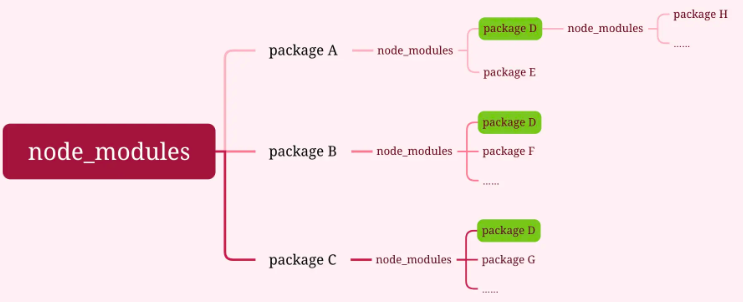
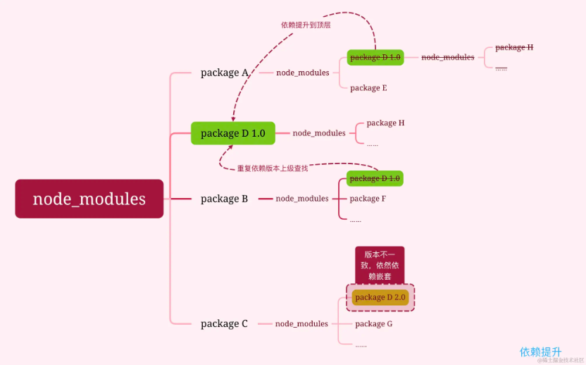

# 包管理工具

## Monorepo

`Monorepo`是一种项目代码管理方式，指单个仓库中管理多个项目，有助于简化代码共享、版本控制、构建和部署等方面的复杂性，并提供更好的可重用性和协作性。

### 演进

#### 阶段一、单仓库巨石应用
一个Git仓库维护项目代码，随着迭代业务复杂度的提升，项目代码会变得越来越多，越来越复杂，大量代码构建效率也会降低，最终导致单体巨石应用，这种代码管理方式称为`Monolith`

#### 阶段二、多仓库多模块应用
将项目拆解成多个业务模块，并在多个Git仓库管理，模块解耦，降低巨石应用的复杂度，每个模块都可以独立编码、测试、发版，代码管理变得简化，构建效率也得以提升，这种代码管理方式称为`MultiRepo`

#### 阶段三、单仓库多模块应用
随着业务复杂度的提升，模块仓库越来越多，`MultiRepo`这种方式虽然从业务上解耦了，但增加了项目工程管理的难度，随着模块仓库达到一定数量级，会有几个问题：跨仓库代码难以共享；分散在单仓库的模块依赖管理复杂；增加构建耗时。

于是，将多个项目集成到一个仓库下，共享工程配置，同时又快捷地共享模块代码，成为趋势，这种代码管理方式称之为`MonoRepo`

## 包管理工具

npm, yarn, pnpm等是用来管理项目依赖、发布包、安装依赖的工具，都提供了对工作区（workspace）的支持，允许在单个代码库中管理多个项目或包。

> 这些包管理工具与monorepo的关系在于它们可以为Monorepo提供依赖安装与依赖管理的支持，借助自身对workspace的支持，允许在Monorepo中的不同子项目之间共享依赖项，并提供一种管理这些共享依赖项的方式，这样可以简化依赖项管理和构建过程，并提供开发效率。

### npm
npm（Node Package Manager）是随着Node.js一起发布的包管理和分发工具

#### npm三大模块

1、网站：将npm包发布到的网站，网站上可以查找各种各样满足需求的包，便于使用；

2、注册表（registry）：是一个数据库，保存了每个package的信息；

3、命令行工具（CLI）：开发者使用的命令行工具npm，进行包的安装发布等。

#### npm进化

##### 嵌套结构依赖
最开始的（v1/v2）node_modules的目录管理，采用最直接的嵌套式结构

问题：

- 重复依赖安装，导致体积变大

- 层级依赖过深

- 缓存能力出现问题，无离线模式

- 版本管理不稳定

##### 扁平化
v3后针对这些问题采取解决方案：扁平化

扁平化，就是按照安装的顺序，如果遇到相当版本的依赖，那么这个依赖就会被提升到顶层，安装到相同的模块时，根据node require机制，会逐级往上寻找node_modules，判断已安装的模块版本是否符合新模块的版本范围，如果符合则跳过，不符合则在当前模块的node_modules下安装该模块

这样还是存在问题，相同的模块因版本不一致无法提升到顶层，还是会重复打包

问题：

- 幽灵依赖：除了安装package.json中引用的依赖外，还有引用的依赖所依赖的包安装，但这些包并没有在package.json中引用，这可能导致依赖丢失或者版本兼容问题

- 依赖分身：不同版本的同一个依赖被重复安装两次

> - 仍出现少数重复包依赖安装，增加node_modules的体积
> 
> - 无法共享库实例，引用得到的是两个独立的实例
> 
> - 如果其中的ts声明文件，会导致使用混乱，导致编译器报错

- 依赖不幂等：多次执行相同的安装命令时，可能会得到不同的结果，或者会产生不一致的行为

##### lock
npm v5时，参考yarn的思路，采取lock锁的思想，将npm安装依赖锁定版本，来解决依赖不幂等的问题。通过lockfile来锁定安装的版本，使得每次执行npm install 的时候，依赖的版本都是相同的

package-lock.json中包含以下几个字段：

- version：唯一版本号

- resolved：包的安装源

- integrity：用于验证包是否失效的完整性hash值，由两部分组成：加密hash函数-摘要dgest，加密函数有sha512或者sha1两种，dfest为`base64(hasnfn(content))`

- dev：是否为开发时依赖

- requires：当前包的dependencies依赖项

- dependencies：当前包的node_modules依赖树

但依旧没有解决幽灵依赖问题

#### 优点
1、广泛的社区支持

2、简单易用

3、自动化解决依赖冲突

#### 缺点
1、性能较差
> 安装依赖的速度较慢，尤其是在处理大量依赖时

2、本地缓存管理不足
> 管理本地缓存方面不如Yarn和pnpm高效，可能导致重复下载同一依赖包，浪费时间和带宽

3、锁文件问题
早期的npm版本在处理package-lock.json文件时存在一些问题，虽然在npm5后有所改善，但仍不如Yarn稳定

### yarn
Yarn 是 Facebook 于 2016 年推出的包管理工具，旨在解决 npm 的一些性能和安全性问题

#### 介绍
yarn诞生在npm v3时期，解决npm存在的问题。

- 采用模块的扁平化。

- 采用缓存机制。实现离线模式解决缓存能力出现的问题。

- 生成package-lock锁文件，解决每次安装依赖时版本的不问题。即使是不同的安装顺序，相同的依赖关系在任何环境和容器中，都可以以相同的方式安装。

- 网络性能更好：yarn采用了请求排队的理念，类似并发池连接，能够更好的利用网络资源，同时也引入了一种安装失败的重试机制。

#### lock文件

- npm采用json结构

- yarn采用一种自定义的标记方式，以yarn.lock结尾

#### 优点
1、速度快
> 通过并行安装和本地缓存显著提高了依赖包的安装速度，会将下载的包缓存到本地，避免了重复下载

2、确定性安装
> lock文件yarn.lock确保了跨环境的一致性安装，避免了不同开发环境之间的版本不一致问题

3、更好的依赖管理
> 在处理依赖树和扁平化依赖结构上做的更好，减少了依赖冲突的发生

4、工作空间
> yarn支持Monorepo，通过workspaces功能，可以在一个仓库中管理多个包，极大的方便了大型项目的依赖管理

#### 缺点

1、学习曲线

2、社区和生态

### pnpm
pnpm 是一种高性能的包管理工具，推出的时间比 Yarn 晚一些，但凭借其独特的硬链接机制和高效的依赖管理方式，迅速获得了很多开发者的认可

#### 介绍

npm/yarn依赖扁平化的方案也存在相应的问题，如幽灵依赖，版本出现很多个的时候依赖包只会提升一个，其他版本的包还是安装了多次，仍然会浪费很多空间

pnpm：快速的，节省磁盘空间的包管理工具

- 快速：使用符号连接技术和并行安装，能够显著提高依赖包的安装速度

- 高效：node_modules中的文件为复制或链接自特定的内容寻址存储库，节省磁盘空间

- 支持monorepos：要求在代码仓的根目录下存有`pnpm-workspace.yaml`文件指定哪些目录作为独立的工作空间，这个工作空间可以理解为一个子模块或者npm包

- 非扁平的结构：

> - 硬链接：硬链接可以理解为源文件的副本，项目里安装的其实是副本，它使得用户可以通过路径引用查找到全局 store 中的源文件，而且这个副本根本不占任何空间。同时，pnpm 会在全局 store 里存储硬链接，不同的项目可以从全局 store 寻找到同一个依赖，大大地节省了磁盘空间。
> 
> - 符号链接：也叫软连接，可以理解为快捷方式，pnpm 可以通过它找到对应磁盘目录下的依赖地址。
> 

yarn和npm通过扁平化处理，会将依赖包提升到根结构，那么这个时候，源码可以直接访问和修改依赖，而不是作为只读的项目依赖。那么在pnpm 使用符号链接将项目的直接依赖项添加到模块目录的根目录中。

#### 优点
1、硬链接机制
> 通过硬链接和符号链接来管理包，这意味着即使在多个项目中使用相同的依赖，也只需要下载一次，大大节省了磁盘空间和下载时间

2、高效的依赖管理
> pnpm 的依赖管理机制能够有效避免依赖重复和版本冲突问题。它使用独特的 node_modules 结构，使得依赖解析更加快速和准确

3、支持Monorepo
> 与 Yarn 类似，pnpm 也支持 Monorepo，可以通过 workspaces 功能在一个仓库中管理多个包，方便大型项目的开发和维护

4、性能优势
> 无论缓存类型（冷或热）如何，PNPM 在速度方面都优于 Yarn。PNPM 速度快的关键在于其文件链接方法，它只需从全局存储中链接文件，而 Yarn 则采用从缓存中复制文件的方法。此外，PNPM 不会在磁盘上多次保存软件包版本，从而确保高效使用磁盘

#### 缺点

1、相对较新

2、学习曲线

## 参考链接
[https://juejin.cn/post/7370008254719803431?searchId=2024071714462180C1A6E3E59E427FF7BF](https://juejin.cn/post/7370008254719803431?searchId=2024071714462180C1A6E3E59E427FF7BF)

[https://juejin.cn/post/7286362110211489855?searchId=20240717150243127DA856A182FA84E564](https://juejin.cn/post/7286362110211489855?searchId=20240717150243127DA856A182FA84E564)

[https://juejin.cn/post/7357546247848198182?searchId=20240717150243127DA856A182FA84E564](https://juejin.cn/post/7357546247848198182?searchId=20240717150243127DA856A182FA84E564)

[https://juejin.cn/post/7215886869199896637?searchId=2024071714462180C1A6E3E59E427FF7BF](https://juejin.cn/post/7215886869199896637?searchId=2024071714462180C1A6E3E59E427FF7BF)

[https://juejin.cn/post/7379784414459904051?searchId=2024071714462180C1A6E3E59E427FF7BF#heading-0](https://juejin.cn/post/7379784414459904051?searchId=2024071714462180C1A6E3E59E427FF7BF#heading-0)