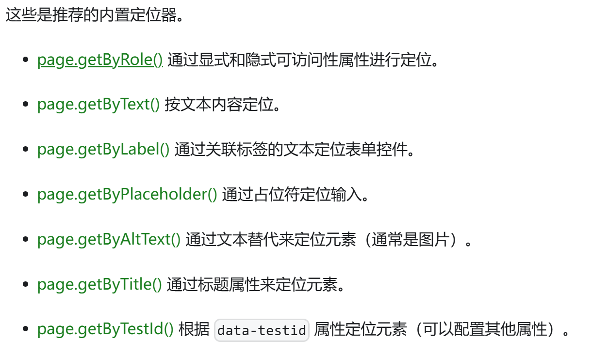

# Playwright基本使用

## 简介

> Playwright Test 是专门为了满足端到端测试的需求而创建的。Playwright 支持所有现代渲染引擎，包括 Chromium、WebKit 和 Firefox。在 Windows、Linux 和 macOS 上进行本地或 CI 测试，无头测试或使用适用于 Android 和 Mobile Safari 的 Google Chrome 的原生移动模拟进行测试。

## 搭建环境

### 安装命令

```
npm init playwright@latest
```

执行上述命令将会创建以下文件，并下载所需的浏览器
```
playwright.config.ts
package.json
package-lock.json
tests/
  example.spec.ts
tests-examples/
  demo-todo-app.spec.ts
```

注意：如果初始化选择不安装浏览器，可以通过`npx playwright install`来安装浏览器

### 运行测试命令

```
npx playwright test
```

可视化界面方式运行测试用例：
```
npx playwright test --ui
```

查看测试报告命令：
```
npx playwright show-report
```

## 编写测试用例

### 测试API

1、测试分组：通过`test.describe`方法，对逻辑相近的测试用例进行分组

```js
test.describe('提交表单', () => {
  test('A 类型表单提交', async ({ page }) => {
    // ...
  });

  test('B 类型表单提交', async ({ page }) => {
    // ...
  });
});
```

2、前/后置钩子：一般用于处理测试用例的公共逻辑，或设置用例之间共享的资源

- `test.beforeEach`：每个测试用例执行前触发

- `test.afterEach`：每个测试用例执行后触发

- `test.beforeAll`：所有测试用例执行前触发

- `test.afterAll`：所有测试用例执行完触发

```js
import { test } from '@playwright/test';

// 全局钩子对每一个用例都生效
test.beforeEach(async ({ page }) => {
  // 没个用例执行前先跳转到起始 url
  await page.goto('https://juejin.cn/');
});

test.describe('group A', () => {
  // 分组内的钩子只对当前分组中的用例生效
  test.beforeEach(async ({ page }) => {
    // ...
  });

  test('my test', async ({ page }) => {
    // ...
  });

  // 在 my test 用例完成后执行，可以用来删除测试遗留数据
  test.afterEach(async ({ page }) => {
  // ...
  });
});
```

### 定位API

`Locator`



```js
await page.getByLabel('User Name').fill('John');

await page.getByLabel('Password').fill('secret-password');

await page.getByRole('button', { name: 'Sign in' }).click();

await expect(page.getByText('Welcome, John!')).toBeVisible();
```

1、按角色定位`page.getByRole()`

> 角色定位器包含 按钮、复选框、标题、链接、列表、表格等等

2、按标签定位`page.getByLabel()`

> 

3、通过占位符定位`page.getByPlaceholder()`

4、通过文本定位`page.getByText()`

5、通过替代文本定位`page.getByAltText()`

6、通过测试id定位`page.getByTestId()`

7、通过css或XPath定位`page.locator()`

### 断言API

1、一般的断言

```js
// 值断言
expect(2).toBe(2);

// 对象比较断言
expect({ code: 0 }).toEqual({ code: 0 })

// 错误断言
expect(() => {
  throw new Error('Something bad');
}).toThrow(/something/);

// 否定断言
expect(1).not.toBe(2);
```

2、页面断言：复杂的断言类型都是异步任务

```js
// 检查页面标题是否为 稀土掘金
await expect(page).toHaveTitle('稀土掘金');

// 检查页面 URL 是否包含 /login
await expect(page).toHaveURL(/.*\/login/);
```

3、定位器断言：可以对定位API选中的元素的状态进行检验，它是测试用例中具有最高的使用频率

```js
const headerElement = page.getByTestId('my-header')
// 检查标题元素是否包含类名：title
await expect(headerElement).toHaveClass(/title/);
// 检查标题是否为：Title
await expect(headerElement).toContainText(/Title/);

const inputElement = page.getByRole('textbox');
// 检查输入框是否聚焦
await expect(inputElement).toBeFocused();
// 检查输入框的值是否为纯数字
await expect(inputElement).toHaveValue(/[0-9]+/);
```


### 等待API

>  在实际应用中，最常见的场景是等待网络请求返回数据(waitForResponse)

```js
import { test } from '@playwright/test';

test('接口检查', async ({ page }) => {
  // 访问掘金首页
  await page.goto('https://juejin.cn/');

  const promise = page.waitForResponse(
    (res) => res.url().includes('/user_api/v1/author/recommend'));
  
  const res = await promise;
  const data = await res.json();
  expect(data.err_no).toBe(0);
})
```

## 生成测试

命令：`npx playwright codegen`，可以启动用例录制和代码生成界面

将打开两个窗口：浏览器窗口与Playwright检查器窗口，可以在其中记录测试、复制测试、清除测试以及更改测试的语言


## 参考

[https://playwright.nodejs.cn/docs/intro](https://playwright.nodejs.cn/docs/intro)
[https://juejin.cn/post/7409138396793061410#heading-0](https://juejin.cn/post/7409138396793061410#heading-0)
[https://juejin.cn/post/7245838232013078588](https://juejin.cn/post/7245838232013078588)
