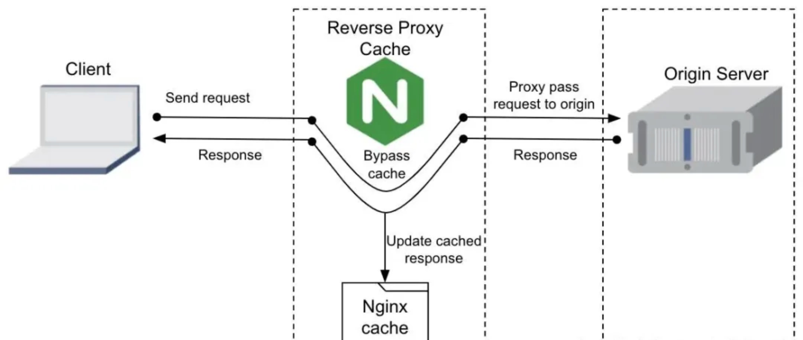

# HTTP 缓存

## 关键点

1、减少重复请求

> 通过缓存机制，浏览器可以存储已请求过的资源，减少对服务器的重复请求

2、设置缓存头

> 在服务器端设置合适的`Cache-Control`、`Expires`或`ETag`响应头，告诉浏览器如何缓存资源

3、区分静态和动态资源

> 静态资源如图片、CSS、JS 文件可以设置较长的缓存时间，而动态内容则需要更短的缓存时间或使用验证缓存

4、利用浏览器缓存

> 合理配置服务端缓存策略，让浏览器自动处理缓存，减少不必要的网络请求

5、更新缓存策略

> 当资源更新时，确保使用新的缓存策略，如改变文件名或使用`Last-Modified`和`ETag`头来验证缓存

6、监控缓存效果

> 使用浏览器的开发者工具监控资源的缓存情况，确保缓存策略按预期工作

## nginx 服务器端配置 HTTP 缓存

1、配置 Expires 头，并且尽量设置一个长久的 Expires

2、配置 Cache-Control

`nginx.conf`文件中引用配置：

```
http {
  # 其它配置
  
  # Specify file cache expiration.
  include web_performance/cache_expiration.conf;

   # Add Cache-Control.
   include web_performance/cache-control.conf;
}
```

### `cache_expiration.conf`

```
map $sent_http_content_type $expires {
  default                                 1M;

  # No content
  ""                                      off;

  # CSS
  ~*text/css                              1y;

  # Data interchange
  ~*application/atom\+xml                 1h;
  ~*application/rdf\+xml                  1h;
  ~*application/rss\+xml                  1h;

  ~*application/json                      0;
  ~*application/ld\+json                  0;
  ~*application/schema\+json              0;
  ~*application/geo\+json                 0;
  ~*application/xml                       0;
  ~*text/calendar                         0;
  ~*text/xml                              0;

  # Favicon (cannot be renamed!) and cursor images
  ~*image/vnd.microsoft.icon              1w;
  ~*image/x-icon                          1w;

  # HTML
  ~*text/html                             0;

  # JavaScript
  ~*application/javascript                1y;
  ~*application/x-javascript              1y;
  ~*text/javascript                       1y;

  # Manifest files
  ~*application/manifest\+json            1w;
  ~*application/x-web-app-manifest\+json  0;
  ~*text/cache-manifest                   0;

  # Markdown
  ~*text/markdown                         0;

  # Media files
  ~*audio/                                1M;
  ~*image/                                1M;
  ~*video/                                1M;

  # WebAssembly
  ~*application/wasm                      1y;

  # Web fonts
  ~*font/                                 1M;
  ~*application/vnd.ms-fontobject         1M;
  ~*application/x-font-ttf                1M;
  ~*application/x-font-woff               1M;
  ~*application/font-woff                 1M;
  ~*application/font-woff2                1M;

  # Other
  ~*text/x-cross-domain-policy            1w;
}

# 时间根据变量 $expires 的配置匹配
expires $expires;
```

主要策略是针对不会经常调整的文件类型，尽量给一个长久的 Expires

### Lighthouse 的缓存策略

如果满足以下所有条件，则 Lighthouse 会认为资源可缓存：

- 资源可以是字体、图片、媒体文件、脚本或样式表

- 资源具有`200`、`203`或`206` HTTP 状态码

### `cache-control.conf`

处理配置 Expires 头的配置，另外一个重要配置是`cache-control.cong`文件，是针对`Cache-Control`首部字段的配置

```
map $sent_http_content_type $cache_control {
    default                           "public, immutable, stale-while-revalidate";

    # No content
    ""                                "no-store";

    # Manifest files
    ~*application/manifest\+json      "public";
    ~*text/cache-manifest             ""; # `no-cache` (*)

    # Assets
    ~*image/svg\+xml                  "public, immutable, stale-while-revalidate";

    # Data interchange
    ~*application/(atom|rdf|rss)\+xml "public, stale-while-revalidate";

    # Documents
    ~*text/html                       "private, must-revalidate";
    ~*text/markdown                   "private, must-revalidate";
    ~*text/calendar                   "private, must-revalidate";

    # Data
    ~*json                            ""; # `no-cache` (*)
    ~*xml                             ""; # `no-cache` (*)
}
```

## 与缓存相关的 HTTP 首部字段

### `Expire`首部字段

使用一个特定时间：`Wed, 23 Jul 2025 12:37:27 GMT`，这有一定的局限性，因为 Expires 头要求服务器和客户端的时间要严格同步。如果本地电脑调整了时间，超过了 Exipres 头设置的时间，也会使缓存过期。

另外，Exipres 头会经常检测过期时间，并且一旦过期了，又需要再服务器中配置提供一个新的日期。所以会有 Exipres 头设置的时间尽量长的策略

### `Cache-Control` 首部字段

为解决 Exipres 头的这些不足，HTTP 1.1 协议中引入了 Cache-Control 首部字段。Cache-Control 使用 `max-age` 指令指定组件被缓存多久。它以秒为单位定义更新时间。如果从资源被请求开始过去的秒数小于 max-age，浏览器就会使用缓存版本。它可以消除 Expires 头对于服务器和客户端的时间必须同步的限制。

max-age 指定的设置策略也和 Expires 头一致，尽量设置一个较长的时间。最大可以设置 10 年，一般都设置至少 30 天以上。

其他常用指令：

- public：响应可以被任何对象缓存。默认是 public。

- private：响应只能被单个用户缓存。

- no-cache：在释放缓存副本之前，强制高速缓存将请求提交给原始服务器进行验证。`指定不缓存响应，表明资源不进行缓存`。

- only-if-cached：表明客户端只接受已缓存的响应，并且不需要向原始服务器检查是否有更新的拷贝

- no-store：缓存不应存储有关客户端请求或服务器响应的任何内容，表示绝对禁止缓存

- no-transform：不得对资源进行转换或转变。Content-Encoding, Content-Range, Content-Type 等 HTTP 头不能由代理修改。例如，非透明代理可以对图像格式进行转换，以便节省缓存空间或者减少缓慢链路上的流量。no-transform 指令不允许这样做。

### `Last-Modified Date` 和 `ETag`

Cache-Control 和 Expires 两个 HTTP 首部字段是用来指定资源的缓存时长的。而服务器在检测缓存的资源是否和原始服务器上的资源匹配，则使用的是另外 2 种方式：

- 比较最新修改日期（Last-Modified Date）

- 比较实体标签（ETag）

#### 最新修改时间（Last-Modified Date）

原始服务器通过 Last-Modified 响应头来返回组件的最新修改日期：`Last-Modified: Tue, 25 Jun 2024 20:20:53 GMT`

设置了 Expires 头后，浏览器会缓存资源和它的最新修改日期。再次请求同一资源时，浏览器会使用 If-Modified-Since 头将最新修改日期回传到原始服务器进行比较。如果匹配则返回 304 响应，而不会重新下载组件。

#### 实体标签（ETag）

实体标签 ETag 是 Web 服务器和浏览器用于确认缓存资源的有效性的一种机制。ETag 在 HTTP 1.1 引入，它是表示组件的特定版本的唯一性的字符串。

##### ETag的问题
通常的 Web 服务器的架构设计都是做了高可用的配置的，是由多台服务器组成的集群构建而成。

如设置负载均衡之后：

```
upstream yao {
  server 127.0.0.1:18080;
  server 127.0.0.1:18081;
  server 127.0.0.1:18082;
}
```
ETag 有个问题，当浏览器分别从两台不同的后端集群服务器中请求同一资源的时候，两台不同的服务器的 ETag 是不会一致的。

当然，我们可以通过在负载平衡的配置中添加 keepalive 或者设置服务器的 weight 权重，让同一客户端尽量从同一服务器获取资源，但还是无法保证会切换服务器请求资源。

#### nginx配置反向代理缓存

除了使用普通的静态资源的 HTTP 缓存外，还可以将服务器集群中的原始资源缓存到代理服务器上，也就是配置反向代理缓存，将资源都缓存到 NGINX 服务器所在的代理服务器上。



用户第一次请求资源，NGINX 服务器会向集群中的服务器请求资源，然后缓存下来。用户再次请求数据的时候，如果 NGINX 服务器已经缓存了，NGINX 服务器就会直接响应，而不用再向上游的服务器集群的服务器请求资源了。这样就进一步优化了请求的响应速度，也更进一步的优化了前端性能。

`要配置反向代理缓存，需要在 NGINX 服务器上配置一个缓存区域，指定缓存路径，目录层级，共享内存的大小等信息。`

`proxy_cache_path` 是 Nginx 中用于配置反向代理缓存的指令。它定义了缓存存储的位置、缓存大小、缓存的各种参数等。反向代理缓存可以极大地提高性能，减少对后端服务器的负载。

`proxy_cache.conf`

```
proxy_cache_path  ./cache
                  levels=1:2 
                  keys_zone=cache_static:100m  
                  inactive=1h  
                  max_size=300m  
                  use_temp_path=off;
```


## 参考

[https://mp.weixin.qq.com/s/RX11KXRdRF4szssr8ohcxw](https://mp.weixin.qq.com/s/RX11KXRdRF4szssr8ohcxw)
