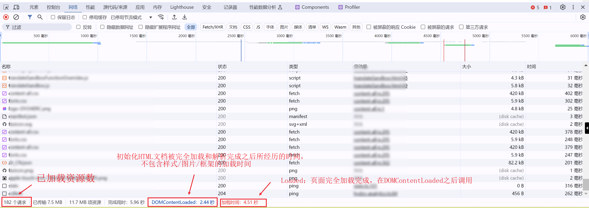
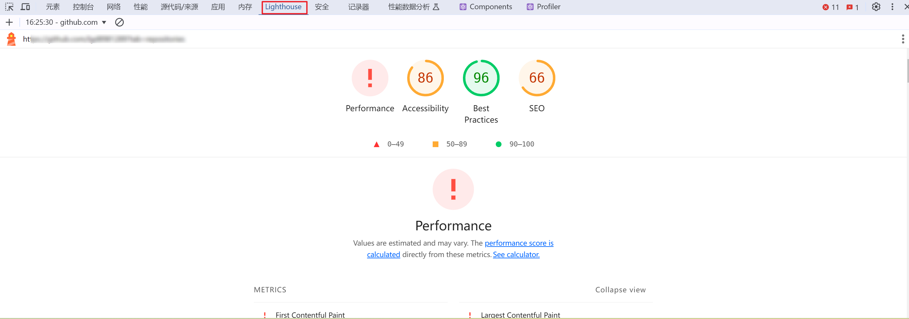
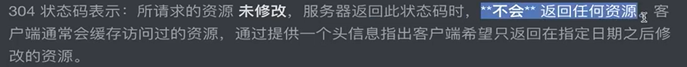

# 性能优化方案

## 浏览器查看性能指标

### network



### performance

### lighthouse 打分报告



## 企业项目性能优化方案

### 数据懒加载处理

一开始不获取数据，等到用户将要看到它的时候，再进行数据获取和展示的功能，叫做数据懒加载

阶段：

1、不获取数据

2、用户将要看到

3、获取数据并渲染

#### 监听视图内是否可见

```js
const intersectionObserver = new IntersectionObserver((entries) => {
  if (entries[0].intersectionRatio <= 0) {
    return console.log("当前视图不可见");
  }
  console.log("当前视图可见");
});
intersectionObserver.observe(box3Target.value);
```

Intersection Observer 优点：

1、异步触发：IntersectionObserver 观察器的优先级非常低，采用了 requestIdleCallback()，不会占用主线程资源，只有在浏览器空闲下来才会执行观察器。

2、减小开销：相比较传统的监听滚动事件， IntersectionObserver 避免了频繁的触发和计算，节省了资源。

3、批量观察元素：可以一次性观察多个目标元素，以数组形式存储在 callback 函数的 entries 参数中，方便开发者进行批量操作。

4、浏览器兼容性好

#### react 封装视图是否可见

```js
// useInView
import { useEffect, useState, useRef } from 'react';

const useInView = (
    options = {
        root: null,
        rootMargin: '0px 0px',
        threshold: 1,
    },
    triggerOnce = false, // 是否只触发一次
) => {
    const [inView, setInView] = useState(false);
    const targetRef = useRef(null);

    useEffect(() => {
        const observer = new IntersectionObserver((entries) => {
            entries.forEach((entry) => {
                if (entry.isIntersecting) {
                    setInView(true);
                    if (triggerOnce) {
                        // 触发一次后结束监听
                        observer.unobserve(entry.target);
                    }
                } else {
                    setInView(false);
                }
            });
        }, options);

        if (targetRef.current) {
            // 开始监听
            observer.observe(targetRef.current);
        }

        return () => {
            if (targetRef.current) {
                // 组件卸载时结束监听
                observer.unobserve(targetRef.current);
            }
        };
    }, [options, triggerOnce]);

    return [targetRef, inView];
};

export default useInView;


// 使用
import React from 'react';
import useInView from './hooks/useInView';

const App = () => {
    const [targetRef, inView] = useInView();

    return (
        <div>
            <div style={{ height: '100vh' }}></div>
            <div
                ref={targetRef}
                style={{
                    width: '100px',
                    height: '100px',
                    background: inView ? 'green' : 'red',
                }}
            >
                {inView ? 'In View' : 'Out of View'}
            </div>
        </div>
    );
};

export default App;
```

TS 版本

```ts
import { useEffect, useState, useRef } from "react";
import type { MutableRefObject } from "react";

type TargetRef = MutableRefObject<HTMLElement | null>;
const useInView = (
  options: IntersectionObserverInit = {
    root: null,
    rootMargin: "0px",
    threshold: 1,
  },
  triggerOnce: boolean = false
): [TargetRef, boolean] => {
  const [inView, setInView] = useState(false);
  const targetRef: TargetRef = useRef<HTMLElement | null>(null);

  useEffect(() => {
    const observer = new IntersectionObserver((entries) => {
      entries.forEach((entry) => {
        if (entry.isIntersecting) {
          setInView(true);
          if (triggerOnce) {
            observer.unobserve(entry.target);
          }
        } else {
          setInView(false);
        }
      });
    }, options);

    if (targetRef?.current) {
      observer.observe(targetRef.current);
    }

    return () => {
      if (targetRef?.current) {
        observer.unobserve(targetRef.current);
      }
    };
  }, [options, triggerOnce]);

  return [targetRef, inView];
};

export default useInView;
```

### 图片懒加载处理

图片数量较多，没法每一个都设置监听。

可以把每个图片的 src 属性改为 data-src 属性

```js

useEffect(() => {
  // 创建 IntersectionObserver 实例
  const ob = new IntersectionObserver(
    (entries) => {
      for (let entry of entries) {
        if (entry.isIntersecting) {
          const img = entry.target;
          img.src = img.dataset.src; // 将 data-src 的值赋给 src，实现图片加载
        }
      }
    },
    {
      root: null, // 相对于整个视口进行判断
      rootMargin: '0px', // 元素进入视口一段距离即触发
      threshold: 1, // 元素完全进入视口时触发
    },
  );

  // 获取所有带有 data-src 属性的图片元素
  const imgs = document.querySelectorAll('img[data-src]');

  // 遍历图片元素，将每个元素绑定到 IntersectionObserver 上进行观察
  imgs.forEach((item) => {
    ob.observe(item);
  });
}, [newlist]);


<div className="main" onScroll={handelScroll} ref={scorllRef}>
        {newlist.map((item) => (
          <div className="main-item" key={item._id}>
            
          </div>
        ))}
      </div>
```

### webpack 打包体积过大与 CDN 优化处理

webpack 配置里面 externals 可以设置排除 import 的包

cdn 接入排除的包

```js
let externals = {};
let cdn = {
  js: [],
};

// 排除打包，只需要在 build 排除
const isProd = process.env.NODE_ENV === "production";
if (isProd) {
  externals = {
    xlsx: "XLSX",
    echarts: "echarts",
  };
  cdn = {
    js: [
      "https://cdn.jsdelivr.net/npm/echarts@5.4.2/dist/echarts.min.js",
      "https://cdn.jsdelivr.net/npm/xlsx@0.18.5/dist/xlsx.full.min.js",
    ],
  };
}

module.exports = defineConfig({
  configureWebpack: {
    transpileDependencies: true,
    configureWebpack: {
      externals,
    },
    chainWebpack(config) {
      config.plugin("html").tap((args) => {
        // 携带指定的属性到 htmlWebpackPlugin
        args[0].cdn = cdn;
        return args;
      });
    },
  },
});
```

index.html 引入

```html
<body>
  <noscript>
    <strong
      >We're sorry but <%= htmlWebpackPlugin.options.title %> doesn't work
      properly without JavaScript enabled. Please enable it to continue.</strong
    >
  </noscript>
  <div id="app"></div>
  <!-- built files will be auto injected -->
  <!-- 引入 js -->
  <% for(var js of htmlWebpackPlugin.options.cdn.js) { %>
  <script src="<%=js%>"></script>
  <% } %>
</body>
```

CDN 只会加速访问速度，但并不会减少依赖包的体积

### 其他优化方案（gzip、http 缓存、service worker）

1、gzip 压缩

> gzip 通过 LZ77 算法与 Huffman 编码来压缩文件，重复度越高的文件可压缩的空间就越大，对 JS、CSS、HTML 等文本资源均有效

> 当 nginx 返回 js 文件的时候，会判断是否开启 gzip，然后压缩后再返回给浏览器
>
> 该压缩方法需要 nginx 配置开启 gzip 压缩，单纯前端通过 webpack 插件开启 gzip 压缩是不能达到优化效果的

2、http 缓存



3、service worker

是一个 JS API，作用是为网站提供有效的离线体验

## 参考

[https://www.bilibili.com/video/BV1GAWDe7E3k/?p=7&spm_id_from=pageDriver&vd_source=c2b84cb781f449de214223923517efb2](https://www.bilibili.com/video/BV1GAWDe7E3k/?p=7&spm_id_from=pageDriver&vd_source=c2b84cb781f449de214223923517efb2)

[https://www.nowcoder.com/discuss/522882522523402240](https://www.nowcoder.com/discuss/522882522523402240)

[https://blog.csdn.net/g2255yuuhgy/article/details/133340656](https://blog.csdn.net/g2255yuuhgy/article/details/133340656)
