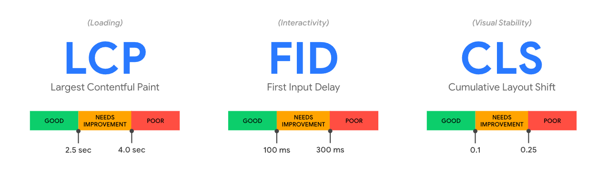
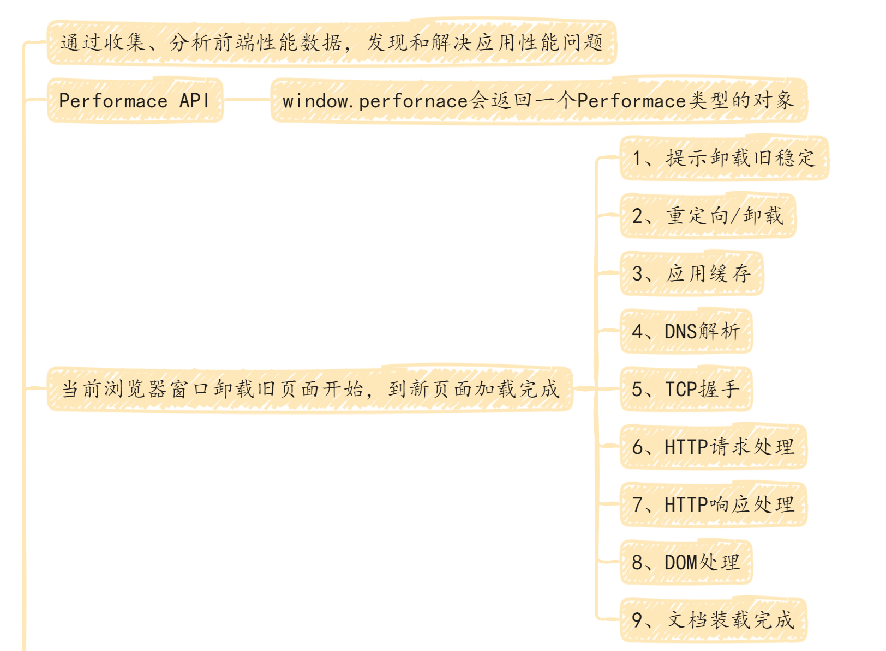
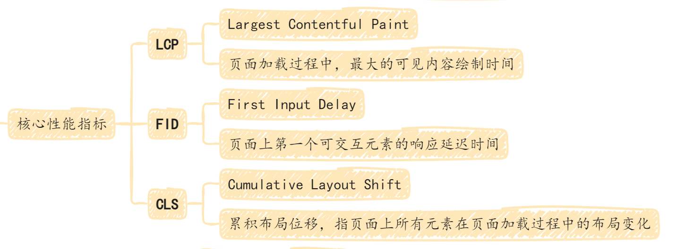
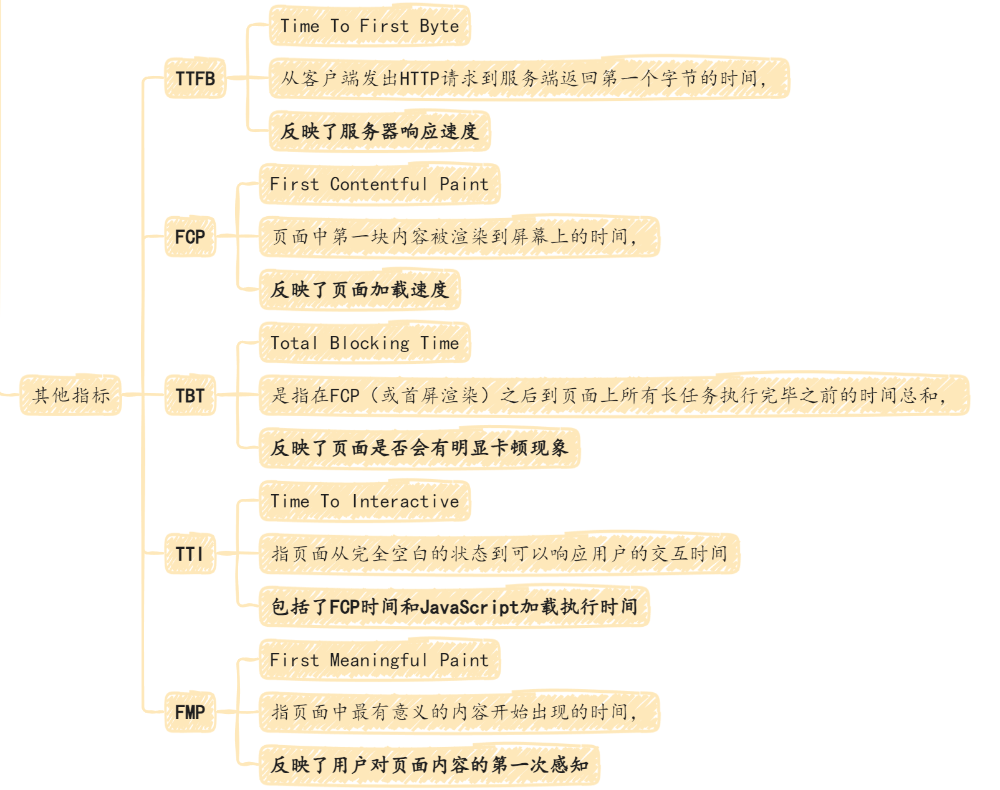
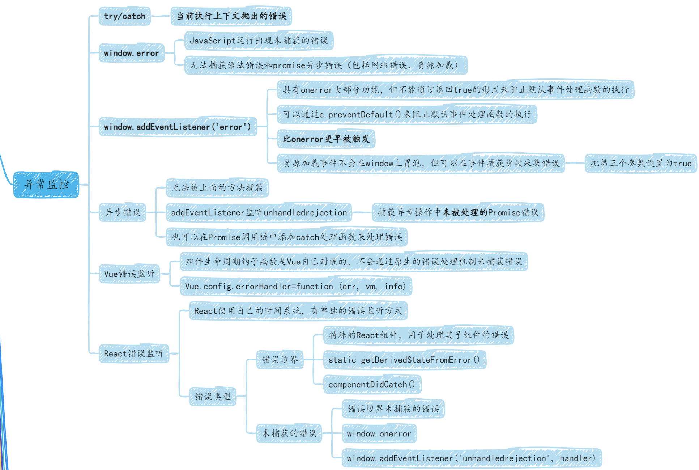
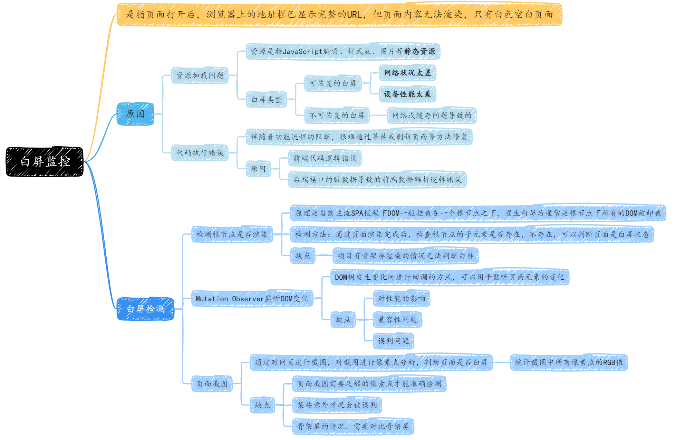
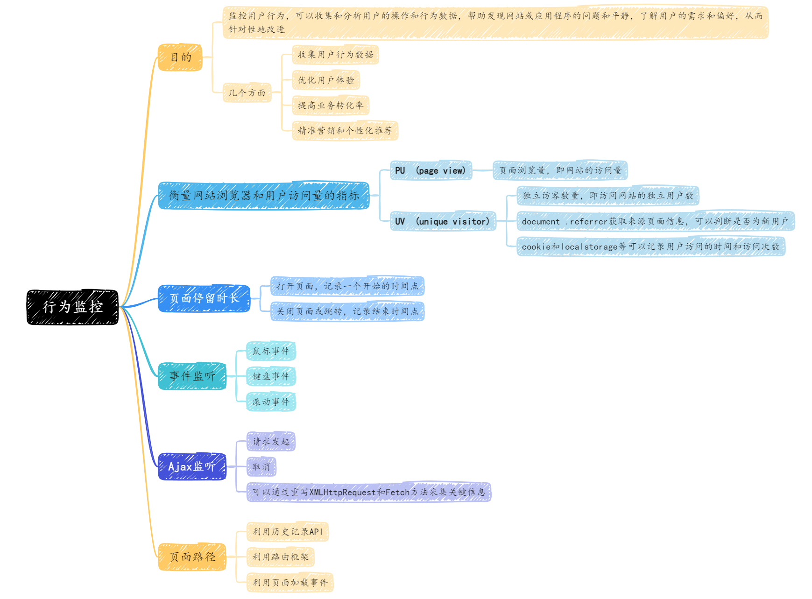

# 页面监控

## 性能监控

前端性能监控是指通过收集、分析前端性能数据，以便发现和解决应用性能的问题的过程。

可以帮助我们了解应用程序的整体性能和用户体验，并且帮助优化页面加载速度、提高应用程序的性能和可靠性，从而提高用户的满意度

### Performance API

是 HTML5 提供的 API 之一，用于在 Web 前端监控性能数据，可以帮助开发者对 Web 应用进行性能优化。

帮助了解`页面的加载时间`、`资源的加载时间`、`页面渲染时间`以及`JavaScript执行时间`等。

window.performance 会返回一个 Performance 类型的对象，其中，`performance.timing` 包含了各种与浏览器性能有关的时间数据，提供浏览器各处理阶段的耗时。

### 核心性能指标

核心 Web 性能指标的构成指标随着时间的推移而发展，当前针对 2020 年的指标构成侧重于用户体验的三个方面——加载性能】交互性和视觉稳定性——并包括以下指标（及各指标相应的阈值）：



- Largest Contentful Paint(LCP)：页面加载过程中，最大的可见内容绘制时间。即页面上最显眼的元素（如图片、文字、视频等）加载完成并显示在屏幕上的时间点。

- First Input Delay(FID)：测量页面上第一个可交互元素（如按钮、链接等）的响应延迟时间。FID 是用户`首次与页面进行交互的时间`，通常与页面的 JavaScript 处理时间相关。

- Cumulative Layout Shift(CLS)：累计布局位移，指页面上所有元素在页面加载过程中的布局变化。

### 其他指标

- TTFB（Time To First Byte）：是指从客户端发出 HTTP 请求到服务端`返回第一个字节`的时间，反映了`服务器响应速度`

- FCP（First Contentful Paint）：是指页面上的`第一块内容（如文本、图片、svg 等）被渲染到屏幕上`的时间，反映了`页面加载速度`

- TBT（Total Blocking Time）：是指在 FCP（或首屏渲染）之后到页面上`所有长任务执行完毕之前的时间总和`，反映了`页面是否会有明显的卡顿现象`

- FMP（First Meaningful Paint）：指页面中`最有意义的内容开始出现的时间`，反映了`用户对页面内容的第一次感知`

### 总结







## 异常监控

是指通过对前端代码的监控和分析，及时发现和定位前端代码中的异常，以便于及时修复和提高用户体验

### try/catch

捕获错误，并在错误处理程序中抛出错误。被捕获的错误不影响后续代码的执行，但需要手动包裹可能出现的异常代码

```js
try {
  throw new Error("test");
} catch (error) {
  console.log(error);
}
```

只能捕获当前执行的上下文抛出的错误。

实际开发，只会针对一些特殊的部分使用，如果大量使用，不仅会增加开发负担，也会降低代码的可读性

所以需要一种对工程低侵入的错误采集方案

### window.onerror

用于 JavaScript 错误处理的全局事件，当 JavaScript 运行时出现未被捕获的错误时，会被触发

```js
window.onerror = function (message, source, lineno, colno, error) {
  // 处理异常信息
  console.log("错误信息", message);
  console.log("发生错误的脚本 URL", source);
  console.log("发生错误的行号", lineno);
  console.log("发生错误的列号", colno);
  console.log("错误Error对象的堆栈", error);
  // 返回true， 阻止执行默认事件处理函数，控制台不会在默认打印错误信息
  return true;
};
```

`不能捕获语法错误和promise异常错误（网络错误、资源加载）`

### window.addEventListener('error')

具有 window.onerror 的大部分功能，但不能通过返回 true 的形式来阻止默认事件处理函数的执行，可以通过 e.preventDefault()来阻止默认事件处理函数的执行

在错误捕获时机上，比 onerror 更早被触发

```js
window.addEventListener("error", function (event) {
  console.log("报错信息: ", event.message);
  console.log("错误文件地址: ", event.filename);
  console.log("错误行数: ", event.lineno);
  console.log("错误列数: ", event.colno);
  console.log("错误堆栈: ", event.error);
});
```

资源加载事件不会在 window 上冒泡，但可以在事件捕获阶段采集，第三个参数设置为 true

```js
window.addEventListener(
  "error",
  function (event) {
    const { target } = e;
    console.log("资源加载失败标签:", target.nodeName);
    console.log("资源地址:", target.src);
  },
  true
);
```

要区分 Javascript 错误和资源加载错误，可以利用 lineno 和 colno 字段实现。当资源加载失败时，回调参数中的两个字段的值为 undefined。同时，也可以利用 instanceof 来判断，JavaScript 错误抛出的事件类型为 ErrorEvent,资源加载失败抛出的事件类型为 Event，ErrorEvent 为 Event 的子类型。

```js
window.addEventListener(
  "error",
  (e) => {
    if (e instanceof ErrorEvent) {
      console.log("JavaScript 报错");
      console.log("报错信息:", message);
      console.log("错误文件地址:", filename);
      console.log("错误文件行数:", lineno);
      console.log("错误文件列数:", colno);
      console.log("错误堆栈:", error);
    } else {
      console.log("资源加载报错");
      console.log("资源加载失败标签:", target.nodeName);
      console.log("资源地址:", target, src);
    }
  },
  true
);
```

### 异步错误：无法被上述捕获

这种错误没办法被上述三种方法捕获，需要使用 addEventListener 监听 unhandledrejection 事件

> try/catch 能捕获到 async/await 并不是本身的能力，而是 async/await 是语法糖，实现的时候。捕获了异步错误，内部使用 throw 抛出

unhandledrejection 事件用于捕获异步操作中未被处理的 Promise 错误。当一个 Promise 被拒绝（rejected）`但没有被处理`（没有 catch 或者 then 带有第二个参数），这个事件就会被触发。被处理了就不会被触发。

```js
window.addEventListener("unhandledrejection", function (event) {
  console.warn("Unhandled promise rejection:", event.reason);
});
// Uncaught (in promise) xxx
// (anonymous) @ VM207:1
```

除了使用 unhandledrejection 事件捕获异步错误，还可以在 promise 调用链中添加 catch 处理函数来处理错误，以避免错误未被处理而导致程序错误

### react 错误监听

react 使用了自己的时间系统，所以有单独的错误监听方法

分为两种类型：

1、错误边界 Error Boundaries

> 是一种特殊的 react 组件，用于处理其子组件中的错误
>
> 可以通过 static getDerivedStateFromError()和 componentDidCatch()这两个生命周期函数来捕获和处理子组件中的错误

2、未捕获的错误 Unhandled Errors

> 是指哪些没有被错误边界组件捕获的错误
>
> 可以通过 window.onerror 和 window.addEventListener('unhandledrejection',handler)来捕获和处理

```js
class ErrorBoundary extends React.Component {
  constructor(props) {
    super(props);
    this.state = { hasError: false };
  }

  componentDidCatch(error, info) {
    // 错误处理
    console.log("错误对象", error);
    console.log("错误堆栈信息", info);
    this.setState({ hasError: true });
  }

  render() {
    if (this.state.hasError) {
      return <h1>Something went wrong.</h1>;
    }
    return this.props.children;
  }
}

<ErrorBoundary>
  <MyComponent />
</ErrorBoundary>;
```

### 总结



## 白屏监控

是指页面打开后，浏览器上面的地址栏已经显示完整的 URL，但是页面内容无法渲染，只有白色的空白页面

导致白屏的原因大致可分为两类：

- 资源加载问题

- 代码执行错误

都与当前 SPA 框架的广泛使用有关

### 资源加载问题

JavaScript 脚本、样式表、图片等静态资源，不包括接口调用等动态资源

可分为可恢复的和不可恢复的两大类

#### 可恢复的白屏

常见于第一次进入页面时，由于资源加载过慢或者接口请求未返回，所以浏览器无法执行下一步骤

这种白屏通常是`网络状况太差`或者`设备性能太差`等原因导致的，一般在浏览器返回后，就能恢复页面渲染，可以通过监控首屏时间来发现

#### 不可恢复的白屏

大多是由于网络或缓存问题导致的

### 代码执行错误

一般伴随着功能流程的阻断出现，并且很难通过等待或者页面刷新等方法修复

出现的原因通常是前端代码逻辑错误，或者是后端接口脏数据导致的前端数据解析逻辑错误，最终导致运行异常的前端代码触发了页面崩溃

### 白屏检测

#### 检测根节点是否渲染

原理是在当前主流 SPA 框架下，DOM 一般挂载在一个根节点之下，发生白屏后通常是根节点下所有 DOM 被卸载

#### Mutation Observer 监听 DOM 变化

#### 页面截图

### 总结



## 卡顿监控

是指对网站的性能进行监控，从而识别用户在使用网站时所遇到的卡顿问题

卡顿通常是由于网站在执行复杂的 JavaScript 操作或渲染大量内容时导致的（常见的涉及到动画、列表渲染的场景），这会使得页面加载速度变慢，影响用户的体验。

通过测量页面的响应时间和 FPS（每秒帧数）来判断用户是否遇到了卡顿问题

FPS 是 Frames Per Second 的缩写，意为每秒帧数，是指显示器每秒钟能够显示的图像帧数。在计算机图形学和动画制作中，FPS 是一个重要的指标，它决定了画面的流畅度和清晰度。在前端开发中，浏览器的 FPS 是一个重要的指标，它反映了页面的性能和用户体验。通常来说，页面的 FPS 应该保持在 60FPS 或以上，以保证页面的流畅度和响应速度。

### 实现

浏览器提供了 Performance API 和 requestAnimationFrame API 来测量页面的响应时间和 FPS

```js
let fps = 60; // 帧率
let frameTime = 1000 / fps; // 每帧所需的时间
let lastFrameTime = 0; // 上一帧的时间戳

function checkFps(currentTime) {
  const elapsed = currentTime - lastFrameTime; // 计算两帧之间的时间差
  if (elapsed > frameTime) {
    // 如果时间差超过了每帧所需的时间，说明页面出现了卡顿
    console.warn("页面出现卡顿现象！");
  }
  requestAnimationFrame(checkFps);
}

requestAnimationFrame(checkFps);
```

requestAnimationFrame 是一种浏览器提供的 JavaScript 函数，它可以让我们在下一次重绘之前执行指定的函数。通常情况下，requestAnimationFrame 的调用频率与浏览器的刷新率相同，即一秒钟 60 次。

### 常见卡顿原因

1、网络问题：前端资源文件过大、网络请求过多

> 通过减小资源文件的体积或者优化网络请求的方式

2、JS 代码问题：JS 代码过于复杂或者存在死循环

> 优化 JS 代码或者检查代码中的死循环问题

3、CSS 样式问题：CSS 样式存在大量层叠或者过于复杂

> 优化 css 样式或者使用 css 预编译器来解决

4、渲染问题：浏览器的渲染引擎。页面存在大量 DOM 元素或者复杂的布局时，浏览器会消耗更多的计算资源，从而导致页面卡顿

> 减少 DOM 元素的数量或者使用虚拟滚动技术

5、设备问题：设备本身内存不足或处理器性能不足

> 升级硬件或者减少前端页面的复杂度

### 常见解决方式

1、图片懒加载

2、压缩文件

3、使用缓存

4、减少 HTTP 请求

5、使用 Web Workers：Web Workers 可以将一些计算密集型的任务转移到后台线程中，避免阻塞主线程，从而提高页面性能

6、虚拟滚动：用于处理大量数据列表的渲染问题，会动态地加载和卸载元素，从而减少浏览器的渲染负担

## 行为监控



## 数据上报

前端角度，数据上报是前端监控系统的最后一个环节，也是至关重要的一环

数据上报存在的问题：

1、监控系统跟业务系统是两个独立的服务，存在跨域问题

2、在页面关闭前上报，发送的请求会被截断

3、需要等待服务器返回响应结果，可能会导致浏览器的主线程被阻塞，影响页面的性能和用户体验

4、受到浏览器的同域并发限制，即同一个域名下同时只能有一定数量的请求在进行中，超过限制的请求会被阻塞，导致监控数据丢失

### 1\*1 像素的透明 GIF 上报

由于浏览器在请求图片时会将请求地址和所有的查询参数一起发送到服务器，因此通过`在请求地址中添加查询参数，可以实现数据的上报功能`

**使用图片上传的好处**：

1、防止跨域，图片 src 不会跨域，并且可以发起请求

2、防止阻塞页面加载，影响用户体验，图片不用真实插入 DOM 中，即可发送请求

**1\*1 像素的透明 GIF**：

1、体积小

2、1\*1 像素是最小的合法图片

3、透明图片不会影响页面本身展示的效果

4、透明色图片不用存储色彩空间数据，节约体积

```js
const img = new Image();
img.src = `https://www.example.com/report.gif?data=${JSON.stringify(data)}`;
```

**注意**：只能发送 get 请求；动态创建图片时，赋值 src 会自动发起一次请求，所以不需要再将图片插入到 dom 中。否则会发送两次一模一样的数据

### sendBeacon

使用 navigator.sendBeacon() 方法上报数据可以确保数据的可靠性和实时性，因为它可以在页面卸载前异步传输数据到服务器，并且不会阻塞页面的卸载。

```js
const log = {
  time: new Date().toLocaleString(),
  message: "Some error message",
  // ... 其他信息
};
const data = JSON.stringify(log);
navigator.sendBeacon("/api/log", data);
```

**注意**：

navigator.sendBeacon()只能发送少量数据，通常不超过 64KB，且只支持 POST 请求，不支持同步请求，因此不能保证数据一定会被发送到服务器。

## 参考

[https://guide.duanhl.com/project/monitor/performance.html](https://guide.duanhl.com/project/monitor/performance.html)
