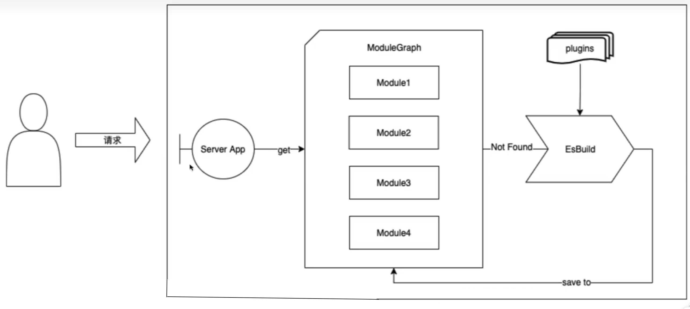

# 基础知识

## vite 的出现

在浏览器支持 ES 模块之前，JavaScript 并没有提供原生机制让开发者以模块化的方式进行开发。

webpack、Rollup 和 Parcel 等工具的出现，极大地改善了前端开发者的开发体验。

但开始构建越来越大的大型应用时，需要处理的 JavaScript 代码量也呈指数级增长。基于 JavaScript 开发的工具就会开始遇到性能瓶颈：通常需要很长时间才能启动开发服务器。

vite 旨在利用生态系统中的新进展解决上述问题：浏览器开始原生支持 ES 模块，且越来越多 JavaScript 工具使用编译型语言编写。

### 浏览器原生支持 ES 模块

#### 背景

传统打包工具需要在开发阶段进行繁重的打包工作，因为早期浏览器不支持模块化 JavaScript。

开发者需要将所有模块预先打包成一个或多个 bundle 文件，以便在浏览器中运行。

#### Vite 的做法

由于现代浏览器支持 ES 模块，Vite 可以利用这一特性，在开发时通过浏览器原生支持的模块加载机制进行代码模块化管理。

在开发模式下，Vite 不再需要预先打包所有代码，而是按需加载，极大地加快了启动速度和文件的热更新（HMR，Hot Module Replacement）。

### 越来越多的 JavaScript 工具使用编译型语言编写

#### 背景

传统的 JavaScript 构建工具（如 Webpack）多是用 JavaScript 或 Node.js 编写。

JavaScript 是解释型语言，虽然灵活，但在某些场景下性能不如编译型语言。

#### Vite 的做法

Vite 使用了编译型语言编写的工具来提升性能。例如，Vite 的开发服务器使用了 esbuild，一个用 Go 语言编写的超快速打包工具。

编译型语言（如 Rust、Go）通常提供更高的性能，特别是在处理大量文件和复杂的编译任务时。

### 其他打包工具的现状

#### 传统工具（如 Webpack、Parcel、Rollup）特性

这些工具大多用 JavaScript 编写，且在性能上可能不如用编译型语言编写的工具高效。

然而，这些工具也在不断演进中，逐渐引入多线程处理、缓存优化、热更新等特性来提高构建速度和开发体验。

#### Vite 的优势

**快速启动：**利用浏览器对 ES 模块的支持，实现快速启动和即时更新。

**轻量化开发：**无需预先打包所有代码，按需加载模块。

**高性能：**通过使用更高效的底层工具（如 esbuild）加快编译速度。

### vite 的缓慢的服务器启动

当冷启动开发服务器时，基于打包器的方式启动必须优先抓取并构建整个应用，然后才能提供服务。

Vite 通过在一开始将应用中的模块区分为`依赖`和`源码`两类，改进了开发服务器启动时间。

- `依赖`：大多是在开发时不会变动的纯 JavaScript。

> 一些较大的依赖处理的代价也很高。
>
> 依赖也通常会存在多种模块化格式，如 ESM 或 CommonJS

Vite 会使用 esbuild 预构建依赖。esbuild 使用 GO 编写，并且比以 JavaScript 编写的打包器预构建依赖快 10~100 倍

> 预构建可以提高页面加载速度（将 ESM 模块构建为许多的安单独的文件，彼此导入），并将 CommonJS/UMD 转换为 ESM 格式

- `源码`：通常包括一些并非直接是 JavaScript 的文件，需要转换（如 JSX, CSS 或者 vue/svelte 组件），时常会被编辑。同时，并不是所有的源码都需要同时被加载

vite 以原生 ESM 方式提供源码。实际上是让浏览器接管了打包程序的部分工作：vite 只需要在浏览器请求源码时进行转换并按需提供源码。根据情景动态导入代码，即只在当前屏幕上实际使用时才会被处理。
