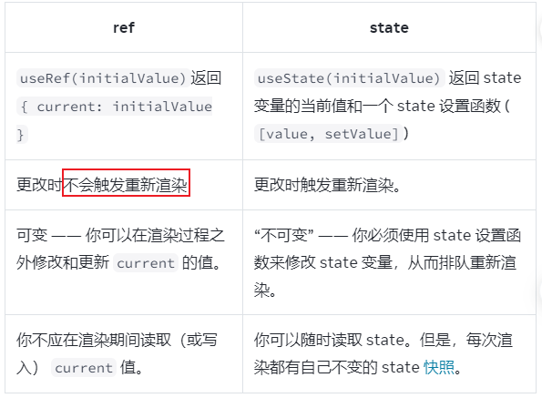

# 官方文档

## 声明式 UI 与命令式 UI

UI 交互时，要思考 UI 如何根据用户的操作而响应变化。

命令式编程中，直接告诉如何实现交互，根据要发生的事情写一些明确的命令去操作 UI。

对于独立系统来说，命令式地控制用户界面的效果也不错，但当处于更加复杂的系统中时，会造成管理的困难程度指数级地增长。

React 正是为了解决这样的问题而诞生的，react 中，不必直接去操作 UI，只需要声明想要显示的内容，react 就会通过计算得出该如何去更新 UI

## ref 和 state 的不同之处

如果需要存储一些值，但不影响渲染逻辑，可以选择 ref

## 生命周期

react 组件：

1、被添加到屏幕上，组件的 `挂载`

2、组件接收到新的 props 或 state 时，通常是作为对交互的响应，会进行组件的`更新`

3、组件从屏幕上移除时，会进行组件的`卸载`

Effect：

每个 Effect 描述了一个独立的同步过程，可以`开始`和`停止`
