# 知识记录

## Flux 架构：单向数据流

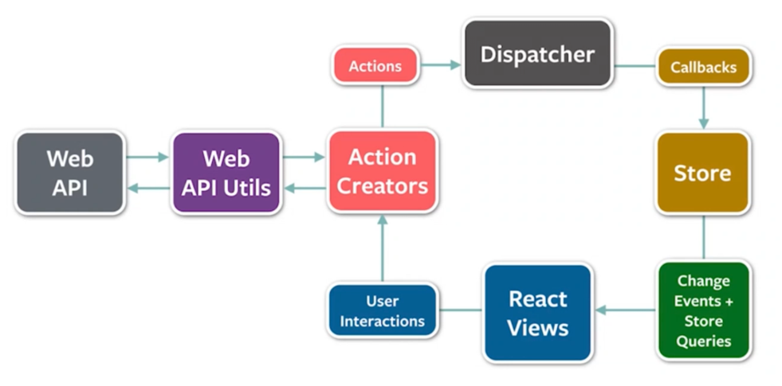

衍生项目：Redux、Mobx

## React 组件

props + state -> view

外部传的属性加内部维护的状态决定 view

单向数据绑定

创建组件遵循的原则：

1、何时创建 -> 单一职责原则：每个组件只做一件事；如果组件变得复杂，应该拆分成小组件；

2、数据状态管理 -> DRY 原则：能计算得到的状态不要单独存储；组件尽量无状态，所需数据通过 props 获取；

## JSX

在 JavaScript 代码中直接写 HTML 标记

本质：动态创建组件的语法糖

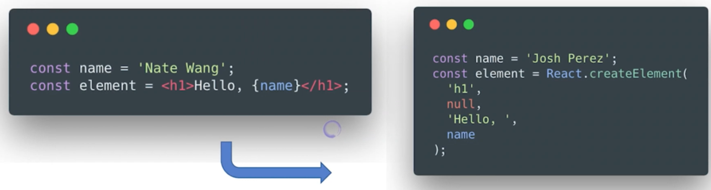

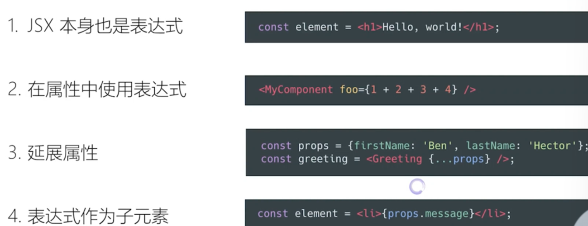

优点：
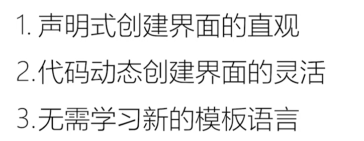

约定：自定义组件以大写字母开头

## 生命周期

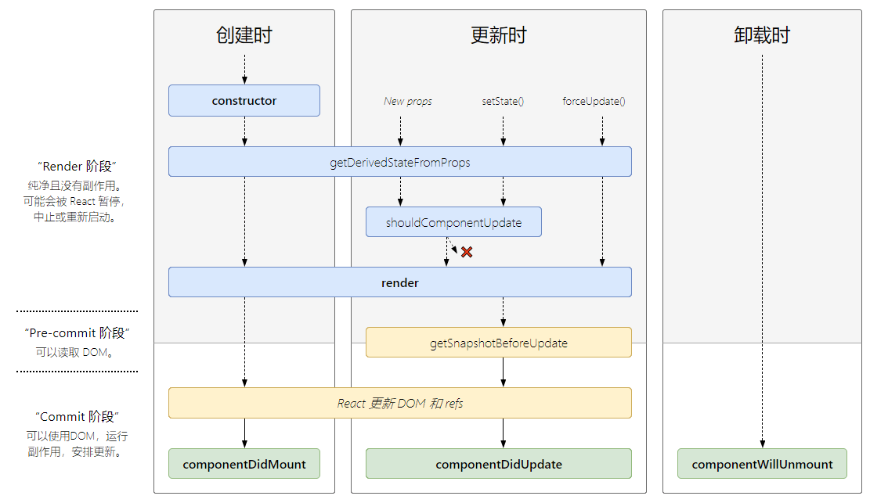

### constructor

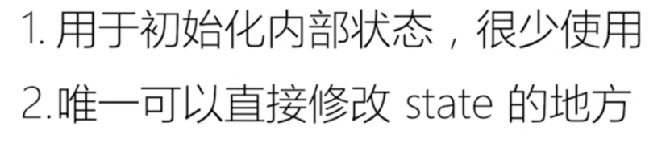

### getDerivedStateFromProps

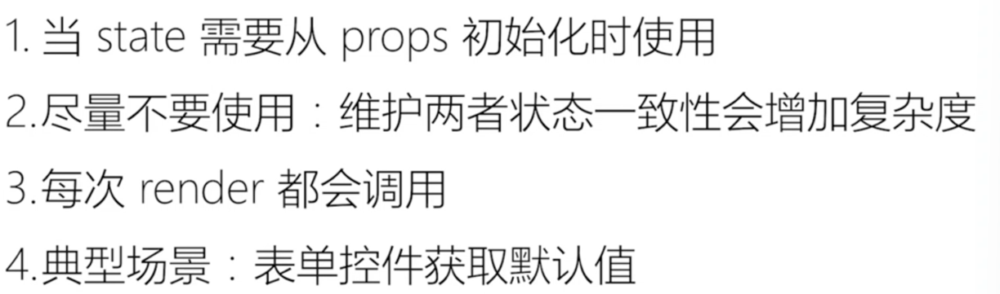

### componentDidMount

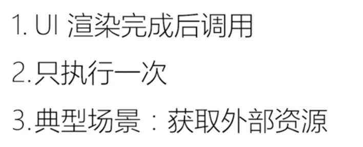

### componentWillUnmount1

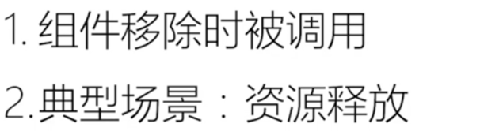

### getSnapshotBeforeUpdate

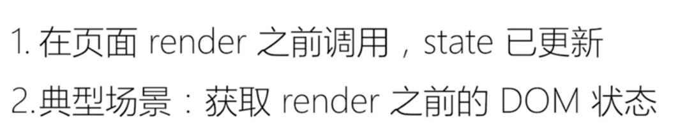

### componentDidUpdate

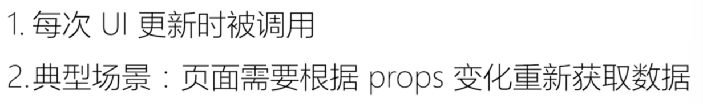

### shouldComponentUpdate

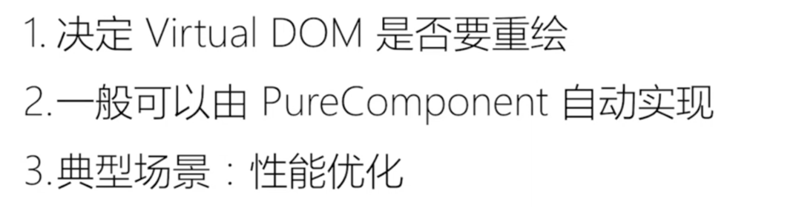

## Virtual DOM 及 key 属性

虚拟 DOM 的两个假设：
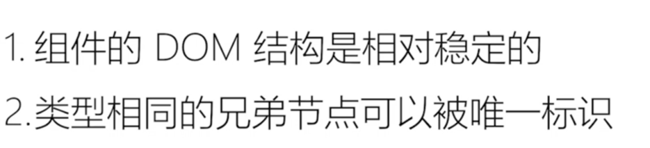

## 组件设计模式

组件复用的另外两种形式：高阶组件和函数作为子组件
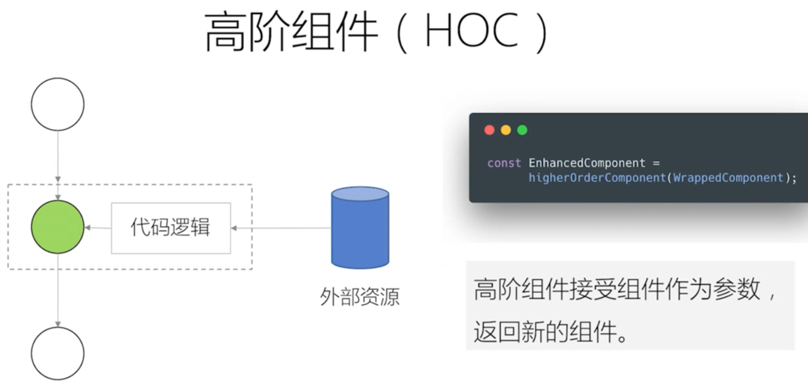

## 新的 Context API 及使用场景

16.3 新特性

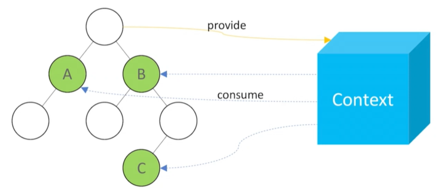

## 使用脚手架工具创建 React 应用

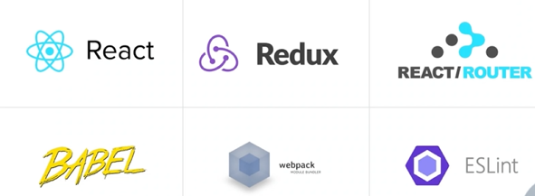
脚手架工具：预先定义好一个项目需要什么依赖

### Creat React App

最简策略
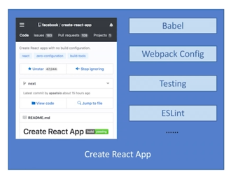

### Codesandbox

线上环境
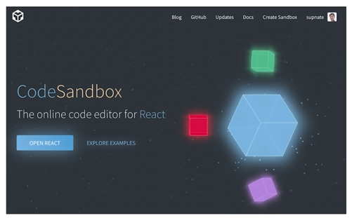

### Rekit

整合了更多最佳实践
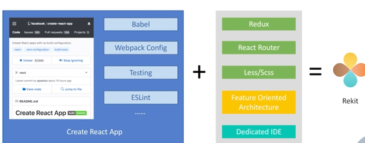

## 打包和部署

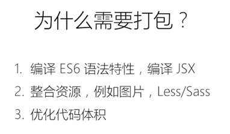

webpack

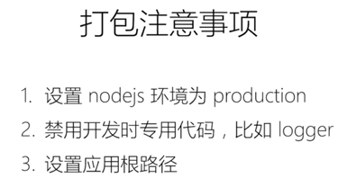

## Redux

状态管理框架

Redux 让组件通信更加容易

特性：

- single source of truth
  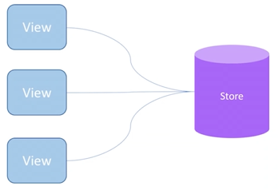

- 可预测性
  

- 纯函数更新 store
  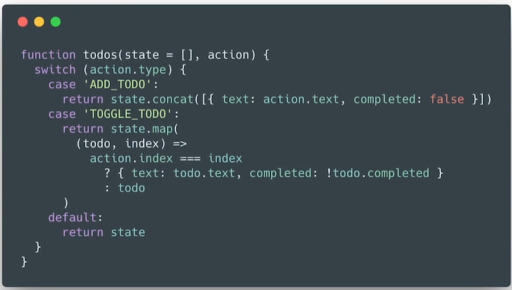

### store、action、reducer

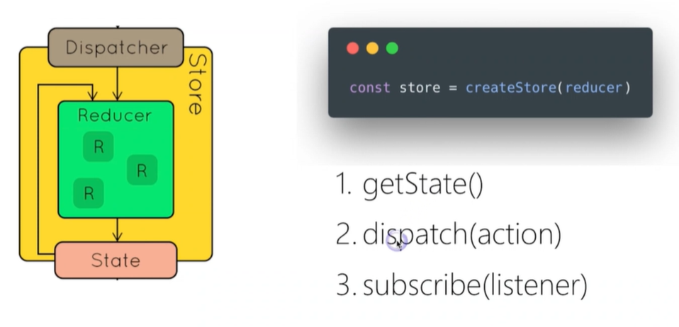
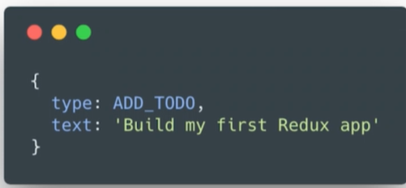
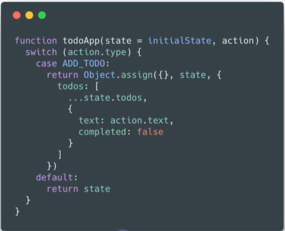

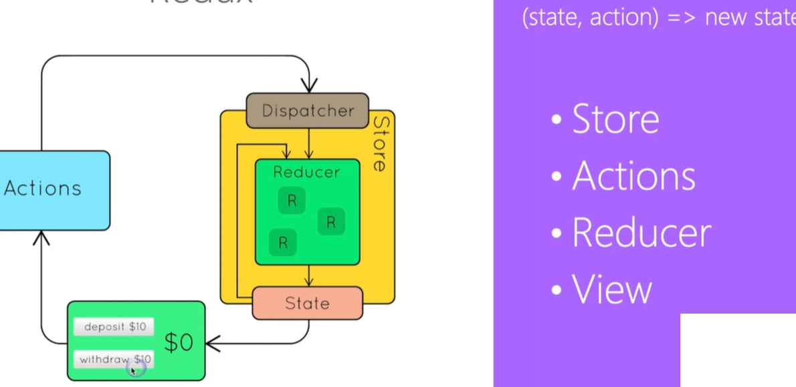
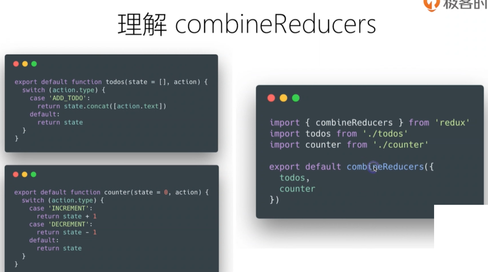
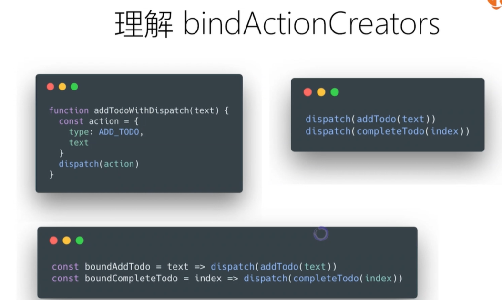
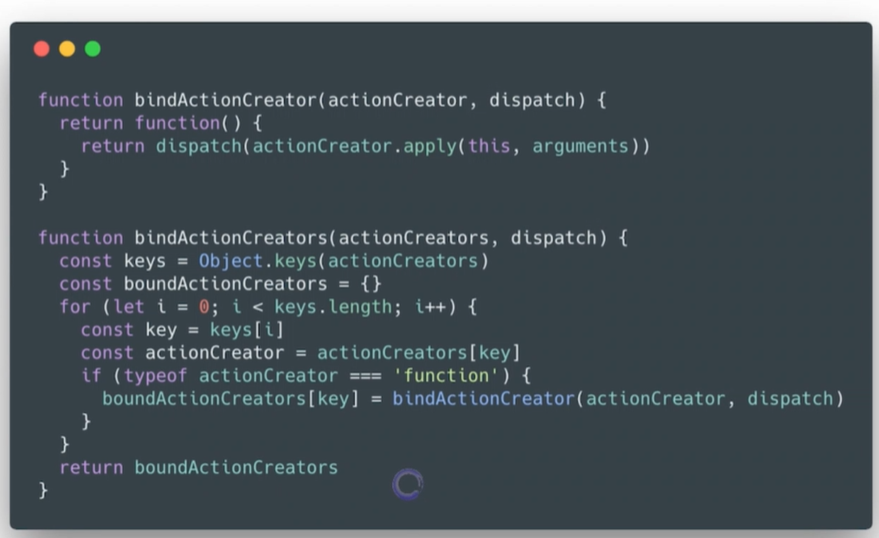

### react 中使用 redux

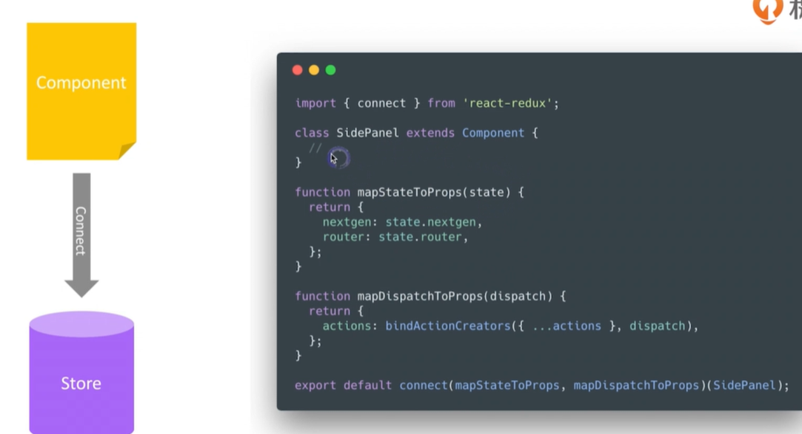
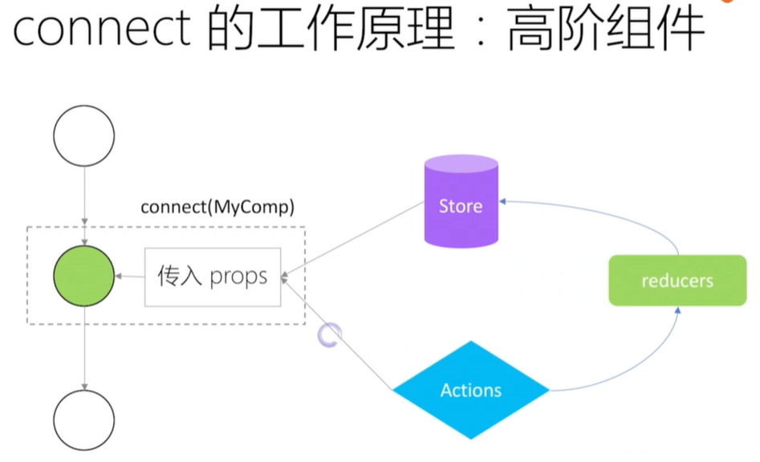

## 单元测试

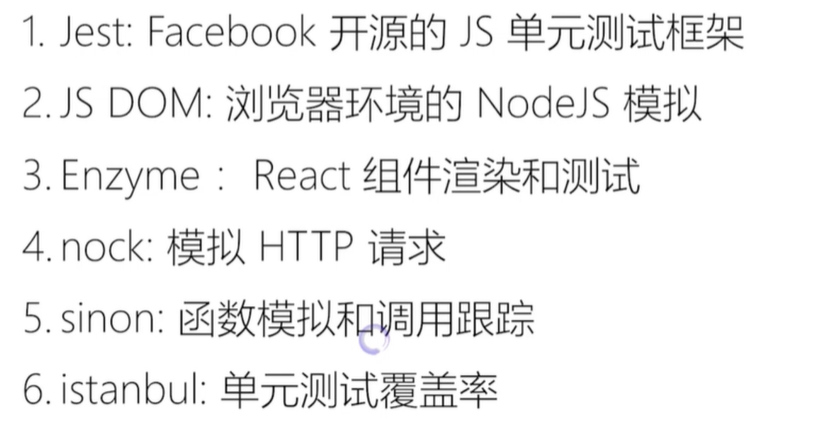

## 调试工具

### ESLint

1、使用.eslintrc 进行规则的配置

2、使用 airbnb 的 JavaScript 代码风格

### Prettier

1、代码格式化的神器

2、保证更容易写出风格一致的代码

.prettierrc 文件里面

### React DevTool

可以帮助观察 react 结构

### Redux DevTool

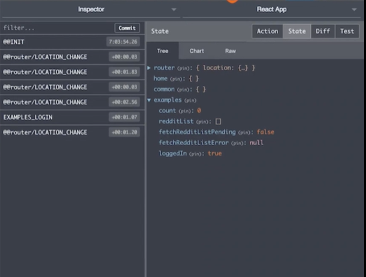
