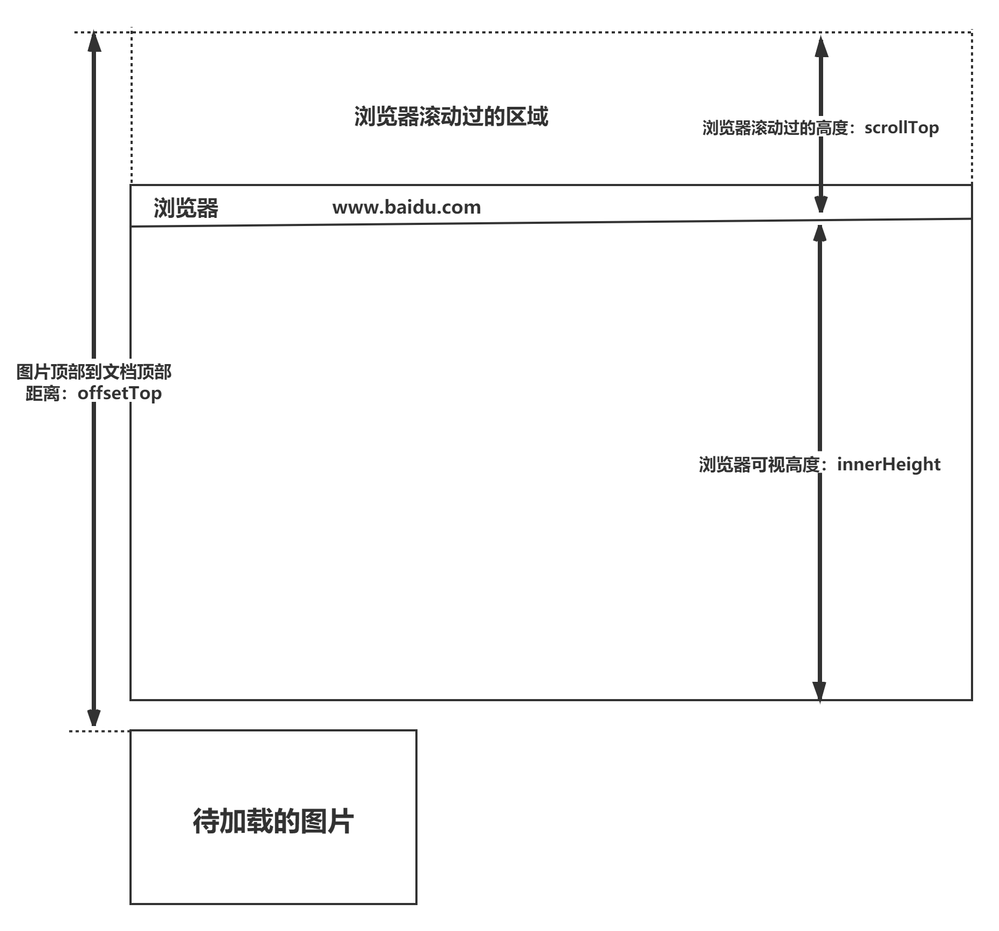

# 优化

## 懒加载和预加载

懒加载也叫做延迟加载、`按需加载`，指的是长网页中延迟加载图片数据。懒加载适用于图片较多，页面较长的页面场景中。

预加载指的是将所需的资源`提前请求`加载到本地，这样后面在需要用到时就直接从缓存取资源。通过预加载能够减少用户的等待时间，提高用户的体验。

## 路由懒加载

路由懒加载就是只加载点击的那个模块，按需加载路由对应的资源

原理：利用了 ES6 的 import()函数动态地加载模块。将路由相关的组件，不再直接导入，而是改写成异步组件的写法，只有当函数被调用的时候，才去加载对应的组件内容。

这样可以避免在初次加载应用时加载过多的组件代码，从而提高应用的性能和体验。

```js
import VueRouter from 'vue-router'

Vue.use(VueRouter)
const router = new VueRouter({
 routes: [
    { path: '/login', component: () => import('@/views/login/index.vue') },
    { path: '/home',  component: () => import('@/views/home/home.vue') }
  ]

export default router
```

import()函数：一般来说，当在代码中使用 import()函数时，打包攻击会将对应的模块代码单独分割出来，并生成一个独立的 chunk(代码块)文件。这些 chunk 可以是 JS, CSS 或者其他资源类型，根据具体的配置和需求进行优化。

当页面加载时，只会加载当前页面所需的主 chunk 文件，而其他 chunk 文件则会在需要时在进行异步加载。

当 import()函数被调用时，相应的 chunk 文件会被下载并解析，从而完成加载模块的过程

实现：路由懒加载一般是由前端框架或其他库来实现的，打包工具会根据配置来生成对应的 chunk 文件，因此，路由懒加载既涉及前端框架或库的使用，也与打包工具和优化密切相关。

## 图片懒加载

对于图片量比较大的首页，用户打开页面后，只需要呈现出屏幕可视区域内的图片，当用户滑动页面时，再去加载出现在屏幕内的图片，以优化图片的加载效果

### 实现原理

图片的加载是由 src 引起的，当对 src 赋值时，浏览器就会请求图片资源。

由于浏览器会自动对页面中的 img 标签的 src 属性发送请求并下载图片，可以通过 html5 自定义属性 data-xxx 先暂存 src 的值，然后在图片出现在屏幕可视区域的时候，再将 data-xxx 的值重新赋值到 img 的 src 属性即可

懒加载的实现重点在于确定用户需要加载哪张图片，在浏览器中，可视区域的资源就是用户需要的资源。

所以当图片出现在可视区域时，获取图片的真实地址并赋值给图片即可



### 实现 1：浏览器原生支持

element 的 loading="lazy"属性

```js


```

loading 属性可用于 iframe 标签和 img 标签；

- `eager` 默认值：当 loading 属性的默认值为 eager，即立即请求资源，即当你不设置 loading='lazy'时，或者 loading="无效值"时，均代表立即请求当前资源；

- `lazy`：代表将延迟加载当前 element，但如果页面禁止了 JavaScript 的运行，则也不会生效，这是浏览器的一种反追踪措施；

### 实现 2：监听图片元素是否可见（IntersectionObserver API）

`IntersectionObserver API`，可以自动"观察"元素是否可见。由于可见（visible）的本质是，目标元素与视口产生一个交叉区，所以这个 API 叫做 `交叉观察器`。

`IntersectionObserver`在懒加载、虚拟滚动、曝光统计、上拉刷新等场景中，均能提供高效的解决方案。因为传统的观察元素是否可见方案，都离不开`Element.getBoundingClientRect`等 DOM 方法，而这些方法均运行在浏览器主线程，一旦方案设计有缺陷，去频繁的触发调用，便会造成一定的性能问题。

```html


<script type="text/javascript">
  const config = {
    rootMargin: "0px 0px 50px 0px",

    threshold: 0,
  };

  const preloadImage = (imagEl) => {
    if (imagEl.getAttribute("src") !== imagEl.getAttribute("data-src")) {
      imagEl.src = imagEl.getAttribute("data-src");
    }
  };

  let observer = new intersectionObserver(function (entries, self) {
    entries.forEach((entry) => {
      if (entry.isIntersecting) {
        // 将 data-src 改到 src
        preloadImage(entry.target);
        //　停止对它监听
        self.unobserve(entry.target);
      }
    });
  }, config);

  const imgs = document.querySelectorAll("[data-src]");

  imgs.forEach((img) => {
    observer.observe(img);
  });
</script>
```

### 实现 3：监听 scroll 事件

```html
<body>
  <style>
    img {
      display: block;
      margin-bottom: 50px;
      height: 200px;
    }
  </style>

  
  
  
  
  
  
  
  
  
  
  
  

  <script>
    function throttle(fn, delay, atleast) {
      var timeout = null;
      var startTime = new Date();
      return function () {
        var curTime = new Date();
        clearTimeout(timeout);
        if (curTime - startTime >= atleast) {
          fn();
          startTime = curTime;
        } else {
          timeout = setTimeout(fn, delay);
        }
      };
    }

    function lazyload() {
      var images = document.querySelectorAll("[data-src]");
      var len = images.length;
      var n = 0; //存储图片加载到的位置，避免每次都从第一张图片开始遍历
      return function () {
        var seeHeight = document.documentElement.clientHeight;
        var scrollTop =
          document.documentElement.scrollTop || document.body.scrollTop;
        for (var i = n; i < len; i++) {
          if (images[i].offsetTop < seeHeight + scrollTop) {
            if (
              images[i].getAttribute("src") !==
              images[i].getAttribute("data-src")
            ) {
              images[i].src = images[i].getAttribute("data-src");
            }
            n = n + 1;
          }
        }
      };
    }
    var loadImages = lazyload();
    loadImages(); //初始化首页的页面图片
    // window.addEventListener('scroll', loadImages, false); //会被高频触发，这非常影响浏览器的性能

    window.addEventListener("scroll", throttle(loadImages, 500, 1000), false); //设置500ms 的延迟，和 1000ms 的间隔　避免高频防抖
  </script>
</body>
```

## 参考

[https://blog.csdn.net/qq_42033567/article/details/113757978](https://blog.csdn.net/qq_42033567/article/details/113757978)

[https://www.csayc.com/article/image-lazy-load](https://www.csayc.com/article/image-lazy-load)
