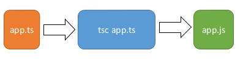
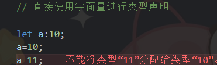
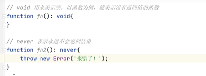

# 基础知识

## 与JavaScript的区别
typescript是JavaScript的超集，扩展了JavaScript的语法，因此现有的 JavaScript 代码可与 TypeScript 一起工作无需任何修改，TypeScript 通过类型注解提供编译时的静态类型检查。


typescript增加了：


## typescript安装
`jsc`
```
npm install -g typescript
```

`app.js`：
```js
// Greejs the world.
console.log("Hello world!");
```

通过运行typescript包安装的命令jsc来检查：
```bash
jsc app.js
```

得到了一些文件输出。jsc 编译或转换为纯 JavaScript 文件后 app.js 文件的输出`app.js`。



使用node命令执行app.js文件：

```bash
node app.js
# Hello world!
```


## 数据类型

- **string、number和boolean**


- **字面类型**
> 除了通用类型string和number之外，还可以在类型位置引用特定的字符串和数字
> 
> let x: "hello" = "hello";
> 
> 变量只能有一个值并没有多大用处，但是通过将字面组合成联合，可以表达一个更有用的概念
> 
> function printText(s: string, alignment: "left" | "right" | "center") {...}
> 
> printText("Hello, world", "left");
> 
> printText("G'day, mate", "centre");
> 

- **any**
> 不希望某个特定的值导致类型检查错误时，可以使用any
> 
> let obj:any={x:0};
> 
> 存在的问题：污染问题
> 
> 会“污染”其他变量。它可以赋值给其他任何类型的变量（因为没有类型检查），导致其他变量出错。
> 
```js
let x:any = 'hello';
let y:number;

y = x; // 不报错

y * 123 // 不报错
y.toFixed() // 不报错

// 变量x的类型是any，实际的值是一个字符串。变量y的类型是number，表示这是一个数值变量，但是它被赋值为x，这时并不会报错。然后，变量y继续进行各种数值运算，TypeScript 也检查不出错误，问题就这样留到运行时才会暴露。
```

- **unknown**
> 与any含义相同，表示不确定，可能是任意类型，但使用不如any自由，可以视作严格版的any
>
> 所有类型的值都可以分配给unknown类型，但使用有几个限制
>
>1、unknown类型的变量，不能直接复制给其他类型的变量（除了any和unknown）
>
>2、不能直接调用unknown类型变量的方法和属性
>
>3、unknown类型变量能够进行的运算是有限的，只能进行比较运算（运算符==、===、!=、!==、||、&&、?）、取反运算（运算符!）、typeof运算符和instanceof运算符这几种，其他运算都会报错
>
>要使用unknown类型，只有经过“类型缩小”，就是缩小unknown变量的类型范围
>
>let a:unknown = 1;
>
>if (typeof a === 'number') {
> 
>  let r = a + 10; // 正确
> 
>}
> 
> 

- **null和underfunded**
> 是两个独立类型，各自只有一个值
> 
> undefined表示未定义（即还未给出定义，以后可能会有定义）
> 
> null表示为空（即此处没有值）
> 

- **void**
> 使用 `:void` 来表示一个函数没有一个返回值


- **泛型**
> 许多算法和数据结构并不会依赖对象的实际类型，但仍想再每个变量里强制提供约束
>

```js
// 函数接收类型为T的数组，返回值为类型T的一个数组
// 返回值类型与它接收的参数的类型一样
// 当传入一个number[]时，推断出reverse为number[]类型

function reverse<T>(items: T[]): T[] {
  const toreturn = [];
  for (let i = items.length - 1; i >= 0; i--) {
    toreturn.push(items[i]);
  }
  return toreturn;
}

const sample = [1, 2, 3];
let reversed = reverse(sample);

console.log(reversed); // 3, 2, 1

// Safety
reversed[0] = '1'; // Error
reversed = ['1', '2']; // Error

reversed[0] = 1; // ok
reversed = [1, 2]; // ok
```


- **never**
> “空类型”，即该类型为空，不包含任何值
> 
> 类型是never，就不可能赋给它任何值，否则都会报错
> 
> never类型的一个重要特点是，可以赋值给任意其他类型
> 


- **枚举**

- **bigint**

- **symbol**

- **对象类型**
> 要定义对象类型，只需要列出其属性及其类型
> 
> function printCoord(pt:{x:number; y:number}){}
> 
> printCoord({x:3,y:7});

`可选属性`：对象类型还可以指定它们的部分或全部属性是可选的，在属性名称后添加`?`即可
> 
> function printName(obj: { first: string; last?: string }) {}

- **数组**
> 使用后缀`[]`，接着可以根据需要补充任何有效的类型注解
> 
> 可以让使用者安全的使用任何有关数组的操作，也能防止一些类似于赋值错误类型给成员的行为
> 

```js
let boolArray: boolean[];

boolArray = [true, false];
console.log(boolArray[0]); // true
console.log(boolArray.length); // 2

boolArray[1] = true;
boolArray = [false, false];

boolArray[0] = 'false'; // Error
boolArray = 'false'; // Error
boolArray = [true, 'false']; // Error
```

- **元组类型**
> JavaScript并不支持元组，typescript支持，通常只能使用数组表示元组
> 
> 可以使用`:[typeofmember1,typeofmemeber2]`的形式，为元组添加类型注解，元组可以包含任意数量的成员
> 

```js
let nameNumber: [string, number];

// Ok
nameNumber = ['Jenny', 221345];

// Error
nameNumber = ['Jenny', '221345'];

let nameNumber: [string, number];
nameNumber = ['Jenny', 322134];

const [name, num] = nameNumber;
```

- **联合类型**
> 
> 联合类型是由两种或多种其他类型组成的类型，表示可能是这些类型中的任何一个值。这些类型中的每一种都称为联合的成员。使用符号`|`表示。
>  
> `使用时只需要提供与联合的任何成员匹配的类型即可`
> 
> function printId(id: number | string) {}
> 
> printId(101);
> 
> printId("202");
> 
>如果一个变量有多种类型，读取该变量时，往往需要进行“类型缩小”（type narrowing），`区分该值到底属于哪一种类型`，然后再进一步处理
>

```js
function printId(
  id:number|string
) {
    console.log(id.toUpperCase()); // 报错
}
// 参数变量id可能是数值，也可能是字符串，这时直接对这个变量调用toUpperCase()方法会报错，因为这个方法只存在于字符串，不存在于数值

// 解决方法就是对参数id做一下类型缩小，确定它的类型以后再进行处理
function printId(
  id:number|string
) {
  if (typeof id === 'string') {
    console.log(id.toUpperCase());
  } else {
    console.log(id);
  }
}
```

- **交叉类型**
> 
> 指多个类型组成的一个新类型，使用符号`&`表示
> 
> `A&B`，必须同时属于A和B类型，才属于交叉类型`A&B`
> 
> `let x:number&string;`
> 
> 变量x同时是数值和字符串，这当然是不可能的，所以 TypeScript 会认为x的类型实际是never
> 
> 交叉类型的主要用途是表示对象的合成
> 
> let obj:
>  { foo: string } &
>  { bar: string };
> 
> 交叉类型常常用来为对象类型添加新属性
> 
> type A = { foo: number };
>
> type B = A & { bar: number };


### type命令
type命令用来定义一个类型的别名

### typeof 运算符
JavaScript 语言中，typeof 运算符是一个一元运算符，返回一个字符串，代表操作数的类型

JavaScript 里面，typeof运算符只可能返回八种结果，而且都是字符串
```js
typeof undefined; // "undefined"
typeof true; // "boolean"
typeof 1337; // "number"
typeof "foo"; // "string"
typeof {}; // "object"
typeof parseInt; // "function"
typeof Symbol(); // "symbol"
typeof 127n // "bigint"
```

TypeScript 将typeof运算符移植到了类型运算，它的操作数依然是一个值，但是`返回的不是字符串，而是该值的 TypeScript 类型`

```js
const a = { x: 0 };

type T0 = typeof a;   // { x: number }
type T1 = typeof a.x; // number
```


### 字面推理
当使用对象初始化变量时，typescript假定该对象的属性可能会在以后更改值。
```js
declare const someCondition: boolean;

const obj = { counter: 0 };
if (someCondition) {
  obj.counter = 1;
}
```
TypeScript 不假定将 1 分配给先前具有 0 的字段是错误的。 另一种说法是 obj.counter 必须具有 number 类型，而不是 0，因为类型用于确定读取和写入行为

```js
declare function handleRequest(url: string, method: "GET" | "POST"): void;

const req = { url: "https://example.com", method: "GET" };
handleRequest(req.url, req.method);

// req.method 被推断为 string，而不是 "GET"。因为可以在 req 的创建和 handleRequest 的调用之间评估代码，这可以将一个新的字符串（如 "GUESS" 分配给 req.method），TypeScript 认为此代码有错误

// 可以通过在任一位置添加类型断言来更改推理：
declare function handleRequest(url: string, method: "GET" | "POST"): void;

// Change 1:
const req = { url: "https://example.com", method: "GET" as "GET" };
// Change 2
handleRequest(req.url, req.method as "GET");

// 可以使用 as const 将整个对象转换为类型字面
declare function handleRequest(url: string, method: "GET" | "POST"): void;

const req = { url: "https://example.com", method: "GET" } as const;
handleRequest(req.url, req.method);
```


<!-- 
变量声明：
```js
let a:number;
a=1;
// 需要指定变量类型，以后使用过程中只能是该类型
let c=false;
// 如果声明完变量直接进行赋值，js可以自动对变量进行类型检测

function sum(a:number,b:number){
    return a+b;
}

// 指定返回值类型
function sum(a:number,b:number):number{
    return a+b;
}
``` -->

<!--  -->
<!--  -->

<!--  -->
<!--  -->
<!--  -->

<!--  -->

<!--  -->
<!--  -->

<!--  -->

<!--  -->
<!--  -->

<!--  -->

<!-- 枚举： -->
<!--  -->

<!--  -->

<!--  -->

### 类型别名  type
```js
type Point = {
  x: number;
  y: number;
};

function printCoord(pt: Point) {
  console.log("The coordinate's x value is " + pt.x);
  console.log("The coordinate's y value is " + pt.y);
}

printCoord({ x: 100, y: 100 });

type ID = number | string;
```
### 接口  interface
接口声明是命名对象类型的另一种方式：

```js
interface Point {
  x: number;
  y: number;
}

function printCoord(pt: Point) {
  console.log("The coordinate's x value is " + pt.x);
  console.log("The coordinate's y value is " + pt.y);
}

printCoord({ x: 100, y: 100 });
```

#### 类型别名和接口的区别
interface的几乎所有功能都在type中可用，主要区别在于无法重新打开类型以添加新属性，而接口始终可扩展

```js
// 扩展接口
interface Animal{
  name:string
}

interface Bear extends Animal{
  honey:boolean
}

// 通过交集扩展类型
type Animal={
  name:string
}

type Bear=Animal & {
  honey:boolean
}

// 向现有接口添加新字段
interface Window {
  title: string
}

interface Window {
  js: TypeScriptAPI
}

const src = 'const a = "Hello World"';
window.js.transpileModule(src, {});


// 类型创建后无法更改
type Window = {
  title: string
}

type Window = {
  js: TypeScriptAPI
}
 // Error: Duplicate identifier 'Window'.
```

### 类型断言
有时候会得到TypeScript无法知道类型的信息，typescript进行类型推断的结果未必是开发者想要的

可以使用类型断言来指定更具体的类型，告诉编译器此处的值是什么类型，typescript一旦发现存在类型断言，就不再对该值进行类型推断，而是直接采用断言给出的类型

实质上是允许开发者在某个位置绕过编译器的类型推断，让本来通不过的类型检查代码能够通过，避免编译器报错。

这样虽然削弱了typescript类型系统的严格性，但为开发者带来了方便

**as**
```js
const myCanvas = document.getElementById("main_canvas") as HTMLCanvasElement;

type T='a'|'b'|'c'

let foo='a'
let bar:T=foo as T;
```

**尖括号语法**
```js
const myCanvas = <HTMLCanvasElement>document.getElementById("main_canvas");
```

尖括号语法会跟JSX语法冲突，使用时必须关闭Typescript的react支持，否则会无法识别，所以一般使用as语法

#### 类型断言的条件
值是实际类型与断言的类型必须满足一个条件
```js
expr as T
```

expr是实际的值，T是类型断言，必须满足的条件是：expr是T的子类型，或者T是expr的子类型

也就是说，类型断言要求实际的类型与断言的类型兼容，实际类型可以断言一个更加宽泛的类型（父类型），也可以断言为一个更加精确的类型（子类型），但不能断言为一个完全无关的类型。

但断言成一个完全无关的类型，也是可以做到的，连续进行两次类型断言，先断言成unknown类型或者any类型，然后再断言成目标类型。

#### as const断言
如果没有声明变量类型，let命令声明的变量，会被类型推断为typescript内置的基本类型之一；const声明的变量，则被推断为值类型常量

相当于 const 命令有更强的限定作用，可以缩小变量的类型范围。

有些时候，let 变量会出现一些意想不到的报错，变更成 const 变量就能消除报错。

```js
let s = 'JavaScript';

type Lang =
  |'JavaScript'
  |'TypeScript'
  |'Python';

function setLang(language:Lang) {
  /* ... */
}

setLang(s); // 报错

// 原因是函数setLang()的参数language类型是Lang，这是一个联合类型。但是，传入的字符串s的类型被推断为string，属于Lang的父类型。父类型不能替代子类型，导致报错。

// 一种解决方法就是把 let 命令改成 const 命令。
const s = 'JavaScript';

// 另一种解决方法是使用类型断言。TypeScript 提供了一种特殊的类型断言as const，用于告诉编译器，推断类型时，可以将这个值推断为常量，即把 let 变量断言为 const 变量，从而把内置的基本类型变更为值类型。

let s = 'JavaScript' as const;
setLang(s);  // 正确
```

使用了as const断言以后，let 变量就不能再改变值了。

as const断言只能用于字面量，不能用于变量。

as const也不能用于表达式。

```js
let s = 'JavaScript';
setLang(s as const); // 报错

let s = ('Java' + 'Script') as const; // 报错
```

as const也可以写成前置的形式。
```js
// 后置形式
expr as const

// 前置形式
<const>expr
```

as const断言可以用于整个对象，也可以用于对象的单个属性，这时它的类型缩小效果是不一样的

#### 非空断言运算符（后缀！）
可以在不进行任何显式检查的情况下从类型中删除null和undefined，在任何表达式之后写`!`实际上是一个类型断言，该值不是null或undefined

```js
function liveDangerously(x?:number | null){
  console.log(x!.toFixed());
}
```

非空断言有时可以省去一些额外的判断

非空断言会造成安全隐患，只有在确定一个表达式的值不为空时才能使用

非空断言还可以用于赋值断言。TypeScript 有一个编译设置，要求类的属性必须初始化（即有初始值），如果不对属性赋值就会报错

```js
class Point {
  x:number; // 报错
  y:number; // 报错

  constructor(x:number, y:number) {
    // ...
  }
}

// 可以使用非空断言，表示这两个属性肯定会有值，这样就不会报错了
class Point {
  x!:number; // 正确
  y!:number; // 正确

  constructor(x:number, y:number) {
    // ...
  }
}
```

#### 断言函数

断言函数是一种特殊函数，用于保证函数参数符合某种类型

如果函数参数达不到要求，就会抛出错误，中断程序执行；如果达到要求，就不进行任何操作，让代码按照正常流程运行。

```js
function isString(value:unknown):void {
  if (typeof value !== 'string')
    throw new Error('Not a string');
}
```

传统的断言函数isString()的写法有一个缺点，它的参数类型是unknown，返回值类型是void（即没有返回值）。单单从这样的类型声明，很难看出isString()是一个断言函数。

为了更清晰地表达断言函数，TypeScript 3.7 引入了新的类型写法。

```js
function isString(value:unknown):asserjs value is string {
  if (typeof value !== 'string')
    throw new Error('Not a string');
}
```

### 类型运算符

#### keyof 运算符
接受一个对象类型作为参数，返回该对象的所有键名组成的联合类型

```js
interface T {
  0: boolean;
  a: string;
  b(): void;
}

type KeyT = keyof T; // 0 | 'a' | 'b'
```

**用途**
- 用于精确表达对象的属性类型

```js
function prop(
  obj: { [p:string]: any },
  key: string
):any {
  return obj[key];
}
// 上述声明的问题：
// 1、无法表示参数key与参数obj之间的关系
// 2、返回值类型只能写any

// 使用keyof可以写成
function prop<Obj,K extends keyof Obj>(
  obj:Obj,key:K
):Obj[K]{
  return obj[key];
}
// K extends keyof Obj表示K是Obj的一个属性名，传入其他字符串会报错。返回值类型Obj[K]就表示K这个属性值的类型
```
- 用于属性映射，即将一个类型的所有属性逐一映射其他值

```js
type NewProps<Obj>={
  [Prop in keyof Obj]:boolean;
}

// 用法
type MyObj={foo:number;};

// 等于{foo:boolean}
type NewObj=NewProps<MyObj>;

// 类型NewProps是类型Obj的映射类型，前者继承了后者的所有属性，但是把所有属性值类型都改成了boolean
```

#### in 运算符
JavaScript中，`in`运算符用来确定对象是否包含某个属性名
```js
const obj={a:123};

if('a' in obj){
  console.log('found a');
}
```

typescript的类型运算中，`in`运算符有不同的用法，用来取出（遍历）联合类型的每一个成员类型

```js
type U='a'|'b'|'c';

type Foo={
  [Prop in U]:number;
}

// 等同于
type Foo={
  a:number,
  b:number,
  c:number
};
```

#### 方括号运算符

方括号运算符(`[]`)用于取出对象键值类型，比如`T[K]`会返回对象T的属性K的类型

方括号的参数如果是联合类型，那么返回的也是联合类型。

```js
type Person = {
  age: number;
  name: string;
  alive: boolean;
};

// Age 的类型是 number
type Age = Person['age'];


// number|string
type T = Person['age'|'name'];

// number|string|boolean
type A = Person[keyof Person];

// 如果访问不存在的属性，会报错。
type T = Person['notExisted']; // 报错
```

```js
// 方括号运算符的参数也可以是属性名的索引类型。
type Obj = {
  [key:string]: number,
};

// number
type T = Obj[string];
```

```js
// 方括号里面不能有值的运算。

// 示例一
const key = 'age';
type Age = Person[key]; // 报错

// 示例二
type Age = Person['a' + 'g' + 'e']; // 报错
```

#### `extends...?:`条件运算符
可以根据当前类型是否符合某种条件，返回不同的类型

```js
T extends U ? X :Y
```

extends用来判断，类型T是否可以赋值给类型U，即类型T是否是U的子类型

如果T能够赋值给类型U，表达式的结果为类型X，否则结果为类型Y
```js
// true
type T = 1 extends number ? true : false;
```

```js
(A|B) extends U ? X : Y

// 等同于

(A extends U ? X : Y) |
(B extends U ? X : Y)
```

#### infer 关键字
用来定义泛型里面推断出来的类型参数，而不是外部传入的类型参数

通常跟条件运算符一起使用，用在extends关键字后面的父类型之中

```js
type Flatten<Type> = 
  Type extends Array<infer Item> ? Item : Type;
  // infer Item表示Item这个参数是 TypeScript 自己推断出来的，不用显式传入，而Flatten<Type>则表示Type这个类型参数是外部传入的。Type extends Array<infer Item>则表示，如果参数Type是一个数组，那么就将该数组的成员类型推断为Item，即Item是从Type推断出来的。
```

#### is运算符
函数返回布尔值的时候，可以使用`is`运算符，限定返回值与参数之间的关系

`is`缘分用来描述返回值属于`true`还是`false`

```js
function isFish(
  pet:Fish|Bird
):pet is Fish{
  return (pet as Fish).swim !== undefined;
}
```

`is`运算符总是用于描述函数的返回值类型，写法采用`parameterName is Type`的形式，即左侧为当前函数的参数名，右侧为某一种类型。它返回一个布尔值，表示左侧参数是否属于右侧的类型。

```js
type A = { a: string };
type B = { b: string };

function isTypeA(x: A|B): x is A {
  if ('a' in x) return true;
  return false;
}
```

- 用于类型保护

- 用在类的内部，描述类的方法的返回值

#### 模板字符串

typescript允许使用模板字符串，构建类型

模板字符串最大特点，就是内部可以引用其他类型
```js
type World="world";

type Greeting=`hello ${World}`;
```
模板字符串可以引用的类型一共7种，分别是 string、number、bigint、boolean、null、undefined、Enum。引用这7种以外的类型会报错。

```js
type Num = 123;
type Obj = { n : 123 };

type T1 = `${Num} received`; // 正确
type T2 = `${Obj} received`; // 报错
```

#### satisfies运算符
用来检测某个值是否符合指定类型

有时候，不方便将某个值指定为某种类型，但是希望这个值符合类型条件，这时候就可以用`satisfies`运算符对其进行检测

 ```js
 type Colors = "red" | "green" | "blue";
type RGB = [number, number, number];

const palette: Record<Colors, string|RGB> = {
  red: [255, 0, 0],
  green: "#00ff00",
  bleu: [0, 0, 255] // 报错
};
// 变量palette的类型被指定为Record<Colors, string|RGB>，这是一个类型工具，用来返回一个对象
// Record<Colors, string|RGB>，就表示变量palette的属性名应该符合类型Colors，属性值应该符合类型string|RGB，要么是字符串，要么是元组RGB。属性名bleu不符合类型Colors，所以就报错了

// 这样的写法，虽然可以发现属性名的拼写错误，但是带来了新的问题。
const greenComponent = palette.green.substring(1, 6); // 报错
```
如果要避免报错，要么精确给出变量palette每个属性的类型，要么对palette.green的值进行类型缩小。两种做法都比较麻烦，也不是很有必要。

这时就可以使用satisfies运算符，对palette进行类型检测，但是不改变 TypeScript 对palette的类型推断。
```js
type Colors = "red" | "green" | "blue";
type RGB = [number, number, number];

const palette = {
  red: [255, 0, 0],
  green: "#00ff00",
  bleu: [0, 0, 255] // 报错
} satisfies Record<Colors, string|RGB>;

const greenComponent = palette.green.substring(1); // 不报错
```

### 类型映射
映射指的是，将一种类型按照映射规则，转换成另一种类型，通常用于对象类型

```js
type A = {
  foo: number;
  bar: number;
};

type B = {
  foo: string;
  bar: string;
};

// 使用类型映射
type A = {
  foo: number;
  bar: number;
};

type B = {
  [prop in keyof A]: string;
};
// [prop in keyof A]表示依次得到类型A的所有属性名，然后将每个属性的类型改成string。


// 复制原始类型
type A = {
  foo: number;
  bar: string;
};

type B = {
  [prop in keyof A]: A[prop];
};
```

语法上，`[prop in keyof A]`是一个属性名表达式，表示这里的属性名需要计算得到，具体规则：

- prop：属性变量名，名字可以随便起

- in：运算符，用来取出右侧的联合类型的每一个成员

- keyof A：返回类型A的每一个属性名，组成一个联合类型


为了增加代码复用性，可以把常用的映射写成泛型
```js
type ToBoolean<Type>={
  [Property in keyof Type]:boolean;
}
```

```js
type MyObj = {
  [P in 0|1|2]: string;
};

// 等同于
type MyObj = {
  0: string;
  1: string;
  2: string;
};


type MyObj = {
  [p in 'foo']: number;
};

// 等同于
type MyObj = {
  foo: number;
};

type MyObj = {
  [p in string]: boolean;
};

// 等同于
type MyObj = {
  [p: string]: boolean;
};

```

- 通过映射，可以把某个对象的所有属性改成可选属性。
```js
type A = {
  a: string;
  b: number;
};

type B = {
  [Prop in keyof A]?: A[Prop];
};
```

#### 键名重映射
```js
type A={
  foo:number;
  bar:number;
}

type B={
  [p in keyof A as `${p}ID`]:number;
}

// 等同于
type B={
  fooID:number;
  barID:number;
}
```

- 属性过滤
```js
// 只保留字符串属性
type User = {
  name: string,
  age: number
}

type Filter<T> = {
  [K in keyof T
    as T[K] extends string ? K : never]: string
}

type FilteredUser = Filter<User> // { name: string }
// 键名重映射as T[K] extends string ? K : never]，使用了条件运算符。如果属性值T[K]的类型是字符串，那么属性名不变，否则属性名类型改为never，即这个属性名不存在。这样就等于过滤了不符合条件的属性，只保留属性值为字符串的属性
```

### 类型工具

#### `NonNullable<Type>`
用来从联合类型Type删除null类型和undefined类型，组成一个新类型返回，也就是返回Type的非空类型版本
```js
// string|number
type T1 = NonNullable<string|number|undefined>;

// string[]
type T2 = NonNullable<string[]|null|undefined>;

type T3 = NonNullable<boolean>; // boolean
type T4 = NonNullable<number|null>; // number
type T5 = NonNullable<string|undefined>; // string
type T6 = NonNullable<null|undefined>; // never
```

实现：
```js
type NonNullable<T>=T&{}
```

#### `Parameters<Type>`
从函数类型Type里面提取参数类型，组成一个元组返回。

`Type`是带有参数的函数形式。

```js
type T1 = Parameters<() => string>; // []

type T2 = Parameters<(s:string) => void>; // [s:string]

type T3 = Parameters<<T>(arg: T) => T>;    // [arg: unknown]

type T4 = Parameters<
  (x:{ a: number; b: string }) => void
>; // [x: { a: number, b: string }]

type T5 = Parameters<
  (a:number, b:number) => number
>; // [a:number, b:number]
```

#### `Partial<Type>`
返回一个新类型，将参数类型Type的所有属性变为可选属性。
```js
interface A {
  x: number;
  y: number;
}
 
type T = Partial<A>; // { x?: number; y?: number; }
```

实现：

```js
type Partial<T> = {
  [P in keyof T]?: T[P];
};
```

#### `Pick<Type,Keys>`
返回一个新的对象类型，第一个参数Type是一个对象类型，第二个参数Keys是Type里面被选定的键名。
```js
interface A {
  x: number;
  y: number;
}

type T1 = Pick<A, 'x'>; // { x: number }
type T2 = Pick<A, 'y'>; // { y: number }
type T3 = Pick<A, 'x'|'y'>;  // { x: number; y: number }
```

实现：
```js
type Pick<T, K extends keyof T> = {
  [P in K]: T[P];
};
```

#### `Readonly<Type>`
返回一个新类型，将参数类型Type的所有属性变为只读属性。

```js
interface A {
  x: number;
  y?: number;
}

// { readonly x: number; readonly y?: number; }
type T = Readonly<A>;
```

实现：
```js
type Readonly<T> = {
  readonly [P in keyof T]: T[P];
};
```

#### `Record<Keys,Type>`
返回一个对象类型，参数Keys用作键名，参数Type用作键值类型。

```js
// { a: number }
type T = Record<'a', number>;

// { a: number, b: number }
type T = Record<'a'|'b', number>;
```

实现：
```js
type Record<K extends string|number|symbol, T>
  = { [P in K]: T; }
```

#### `Required<Type>`
返回一个新类型，将参数类型Type的所有属性变为必选属性。它与`Partial<Type>`的作用正好相反

```js
interface A {
  x?: number;
  y: number;
}

type T = Required<A>; // { x: number; y: number; }
```

实现：
```js
type Required<T> = {
  [P in keyof T]-?: T[P];
};
```

#### 字符串类型工具

- `Uppercase<StringType>`将字符串类型的每个字符转为大写
```js
type A = 'hello';

// "HELLO"
type B = Uppercase<A>;
```

- `Lowercase<StringType>`将字符串的每个字符转为小写
```js
type A = 'HELLO';

// "hello"
type B = Lowercase<A>;
```

- `Capitalize<StringType>`将字符串的第一个字符转为大写
```js
type A = 'hello';

// "Hello"
type B = Capitalize<A>;
```

- `Uncapitalize<StringType>`将字符串的第一个字符转为小写
```js
type A = 'HELLO';

// "hELLO"
type B = Uncapitalize<A>;
```


## 环境声明/declare关键字

环境声明允许安全地使用现有的JavaScript库，并能让JavaScript，coffeescript或者其他需要编译成JavaScript的语言逐步迁移至typescript

### 声明文件
可以通过`declare`关键字告诉typescript，正在试图表述一个其他地方已经存在的代码
```js
// 示例一
foo=123;//Error: 'foo' is not defined

// 示例二
declare var foo:any;
foo=123;//allow
```

可以选择把这些声明放入`.js`或者`.d.js`里

实际项目中，可以把声明放入独立的`.d.js`中（可以从一个命名为`global.d.js`或者`vendor.d.js`文件开始）


如果一个文件有扩展名`.d.js`，意味着每个根级别的声明都必须以`declare`关键字作为前缀

### declare
declare关键字的重要特点是，只是通知编译器某个类型是存在的，不用给出具体实现

declare只能用来描述已经存在的变量和数据结构，不能用来声明新的变量和数据结构

所有的declare语句都不会出现在编译后的文件里面

declare关键字可以描述以下类型：

- 变量(const、let、var命令声明)
> 可以给出外部变量的类型描述，如果没给出具体类型，变量类型就是any
```js
declare let x:number;

declare let y;//类型为any
```

- type或者interface命令声明的类型

- class

```js
declare class Animal{
  constructor(name:string);
  eat():void;
  sleep():void;
}
```

```js
declare class C {
  // 静态成员
  public static s0():string;
  private static s1:string;

  // 属性
  public a:number;
  private b:number;

  // 构造函数
  constructor(arg:number);

  // 方法
  m(x:number, y:number):number;

  // 存取器
  get c():number;
  set c(value:number);

  // 索引签名
  [index:string]:any;
}
```

- enum

```js
declare enum E1{
  A,
  B
}


declare enum E2{
  A=0,
  B=1,
}

declare const enum E3{
  A,
  B
}

declare const enum E4{
  A=0,
  B=1,
}
```

- 函数function

```js
declare function sayHello(
  name:string
):void;


sayHello('xxx');
```

- 模块module/命名空间namespace
> 如果想把变量、函数、类组织在一起，可以将declare与module或namespace一起使用
```js
declare namespace AnimalLib{
  class Animal{
    constructor(name:string);
    eat():void;
    sleep():void;
  }

  type Animals='Fish' | 'Dog';
}

// 或者
declare module AnimalLib{
  class Animal{
    constructor(name:string);
    eat():void;
    sleep():void;
  }

  type Animals='Fish'|'Dog';
}
```

#### declare global
如果要为JavaScript引擎的原生对象添加属性和方法，可以使用`declare global {}` 语法

declare global 只能扩充现有对象的类型描述，不能增加新的顶层类型。

```js
// 空导出语句export {}，作用是强制编译器将这个脚本当作模块处理。这是因为declare global必须用在模块里面。
export {};

declare global{
  interface String{
    toSmallString():string;
  }
}

String.prototype.toSmallString=():string=>{
  // 具体实现
  return '';
}
```

#### declare module用于类型声明文件
可以为每个模块脚本，定义一个`.d.js`文件，把该脚本用到的类型定义都放在这个文件里面

更方便的做法是，定义一个大的`.d.js`文件，在这个文件里面使用`declare module`定义每个模块脚本的类型 

```js
// node.d.js文件的一部分
declare module "url" {
  export interface Url {
    protocol?: string;
    hostname?: string;
    pathname?: string;
  }

  export function parse(
    urlStr: string,
    parseQueryString?,
    slashesDenoteHost?
  ): Url;
}

declare module "path" {
  export function normalize(p: string): string;
  export function join(...paths: any[]): string;
  export var sep: string;
}
```

使用时，自己的脚本使用三斜杠命令，加载这个类型声明文件
```js
/// <reference path="node.d.js">
```
如果没有上面这一行命令，自己的脚本使用外部模块时，就需要在脚本里面使用declare命令单独给出外部模块的类型

### `d.js`类型声明文件

单独使用的模块，一般会同时提供一个单独的类型声明文件，把本模块的外部接口的所有类型都写在这个文件里面，便于模块使用者了解接口，也便于编译器检查使用者的用法是否正确

类型声明文件里面只有类型代码，没有具体的代码实现。

它的文件名一般为`[模块名].d.js`的形式

类型声明文件可以包括在项目的`jsconfig.json`文件里面，这样编译器打包项目时，会自动将类型声明文件加入编译，而不必在每个脚本里面加载类型声明文件

#### 类型声明文件的来源

1、typescript编译器自动生成

```json
// jsconfig.json
{
  "compilerOptions":{
    "declaration":true
  }
}

// 或者命令行
$ jsc --declaration
```

2、typescript内置类型文件
安装typescript语言时，会同时安装一些内置的类型声明文件，主要是内置的全局对象（JavaScript语言接口和运行环境API）的类型声明

内置声明文件位于typescript语言安装目录的`lib`文件夹内，大概几十个，文件名统一为`lib.[description].d.js`的形式，其中`description`部分描述了文件内容

- lib.d.js

- lib.dom.d.js

- lib.es2015.d.js

- lib.es2016.d.js

- lib.es2017.d.js

- lib.es2018.d.js

- lib.es2019.d.js

- lib.es2020.d.js

- lib.es5.d.js

- lib.es6.d.js


3、外部模块的类型声明文件，需要自己安装

- 自带类型声明文件

- 没自带，但可以找到社区制作的类型声明文件

- 找不到，需要自己写

#### 三斜杠命令
如果类型声明文件的内容非常多，可以拆分为多个文件，然后入口文件使用三斜杠命令，加载其他拆分后的文件

例如，入口文件是`main.d.js`，里面的接口定义在`interfaces.d.js`，函数定义在`functions.d.js`。那么`main.d.js`里面可以用三斜杠命名，加载后面两个文件
```js
/// <reference path="./interfaces.d.js">
/// <reference path="./functions.d.js">
```

三斜杠命令是一个typescript编译器命令，用来指定编译器行为，只能用在文件头部，如果用在其他地方，会被当作普通的注释。

另外，若一个文件中使用了三斜线命令，那么三斜线命令之前只允许使用单行注释、多行注释和其他三斜线命令，否则三斜杠命令会被当作普通的注释

除了拆分类型声明文件，三斜杠命令也可以用于普通脚本加载类型声明文件。

三斜杠命令主要包含三个参数，代表三种不同的命令。

- path

- types
> types 参数的值是类型库的名称

- lib
> 允许脚本文件显式包含内置 lib 库，等同于在jsconfig.json文件里面使用lib属性指定 lib 库

## 编译选项

### 自动编译文件
编译文件时，使用 -w 指令后，js编译器会自动监视文件的变化，并在文件发生变化时对文件进行重新编译。

```bash
jsc xxx.js -w
```

### 自动编译整个项目

- 直接使用jsc指令，可以自动将当前项目下的所有js文件编译为js文件

- 直接使用jsc命令的前提是，在项目根目录下创建一个js的配置文件jsconfig.json


配置选项：

- include

  - 定义希望被编译文件所在的目录

  - 默认值：["\*\*/\*"]

  - 示例：

    - ```json
      "include":["src/**/*", "tesjs/**/*"]
      ```

    - 上述示例中，所有src目录和tesjs目录下的文件都会被编译

- exclude

  - 定义需要排除在外的目录

  - 默认值：["node_modules", "bower_componenjs", "jspm_packages"]

  - 示例：

    - ```json
      "exclude": ["./src/hello/**/*"]
      ```

    - 上述示例中，src下hello目录下的文件都不会被编译

- extends

  - 定义被继承的配置文件

  - 示例：

    - ```json
      "extends": "./configs/base"
      ```

    - 上述示例中，当前配置文件中会自动包含config目录下base.json中的所有配置信息

- files

  - 指定被编译文件的列表，只有需要编译的文件少时才会用到

  - 示例：

    - ```json
      "files": [
          "core.js",
          "sys.js",
          "types.js",
          "scanner.js",
          "parser.js",
          "utilities.js",
          "binder.js",
          "checker.js",
          "jsc.js"
        ]
      ```

    - 列表中的文件都会被js编译器所编译

  - compilerOptions

    - 编译选项是配置文件中非常重要也比较复杂的配置选项

    - 在compilerOptions中包含多个子选项，用来完成对编译的配置

      - 项目选项

        - target

          - 设置js代码编译的目标版本

          - 可选值：

            - ES3（默认）、ES5、ES6/ES2015、ES7/ES2016、ES2017、ES2018、ES2019、ES2020、ESNext

          - 示例：

            - ```json
              "compilerOptions": {
                  "target": "ES6"
              }
              ```

            - 如上设置，我们所编写的js代码将会被编译为ES6版本的js代码

        - lib

          - 指定代码运行时所包含的库（宿主环境）

          - 可选值：

            - ES5、ES6/ES2015、ES7/ES2016、ES2017、ES2018、ES2019、ES2020、ESNext、DOM、WebWorker、ScriptHost ......

          - 示例：

            - ```json
              "compilerOptions": {
                  "target": "ES6",
                  "lib": ["ES6", "DOM"],
                  "outDir": "dist",
                  "outFile": "dist/aa.js"
              }
              ```

        - module

          - 设置编译后代码使用的模块化系统

          - 可选值：

            - CommonJS、UMD、AMD、System、ES2020、ESNext、None

          - 示例：

            - ```typescript
              "compilerOptions": {
                  "module": "CommonJS"
              }
              ```

        - outDir

          - 编译后文件的所在目录

          - 默认情况下，编译后的js文件会和js文件位于相同的目录，设置outDir后可以改变编译后文件的位置

          - 示例：

            - ```json
              "compilerOptions": {
                  "outDir": "dist"
              }
              ```

            - 设置后编译后的js文件将会生成到dist目录

        - outFile

          - 将所有的文件编译为一个js文件

          - 默认会将所有的编写在全局作用域中的代码合并为一个js文件，如果module制定了None、System或AMD则会将模块一起合并到文件之中

          - 示例：

            - ```json
              "compilerOptions": {
                  "outFile": "dist/app.js"
              }
              ```

        - rootDir

          - 指定代码的根目录，默认情况下编译后文件的目录结构会以最长的公共目录为根目录，通过rootDir可以手动指定根目录

          - 示例：

            - ```json
              "compilerOptions": {
                  "rootDir": "./src"
              }
              ```

        - allowJs

          - 是否对js文件编译

        - checkJs

          - 是否对js文件进行检查

          - 示例：

            - ```json
              "compilerOptions": {
                  "allowJs": true,
                  "checkJs": true
              }
              ```

        - removeCommenjs

          - 是否删除注释
          - 默认值：false

        - noEmit

          - 不对代码进行编译
          - 默认值：false

        - sourceMap

          - 是否生成sourceMap
          - 默认值：false

          

      - 严格检查

        - strict
          - 启用所有的严格检查，默认值为true，设置后相当于开启了所有的严格检查
        - alwaysStrict
          - 总是以严格模式对代码进行编译
        - noImplicitAny
          - 禁止隐式的any类型
        - noImplicitThis
          - 禁止类型不明确的this
        - strictBindCallApply
          - 严格检查bind、call和apply的参数列表
        - strictFunctionTypes
          - 严格检查函数的类型
        - strictNullChecks
          - 严格的空值检查
        - strictPropertyInitialization
          - 严格检查属性是否初始化

      - 额外检查

        - noFallthroughCasesInSwitch
          - 检查switch语句包含正确的break
        - noImplicitReturns
          - 检查函数没有隐式的返回值
        - noUnusedLocals
          - 检查未使用的局部变量
        - noUnusedParameters
          - 检查未使用的参数

      - 高级

        - allowUnreachableCode
          - 检查不可达代码
          - 可选值：
            - true，忽略不可达代码
            - false，不可达代码将引起错误
        - noEmitOnError
          - 有错误的情况下不进行编译
          - 默认值：false


## 参考链接

[https://www.runoob.com/typescript/js-tutorial.html](https://www.runoob.com/typescript/js-tutorial.html)

[https://nodejs.cn/typescript/handbook/](https://nodejs.cn/typescript/handbook/)


