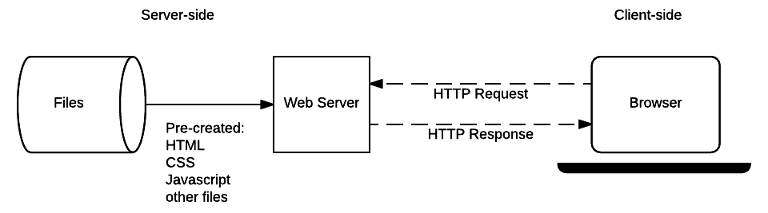
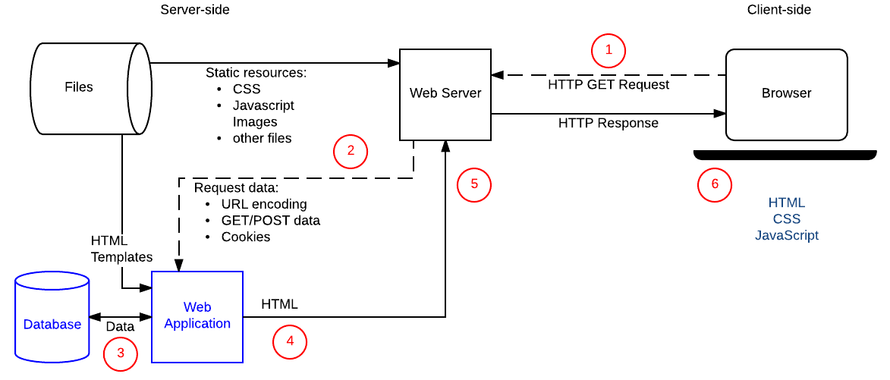

# 服务端编程

大多数的大型网站采用服务器端编程来在需要的时候动态展示不同的信息，这些信息会从服务器上的数据库中取出，然后发送给客户端，并通过一些代码展示在客户端。

服务器端编程的最大益处在于它允许对不同的用户个体展示不同的网站信息。

动态网站可以提高基于用户喜好和习惯的与用户相关度更高的内容。

它允许在页面中与用户进行交互，比如通过邮件或者其他渠道发送通知和更新信息。

## 服务器端编程是什么？
web浏览器通过HTTP来和web服务器进行通信。

HTTP请求包括一个标识所请求资源的URL，一个定义所需操作的方法，还可以包括编码在URL参数中的附加信息。

附加信息以键值对的形式，通过一个查询字符串，作为POST数据或存放在与之相关联的cookie中

web服务器等待客户端的请求信息，在它们到达的时候处理它们，并且回复web浏览器一个HTTP响应信息。响应信息包含一个表明该请求是否成功的状态行。

### 静态网站

静态网站是指无论何时当一个特定资源被请求的时候都返回相同的被硬编码的内容

### 动态网站

动态网站是指一些响应内容只有在被需要的时候才会触发的网站。

动态网站可以基于用户提供的个人信息或者偏好设置来返回不同的数据，并且可以展示作为返回一个回应的内容的一部分的其他操作（比如发送通知）。

大多数支持动态网站的代码必须运行在服务器上。编写这些代码就是所谓的“**服务器端编程**”（有些时候也称“后端脚本编写”）。

## 服务器端编程和客户端编程

在浏览器端运行的代码被称为**客户端代码**，并且主要涉及所呈现的网页的外观和行为的改进。这就包括选择和设计 UI 元素、布局、导航、表单验证等。

**服务器端网站编程**主要涉及，对于相应的请求，选择所要返回给浏览器的内容。服务器端代码解决这样一些问题，比如验证提交的数据和请求、使用数据库来存储和检索信息及发送给用户正如他们所请求的的正确内容。

客户端代码使用 HTML、CSS 和 JavaScript 来编写——这些代码直接在 Web 浏览器中运行，并且几乎没有访问底层操作系统的路径（包括对文件系统访问的限制）。

服务器端代码可以用任何一种编程语言进行编写——比较受欢迎的服务器端编程语言包括 PHP、Python、Ruby 和 C#。服务器端代码有充分的权限访问服务器的操作系统，并且开发者可以选择他们希望使用的编程语言（和特定版本的语言）。

开发者们通常会使用 web 框架来编写他们的代码。web 框架是一个各种函数、对象、方法和其他代码结构的集合体，web 框架被设计用来解决一些普遍问题，从而加速开发，并且简化在一个特定领域中面临的不同类型的任务。

## 服务器端可以做什么

信息的高效存储和传输

定制用户体验

控制对内容的访问

存储会话和状态信息

通知和通讯

数据分析

## 网络服务器与HTTP

网络浏览器通过超文本标记语言传输协议HTTP与网络服务器交互。当在网页上点击一个链接、提交一个表单、或者进行一次搜索的时候，浏览器发送一个 HTTP 请求给服务器。

这个请求包含：

- 一个用来识别目标服务器和资源的URL

- 一个定义了请求行为的方法。不同的方法/动作以及相关的行为有：
    - GET：获取一份指定的资源

    - POST：创建一份新的资源

    - HEAD: 获取有关指定资源的元数据信息，而不会得到像 GET 的内容部分。

    - PUT：更新一份已经存在的资源

    - DELETE：删除指定的资源

    - TRACE、OPTIONS、CONNECT、PATCH：这些动作是为一些不常见任务设计的

- 额外的信息可以和请求一起被编码，信息可以被编码为：

    - URL 参数：GET 请求通过在 URL 末尾增加的键值对，来编码包含在发送给服务器的 URL 中的数据——比如，http://mysite.com?name=Fred&age=11

    - POST 数据：POST 请求会增加新的资源，这些数据将会在请求体中编码

    - 客户端 cookie：cookies 包含与客户相关的会话数据，服务器可以用这些数据来判断用户的登录状态以及用户是否有访问资源的权限。

网络服务器等待来自客户的请求信息，当请求到达时处理他们，然后发给浏览器HTTP响应信息。

回应包含一个 HTTP 响应状态码（HTTP Response status code）来暗示请求是否成功 (比如 "200 OK" 连接成功， "404 Not Found" 资源没有找到，"403 Forbidden" 用户没有被授权查看资源，等等). 一个成功的响应主体，会包含 GET 请求所请求的资源。

## 服务端web框架

服务端框架使编写、维护和扩展web应用更加容易。它们提供工具和库来实现简单、常见的开发任务，包括 路由处理，数据库交互，会话支持和用户验证，格式化输出，提高安全性应对网络攻击。

### web框架功能

1、直接处理HTTP请求和响应

2、将请求路由到相关的handler中

3、使从请求中获得数据变得简单

4、抽象和简化数据库接口

网站使用数据库来存储与用户分享的信息和用户个人信息，web框架通常会提供一个数据库层抽象数据库的读写查询和删除，这一个抽象层被称作对象关系映射器（ORM）

5、渲染数据

web 框架经常提供模板系统。这些允许你制定输出文档的结构，使用为那些数据准备的将在页面生成时添加进去的占位符。模板经常是用来生成 HTML 的，但是也可以用来生成一些其他的文档。

### 如何选择一个web框架

- 学习代价

- 效率：编写和维护代码的代价

- 框架/编程语言的表现：通常来说，“速度”并不是选择中最重要的因素，甚至，相对而言，运行速度很缓慢的 Python 对于一个在中等硬盘上跑的中等大小的网站已经足够了。其他语言（C++/Javascript）的明显的速度优势很有可能被学习和维护的代价给抵消了。

- 缓存支持：缓存是一种优化，是指你将全部的或者大部分的网站请求保存起来，那么在后继请求中就不需要重新计算了。返回一个缓存请求比重新计算一次要快得多。缓存可以被植入你的代码里面，或者是服务器中（参见[反向代理](https://zh.wikipedia.org/wiki/%E5%8F%8D%E5%90%91%E4%BB%A3%E7%90%86)）。web 框架对于定义可缓存内容有着不同程度的支持。

- 可扩展性

- 网络安全

- 其他：许可证、框架是否动态发展

### 几个特定的服务器端框架

1、Django (Python)

Django是一个高水平的 python web 框架，它鼓励快速的开发和简洁、务实的设计。它由非常有经验的开发者创建的，考虑到了 web 开发中会遇到的大多数难题，所以你无需重复造轮就能够专心编写你的应用。

2、Flask (Python)

Flask是 python 的一个微型框架

虽然体量很小，Flask 却可以开箱即用地创造出完备网站。它包含一个开发服务器和调试器，并且包含对于 Jinja2 模板的支持，安全的 cookie, unit testing, 和 RESTful request dispatching。它有很好的文档和一个活跃的社区。

3、Express (Node.js/JavaScript)

Express 针对 Node.js 的快速的、unopinioned、灵活的、小型的 web 框架 (node 是用来运行 Javascript 的无浏览器的环境)。它为 web 和移动应用提供强大的系列功能，并且传输有用的 HTTP 工具、方法和middleware (en-US)

它减轻了客户端 Javascript 程序到服务器端开发的迁移，并且部分因为它是资源节约型（底层的 node 环境在单线程中使用轻量级多任务处理，而不是为每个 web 请求提供单独的进程）。

4、Ruby on Rails (Ruby)

Rails （通常被称作"Ruby on Rails"）是一个为 Ruby 语言编写的 web 框架。

Rails 遵循了和 Django 非常相似的设计哲学。正如 Django 一样，它提供了检索 URLs 的标准机制、从数据库中访问数据、从模板中生成 HTML 页面、格式化数据JSON 或者 XML。同样的，它也鼓励如 DRY（不要重复你自己）的设计模板——尽可能地只写一次代码、MVC（模板 - 视图 - 控制中心）以及很多其他的一些。

5、ASP.NET

ASP.NET 是一个由微软开发的开源 Web 框架，用于构建现代的 Web 应用程序和服务。通过 ASP.NET 你能快速创建基于 HTML、CSS、JavaScript 的网站，并且能满足大量用户的需求，还可以很容易地添加诸如 Web API、数据表单、即时通讯的功能。

特点之一就是它建立在 Common Language Runtime (CLR 公共语言运行时) 之上。这使得程序员可以使用任何支持的.NET 语言（如 C#、Visual Basic) 来编写 ASP.NET 代码。

6、Mojolicious (Perl)

Mojolicious是为 Perl 语言设计的新一代 Web 框架。

在 Web 的早期阶段，许多人都为了一个叫做 CGI 的优秀的 Perl 库而学过 Perl。它简单到即使你不是太懂这门语言也可以开始使用，而且也强大到足以让你可以用下去。Mojolicious 通过最新的技术实现了这个想法。

## 站点安全

站点安全的目的就是为了防范这些（或者说所有）形式的攻击。更正式点说，站点安全就是为保护站点不受未授权的访问、使用、修改和破坏而采取的行为或实践。

有效的站点安全需要在对整个站点进行设计：包括 Web 应用编写、Web 服务器的配置、密码创建和更新的策略以及客户端代码编写等过程。

