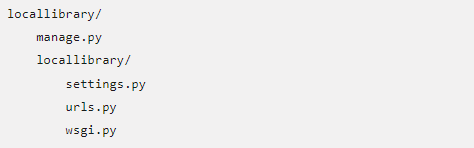
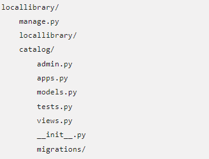
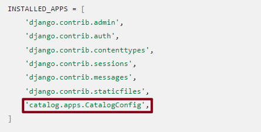
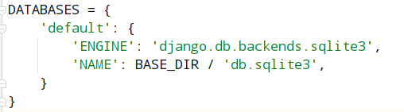

# 代码教程

## 搭建框架

1、使用django-admin工具创建工程的文件夹，基本的文件模板和工程管理脚本manage.py

```bash
mkdir locallibrary
cd locallibrary
django-admin startproject locallibrary
cd locallibrary
```


- settings.py 包含所有的网站设置，这是可以注册所有创建的应用的地方，也是静态文件，数据库配置的地方

- urls.py 定义了网站url到view的映射，虽有可以包含所有的url，但是更常见的做法是把应用相关的url包含在相关应用中

- wsgi.py 帮助Django应用和网络服务器间的通讯，可以把这个当作模板


manage.py脚本可以创建应用，和数据库通讯，启动开发用网络服务器

2、用manage.py创建一个或多个应用


3、在工程里注册新的应用

4、为每个应用分配url

## 创建应用

```bash
python3 manage.py startapp catalog
```


- migration文件夹，用来存储“migrations”，当修改数据模型时，这个文件会自动升级数据库

-__init__.py：一个空文件，Django/Python会将这个文件作为Python包并允许在项目的其他部分使用它

## 注册catalog应用

创建好之后，需要在项目中注册它，以便工具在运行时他会包括在里面

在settings里面把应用添加进`INSTALLED_APPS  `，就完成了注册



## 配置数据库

项目使用SQLite，可以在settings.py里看到这个数据是怎么配置的


## 其他项目配置

修改时区

```python
TIME_ZONE = 'Asia/Shanghai'
```

- `SECRET_KEY` 这个密钥值是Django网站安全策略的一部分。

- `DEBUG` 这个会在debug日志里输出错误信息，而不是输出HTTP的返回码。生产环境中，它应设置为 false，因为输出的错误信息会帮助想要攻击网站的人。

## URL映射器

URL 映射通过urlpatterns 变量管理，它是path() 函数的一个 Python 列表结构。每个path()函数要么将 URL 式样 (URL pattern) 关联到特定视图 (specific view)，将在模式匹配时显示；要么关联到某个 URL 式样列表的测试代码。 

```python
"""locallibrary URL Configuration

The `urlpatterns` list routes URLs to views. For more information please see:
    https://docs.djangoproject.com/en/2.0/topics/http/urls/
Examples:
Function views
    1. Add an import:  from my_app import views
    2. Add a URL to urlpatterns:  path('', views.home, name='home')
Class-based views
    1. Add an import:  from other_app.views import Home
    2. Add a URL to urlpatterns:  path('', Home.as_view(), name='home')
Including another URLconf
    1. Import the include() function: from django.urls import include, path
    2. Add a URL to urlpatterns:  path('blog/', include('blog.urls'))
"""
from django.contrib import admin
from django.urls import path

urlpatterns = [
    path('admin/', admin.site.urls),
]
```

添加catalog
```python
# Use include() to add paths from the catalog application
from django.conf.urls import include
from django.urls import path

urlpatterns += [
    path('catalog/', include('catalog.urls')),
]
```

让网站的根URL重定向到该URL

```python
#Add URL maps to redirect the base URL to our application
from django.views.generic import RedirectView
urlpatterns += [
    path('', RedirectView.as_view(url='/catalog/')),
]
```

Django默认不提供CSS，JavaScript和图片等静态文件。但在开发环境中开发时，这些静态文件很有用，通过以下添加在开发期间启用静态文件的服务。

```python
# Use static() to add url mapping to serve static files during development (only)
from django.conf import settings
from django.conf.urls.static import static

urlpatterns += static(settings.STATIC_URL, document_root=settings.STATIC_ROOT)
```

在catalog文件夹下创建一个urls.py的文件

```python
from django.urls import path
from catalog import views

urlpatterns = [

]
```

## 测试网站框架

在运行前，应该向运行数据库迁移，这回更新数据库并且包含所有安装的应用

### 运行数据库迁移

Django使用对象关系映射器ORM将Django代码中的模型定义映射到底层数据库使用的数据结构。当更改模型定义时，Django会跟踪更改并创建数据库迁移脚本/locallibrary/catalog/migrations/来自动迁移数据库中的底层数据结构

创建网站时，Django会自动添加一些模型提供网站的管理部分使用，运行以下命令来定义数据库中这些模型的表：
```python
python3 manage.py makemigrations
python3 manage.py migrate
```

### 运行网站

```bash
python3 manage.py runserver
```

## 模型定义

模型通常在应用程序的models.py文件中定义，作为django.db.models.Model子类实现，可以包含字段、方法和元数据

例：
```python
from django.db import models

class MyModelName(models.Model):
    """
    A typical class defining a model, derived from the Model class.
    """

    # Fields
    my_field_name = models.CharField(max_length=20, help_text="Enter field documentation")
    ...

    # Metadata
    class Meta:
        ordering = ["-my_field_name"]

    # Methods
    def get_absolute_url(self):
            """
            Returns the url to access a particular instance of MyModelName.
            """
            return reverse('model-detail-view', args=[str(self.id)])

    def __str__(self):
        """
        String for representing the MyModelName object (in Admin site etc.)
        """
        return self.field_name
```

### 域

一个模型可以有任意数量的域，或任意的类型——每个用一行呈现想存储进数据库的数据

```python
my_field_name = models.CharField(max_length=20, help_text="Enter field documentation")
```

域类型被特殊的 class 赋值，这确认了记录的类型是用来存入数据库的，以及当用户从 HTML 表格里提交值后，用来验证提交的值是否有效的条件。

字段类型还可以获取参数，进一步指定字段如何存放或如何被使用。这里给了字段两个参数：

- max_length=20 — 表示此字段中值的最大长度为 20 个字符的状态。

- help_text="Enter field documentation" — 提供一个帮助用户的文本标签，让用户知道当前透过 HTML 表单输入时要提供什么值。

**公共字段参数**

- help_text：提供HTML表单文本标签

- verbose_name：字段标签中的可读性名称，如果没有被指定，Django将从字段名称推断默认的详细名称

- default：字段默认值

- null：如果为True，即允许Django于资料栏写入NULL，预设值是False

- blank：如果为True，表单中的字段被允许空白，默认是False。通常搭配NULL=True使用

- choices：是给字段的一组选项。

- primary_key：如果为True，将当前字段设置为模型的主键。如果没有指定字段作为主键，则Django将自动为此添加一个字段。

**常见字段类型**

- `CharField` 是用来定义短到中等长度的字段字符串。必须指定max_length要存储的数据。

- `TextField` 用于大型任意长度的字符串。

- `IntegerField` 是一个用于存储整数（整数）值的字段，用于在表单中验证输入的值为整数。

- `DateField` 和 `DateTimeField` 用于存储／表示日期和日期／时间信息（分别是`Python.datetime.date` 和 `datetime.datetime` 对象）。这些字段可以另外表明（互斥）参数 `auto_now=Ture`（在每次保存模型时将该字段设置为当前日期），`auto_now_add`（仅设置模型首次创建时的日期）和 `default`（设置默认日期，可以被用户覆盖）。

- `EmailField` 用于存储和验证电子邮件地址。

- `FileField` 和 `ImageField` 分别用于上传文件和图像（ImageField 只需添加上传的文件是图像的附加验证）。这些参数用于定义上传文件的存储方式和位置。

- `AutoField` 是一种 `IntegerField` 自动递增的特殊类型。如果你没有明确指定一个主键，则此类型的主键将自动添加到模型中。

- `ForeignKey` 用于指定与另一个数据库模型的一对多关系（例如，汽车有一个制造商，但制造商可以制作许多汽车）。

- `ManyToManyField` 用于指定多对多关系（例如，一本书可以有几种类型，每种类型可以包含几本书）。

### 元数据

```python
class Meta:
    ordering = ['-my_field_name']
```
此元数据最有用的功能之一是控制在查询模型类型时返回之记录的默认排序。

排序将依赖字段的类型（字符串字段按字母顺序排序，而日期字段按时间顺序排序）。如上所示，可以使用减号（-）对字段名称进行前缀，以反转排序顺序。

通过标题依据--字母排序--排列，从 A 到 Z，然后再依每个标题的出版日期，从最新到最旧排列。

```python
ordering = ['title', '-pubdate']
```

### 方法

在每个模型中，应该定义标准的 Python 类方法 __str__()，来为每个物件返回一个人类可读的字符串。

```python
def __str__(self):
    return self.field_name
```

另一个常用方法是 get_absolute_url() ，这函数返回一个在网站上显示个人模型记录的 URL
```python
def get_absolute_url(self):
    """Returns the url to access a particular instance of the model."""
    return reverse('model-detail-view', args=[str(self.id)])
```

### 模型管理
一旦定义了模型类，可以使用它们来创建、更新或删除记录，并运行查询获取所有记录或特定的记录子集


