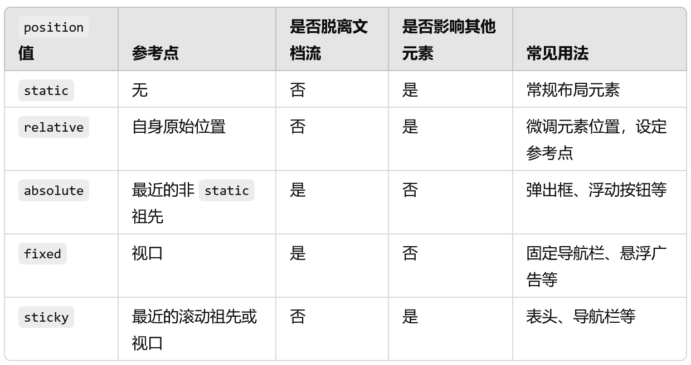

# 定位

## static默认值

元素会按照正常的文档流布局，不会被特别定位

不会响应top、right、bottom、left等偏移属性

## relative相对定位

会使元素相对于它在文档流中的原始位置进行偏移

可以使用 top、right、bottom 和 left 进行偏移，偏移后的元素仍然保留在文档流中，不会影响其他元素的位置

场景：通常用于微调元素位置，或者作为绝对定位（position: absolute;）元素的参考点

## absolute绝对定位

会使元素脱离文档流，相对于最近的非 static 定位祖先元素进行定位（即最近的 relative、absolute 或 fixed 元素）进行偏移。如果没有这样的祖先元素，则相对于 body（或 html）

使用 top、right、bottom 和 left 来精确控制位置。元素脱离文档流，不会影响其他元素的布局

用法场景：用于创建精确定位的元素，如弹出框、浮动按钮等

## fixed固定定位

使元素相对于视口（浏览器窗口）进行定位，即使页面滚动，元素依然保持在视口中的固定位置

可以使用 top、right、bottom 和 left 进行偏移，不受文档流影响，不会影响其他元素

场景：常用于页面上的固定元素，如导航栏、浮动按钮或悬浮广告

## sticky粘性定位

是一种混合了相对定位和固定定位的模式。元素在滚动过程中表现为 relative，当到达指定的 top、right、bottom 或 left 位置时，变为 fixed 定位

可以指定 top、right、bottom 或 left，当滚动到达指定位置时，元素将固定在指定位置。超出范围后恢复为 relative

场景：常用于表头、导航栏等需要在滚动中保持在某个位置的元素

```css
.sticky-element {
  position: sticky;
  top: 10px;   /* 滚动到视口距离顶部 10px 时开始固定 */
}
```

## 总结

