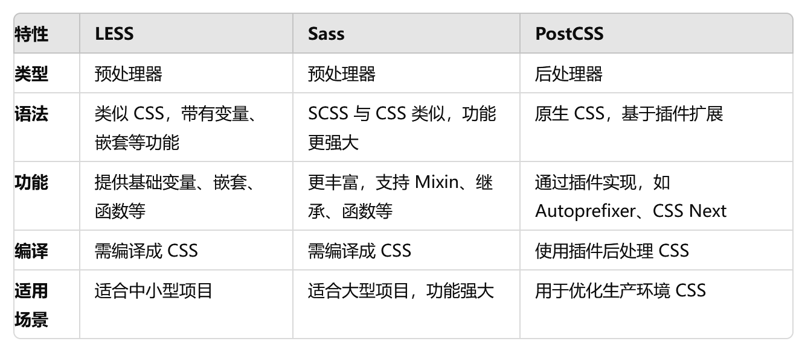

# 汇总 1

## 前端页面组成

1、结构层 structural layer

由 HTML 超文本标记语言来创建的，也就是页面中的各种标签，在结构层中保存了用户可以看到的所有内容，比如说：一段文字、一张图片、一段视频等等

2、表示层 presentation layer

表示层是由 CSS 负责创建，它的作用是如何显示有关内容，学名：层叠样式表

3、行为层 behavior layer

行为层表示网页内容跟用户之间产生交互性，简单来说就是用户操作了网页，网页给用户一个反馈，这是 JavaScript 和 DOM 主宰的领域

## 盒模型

盒模型 box model 是元素大小的呈现方式

css3 新增了盒模型计算方式：`box-sizing 属性`

盒模型的默认值是 `content-box`

`content-box`：

布局所占宽度 `Width=width+padding-left+padding-right+border-left+border-right`

`border-box`：

布局所占宽度 `Width=width(包含了 padding-left+padding-right+border-left+border-right)`

`padding-box`:

布局所占宽度 `Width=width(包含了 padding-left+padding-right)+border-left+border-right`

## 内联元素与块状元素

## CSS 预处理器/后处理器

这些工具可以帮助开发者更有效地编写、更具维护性的 CSS 代码

### LESS（Leaner Style Sheets）：预处理器

在普通的 css 基础上增加了一些编程语言的特性，比如变量，嵌套，函数等，帮助开发者更便捷地编写样式

LESS 主要用于增强 CSS 的复用性和减少冗余代码，常见于一些轻量级项目或团队已有 LESS 代码的项目中。

LESS 代码需要通过 less 编译器 编译成纯 CSS 代码，才能在浏览器中使用。可以通过 Node.js 或构建工具（如 Webpack）来自动编译

```css
/* 变量：可以定义全局变量，方便复用和修改 */

@primary-color: #4CAF50;
div {
  color: @primary-color;
}

/* 嵌套规则：支持嵌套编写选择器，使代码结构更加清晰 */
.container {
  .header {
    color: blue;
  }
}

/* 运算：支持加减乘除等数学运算 */
@width: 500px;
div {
  width: @width - 100px;
}
```

### Sass（Syntactically Awesome Stylesheets）：预处理器

比 LESS 功能更丰富、语法更强大，被广泛用于复杂的大型项目中。Sass 有两种语法形式：Sass（缩进语法） 和 SCSS（CSS 语法扩展），其中 SCSS 是目前更常用的格式，因为它与 CSS 语法更兼容

Sass 适合`复杂的大型项目`，因为它功能强大且灵活，可以用于组织大规模的 CSS 代码。许多现代 CSS 框架（如 Bootstrap）都使用 Sass。

与 LESS 类似，Sass 代码需要通过 Sass 编译器 转换为普通的 CSS。编译可以通过构建工具（如 Webpack、Gulp）来完成

```css
/* 变量：与 LESS 类似，Sass 也支持变量定义 */
$primary-color: #3498db;
body {
  color: $primary-color;
}
/* 嵌套规则：与 LESS 类似，Sass 支持嵌套样式，提升代码可读性 */
.nav {
  ul {
    margin: 0;
    li {
      list-style: none;
    }
  }
}
/* Mixin（混合）：Sass 支持定义可复用的代码块（函数）。 */
@mixin flex-center {
  display: flex;
  justify-content: center;
  align-items: center;
}
.box {
  @include flex-center;
}
/* 继承：Sass 支持继承其他选择器的样式，避免代码重复。 */
.button {
  border: 1px solid #333;
}
.primary-button {
  @extend .button;
  background-color: blue;
}
```

### PostCSS：后处理器

与 LESS 和 Sass 不同，它不是预处理器，而是一个基于插件的工具，允许你在写完普通 CSS 后对其进行进一步处理和优化。PostCSS 本身是一个平台，具体的功能通过插件来实现，比如支持变量、自动添加浏览器前缀等。

PostCSS 通常用于生产环境优化，比如自动添加浏览器前缀、压缩 CSS 代码。它也可以用来结合其他预处理器工具来进一步优化 CSS

PostCSS 需要通过工具链（如 Webpack、Gulp）配合相应插件进行处理，编译之后的 CSS 是标准的浏览器可读代码。

### 区别



### CSS Modules

styles.module.css 是 CSS Modules 的一种命名约定，主要用于在 React 项目中实现样式的模块化。CSS Modules 是一种将 CSS 样式局部化的方法，防止全局作用域中的样式冲突问题。

CSS Modules 是一种默认将 CSS 样式作用范围限制在某个特定组件的方法。传统的 CSS 是全局的，意味着所有的样式规则都适用于整个页面上的元素，可能导致命名冲突和样式覆盖的问题。而 `CSS Modules 通过生成唯一的类名，使得每个样式仅在当前模块内生效`，解决了这个问题。

#### 优点

1、作用域隔离：通过生成唯一的类名

2、样式局部化

3、动态生成类名

4、组合类名：在 CSS Modules 中，你可以通过 ES6 模板字符串的方式组合多个类名。

```html
<div className="{`${styles.container}" ${styles.title}`}>Hello</div>
```

5、全局类名：虽然 CSS Modules 提供局部化样式管理，但你仍然可以通过 :global 语法将某些样式设为全局样式。

```css
:global(.globalClassName) {
  color: red;
}
```

总结：可以避免样式冲突，更易维护，增强代码的可组合型

#### 使用

1、创建一个 CSS Module 文件： 通常将文件命名为 styles.module.css，表示这是一个 CSS Modules 文件。它与普通的 CSS 文件语法相同，但不同的是，这些样式会被局部化。

```css
/* styles.module.css */
.container {
  background-color: #f0f0f0;
  padding: 20px;
}

.title {
  color: blue;
  font-size: 24px;
}
```

2、在 React 组件中导入 CSS Module： 通过 import 将 CSS Module 文件导入到你的 React 组件中，并通过对象属性的方式引用类名。

```css
import React from 'react';
import styles from './styles.module.css';  // 导入样式模块

const MyComponent = () => {
  return (
    <div className={styles.container}>
      <h1 className={styles.title}>Hello, World!</h1>
    </div>
  );
};

export default MyComponent;

```

3、样式自动局部化： 当你使用 styles.container 和 styles.title 时，React 会自动将这些类名映射为唯一的、局部化的 CSS 类名，类似于 styles_container\_\_2MkcS 这样的格式，确保这些样式不会影响其他组件的样式，也不会与其他样式冲突。

### CSS-in-JS

CSS-in-JS 是将 CSS 直接写在 JavaScript 代码中的技术，它允许开发者使用 JavaScript 动态地定义样式并将其作用于组件。CSS-in-JS 提供了更强的可组合性和动态样式处理能力，特别适用于组件化框架（如 React、Vue、Angular）。

#### 优点

- 组件化：样式与组件紧密结合，代码更易维护

- 动态样式：可以根据 JavaScript 逻辑动态生成样式

- 避免全局命名冲突：每个组件的样式都是局部的，避免了全局 css 冲突

#### 常见库

- Styled Components：允许在 React 中定义组件样式，并通过 ES6 模板字符串编写 CSS 代码。

```js
import styled from "styled-components";

const Button = styled.button`
  background-color: blue;
  color: white;
  padding: 10px;
`;
```

- Emotion：类似于 Styled Components，提供了高性能的 CSS-in-JS 解决方案，支持动态样式和主题切换。

- JSS：CSS-in-JS 的一种实现，允许将样式定义为 JavaScript 对象，特别适合 React 等框架。

### Tailwind CSS

Tailwind CSS 是一种功能性（实用性）优先的 CSS 框架。与传统的 CSS 框架不同，Tailwind 不提供现成的 UI 组件，而是提供了大量的实用类名，每个类名对应特定的样式。这使得开发者可以通过组合多个类名快速构建页面，而无需编写额外的自定义 CSS。

#### 特点

- 实用类名：每个类名只做一件事情（如 bg-blue-500 设定背景色，py-2 设定内边距），通过组合类名来构建复杂的样式。

- 快速开发：不需要编写自定义的样式，直接使用 Tailwind 提供的类名。

- 定制化：Tailwind 的配置文件可以轻松进行主题定制、响应式设计和媒体查询的管理。

- 响应式设计：Tailwind 内置了大量的响应式工具，可以轻松处理不同设备的布局。

```html
<button
  class="bg-blue-500 hover:bg-blue-700 text-white font-bold py-2 px-4 rounded"
>
  Button
</button>
```

### BEM（Block Element Modifier）命名法

BEM 是一种 CSS 命名约定，主要用于增强样式的可维护性和结构化。BEM 强调将组件分成**块（Block）、元素（Element）和修饰符（Modifier）**三部分。

提高了样式的可读性和维护性。

避免了全局样式的冲突，通过结构化命名，确保样式独立性。

- Block：代表独立的功能块或组件（例如导航栏、按钮）。

- Element：属于块的一部分，依赖于块存在（例如按钮中的图标）。

- Modifier：是块或元素的变体，用来定义不同的状态或版本（例如不同颜色的按钮）。

```html
<div class="button button--primary">
  <span class="button__icon"></span>
  <span class="button__text">Click me</span>
</div>
```

### Responsive Design (响应式设计)

响应式设计 是指网页可以根据用户的屏幕尺寸、分辨率、设备类型等进行自适应调整，使得网站在桌面、平板、手机等不同设备上都能良好显示。

#### 关键技术

1、媒体查询：根据设备的宽度或高度，应用不同的样式

2、弹性布局和 Grid 布局

3、相对单位

## sass,less

Sass(Scss)，Less 都是**CSS 预处理器**，它们定义了一种新的语言，其基本思想是，用一种专门的编程语言为 CSS 增加了一些编程的特性，将 CSS 作为目标生成文件，然后开发者就只要使用这种语言进行 CSS 的编码工作

- 为什么要用 CSS 预处理器？

因为 css 仅仅是一个标记语言，自定义变量的使用不够灵活，语法不够强大，导致模块化开发中需要书写很多重复的选择器；并且没有变量和合理的样式复用机制，使得逻辑上相关的属性必须以字面量的形式重复输出，导致难以维护

- css 预处理器的好处

提供 css 层缺失的样式层复用机制；减少冗余代码；提高样式代码的可维护性

- sass/scss

```
$blue: #1875e7;　
div {
  color: $blue;
}

$side: left;
$my-radius: 5px;
.rounded {
  border-#{$side}-radius: $my-radius;
}
```

- less

```
@width: 10px;
@height: @width + 10px;
@test: left;
#header {
  width: @width;
  height: @height;
  margin-@{test}: 5px;
}
```

- Stylus

```
$base-font-size = 16px

h1
  font-size $base-font-size * 1.5

@if light-theme
  body
    background-color #fff
  @else
  body
    background-color #000
```

- PostCSS

使用 PostCSS，可以根据需要选择和配置不同的插件来实现各种转换和增强

## CSS3 动画

CSS 动画（CSS Animations）是为层叠样式表建议的允许可扩展标记语言（XML）元素使用 CSS 的动画的模块

即指元素从一种样式逐渐过渡为另一种样式的过程

常见的动画效果有很多，如平移、旋转、缩放等等，复杂动画则是多个简单动画的组合

css 实现动画的方式，有如下几种：

- transition 实现渐变动画

- transform 转变动画

- animation 实现自定义动画

### transition 实现渐变

transition 的属性如下：

- property:填写需要变化的 css 属性

- duration:完成过渡效果需要的时间单位(s 或者 ms)

- timing-function:完成效果的速度曲线

- delay: 动画效果的延迟触发时间

`注意：并不是所有的属性都能使用过渡的，如 display:none<->display:block`

### transform 转变动画

包含四个常用的功能：

- translate：位移

- scale：缩放

- rotate：旋转

- skew：倾斜

一般配合 transition 过度使用

`注意的是，transform 不支持 inline 元素，使用前把它变成 block`

### animation 实现自定义动画

## css 隐藏页面元素

### display:none

彻底消失，空间被其他元素占有，会导致浏览器的重排和重绘

特点：元素不可见，不占据空间，无法响应点击事件

### visibility:hidden

DOM 会存在，不会触发重排，但会触发重绘

特点：元素不可见，占据空间，无法响应点击事件

### opacity:0

元素透明度，不引发重排，一般会引发重绘

但如果利用 animation 动画，对 opacity 做变化（animation 会默认触发 GPU 加速），只会触发 GPU 层面的 composite，不会触发重绘

其子元素无法设置 opacity 来达到显示的效果

特点：改变元素透明度，元素不可见，占据页面空间，可以响应点击事件

### 设置 height、width 模型属性为 0

margin，border，padding，height 和 width 等影响元素盒模型的属性设置成 0，如果元素内有子元素或内容，还应该设置其 overflow:hidden 来隐藏其子元素

特点：元素不可见，不占据页面空间，无法响应点击事件

### position:absolute

将元素移出可视区域

特点：元素不可见，不影响页面布局

### clip-path

通过裁剪的形式

```css
.hide {
  clip-path: polygon(0px 0px, 0px 0px, 0px 0px, 0px 0px);
}
```

特点：元素不可见，占据页面空间，无法响应点击事件

### 区别


## 参考

[https://juejin.cn/post/7316349850855211046#heading-2](https://juejin.cn/post/7316349850855211046#heading-2)

[https://vue3js.cn/interview/css/animation.html](https://vue3js.cn/interview/css/animation.html)

[https://vue3js.cn/interview/css/hide_attributes.html#%E4%BA%8C%E3%80%81%E5%AE%9E%E7%8E%B0%E6%96%B9%E5%BC%8F](https://vue3js.cn/interview/css/hide_attributes.html#%E4%BA%8C%E3%80%81%E5%AE%9E%E7%8E%B0%E6%96%B9%E5%BC%8F)
