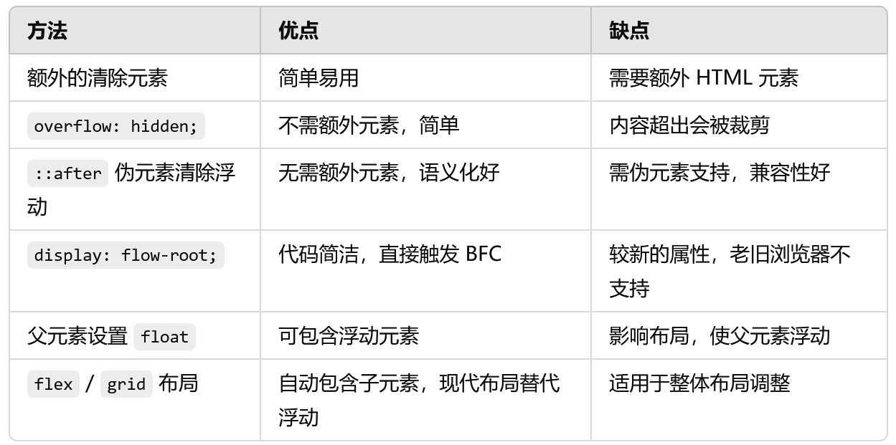

# 清除浮动

清除浮动是指让浮动元素不影响其父元素的高度，解决浮动元素脱离文档流而导致父元素高度塌陷的问题

## 使用额外的div清除元素
在浮动元素的后面添加一个带有 clear: both; 的空 div 元素，以清除浮动。这是最早使用的一种方法。

```html
<div class="container">
  <div class="float-element" style="float: left;">浮动内容</div>
  <div class="clear"></div> <!-- 清除浮动的元素 -->
</div>

.clear {
  clear: both;
}

```

优点：简单易用，直接添加一个清除浮动的元素

缺点：需要额外的HTML元素，不够语义化，不推荐在现代开发中使用

## 使用overflow属性

给父元素设置 overflow: hidden;、overflow: auto; 或 overflow: scroll; 可以触发 BFC（块级格式化上下文），从而包含浮动元素。

```html
<div class="container">
  <div class="float-element" style="float: left;">浮动内容</div>
</div>
.container {
  overflow: hidden;
}
```

优点：不需要额外的元素或清除浮动的代码，简单易用

缺点：可能会导致内容超出时被裁剪，适用于内容固定且不需要滚动的场景

## 使用`::after`伪元素清除浮动

这是目前最常用的方法。通过在父元素上添加`::after`伪元素，并设置`clear: both;`和`content: ""`，可以有效清除浮动

```html
<div class="container">
  <div class="float-element" style="float: left;">浮动内容</div>
</div>
.container::after {
  content: "";
  display: block;
  clear: both;
}
```

优点：不需要额外的HTML元素，代码简洁，语义化好

缺点：需要支持伪元素的浏览器（现代浏览器基本都支持）

为了兼容性和简洁性，这个方法通常被定义为一个公共的`clearfix`类

```css
.clearfix::after {
  content: "";
  display: block;
  clear: both;
}
```

然后在需要的父元素上加上`clearfix`类：

```html
<div class="container clearfix">
  <div class="float-element" style="float: left;">浮动内容</div>
</div>
```

## 使用 display: flow-root

display: flow-root; 是一种触发 BFC 的简洁方法，可以直接让父元素包含浮动子元素。

```html
<div class="container">
  <div class="float-element" style="float: left;">浮动内容</div>
</div>
.container {
  display: flow-root;
}
```
优点：代码简单，直接触发 BFC，无需额外的伪元素或样式。

缺点：较新属性，较老的浏览器（如 IE）不支持。

##  父元素设置 float

给父元素本身添加 float 属性，也可以触发 BFC，从而包含浮动的子元素

```html
<div class="container" style="float: left;">
  <div class="float-element" style="float: left;">浮动内容</div>
</div>
```

- 优点：可以包含浮动子元素。

- 缺点：会影响父元素在布局中的表现，使它也成为一个浮动元素，不推荐这种方式。

## 使用 flex 或 grid 布局：替代浮动

使用 display: flex; 或 display: grid; 会让父容器自动包含子元素，无需考虑浮动问题。在现代布局中，flex 和 grid 通常代替浮动来进行布局。


```html
<div class="container">
  <div class="float-element">内容</div>
</div>
.container {
  display: flex; /* 或 display: grid; */
}
```

优点：不需要额外的清除操作，直接避免浮动问题。

缺点：可能需要调整现有布局，适合完全使用 flex 或 grid 布局的场景。


## 总结

