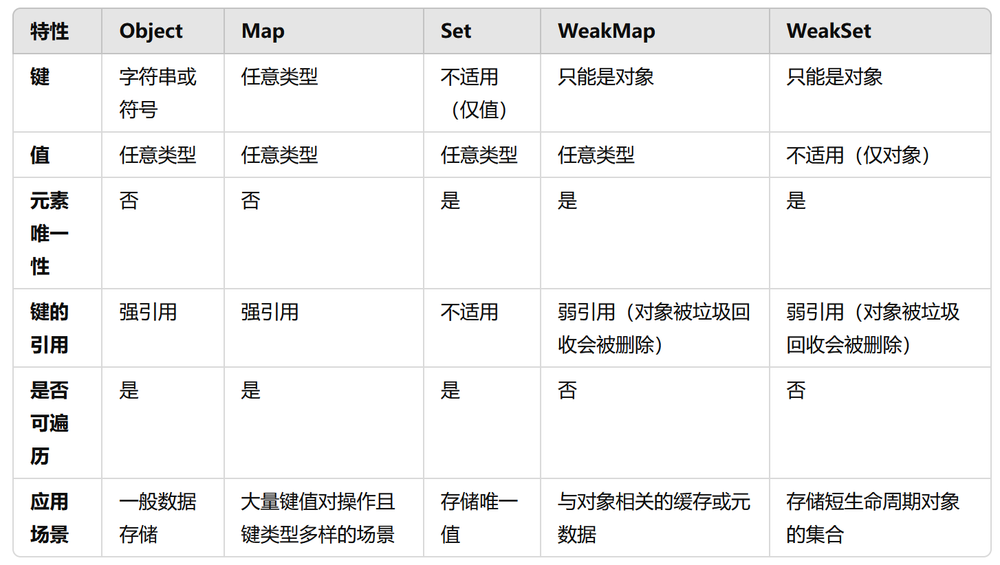

# Object-Set-Map

## Object

JavaScript 的对象（Object），本质上是键值对的集合（Hash 结构），但是传统上`只能用字符串`当作键。这给它的使用带来了很大的限制。

## Set

ES6 提供了新的数据结构 Set。它类似于数组，但是成员的值都是唯一的，没有重复的值。

### 实例属性和方法

**属性：**

- `Set.prototype.constructor`：构造函数，默认就是 Set 函数。

- `Set.prototype.size`：返回 Set 实例的成员总数。

**方法：**

操作方法：用于操作数据

- `Set.prototype.add(value)`：添加某个值，返回 Set 结构本身

- `Set.prototype.delete(value)`：删除某个值，返回一个布尔值，表示删除是否成功

- `Set.prototype.has(value)`：返回一个布尔值，表示该值是否为 Set 的成员

- `Set.prototype.clear()`：清除所有成员，没有返回值

遍历方法：用于遍历成员

- `Set.prototype.keys()`

- `Set.prototype.values()`

- `Set.prototype.entries()`

- `Set.prototype.forEach()`

```js
let set = new Set(["red", "green", "blue"]);

for (let item of set.keys()) {
  console.log(item);
}
// red
// green
// blue

for (let item of set.values()) {
  console.log(item);
}
// red
// green
// blue

for (let item of set.entries()) {
  console.log(item);
}
// ["red", "red"]
// ["green", "green"]
// ["blue", "blue"]
```

### 集合运算

ES2025 为 Set 结构添加了以下集合运算方法：

- Set.prototype.intersection(other)：交集

- Set.prototype.union(other)：并集

- Set.prototype.difference(other)：差集

- Set.prototype.symmetricDifference(other)：对称差集

- Set.prototype.isSubsetOf(other)：判断是否为子集

- Set.prototype.isSupersetOf(other)：判断是否为超集

- Set.prototype.isDisjointFrom(other)：判断是否不相交

## WeakSet

WeakSet 结构与 Set 类似，也是不重复的值的集合。但是，它与 Set 有两个区别。

首先，WeakSet 的成员只能是`对象和 Symbol 值`，而不能是其他类型的值。

其次，WeakSet 中的对象都是弱引用，即垃圾回收机制不考虑 WeakSet 对该对象的引用，也就是说，如果其他对象都不再引用该对象，那么垃圾回收机制会自动回收该对象所占用的内存，不考虑该对象还存在于 WeakSet 之中。

## Map

ES6 提供了 Map 数据结构。它类似于对象，也是键值对的集合，但是`“键”的范围不限于字符串`，`各种类型的值（包括对象）都可以当作键`。也就是说，Object 结构提供了“字符串—值”的对应，Map 结构提供了“值—值”的对应，是一种更完善的 Hash 结构实现。如果你需要“键值对”的数据结构，Map 比 Object 更合适。

## WeakMap

WeakMap 结构与 Map 结构类似，也是用于生成键值对的集合。

WeakMap 与 Map 的区别有两点。

首先，WeakMap 只接受对象（null 除外）和 Symbol 值作为键名，不接受其他类型的值作为键名。

其次，WeakMap 的键名所指向的对象，不计入垃圾回收机制。

## 总结



## 参考

[https://wangdoc.com/es6/set-map#map](https://wangdoc.com/es6/set-map#map)
