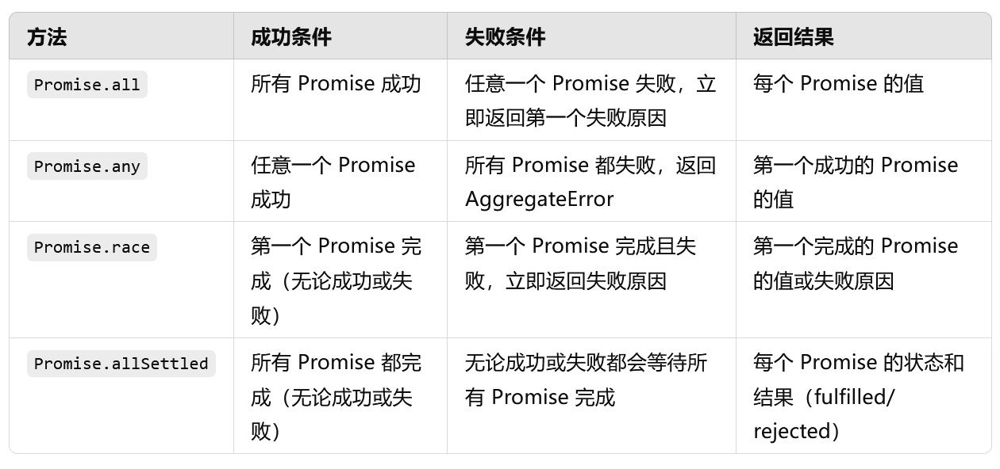

# Promise

## Promise.all：所有成功或第一个失败

接收一个包含多个Promise的可迭代对象，并返回一个新的Promsie

成功条件：所有Promise都变成`fulfilled`状态时，返回的Promise也会变成`fulfilled`，并返回一个数组，包含每个Promise的结果，顺序与输入的Promise顺序一致

失败条件：如果任意一个Promise被`rejected`，则Promise.all会立即变成`rejected`，并返回第一个被`rejected`的Promise的错误

## Promise.any：所有失败或第一个成功

接收一个包含多个Promise的可迭代对象，并返回一个新的Promise

成功条件：返回的Promise将会在第一个Promise变成`fulfilled`时立即完成，返回该Promise的值

失败条件：：如果第一个变为 rejected 的 Promise 出现，那么 Promise.race 也会立即变为 `rejected`，并返回该错误
## Promise.race：第一个成功或失败

接收一个包含多个Promise的可迭代对象，并返回一个新的Promise

成功条件：返回的 Promise 将会在第一个传入的 Promise 变为 `fulfilled` 或 `rejected` 时立即完成（无论成功或失败）

失败条件：如果所有Promise都被`rejected`，则Promise.race返回一个`rejected`的`AggregateError`，包含所有错误信息

## Promise.allSettled：所有的结果

返回的结果是一个数组，其中每个元素对应于输入的每个Promise，包含两个属性：

- status：标识Promise的最终状态，可能是`fulfilled`或`rejected`

- value：如果该Promise成功，则包含Promise的结果

- reason：如果该Promise失败，则包含失败的原因

## 对比

