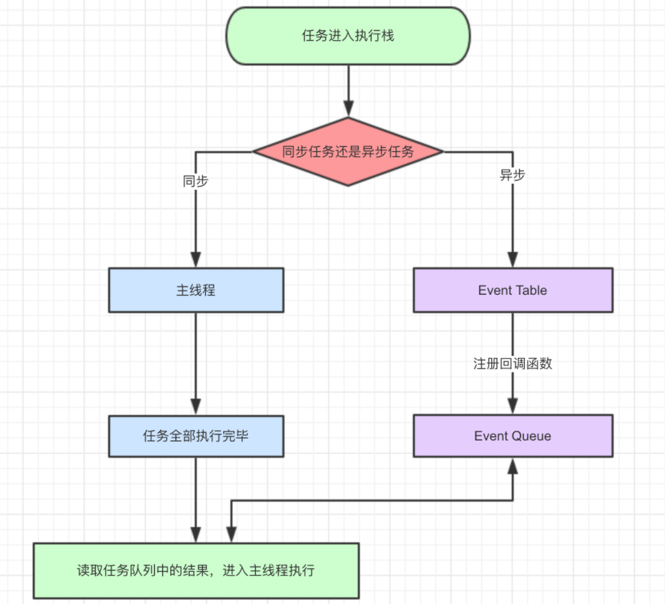
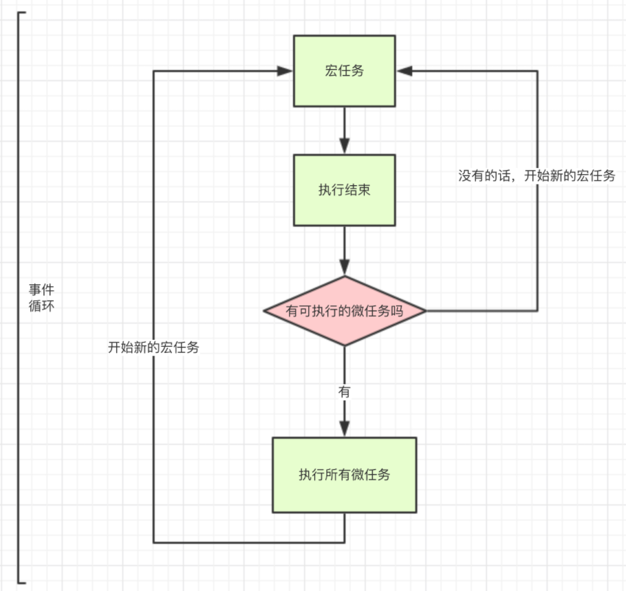
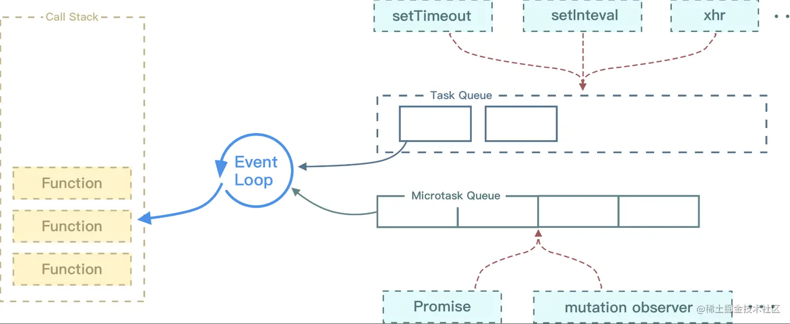
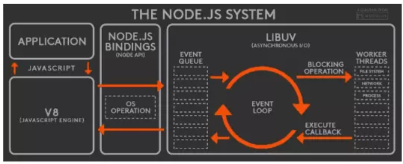
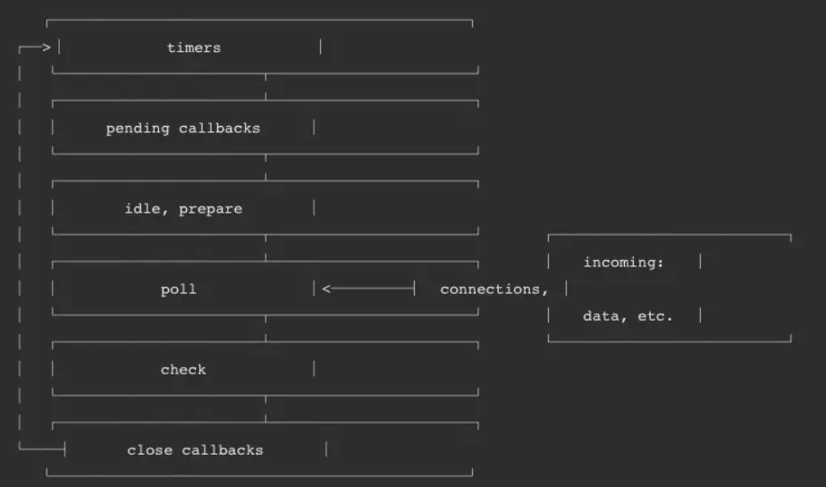

# 单线程的 JavaScript

## 单线程的 JavaScript

作为浏览器脚本语言，JavaScript 的主要作用是与用户交互和操作 DOM。

如果 JavaScript 是多线程，当页面更新内容的时候，用户又触发了交互，这时候线程间的同步问题会很复杂，为了避免复杂性，JavaScript 被设计为单线程。

### 设计为单线程的核心原因

JavaScript 设计为单线程的原因主要与`JavaScript 的运行环境（浏览器）以及它的初衷`有关。

最初是为网页浏览器设计的，目的是处理用户与网页的交互，因此它的设计初衷非常强调简洁性和安全性

核心原因：

1、浏览器中的DOM操作需要简化

> 最初的主要用途是与HTML页面交互，尤其是操作DOM元素。由于DOM是一个共享的全局状态，如果多个线程同时操作DOM（比如同时修改元素的样式或结构），可能会导致冲突或不一致的状态

2、简化开发者的编程模型

3、历史原因和初衷

> JavaScript设计之初并不是为了执行复杂的并发操作，而是处理一些简单的、基于事件的操作，如响应用户的点击、输入、表单提交等

4、异步编程引入

> 虽然JavaScript是单线程的，但通过异步编程模型来实现非阻塞的异步操作

5、Web Workers提供多线程支持

> 浏览器提供了Web Workers，允许开发者在单独的线程中运行JavaScript脚本，进行并行处理

> 这些线程与主线程是隔离的，因此无法直接访问DOM，也没有共享内存，减少了多线程编程中的同步问题

### JavaScript 运行

JavaScript 运行时，主线程会形成一个栈，这个栈主要是解释器用来最终函数执行流的一种机制。通常这个栈被称为调用栈 Call Stack，或执行栈 Execution Context Stack

调用栈，具有后进先出的结构。

调用栈内存放的是代码执行期间的所有执行上下文。

- 每调用一个函数，解释器就会把该函数的执行上下文添加到调用栈并开始执行；

- 正在调用栈中执行的函数，如果还调用了其他函数，那么新函数也会被添加到调用栈，并立即执行；

- 当前函数执行完毕后，解释器会将其执行上下文清除调用栈，继续执行剩余执行上下文的剩余代码

- 分配的调用栈空间被占满，会引发“堆栈溢出”错误。

### 事件循环

单线程意味着任务需要一个一个进行，如果有任务是等待用户输入，那么在用户操作之前，其他任务都会等待，页面处于假死状态，体验很糟，所以出现了异步任务。

JavaScript 中，所有的任务都可以分为：

- 同步任务：立即执行的任务，同步任务一般会直接进入到主线程中执行

- 异步任务：异步执行的任务，比如 ajax 网络请求，setTimeout 定时函数等



异步任务又可以分为宏任务与微任务。

常见的宏任务：

- script(外层同步代码)

- setTimeout/setInterval

- UI rendering/UI 事件

- postMessage、MessageChannel

- setImmediate、I/O(Node.js)

常见的微任务：

- Promise.then

- MutationObserver

- Object.observer(已废弃，Proxy 对象替代)

- process.nextTick（Node.js）

`new Promise是同步任务，直接执行`



#### async 和 await

async 用来声明一个异步方法，而 await 是用来等待异步方法执行

async 函数返回一个 promise 对象

```js
function f() {
  return Promise.resolve("TEST");
}

async function asyncF() {
  return "TEST";
}
```

正常情况下，await 命令后面是一个 Promise 对象，返回该对象的结果

如果不是 Promise 对象，就直接返回对应的值

```js
async function f() {
  return await 123;
  // 等同于return 123;
}

f().then((v) => console.log(v));
// 123
```

但不管 await 后面跟着的是什么，await 都会阻塞后面的代码

```js
async function fn1() {
  console.log(1);

  await fn2();

  console.log(2); //被阻塞
}

async function fn2() {
  console.log("fn2");
}

fn1();

console.log(3);

// await会阻塞下面的代码，即加入微任务队列，先执行async外面的同步代码，同步代码执行完，再回到async函数中，再执行之前阻塞的代码
// 1,fn2,3,2
```

示例：

```js
async function async1() {
  console.log("async1 start");
  await async2();
  console.log("async1 end");
}
async function async2() {
  console.log("async2");
}
console.log("script start");
setTimeout(function () {
  console.log("settimeout");
});
async1();
new Promise(function (resolve) {
  console.log("promise1");
  resolve();
}).then(function () {
  console.log("promise2");
});
console.log("script end");
// script start、async1 start、async2、promise1、script end、async1 end、promise2、settimeout
```

#### async/await 其他细节

```js
async function async1 () {
    await new Promise((resolve, reject) => {
        resolve()
    })
    console.log('A')
}
​
async1()
​
new Promise((resolve) => {
    console.log('B')
    resolve()
}).then(() => {
    console.log('C')
}).then(() => {
    console.log('D')
})
​
// 最终结果👉: B A C D


async function async1 () {
    await async2()
    console.log('A')
}
​
async function async2 () {
    return new Promise((resolve, reject) => {
        resolve()
    })
}
​
async1()
​
new Promise((resolve) => {
    console.log('B')
    resolve()
}).then(() => {
    console.log('C')
}).then(() => {
    console.log('D')
})
​
// 最终结果👉: B C D A
```

async 函数处理返回值，会像 Promise.prototype.then 一样，会对返回值的类型进行辨识

👉 根据返回值的类型，引起 js 引擎 对返回值处理方式的不同

> 📑 结论：async 函数在抛出返回值时，会根据返回值类型开启不同数目的微任务
>
> - return 结果值：非 thenable、非 promise（不等待）
>
> - return 结果值：thenable（等待 1 个 then 的时间）
>
> - return 结果值：promise（等待 2 个 then 的时间）

```js
async function testA () {
    return 1;
}
​
testA().then(() => console.log(1));
Promise.resolve()
    .then(() => console.log(2))
    .then(() => console.log(3));
​
// (不等待)最终结果👉: 1 2 3


async function testB () {
    return {
        then (cb) {
            cb();
        }
    };
}
​
testB().then(() => console.log(1));
Promise.resolve()
    .then(() => console.log(2))
    .then(() => console.log(3));
​
// (等待一个then)最终结果👉: 2 1 3

async function testC () {
    return new Promise((resolve, reject) => {
        resolve()
    })
}

testC().then(() => console.log(1));
Promise.resolve()
    .then(() => console.log(2))
    .then(() => console.log(3));

// (等待两个then)最终结果👉: 2 3 1


async function testC () {
    return new Promise((resolve, reject) => {
        resolve()
    })
}

testC().then(() => console.log(1));
Promise.resolve()
    .then(() => console.log(2))
    .then(() => console.log(3))
    .then(() => console.log(4))

// (等待两个then)最终结果👉: 2 3 1 4

```

```js
async function async1 () {
    console.log('1')
    await async2()
    console.log('AAA')
}
​
async function async2 () {
    console.log('3')
    return new Promise((resolve, reject) => {
        resolve()
        console.log('4')
    })
}
​
console.log('5')
​
setTimeout(() => {
    console.log('6')
}, 0);
​
async1()
​
new Promise((resolve) => {
    console.log('7')
    resolve()
}).then(() => {
    console.log('8')
}).then(() => {
    console.log('9')
}).then(() => {
    console.log('10')
})
console.log('11')
​
// 最终结果👉: 5 1 3 4 7 11 8 9 AAA 10 6

```

跟 Promise 的情况

```js
async function test () {
    console.log(1);
    await new Promise((resolve, reject) => {
        resolve()
    })
    console.log(2);
}
​
test();
console.log(3);
​
Promise.resolve()
    .then(() => console.log(4))
    .then(() => console.log(5))
    .then(() => console.log(6))
    .then(() => console.log(7));
​
// 最终结果👉: 1 3 2 4 5 6 7

// 为什么不等待两个 then 的时间呢？
// TC 39(ECMAScript标准制定者) 对await 后面是 promise 的情况如何处理进行了一次修改，移除了额外的两个微任务，在早期版本，依然会等待两个 then 的时间
// 但在这次更新中并没有修改 thenable 的情况
// 这样做可以极大的优化 await 等待的速度
```

## 事件循环

JavaScript 代码的执行过程中，除了依靠函数`调用栈`来搞定函数的执行顺序外，还依靠`任务队列(task queue)`来搞定另外一些代码的执行。整个执行过程，我们称为事件循环过程。一个线程中，事件循环是唯一的，但是任务队列可以拥有多个。任务队列又分为 macro-task（宏任务）与 micro-task（微任务），在最新标准中，它们被分别称为 task 与 jobs。

执行顺序：

```js
执行同步代码

执行完所有同步代码后且执行栈为空，判断是否有微任务需要执行

执行所有微任务且微任务队列为空

是否有必要渲染页面

执行一个宏任务
```

macro-task 大概包括：

- script(整体代码，可以理解为外层同步代码)

- setTimeout

- setInterval

- setImmediate

- I/O

- UI render

micro-task 大概包括:

- process.nextTick

- Promise

- Async/Await(实际就是 promise)

- MutationObserver(html5 新特性)



## Node中的事件循环

Node中的Event Loop和浏览器中的是完全不同的东西



Node采用V8作为js的解析引擎，而I/O处理方面使用了自己设计的libuv，libuv是一个基于事件驱动的跨平台抽象层，封装了不同操作系统的一些底层特性，对外提供统一的API（时间，非阻塞的网络，异步文件操作，子进程等等），Event Loop也是它里面的实现。

> Node的运行机制：
> 
> V8引擎解析JavaScript脚本
> 
> 解析后的代码，调用Node API
> 
> libuv库负责Node API的执行。将不同的任务分配给不同的线程，形成一个Event Loop，以异步的方式将任务的执行结果返回给V8引擎
> 
> V8引擎再将结果返回给用户
> 



Node的Event Loop分为6个阶段，按照顺序反复运行。每当进入某一个阶段的时候，都会从对应的回调队列中取出函数去执行，当队列为空或者执行的回调函数数量达到系统设定的阈值，就会进入下一阶段。

1、Timers（计时器阶段）：初次进入事件循环，会从计时器阶段开始。此阶段会判断是否存在过期的计时器回调（包含setTimeout和setInterval），如果存在则会执行所有过期的计时器回调，执行完毕后，如果回调中触发了相应的微任务，会接着执行所有的微任务，执行完微任务后再进入Pending callbacks阶段。

2、Pending callbacks：执行推迟到下一个循环迭代的I/O回调

3、Idle/Prepare：仅供内部使用

4、Poll（轮询阶段）：回到timer阶段执行回调，执行I/O回调

> - 当回调队列不为空时：会执行回调，若回调中触发了相应的微任务，这里的微任务执行时机和其他地方有所不同，不会等到所有回调执行完毕后才执行，而是针对每一个回调执行完毕后，就执行相应微任务。执行完所有的回调后，变为下面的情况。
> 
> - 当回调队列为空时（没有回调或所有回调执行完毕）：但如果存在有计时器（setTimeout、setInterval和setImmediate）没有执行，会结束轮询阶段，进入Check阶段。否则会阻塞并等待任何正在执行的I/O操作完成，并马上执行相应的回调，直到所有回调执行完毕
> 

5、Check（查询阶段）：会检查是否存在setImmediate相关的回调，如果存在则执行所有回调，执行完毕后，如果回调中触发了相应的微任务，会接着执行所有微任务，执行完微任务后再进入Close callbacks阶段。

6、Close callbacks：执行一些关闭回调，比如socket.on('close', ...)等。

### process.nextTick

process.nextTick有一个自己的队列，当每个阶段完成后，如果存在 nextTick 队列，就会清空队列中的所有回调函数，并且优先于其他 microtask 执行。

### node中的宏任务和微任务

Node端事件循环中的异步队列也是这两种：macro（宏任务）队列和 micro（微任务）队列：

- 常见的 macro-task 比如：setTimeout、setInterval、 setImmediate、script（整体代码）、 I/O 操作等

- 常见的 micro-task 比如: process.nextTick、new Promise().then(回调)等


## 参考

[https://www.yuque.com/cuggz/interview/browser#a749f3035609d95dbdd1ee99d6f14b02](https://www.yuque.com/cuggz/interview/browser#a749f3035609d95dbdd1ee99d6f14b02)

[https://cchroot.github.io/interview/pages/interview%20notes/%E6%B5%8F%E8%A7%88%E5%99%A8%E4%B8%8ENode%E7%9A%84%E4%BA%8B%E4%BB%B6%E5%BE%AA%E7%8E%AFEvent%20Loop.html#%E4%BA%8B%E4%BB%B6%E5%BE%AA%E7%8E%AF-event-loop](https://cchroot.github.io/interview/pages/interview%20notes/%E6%B5%8F%E8%A7%88%E5%99%A8%E4%B8%8ENode%E7%9A%84%E4%BA%8B%E4%BB%B6%E5%BE%AA%E7%8E%AFEvent%20Loop.html#%E4%BA%8B%E4%BB%B6%E5%BE%AA%E7%8E%AF-event-loop)