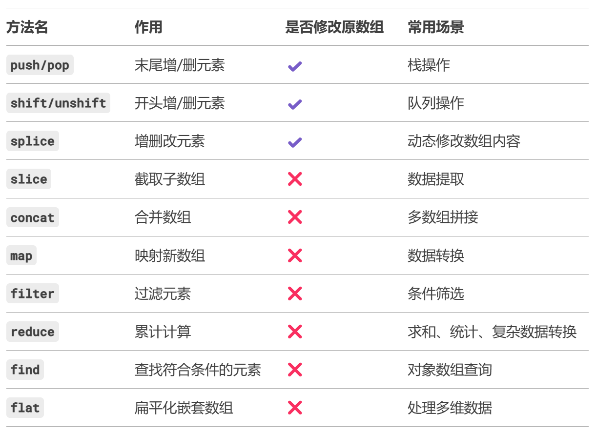

# 数组常用操作

## 修改原数组的方法

### `push()` / `pop()`
> 在数组末尾添加/删除元素
> 
> push返回新长度，pop返回被删除的元素

### `unshift()` / `shift()`

> 在数组开头添加/删除元素
> 
> unshift返回新长度，shift返回被删除的元素

### `splice()`

> 从指定位置删除、替换或添加元素
> 
> 参数：`splice(start, deleteCount, item1, item2, ...)`

```js
let arr = [1, 2, 3, 4];
arr.splice(1, 2, 'a', 'b'); // 从索引1开始，删除2个元素，添加'a','b'
// arr → [1, 'a', 'b', 4]
```

### `reverse()`
作用：反转数组顺序。

```js
[1, 2, 3].reverse(); // [3, 2, 1]
```

### `sort()`


### `fill()`

作用：填充数组（ES6+）

```js
new Array(3).fill(0); // [0, 0, 0]
```

## 不修改原数组的方法

### `concat()`
作用：合并数组，返回新数组。

```js
[1, 2].concat([3, 4]); // [1, 2, 3, 4]
```

### `slice()`
作用：截取子数组（浅拷贝）。

```js
[1, 2, 3, 4].slice(1, 3); // [2, 3]
```

### `join()`
作用：将数组转为字符串。

```js
[1, 2, 3].join('-'); // "1-2-3"
```

## 搜索与判断方法

### `indexOf()` / `lastIndexOf()`
作用：查找元素索引（严格相等 ===）。

```js
[1, 2, 3].indexOf(2); // 1
```

### `includes() ES6+`
作用：判断是否包含某元素。

```js
[1, 2, 3].includes(2); // true
```

### `find()` / `findIndex()` ES6+
作用：根据回调函数查找元素或索引。

```js
const users = [{id:1}, {id:2}];
users.find(user => user.id === 2); // {id: 2}
```

## 迭代方法

### `forEach()`
作用：遍历数组，无返回值。

```js
[1, 2, 3].forEach(num => console.log(num));
```

### `map()`
作用：映射新数组。

```js
[1, 2, 3].map(num => num * 2); // [2, 4, 6]
```

### `filter()`
作用：过滤符合条件的元素。

```js
[1, 2, 3].filter(num => num > 1); // [2, 3]
```

### `reduce()` / `reduceRight()`
作用：累计计算。

```js
[1, 2, 3].reduce((sum, num) => sum + num, 0); // 6
```

### `some()` / `every()`
作用：判断是否至少有一个/全部元素满足条件。

```js
[1, 2, 3].some(num => num > 2); // true
[1, 2, 3].every(num => num > 0); // true
```

## 转换与生成方法

### `flat()` / `flatMap()`（ES6+）
作用：扁平化数组。

```js
[1, [2, [3]]].flat(2); // [1, 2, 3]
[1, 2].flatMap(num => [num, num * 2]); // [1, 2, 2, 4]
```

### `Array.from()`
作用：将类数组对象转为数组。

```js
Array.from('123'); // ['1', '2', '3']
```

## 其他方法

### `isArray()`
作用：判断是否为数组。

```js
Array.isArray([]); // true
```


### `copyWithin()`
作用：复制数组的一部分到同一数组的另一位置。

```js
[1, 2, 3, 4].copyWithin(0, 2); // [3, 4, 3, 4]
```

## 方法总结



##  常用操作

###  求和

```js
const arr = [1, 2, 3, 4, 5];

// 方法1: reduce
const sum = arr.reduce((acc, num) => acc + num, 0);

// 方法2: for循环
let sum = 0;
for (const num of arr) sum += num;

console.log(sum); // 15
```

###  最大值/最小值

```js
const arr = [1, 2, 3, 4, 5];

// 方法1: Math.max + 展开运算符
const max = Math.max(...arr);
const min = Math.min(...arr);

// 方法2: reduce（适合大数组，避免展开运算符的栈溢出）
const max = arr.reduce((a, b) => Math.max(a, b), -Infinity);
const min = arr.reduce((a, b) => Math.min(a, b), -Infinity);

console.log(max); // 5
console.log(min); // 1
```

###  去重操作

```js
const arr = [1, 2, 2, 3, 3, 3];
const unique = [...new Set(arr)]; // [1, 2, 3]
```

###  过滤

```js
const arr = [1, 2, 3, 4, 5];
const evenNumbers = arr.filter(num => num % 2 === 0); // [2, 4]
```

###  映射

```js
const arr = [1, 2, 3];
const doubled = arr.map(num => num * 2); // [2, 4, 6]
```

###  排序

```js
const arr = [3, 1, 4, 2];
// 升序
arr.sort((a, b) => a - b); // [1, 2, 3, 4]
// 降序
arr.sort((a, b) => b - a); // [4, 3, 2, 1]
```

###  检查元素是否存在

```js
const arr = [1, 2, 3];
arr.includes(2); // true
arr.indexOf(3) !== -1; // true
```

###  合并数组

```js
const arr1 = [1, 2], arr2 = [3, 4];
const merged = [...arr1, ...arr2]; // [1, 2, 3, 4]
```

###  扁平化数组

```js
const arr = [1, [2, [3]]];
const flat = arr.flat(2); // [1, 2, 3] (参数为展开深度)
```

###  计算平均值

```js
const avg = arr.reduce((acc, num) => acc + num, 0) / arr.length;
```