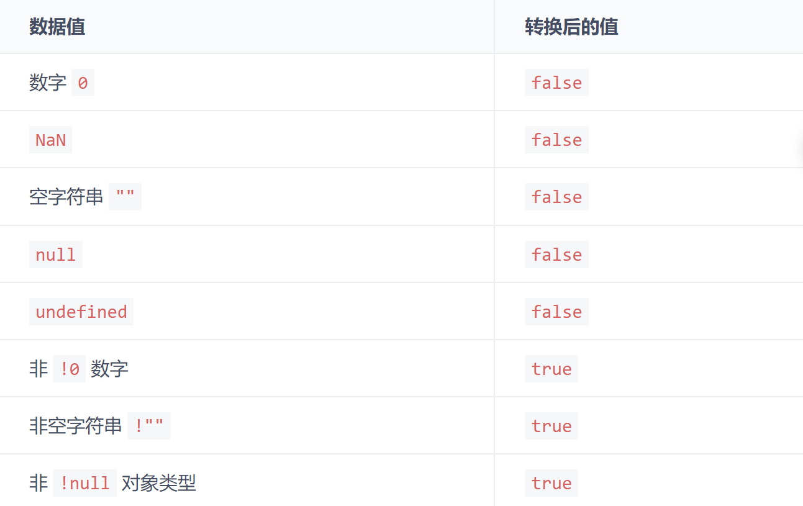
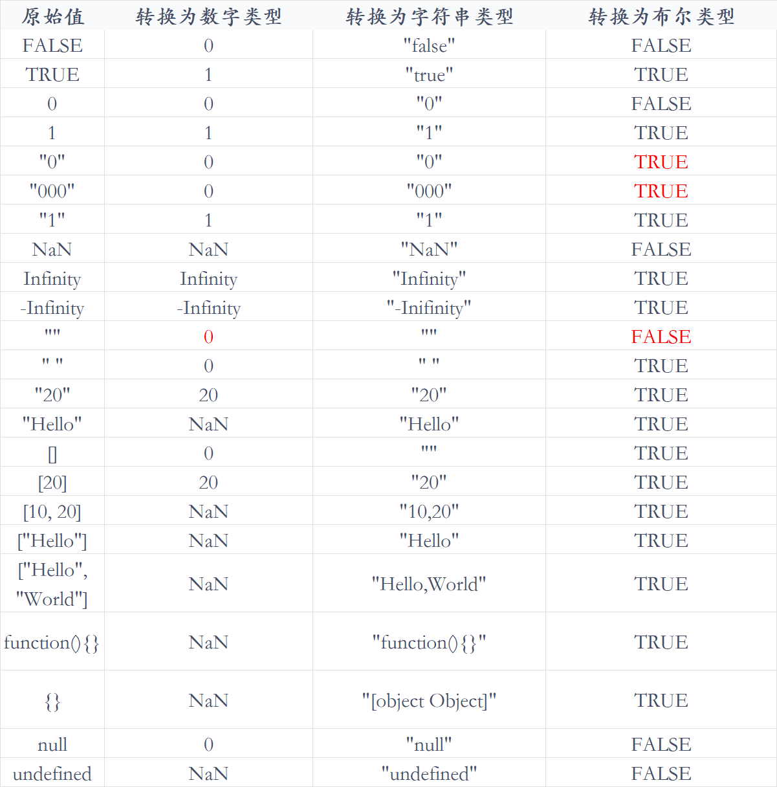

# 汇总 1

## 单线程的 JavaScript

作为浏览器脚本语言，JavaScript 的主要作用是与用户交互和操作 DOM。

如果 JavaScript 是多线程，当页面更新内容的时候，用户又触发了交互，这时候线程间的同步问题会很复杂，为了避免复杂性，JavaScript 被设计为单线程。

### JavaScript 运行

JavaScript 运行时，主线程会形成一个栈，这个栈主要是解释器用来最终函数执行流的一种机制。通常这个栈被称为调用栈 Call Stack，或执行栈 Execution Context Stack

调用栈，具有后进先出的结构。

调用栈内存放的是代码执行期间的所有执行上下文。

- 每调用一个函数，解释器就会把该函数的执行上下文添加到调用栈并开始执行；

- 正在调用栈中执行的函数，如果还调用了其他函数，那么新函数也会被添加到调用栈，并立即执行；

- 当前函数执行完毕后，解释器会将其执行上下文清除调用栈，继续执行剩余执行上下文的剩余代码

- 分配的调用栈空间被占满，会引发“堆栈溢出”错误。

### 事件循环

单线程意味着任务需要一个一个进行，如果有任务是等待用户输入，那么在用户操作之前，其他任务都会等待，页面处于假死状态，体验很糟，所以出现了异步任务。

JavaScript 中，所有的任务都可以分为：

- 同步任务：立即执行的任务，同步任务一般会直接进入到主线程中执行

- 异步任务：异步执行的任务，比如 ajax 网络请求，setTimeout 定时函数等


异步任务又可以分为宏任务与微任务。

常见的宏任务：

- script(外层同步代码)

- setTimeout/setInterval

- UI rendering/UI 事件

- postMessage、MessageChannel

- setImmediate、I/O(Node.js)

常见的微任务：

- Promise.then

- MutationObserver

- Object.observer(已废弃，Proxy 对象替代)

- process.nextTick（Node.js）

`new Promise是同步任务，直接执行`


#### async 和 await

async 用来声明一个异步方法，而 await 是用来等待异步方法执行

async 函数返回一个 promise 对象

```js
function f() {
  return Promise.resolve("TEST");
}

async function asyncF() {
  return "TEST";
}
```

正常情况下，await 命令后面是一个 Promise 对象，返回该对象的结果

如果不是 Promise 对象，就直接返回对应的值

```js
async function f() {
  return await 123;
  // 等同于return 123;
}

f().then((v) => console.log(v));
// 123
```

但不管 await 后面跟着的是什么，await 都会阻塞后面的代码

```js
async function fn1() {
  console.log(1);

  await fn2();

  console.log(2); //被阻塞
}

async function fn2() {
  console.log("fn2");
}

fn1();

console.log(3);

// await会阻塞下面的代码，即加入微任务队列，先执行async外面的同步代码，同步代码执行完，再回到async函数中，再执行之前阻塞的代码
// 1,fn2,3,2
```

示例：

```js
async function async1() {
  console.log("async1 start");
  await async2();
  console.log("async1 end");
}
async function async2() {
  console.log("async2");
}
console.log("script start");
setTimeout(function () {
  console.log("settimeout");
});
async1();
new Promise(function (resolve) {
  console.log("promise1");
  resolve();
}).then(function () {
  console.log("promise2");
});
console.log("script end");
// script start、async1 start、async2、promise1、script end、async1 end、promise2、settimeout
```

#### async/await 其他细节

```js
async function async1 () {
    await new Promise((resolve, reject) => {
        resolve()
    })
    console.log('A')
}
​
async1()
​
new Promise((resolve) => {
    console.log('B')
    resolve()
}).then(() => {
    console.log('C')
}).then(() => {
    console.log('D')
})
​
// 最终结果👉: B A C D


async function async1 () {
    await async2()
    console.log('A')
}
​
async function async2 () {
    return new Promise((resolve, reject) => {
        resolve()
    })
}
​
async1()
​
new Promise((resolve) => {
    console.log('B')
    resolve()
}).then(() => {
    console.log('C')
}).then(() => {
    console.log('D')
})
​
// 最终结果👉: B C D A
```

async 函数处理返回值，会像 Promise.prototype.then 一样，会对返回值的类型进行辨识

👉 根据返回值的类型，引起 js 引擎 对返回值处理方式的不同

> 📑 结论：async 函数在抛出返回值时，会根据返回值类型开启不同数目的微任务
>
> - return 结果值：非 thenable、非 promise（不等待）
>
> - return 结果值：thenable（等待 1 个 then 的时间）
>
> - return 结果值：promise（等待 2 个 then 的时间）

```js
async function testA () {
    return 1;
}
​
testA().then(() => console.log(1));
Promise.resolve()
    .then(() => console.log(2))
    .then(() => console.log(3));
​
// (不等待)最终结果👉: 1 2 3


async function testB () {
    return {
        then (cb) {
            cb();
        }
    };
}
​
testB().then(() => console.log(1));
Promise.resolve()
    .then(() => console.log(2))
    .then(() => console.log(3));
​
// (等待一个then)最终结果👉: 2 1 3

async function testC () {
    return new Promise((resolve, reject) => {
        resolve()
    })
}

testC().then(() => console.log(1));
Promise.resolve()
    .then(() => console.log(2))
    .then(() => console.log(3));

// (等待两个then)最终结果👉: 2 3 1


async function testC () {
    return new Promise((resolve, reject) => {
        resolve()
    })
}

testC().then(() => console.log(1));
Promise.resolve()
    .then(() => console.log(2))
    .then(() => console.log(3))
    .then(() => console.log(4))

// (等待两个then)最终结果👉: 2 3 1 4

```

```js
async function async1 () {
    console.log('1')
    await async2()
    console.log('AAA')
}
​
async function async2 () {
    console.log('3')
    return new Promise((resolve, reject) => {
        resolve()
        console.log('4')
    })
}
​
console.log('5')
​
setTimeout(() => {
    console.log('6')
}, 0);
​
async1()
​
new Promise((resolve) => {
    console.log('7')
    resolve()
}).then(() => {
    console.log('8')
}).then(() => {
    console.log('9')
}).then(() => {
    console.log('10')
})
console.log('11')
​
// 最终结果👉: 5 1 3 4 7 11 8 9 AAA 10 6

```

跟 Promise 的情况

```js
async function test () {
    console.log(1);
    await new Promise((resolve, reject) => {
        resolve()
    })
    console.log(2);
}
​
test();
console.log(3);
​
Promise.resolve()
    .then(() => console.log(4))
    .then(() => console.log(5))
    .then(() => console.log(6))
    .then(() => console.log(7));
​
// 最终结果👉: 1 3 2 4 5 6 7

// 为什么不等待两个 then 的时间呢？
// TC 39(ECMAScript标准制定者) 对await 后面是 promise 的情况如何处理进行了一次修改，移除了额外的两个微任务，在早期版本，依然会等待两个 then 的时间
// 但在这次更新中并没有修改 thenable 的情况
// 这样做可以极大的优化 await 等待的速度
```

## 事件循环

JavaScript 代码的执行过程中，除了依靠函数`调用栈`来搞定函数的执行顺序外，还依靠`任务队列(task queue)`来搞定另外一些代码的执行。整个执行过程，我们称为事件循环过程。一个线程中，事件循环是唯一的，但是任务队列可以拥有多个。任务队列又分为 macro-task（宏任务）与 micro-task（微任务），在最新标准中，它们被分别称为 task 与 jobs。

执行顺序：

```js
执行同步代码

执行完所有同步代码后且执行栈为空，判断是否有微任务需要执行

执行所有微任务且微任务队列为空

是否有必要渲染页面

执行一个宏任务
```

macro-task 大概包括：

- script(整体代码，可以理解为外层同步代码)

- setTimeout

- setInterval

- setImmediate

- I/O

- UI render

micro-task 大概包括:

- process.nextTick

- Promise

- Async/Await(实际就是 promise)

- MutationObserver(html5 新特性)


## 柯里化

柯里化是把一个多参函数转化为一个嵌套的一元函数的过程

柯里化的意义：

1、让纯函数更纯，每次接受一个参数，松散解耦

2、惰性执行

```js
let fn = (x, y) => x + y;

// 转化

const curry = function (fn) {
  return function (x) {
    return function (y) {
      return fn(x, y);
    };
  };
};

let myfn = curry(fn);
console.log(myfn(1)(2));

// 多参数
const curry = function (fn) {
  return function curriedFn(...args) {
    if (args.length < fn.length) {
      return function () {
        return curriedFn(...args.concat([...arguments]));
      };
    }
    return fn(...args);
  };
};
const fn = (x, y, z, a) => x + y + z + a;
const myfn = curry(fn);
console.log(myfn(1)(2)(3)(1));
```

## 精度问题

JavaScript 中 Number 采用的是 IEEE754 规范中 64 位双精度浮点数编码

这样的储存结构优点是可以归一化处理整数和小数，节省存储空间

对于整数，可以轻易转化成十进制或者二进制，但对于浮点数，因为小数点的存在，小数点的位置不是固定的，解决方法是使用科学计数法

但计算机只能使用二进制表示，二进制转换为科学计数法的公式为：`x=a*2^e`

存储二进制时小数点的偏移量最大为 52 位，最多可以表达的位数是`2^53`，对应科学计数的尾数是`9.007199254740992`，这是 JS 最多能表示的精度

长度是 16，所以可以使用 toPrecision(16)来做精度运算，超过的精度会自动做凑整处理

## 类型转换

[https://tsejx.github.io/javascript-guidebook/basic-concept/data-types/type-conversion#%E9%9A%90%E5%BC%8F%E7%B1%BB%E5%9E%8B%E8%BD%AC%E6%8D%A2](https://tsejx.github.io/javascript-guidebook/basic-concept/data-types/type-conversion#%E9%9A%90%E5%BC%8F%E7%B1%BB%E5%9E%8B%E8%BD%AC%E6%8D%A2)

主要摘抄隐式类型转换，涉及到转换为 Boolean、Number、String 类型

JavaScript 中，当运算符在运算时，如果两边数据不统一，CPU 就无法运算，这时编译器会自动将运算符两边的数据做一个数据类型转换，转成相同的数据类型再计算

### 隐式类型转换——Boolean

值在逻辑判断和逻辑运算时会隐式转换为 Boolean



:::tip
使用 new 运算符创建的对象隐式转换为 Boolean 类型的值都是 true。
:::

两个连续非操作可以将一个数据强制转换为 Boolean 类型

```js
!!undefined;
// false

!!null;
// false

!!1;
// true

!!"";
// false

!!"Hello";
// true

!!{};
// true

!![];
// true

!!function () {};
// true
```

### 隐式类型转换——运行环境

很多内置函数期望传入的参数的数据类型是固定的，如 alert(value)，它期望传入的 value 为 String 类型，但是如果我们传入的是 Number 类型或者 Object 类型等非 String 类型的数据的时候，就会发生数据类型的隐式转换。这就是环境运行环境对数据类型转换的影响。

类似的方法还有：

- alert()

- parseInt()

### 隐式类型转换——运算符

#### 加号运算符

当加号运算符作为一元运算符运算值时，它会将该值转换为 Number 类型

```js
' ' +
// 0

'0' +
// 0

'10' +
// 10

'String' +
// NaN

true +
// 1

false +
// 0

undefined +
// 0

null +
// 0

[] +
// 0

![] +
// 0

[1] +
// 1

[1, 2] +
// NaN

[[1]] +
// 1

[[1, 2]] +
// NaN

{} +
// NaN

function () {};
// NaN

+'' +
// 0
```

当加号运算符作为`二元运算符`操作值时，它会根据两边值类型进行数据类型隐式转换

首先，当引用对象类型的值进行二元加号运算符运算时，会涉及到转换为原始数据类型的问题。事实上，当一个对象执行例如加法操作的时候，如果它是原始类型，那么就不需要转换。否则，将遵循以下规则：

- 调用实例的 valueOf() 方法，如果有返回的是基础类型，停止下面的过程；否则继续

- 调用实例的 toString() 方法，如果有返回的是基础类型，停止下面的过程；否则继续

- 都没返回原始类型，就会报错

如果运算符两边均为原始数据类型时，则按照以下规则解释：

- 字符串连接符：如果两个操作数中`只要存在一个操作数为 String 类型`，那么另一个操作数会调用 String() 方法转成字符串然后拼接

- 算术运算符：如果两个操作数`都不是 String 类型`，两个操作数会调用 Number() 方法隐式转换为 Number 类型（如果无法成功转换成数字，`则变为 NaN`，再往下操作），然后进行加法算术运算

值转换为 Number 类型和 String 类型都会遵循一个原则：如果该值为原始数据类型，则直接转换为 String 类型或 Number 类型。如果该值为引用数据类型，那么先通过固定的方法将复杂值转换为原始数据类型，再转为 String 类型或 Number 类型

:::tip
当 {} + 任何值 时， 前一个 {} 都会被 JavaScript 解释成空块并忽略他
:::

```js
"1" + 1             // "11"
"1" + "1"           // "11"
"1" + true          // "1true"
"1" + NaN           // "NaN"
"1" + []            // "1"
"1" + {}            // "1[object Object]"
"1" + function(){}  // "1function(){}"
"1" + new Boolean() // "1false"

1 + NaN             // NaN
1 + "true"          // "1true"
1 + true            // 2
1 + undefined       // NaN
1 + null            // 1

1 + []              // "1"
1 + [1, 2]          // "11,2"
1 + {}              // "1[object Object]"
1 + function(){}    // "1function(){}"
1 + Number()        // 1
1 + String()        // "1"

[] + []             // ""
{} + {}             // "[object Object][object Object]"
{} + []             // 0
{a: 0} + 1          // 1
[] + {}             // "[object Object]"
[] + !{}            // "false"
![] + []            // "false"
'' + {}             // "[object Object]"
{} + ''             // 0
[]["map"] + []      // "function map(){ [native code] }"
[]["a"] + []        // "undefined"
[][[]] + []         // "undefined"
+!![] + []          // 1
+!![]               // 1
1-{}                // NaN
1-[]                // 1
true - 1            // 0
{} - 1              // -1
[] !== []           // true
[]['push'](1)       // 1

(![]+[])[+[]]       // "f"
(![]+[])[+!![]]     // "a"
```

#### 相等运算符

- 如果其中一个操作值为`布尔值`，则在比较之前`先将其转换为数值`

- 如果其中一个操作值为字符串，另一个操作值为数值，则通过 Number() 函数将字符串`转换为数值`

- 如果其中一个操作值是对象，另一个不是，则调用对象的 `valueOf() 方法`，得到的结果按照前面的规则进行比较

- `null 与 undefined 是相等的`

- 如果一个操作值为 `NaN`，则返回 false

- 如果两个操作值都是对象，则比较它们`是不是指向同一个对象`

```js
"1" == true; // true
"1" == 1; // true
"1" == {}; // false
"1" == []; // false

undefined == undefined; // true
undefined == null; // true
nul == null; // true
```

#### 关系运算符

会把其他数据类型转换成 Number 之后再比较关系（除了 Date 类型对象）

- 如果两个操作值都是数值，则进行 数值 比较

- 如果两个操作值都是字符串，则比较字符串对应的 ASCII 字符编码值

- 多个字符则从左往右依次比较

- 如果`只有一个操作值是数值`，则将另一个操作值转换为数值，进行 `数值 比较`

- 如果一个操作数是对象，则调用 valueOf() 方法（如果对象没有 valueOf() 方法则调用 toString() 方法），得到的结果按照前面的规则执行比较

- 如果一个操作值是布尔值，则将其转换为 数值，再进行比较

:::tip
NaN 是非常特殊的值，它不和任何类型的值相等，包括它自己，同时它与任何类型的值比较大小时都返回 false
:::

```js
5 > 10;
// false

"2" > 10;
// false

"2" > "10";
// true

"abc" > "b";
// false

"abc" > "aad";
// true
```

### JavaScript 原始类型转换表



## this 关键字

this 的值取决于函数的调用方式。

this 的作用是指向当前执行代码的对象，在不同的情境下会有不同的值。

### 默认绑定规则

函数在哪个词法作用域中生效，this 就指向哪里（独立调用的函数就指向 window）

```js
var a = 1;
function foo() {
  console.log(this.a);
}
// 1

var a = 1;
function foo() {
  console.log(this);
}

function bar() {
  //bar的词法作用域是window
  var a = 2;
  foo();
} //foo是在bar的作用中调用，但是必须要知道bar的词法作用域中调用。
bar();
```

### 隐式绑定规则

当一个函数被对象拥有，且调用时，函数的 this 指向对象

```js
function foo() {
  console.log(this.a);
}

var obj = {
  a: 1,
  foo: foo,
};

obj.foo();
// 1
```

### 隐式丢失

当函数被多个对象链调用时，this 指向引用函数的那个对象

```js
var obj = {
  a: 1,
  foo: foo,
};

var obj2 = {
  a: 2,
  obj: obj,
};

function foo() {
  console.log(this.a);
}

obj2.obj.foo();
// 1，指向调用的，即obj的（就近原则）
```

### 显式绑定

call，apply，bind

### new 绑定

this 指向实例对象

### 箭头函数

箭头函数没有 this 关键字

## 作用域

作用域指的是变量能够被访问到的范围

JavaScript 中作用域分为局部作用域、全局作用域以及 es6 新增的块级作用域

### 局部作用域

在 JavaScript 函数中定义的变量叫做局部变量，这个时候只能在函数内部才能访问到它，所以它的作用域也是函数的内部，称为局部作用域

```js
function getName() {
  var name = "一个奕";
  console.log(name); //一个奕
}
console.log(name); //undefined
```

### 全局作用域

在 JavaScript 中，在函数外面定义的变量就称作全局变量，全局变量是挂载在 window 对象下的变量，所以在网页中的任何位置都可以访问到这个全局变量。

```js
var globalName = "全局的一个奕";
function getName() {
  console.log(globalName); //全局的一个奕
  var name = "局部的一个奕";
  console.log(name); //局部的一个奕
}
getName();
console.log(name); //undefined
console.log(globalName); //全局的一个奕

function setName() {
  vName = "没有定义而被直接赋值";
}
setName();
console.log(vName); //没有定义而被直接赋值
console.log(window.vName); //没有定义而被直接赋值
```

### 块级作用域

ES6 中新增了块级作用域，使用 let 定义的变量只能在块级作用域中被访问，有暂时性死区的特点，也就是说在变量在定义之前都不能被使用

if 语句以及 for 语句中的`{...} `这就是块级作用域。

```js
console.log(abc); //abc is not defined
if (true) {
  let abc = "嘿嘿~";
  console.log(abc); //嘿嘿~
}
console.log(abc); //abc is not defined
```

## 变量提升

原理：JS 引擎的工作方式是先解析代码，获取所有被声明的变量，然后再运行。JS 代码自上而下执行之前，浏览器首先会把所有带 `“VAR”/“FUNCTION”` 关键词的进行提前 “声明” 或者 “定义” ，这种预先处理机制称之为 “变量提升”。

```js
console.log(a, b); //undefined undefined
var a = 12,
  b = 12;

function fn() {
  console.log(a, b); //=>undefined 12
  var a = (b = 13);
  console.log(a, b); //=>13 13
}

fn();
console.log(a, b); //=>12 13
```

私有作用域中带 var 和不带 var 的区别：

1、带 var 的在私有作用域变量提升阶段，都声明为私有变量，跟外界没有关系

2、不带 var 不是私有变量，会向它的上级作用域查找，一直找到 window 为止

### 对等号左边进行变量提升

先把 fn 提升至顶部，运行到那里时才进行赋值

```js
sum();
fn(); // Uncaught TypeError: fn is not a function

//=>匿名函数之函数表达式
var fn = function () {
  console.log("fn");
}; //=>代码执行到此处会把函数值赋值给fn

//=>普通的函数
function sum() {
  console.log("sum");
}
```

### 条件判断下的变量提升

```js
/*
 * 在当前作用域下，不管条件是否成立都要进行变量提升
 *   =>带VAR的还是只声明
 *   =>带FUNCTION的在老版本浏览器渲染机制下，声明和定义都处理，但是为了迎合ES6中的块级作用
 *     域，新版浏览器对于函数（在条件判断中的函数），
 *     不管条件是否成立，都只是先声明，没有定义，类似于var
 */
console.log(a); //undefined
if (1 === 2) {
  var a = 3;
}
console.log(a); //undefined
```

### 重名问题的处理

```js
fn(); //=>4
function fn() {
  console.log(1);
}
fn(); //=>4
function fn() {
  console.log(2);
}
fn(); //=>4
var fn = 100; //=>带VAR的在提升阶段只把声明处理了,赋值操作没有处理,所以在代码执行的时候需要完成赋值 FN=100
fn(); //=>100() Uncaught TypeError: fn is not a function
function fn() {
  console.log(3);
}
fn();
function fn() {
  console.log(4);
}
fn();
```

如果名字重复了，不会重新的声明，但是会重新的定义（重新赋值）

## 参考

[https://juejin.cn/post/6844904079353708557](https://juejin.cn/post/6844904079353708557)

[https://juejin.cn/post/6948626943717670948?from=search-suggest](https://juejin.cn/post/6948626943717670948?from=search-suggest)

[https://tsejx.github.io/javascript-guidebook/basic-concept/data-types/type-conversion#%E9%9A%90%E5%BC%8F%E7%B1%BB%E5%9E%8B%E8%BD%AC%E6%8D%A2](https://tsejx.github.io/javascript-guidebook/basic-concept/data-types/type-conversion#%E9%9A%90%E5%BC%8F%E7%B1%BB%E5%9E%8B%E8%BD%AC%E6%8D%A2)

[https://juejin.cn/post/7301968484766695458](https://juejin.cn/post/7301968484766695458)

[https://juejin.cn/post/6844903976765227016#heading-0](https://juejin.cn/post/6844903976765227016#heading-0)

[https://juejin.cn/post/6844904093496918023?searchId=20240827091122CE649AF3B6A072C2F1AF](https://juejin.cn/post/6844904093496918023?searchId=20240827091122CE649AF3B6A072C2F1AF)
