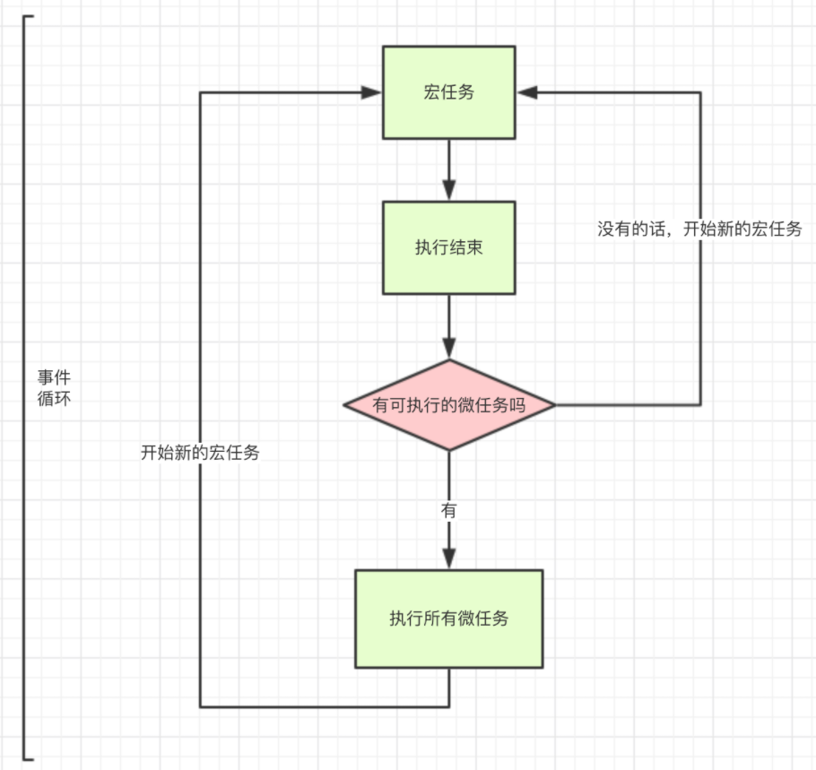

# 汇总 1

## 单线程的 JavaScript

作为浏览器脚本语言，JavaScript 的主要作用是与用户交互和操作 DOM。

如果 JavaScript 是多线程，当页面更新内容的时候，用户又触发了交互，这时候线程间的同步问题会很复杂，为了避免复杂性，JavaScript 被设计为单线程。

### JavaScript 运行

JavaScript 运行时，主线程会形成一个栈，这个栈主要是解释器用来最终函数执行流的一种机制。通常这个栈被称为调用栈 Call Stack，或执行栈 Execution Context Stack

调用栈，具有后进先出的结构。

调用栈内存放的是代码执行期间的所有执行上下文。

- 每调用一个函数，解释器就会把该函数的执行上下文添加到调用栈并开始执行；

- 正在调用栈中执行的函数，如果还调用了其他函数，那么新函数也会被添加到调用栈，并立即执行；

- 当前函数执行完毕后，解释器会将其执行上下文清除调用栈，继续执行剩余执行上下文的剩余代码

- 分配的调用栈空间被占满，会引发“堆栈溢出”错误。

### 事件循环

单线程意味着任务需要一个一个进行，如果有任务是等待用户输入，那么在用户操作之前，其他任务都会等待，页面处于假死状态，体验很糟，所以出现了异步任务。

JavaScript 中，所有的任务都可以分为：

- 同步任务：立即执行的任务，同步任务一般会直接进入到主线程中执行

- 异步任务：异步执行的任务，比如 ajax 网络请求，setTimeout 定时函数等


异步任务又可以分为宏任务与微任务。

常见的宏任务：

- script(外层同步代码)

- setTimeout/setInterval

- UI rendering/UI 事件

- postMessage、MessageChannel

- setImmediate、I/O(Node.js)

常见的微任务：

- Promise.then

- MutationObserver

- Object.observer(已废弃，Proxy 对象替代)

- process.nextTick（Node.js）

`new Promise是同步任务，直接执行`



#### async 和 await

async 用来声明一个异步方法，而 await 是用来等待异步方法执行

async 函数返回一个 promise 对象

```js
function f() {
  return Promise.resolve("TEST");
}

async function asyncF() {
  return "TEST";
}
```

正常情况下，await 命令后面是一个 Promise 对象，返回该对象的结果

如果不是 Promise 对象，就直接返回对应的值

```js
async function f() {
  return await 123;
  // 等同于return 123;
}

f().then((v) => console.log(v));
// 123
```

但不管 await 后面跟着的是什么，await 都会阻塞后面的代码

```js
async function fn1() {
  console.log(1);

  await fn2();

  console.log(2); //被阻塞
}

async function fn2() {
  console.log("fn2");
}

fn1();

console.log(3);

// await会阻塞下面的代码，即加入微任务队列，先执行async外面的同步代码，同步代码执行完，再回到async函数中，再执行之前阻塞的代码
// 1,fn2,3,2
```

示例：

```js
async function async1() {
  console.log("async1 start");
  await async2();
  console.log("async1 end");
}
async function async2() {
  console.log("async2");
}
console.log("script start");
setTimeout(function () {
  console.log("settimeout");
});
async1();
new Promise(function (resolve) {
  console.log("promise1");
  resolve();
}).then(function () {
  console.log("promise2");
});
console.log("script end");
// script start、async1 start、async2、promise1、script end、async1 end、promise2、settimeout
```

#### async/await 其他细节

```js
async function async1 () {
    await new Promise((resolve, reject) => {
        resolve()
    })
    console.log('A')
}
​
async1()
​
new Promise((resolve) => {
    console.log('B')
    resolve()
}).then(() => {
    console.log('C')
}).then(() => {
    console.log('D')
})
​
// 最终结果👉: B A C D


async function async1 () {
    await async2()
    console.log('A')
}
​
async function async2 () {
    return new Promise((resolve, reject) => {
        resolve()
    })
}
​
async1()
​
new Promise((resolve) => {
    console.log('B')
    resolve()
}).then(() => {
    console.log('C')
}).then(() => {
    console.log('D')
})
​
// 最终结果👉: B C D A
```

async 函数处理返回值，会像 Promise.prototype.then 一样，会对返回值的类型进行辨识

👉 根据返回值的类型，引起 js 引擎 对返回值处理方式的不同

> 📑 结论：async 函数在抛出返回值时，会根据返回值类型开启不同数目的微任务
>
> - return 结果值：非 thenable、非 promise（不等待）
>
> - return 结果值：thenable（等待 1 个 then 的时间）
>
> - return 结果值：promise（等待 2 个 then 的时间）

```js
async function testA () {
    return 1;
}
​
testA().then(() => console.log(1));
Promise.resolve()
    .then(() => console.log(2))
    .then(() => console.log(3));
​
// (不等待)最终结果👉: 1 2 3


async function testB () {
    return {
        then (cb) {
            cb();
        }
    };
}
​
testB().then(() => console.log(1));
Promise.resolve()
    .then(() => console.log(2))
    .then(() => console.log(3));
​
// (等待一个then)最终结果👉: 2 1 3

async function testC () {
    return new Promise((resolve, reject) => {
        resolve()
    })
}

testC().then(() => console.log(1));
Promise.resolve()
    .then(() => console.log(2))
    .then(() => console.log(3));

// (等待两个then)最终结果👉: 2 3 1


async function testC () {
    return new Promise((resolve, reject) => {
        resolve()
    })
}

testC().then(() => console.log(1));
Promise.resolve()
    .then(() => console.log(2))
    .then(() => console.log(3))
    .then(() => console.log(4))

// (等待两个then)最终结果👉: 2 3 1 4

```

```js
async function async1 () {
    console.log('1')
    await async2()
    console.log('AAA')
}
​
async function async2 () {
    console.log('3')
    return new Promise((resolve, reject) => {
        resolve()
        console.log('4')
    })
}
​
console.log('5')
​
setTimeout(() => {
    console.log('6')
}, 0);
​
async1()
​
new Promise((resolve) => {
    console.log('7')
    resolve()
}).then(() => {
    console.log('8')
}).then(() => {
    console.log('9')
}).then(() => {
    console.log('10')
})
console.log('11')
​
// 最终结果👉: 5 1 3 4 7 11 8 9 AAA 10 6

```

跟 Promise 的情况

```js
async function test () {
    console.log(1);
    await new Promise((resolve, reject) => {
        resolve()
    })
    console.log(2);
}
​
test();
console.log(3);
​
Promise.resolve()
    .then(() => console.log(4))
    .then(() => console.log(5))
    .then(() => console.log(6))
    .then(() => console.log(7));
​
// 最终结果👉: 1 3 2 4 5 6 7

// 为什么不等待两个 then 的时间呢？
// TC 39(ECMAScript标准制定者) 对await 后面是 promise 的情况如何处理进行了一次修改，移除了额外的两个微任务，在早期版本，依然会等待两个 then 的时间
// 但在这次更新中并没有修改 thenable 的情况
// 这样做可以极大的优化 await 等待的速度
```

## 事件循环

JavaScript 代码的执行过程中，除了依靠函数`调用栈`来搞定函数的执行顺序外，还依靠`任务队列(task queue)`来搞定另外一些代码的执行。整个执行过程，我们称为事件循环过程。一个线程中，事件循环是唯一的，但是任务队列可以拥有多个。任务队列又分为 macro-task（宏任务）与 micro-task（微任务），在最新标准中，它们被分别称为 task 与 jobs。

执行顺序：

```js
执行同步代码

执行完所有同步代码后且执行栈为空，判断是否有微任务需要执行

执行所有微任务且微任务队列为空

是否有必要渲染页面

执行一个宏任务
```

macro-task 大概包括：

- script(整体代码)

- setTimeout

- setInterval

- setImmediate

- I/O

- UI render

micro-task 大概包括:

- process.nextTick

- Promise

- Async/Await(实际就是 promise)

- MutationObserver(html5 新特性)


## 柯里化

柯里化是把一个多参函数转化为一个嵌套的一元函数的过程

柯里化的意义：

1、让纯函数更纯，每次接受一个参数，松散解耦

2、惰性执行

```js
let fn = (x, y) => x + y;

// 转化

const curry = function (fn) {
  return function (x) {
    return function (y) {
      return fn(x, y);
    };
  };
};

let myfn = curry(fn);
console.log(myfn(1)(2));

// 多参数
const curry = function (fn) {
  return function curriedFn(...args) {
    if (args.length < fn.length) {
      return function () {
        return curriedFn(...args.concat([...arguments]));
      };
    }
    return fn(...args);
  };
};
const fn = (x, y, z, a) => x + y + z + a;
const myfn = curry(fn);
console.log(myfn(1)(2)(3)(1));
```

## 精度问题

JavaScript 中 Number 采用的是 IEEE754 规范中 64 位双精度浮点数编码

这样的储存结构优点是可以归一化处理整数和小数，节省存储空间

对于整数，可以轻易转化成十进制或者二进制，但对于浮点数，因为小数点的存在，小数点的位置不是固定的，解决方法是使用科学计数法

但计算机只能使用二进制表示，二进制转换为科学计数法的公式为：`x=a*2^e`

存储二进制时小数点的偏移量最大为 52 位，最多可以表达的位数是`2^53`，对应科学计数的尾数是`9.007199254740992`，这是 JS 最多能表示的精度

长度是 16，所以可以使用 toPrecision(16)来做精度运算，超过的精度会自动做凑整处理

## 参考

[https://juejin.cn/post/6844904079353708557](https://juejin.cn/post/6844904079353708557)

[https://juejin.cn/post/6948626943717670948?from=search-suggest](https://juejin.cn/post/6948626943717670948?from=search-suggest)
