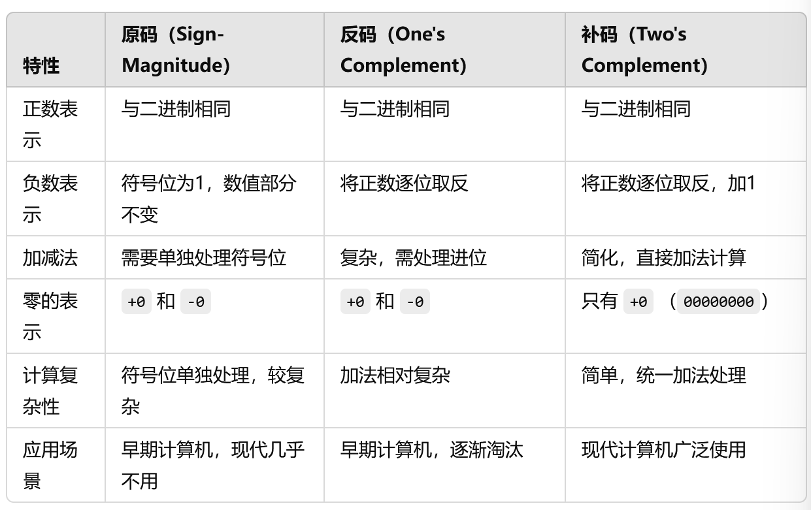

# 精度问题

## 精度问题

JavaScript 中 Number 采用的是 IEEE754 规范中 64 位双精度浮点数编码

这样的储存结构优点是可以归一化处理整数和小数，节省存储空间

对于整数，可以轻易转化成十进制或者二进制，但对于浮点数，因为小数点的存在，小数点的位置不是固定的，解决方法是使用科学计数法

但计算机只能使用二进制表示，二进制转换为科学计数法的公式为：`x=a*2^e`

存储二进制时小数点的偏移量最大为 52 位，最多可以表达的位数是`2^53`，对应科学计数的尾数是`9.007199254740992`，这是 JS 最多能表示的精度

长度是 16，所以可以使用 toPrecision(16)来做精度运算，超过的精度会自动做凑整处理

## 为什么会有精度问题？

在计算机中，某些十进制的数字不能用有限的二进制位数精确表示。例如，0.1 和 0.2 在二进制中无法精确表示，它们会被近似为某个二进制浮点数。这种近似表示会导致运算结果不完全准确。

## 常见的精度问题

1、浮点数相加

```js
console.log(0.1 + 0.2); // 输出 0.30000000000000004
```

2、减法问题

```js
console.log(0.3 - 0.1); // 输出 0.19999999999999998
```

3、乘法问题

```js
console.log(0.1 * 0.2); // 输出 0.020000000000000004
```

## js 处理精度问题

### toFixed()方法四舍五入

> toFixed() 方法可以将数字四舍五入到指定的小数位数：

```js
console.log((0.1 + 0.2).toFixed(2)); // 输出 "0.30"
```

### 使用 toPrecision() 控制总的有效位数

> toPrecision() 可以将数字格式化为指定的总位数

```js
console.log((0.1 + 0.2).toPrecision(2)); // 输出 "0.30"
```

### 避免使用浮点数，转换为整数进行计算

> 通过将浮点数乘以一个合适的倍数，转换成整数进行计算，可以有效避免精度问题，最后再除以相应的倍数还原结果

```js
console.log((0.1 * 10 + 0.2 * 10) / 10); // 输出 0.3
console.log((0.3 * 100 - 0.1 * 100) / 100); // 输出 0.2
```

### 使用 Math.round() 进行四舍五入

```js
console.log(Math.round((0.1 + 0.2) * 100) / 100); // 输出 0.3
```

### 使用大数库（BigNumber）进行精确计算

JavaScript 本身的 Number 类型有精度限制，但可以使用一些外部的库来解决精度问题。常见的库包括：

- Big.js：用于精确处理小数的运算。

- bignumber.js：可以处理非常大的数字和精确的小数运算。

- decimal.js：可以处理小数运算的高精度库。

### JavaScript 内置的 BigInt 类型（适用于整数运算）

```js
const bigInt1 = BigInt(9007199254740991);
const bigInt2 = BigInt(1);

console.log(bigInt1 + bigInt2); // 输出 "9007199254740992n"
```

### 使用 ES2020 的 `Number.EPSILON`

`Number.EPSILON` 是 JavaScript 中最小的浮点误差值，可以用来判断两个浮点数是否“足够接近”，即它们的差值是否小于 `Number.EPSILON`。

```js
function isEqual(a, b) {
  return Math.abs(a - b) < Number.EPSILON;
}

console.log(isEqual(0.1 + 0.2, 0.3)); // 输出 true
```

## 数字在计算机中的表示

### 原码、反码和补码

1、原码

是一种直观的表示方法，直接使用最高位作为符号位，剩下的位表示数值的大小，符号位为 0 表示正数，-1 表示负数

示例：

```
例子（以8位为例）：

+5 的原码表示：00000101

-5 的原码表示：10000101
```

优点：表示方式直观，容易理解

缺点：加减法运算比较复杂，需要专门处理符号位

2、反码

是一种对负数进行特殊表示的方法，是将正数的二进制位取反得到的。正数的反码和原码相同，而负数的反码通过将对应正数的原码逐位取反（0 变 1，1 变 0）得到

特点：

正数的反码和原码相同

负数的反码是对应正数原码的二进制码诸位取反

例子：

```
+5 的反码：00000101（和原码相同）

-5 的反码：对 +5 的二进制取反，得到 11111010
```

优点：

加法运算稍有简化，反码在一些早期计算机中用于简化硬件设计

缺点：

和原码一样，存在两个零的表示：+0 表示为 00000000，-0 表示为 11111111，这仍然会带来不必要的复杂性

加减法运算仍然不是最优，需要处理进位和借位的复杂情况

3、补码

补码是现代计算机系统中最常用的负数表示方法。它解决了原码和反码的一些不足，使得加减法可以统一处理，简化了硬件设计。补码的负数表示通过取反加一来获得，即：负数的补码是对应正数的反码再加 1。

特点：

正数的补码和原码相同

负数的补码是正数的反码加 1

只有一种零表示

例子：

```
+5 的补码：00000101（和原码、反码相同

-5 的补码：对 +5 取反得到 11111010，然后加 1，得到 11111011
```

优点：

唯一的零

加减法统一处理

硬件简单：硬件设计更简单，减少了复杂的处理逻辑

**总结**



8 位情况下：

<!-- 补码范围：

- 正数（000000~0111111）0~127

- 负数 （10000000~1111111）-128~-1 -->

### 整数的表示

#### 无符号整数

无符号整数只表示非负数，没有符号位

一个 n 位的无符号整数可以表示的范围是 0 到 2^n - 1

#### 有符号整数

有符号整数可以表示正数和负数。通常采用补码（Two's Complement）方式来表示有符号整数。在 n 位系统中，第一个位（最高位）是符号位，用于表示正负

### 浮点数表示
浮点数表示的是带有小数部分的数。由于计算机中小数的表示和处理较为复杂，通常采用`IEEE 754 标准`来表示浮点数

浮点数表示由三部分组成：

1、符号位

2、指数：用来表述数的范围

3、尾数：表示有效数字

#### 单精度浮点数(32位，float)
在单精度浮点数中，32 位被分配如下：

- 1 位：符号位。

- 8 位：指数位，存储的是指数的偏移值（偏移127）。

- 23 位：尾数位，用于表示有效位数。

#### 双精度浮点数(64位，double)

在双精度浮点数中，64 位被分配如下：

- 1 位：符号位。

- 11 位：指数位，存储的是指数的偏移值（偏移1023）。

- 52 位：尾数位，用于表示有效位数。

#### IEEE 754标准的表示方法

浮点数的值由以下公式计算：

```
(-1)^符号位 × 尾数 × 2^指数偏移
```

### 大整数
为了处理非常大的整数，JavaScript引入了 BigInt 类型，它能够表示任意大小的整数，而不像普通的 Number 类型那样有固定的大小限制

BigInt 的特性：

- BigInt 不会出现 Number 类型的精度丢失问题。

- 通过在整数末尾加上 n 来创建 BigInt 值

```js
const bigInt = 1234567890123456789012345678901234567890n;
```

### 其他特殊数字的表示

#### NaN

NaN 是 JavaScript 中表示非数字值的一个特殊数值

通常在无效的数学操作（如 `0/0`）中产生

```js
console.log(1 / 0);  // 输出 Infinity
console.log(-1 / 0); // 输出 -Infinity
```

#### Infinity（正无穷大）和 -Infinity（负无穷大）

当计算结果超出了可表示的范围时，JavaScript会返回 Infinity 或 -Infinity

```js
console.log(1 / 0);  // 输出 Infinity
console.log(-1 / 0); // 输出 -Infinity

```

### 定点数的表示
定点数（Fixed-point number）是一种表示小数的方式，尤其是在某些嵌入式系统中使用。定点数`通过将小数部分放大为整数来表示`。常见的做法是将所有小数乘以一个固定的倍数（如 100、1000），然后使用整数进行计算。定点数的计算比浮点数更高效，但灵活性较低，无法表示非常大或非常小的数。

### BCD（Binary-Coded Decimal）表示法

BCD（二进制编码十进制） 是一种将十进制数用4位二进制编码表示的方法。每个十进制数的每一位用4位二进制表示，因此在处理需要精确表示的场景（如金融数据）时，BCD比浮点数更精确

### 字符编码与数字表示

在计算机中，数字有时也以字符形式存储。常见的字符编码如 ASCII、Unicode 规定了数字字符如何表示。例如，字符 '1' 在 ASCII 编码中表示为 49（十进制），在二进制中为 00110001。