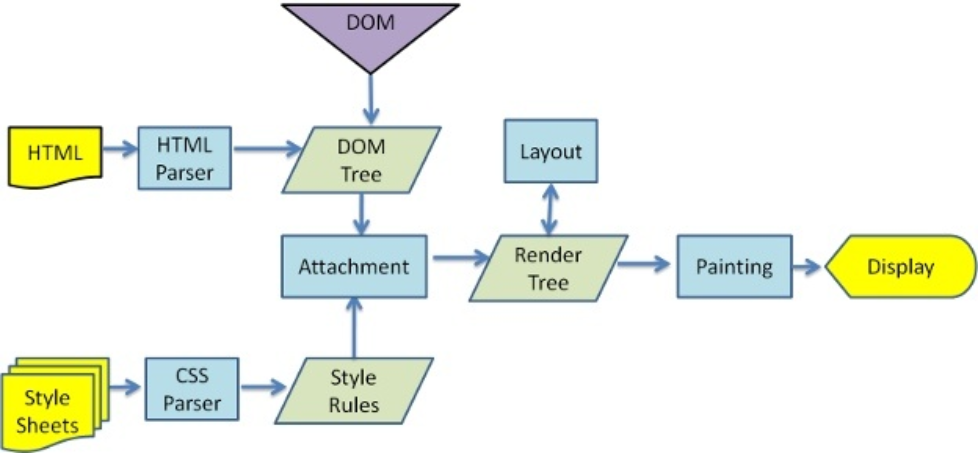

# Hooks

## 什么是 Hooks？

Hooks 是 React 16.8 新增的特性，可以让在不编写 class 的情况下使用 state 以及其他的 React 特性

### 解决的问题

类组件的不足：

- 状态逻辑难复用：在组件之间复用状态逻辑困难，可能要用到 render props（渲染属性）或 HOC（高阶组件），但无论是渲染属性还是高阶组件，都会在原先的组件外包裹一层父容器（一般是 div 元素），导致层级冗余

- 趋于复杂难以维护：生命周期函数中混杂不相干逻辑

- this 指向：父组件给子组件传递函数，必须绑定 this

Hooks 优势：

- 优化上面的三个问题

- 能在无需修改组件结构的情况下复用状态逻辑（自定义 Hooks）

- 能将组件中相互关联的部分拆分成更小的函数

- 副作用的关注点分离

> 副作用指那些没有发生在数据向视图转换过程中的逻辑，如 ajax、访问原生 dom、本地持久化缓存、绑定/解绑事件、添加订阅、设置定时器、记录日志等。

### 副作用

React 中，副作用通常指的是那些无法再组件渲染时同步完成的操作，例如：

- 数据获取（Ajax，API 请求）

- 手动 DOM 操作

- 订阅事件或计时器

- 修改浏览器的标题或 URL

这些副作用不能直接写在组件的渲染逻辑中，因为 React 的渲染逻辑应该是“纯”的——渲染过程不应该影响外部世界，而是根据 props 和 state 渲染 UI

React 提供了 useEffect 钩子来处理这些副作用

> 数据获取、订阅、修改 DOM 等

**副作用的清理**

- 某些副作用需要在组件卸载，例如设置了一个计时器或事件监听时，在组件销毁时应该移除它们，否则会引发内存泄漏

```js
import React, { useEffect } from "react";

function TimerComponent() {
  useEffect(() => {
    const timer = setInterval(() => {
      console.log("Tick");
    }, 1000);

    // 清理副作用
    return () => {
      clearInterval(timer); // 组件卸载或更新时清除计时器
    };
  }, []); // 空数组意味着该副作用只在组件挂载和卸载时执行

  return <div>Timer</div>;
}
```

#### 无副作用的纯函数

在函数式编程中，纯函数 是没有副作用的函数。这意味着，纯函数：

- 只依赖于输入参数，且不会改变输入参数。

- 不会修改外部状态（如全局变量、外部数据等）。

- 多次调用纯函数，返回值始终相同。

纯函数没有副作用，因此更加可预测、容易测试，并且代码的行为不会依赖外部环境的变化。

#### 副作用的利弊

优点：副作用可以与外部世界进行交互，如网络请求、修改 DOM 等，是实际开发中不可避免的。

缺点：副作用会增加程序的复杂性，因为它们会导致函数的行为依赖于外部状态，进而影响可预测性和可测试性。

## useState & useMemo & useCallback

### 惰性初始化 state

initialState 参数只会在组件的初始化渲染中起作用，后续渲染时会被忽略

如果初始 state 需要通过复杂计算获得，则可以传入一个函数，在函数中计算并返回初始的 state，此函数只在初始渲染时被调用

```js
function Counter5(props) {
  console.log("Counter5 render");
  // 这个函数只在初始渲染时执行一次，后续更新状态重新渲染组件时，该函数就不会再被调用
  function getInitState() {
    return { number: props.number };
  }
  let [counter, setCounter] = useState(getInitState);
  return (
    <>
      <p>{counter.number}</p>
      <button onClick={() => setCounter({ number: counter.number + 1 })}>
        +
      </button>
      <button onClick={() => setCounter(counter)}>setCounter</button>
    </>
  );
}
```

### 性能优化

1、Object.is（浅比较）

- Hook 内部使用 Object.is 来比较新/旧 state 是否相等

- 与 class 组件中的 setState 方法不同，如果你修改状态的时候，传的状态值没有变化，则不重新渲染

- 与 class 组件中的 setState 方法不同，useState 不会自动合并更新对象。可以用函数式的 setState 结合展开运算符来达到合并更新对象的效果

2、减少渲染次数

- 默认，只要父组件状态改变了（不管子组件依不依赖该状态），子组件也会重新渲染

- 一般的优化：

> - 类组件：可以使用 pureComponent
>
> - 函数组件：使用 React.memo（但每次更新都是独立的，哪怕没有变化，也会重新渲染）

- 深入的优化：
  > - useCallback：收一个内联回调函数参数和一个依赖项数组（子组件依赖父组件的状态，即子组件会使用到父组件的值） ，useCallback 会返回该回调函数的 memoized 版本，该回调函数仅在某个依赖项改变时才会更新
  >
  > - useMemo：把创建函数和依赖项数组作为参数传入 useMemo，它仅会在某个依赖项改变时才重新计算 memoized 值。这种优化有助于避免在每次渲染时都进行高开销的计算

```js
import React, { useState, memo, useMemo, useCallback } from "react";

function SubCounter({ onClick, data }) {
  console.log("SubCounter render");
  return <button onClick={onClick}>{data.number}</button>;
}
SubCounter = memo(SubCounter);

let oldData, oldAddClick;
export default function Counter2() {
  console.log("Counter render");
  const [name, setName] = useState("计数器");
  const [number, setNumber] = useState(0);
  // 父组件更新时，这里的变量和函数每次都会重新创建，那么子组件接受到的属性每次都会认为是新的
  // 所以子组件也会随之更新，这时候可以用到 useMemo
  // 有没有后面的依赖项数组很重要，否则还是会重新渲染
  // 如果后面的依赖项数组没有值的话，即使父组件的 number 值改变了，子组件也不会去更新
  //const data = useMemo(()=>({number}),[]);
  const data = useMemo(() => ({ number }), [number]);
  console.log("data===oldData ", data === oldData);
  oldData = data;

  // 有没有后面的依赖项数组很重要，否则还是会重新渲染
  const addClick = useCallback(() => {
    setNumber(number + 1);
  }, [number]);
  console.log("addClick===oldAddClick ", addClick === oldAddClick);
  oldAddClick = addClick;
  return (
    <>
      <input
        type="text"
        value={name}
        onChange={(e) => setName(e.target.value)}
      />
      <SubCounter data={data} onClick={addClick} />
    </>
  );
}
```

### useState 源码：链表实现

```js
import React from "react";
import ReactDOM from "react-dom";

let firstWorkInProgressHook = { memoizedState: null, next: null };
let workInProgressHook;

function useState(initState) {
  let currentHook = workInProgressHook.next
    ? workInProgressHook.next
    : { memoizedState: initState, next: null };

  function setState(newState) {
    currentHook.memoizedState = newState;
    render();
  }
  // 这就是为什么 useState 书写顺序很重要的原因
  // 假如某个 useState 没有执行，会导致指针移动出错，数据存取出错
  if (workInProgressHook.next) {
    // 这里只有组件刷新的时候，才会进入
    // 根据书写顺序来取对应的值
    // console.log(workInProgressHook);
    workInProgressHook = workInProgressHook.next;
  } else {
    // 只有在组件初始化加载时，才会进入
    // 根据书写顺序，存储对应的数据
    // 将 firstWorkInProgressHook 变成一个链表结构
    workInProgressHook.next = currentHook;
    // 将 workInProgressHook 指向 {memoizedState: initState, next: null}
    workInProgressHook = currentHook;
    // console.log(firstWorkInProgressHook);
  }
  return [currentHook.memoizedState, setState];
}

function Counter() {
  // 每次组件重新渲染的时候，这里的 useState 都会重新执行
  const [name, setName] = useState("计数器");
  const [number, setNumber] = useState(0);
  return (
    <>
      <p>
        {name}:{number}
      </p>
      <button onClick={() => setName("新计数器" + Date.now())}>新计数器</button>
      <button onClick={() => setNumber(number + 1)}>+</button>
    </>
  );
}

function render() {
  // 每次重新渲染的时候，都将 workInProgressHook 指向 firstWorkInProgressHook
  workInProgressHook = firstWorkInProgressHook;
  ReactDOM.render(<Counter />, document.getElementById("root"));
}

render();
```

### useMemo 场景

缓存某个计算结果，只有当依赖项发生变化时，才能重新进行计算，通常用于避免重复执行开销大的计算

1、复杂运算：计算耗时（处理大量数据、复杂的数学计算等）

2、依赖于复杂计算的数据：当某些计算结果需要基于多个依赖项组合得出时，可以确保仅在相关依赖项变化时才能重新计算

```js
const area = useMemo(() => width * height, [width, height]);
```

3、避免子组件不必要的重新渲染 React.memo

### useCallback 场景

作用是缓存函数，只要当其依赖项发生变化时，才重新创建该函数，`主要用于优化传递给子组件的回调函数，避免子组件不必要的重渲染`

1、避免子组件不必要的重渲染：在 React 中，函数每次渲染都会重新创建，如果将函数作为子组件的道具传递，子组件会因为函数引用的变化而重新渲染。使用 useCallback 可以缓存函数，避免子组件重渲染。

```js
const Parent = () => {
  const [count, setCount] = useState(0);

  // 使用 useCallback 缓存 increment 函数，避免 Parent 重渲染时生成新函数
  const increment = useCallback(() => {
    setCount((c) => c + 1);
  }, []);

  return (
    <div>
      <p>Count: {count}</p>
      <Child onIncrement={increment} />
    </div>
  );
};

const Child = React.memo(({ onIncrement }) => {
  console.log("Child rendered");
  return <button onClick={onIncrement}>Increment</button>;
});
```

2、事件处理函数的优化：如果有多个事件处理函数，且这些函数在组件重渲染时并不会发生变化，可以使用 useCallback 来缓存这些事件处理函数，避免每次渲染时重新创建。

```js
const Example = () => {
  const handleClick = useCallback(() => {
    console.log("Button clicked");
  }, []);

  return <button onClick={handleClick}>Click Me</button>;
};
```

3、依赖复杂数据的回调函数：如果一个回调函数依赖于某些复杂的数据，可以使用 useCallback，确保该回调函数只有在依赖项变化时才重新创建

```js
const Example = ({ data }) => {
  const processData = useCallback(() => {
    // 假设处理 data 的逻辑很复杂
    return data.map((item) => item.value * 2);
  }, [data]);

  return <button onClick={processData}>Process Data</button>;
};
```

## useReducer

- useReducer 和 redux 中 reducer 很像

- useState 内部就是靠 useReducer 来实现的

- useState 的替代方案，它接收一个形如 (state, action) => newState 的 reducer，并返回当前的 state 以及与其配套的 dispatch 方法

- 在某些场景下，useReducer 会比 useState 更适用，例如 state 逻辑较复杂且包含多个子值，或者下一个 state 依赖于之前的 state 等

```js
let initialState = 0;
// 如果你希望初始状态是一个{number:0}
// 可以在第三个参数中传递一个这样的函数 ()=>({number:initialState})
// 这个函数是一个惰性初始化函数，可以用来进行复杂的计算，然后返回最终的 initialState
const [state, dispatch] = useReducer(reducer, initialState, init);

const initialState = 0;
function reducer(state, action) {
  switch (action.type) {
    case "increment":
      return { number: state.number + 1 };
    case "decrement":
      return { number: state.number - 1 };
    default:
      throw new Error();
  }
}
function init(initialState) {
  return { number: initialState };
}
function Counter() {
  const [state, dispatch] = useReducer(reducer, initialState, init);
  return (
    <>
      Count: {state.number}
      <button onClick={() => dispatch({ type: "increment" })}>+</button>
      <button onClick={() => dispatch({ type: "decrement" })}>-</button>
    </>
  );
}
```

## useContext

- 接收一个 context 对象（React.createContext 的返回值）并返回该 context 的当前值

- 当前的 context 由上层组件中距离当前组件最近的`<MyContext.Provider>` 的 value prop 决定

## useEffect & useLayoutEffect



- useEffect 在全部渲染完毕后才会执行

- useLayoutEffect 会在 浏览器 layout 之后，painting 之前执行

- 其函数签名与 useEffect 相同，但它会在所有的 DOM 变更之后同步调用 effect

- 可以使用它来读取 DOM 布局并同步触发重渲染

- 在浏览器执行绘制之前 useLayoutEffect 内部的更新计划将被同步刷新

- 尽可能使用标准的 useEffect 以避免阻塞视图更新

### useEffect 场景

用于在组件选然后执行副作用（数据获取、订阅、手动 DOM 等），会在组件渲染完成后异步执行，确保副作用不会阻塞渲染过程

适用于需要与外部系统交互（如发起网络请求、操作 DOM、设置事件监听器等）的场景

### 依赖项

1、没有：每次渲染后都执行，不推荐

2、空依赖数组：只在组件挂载和卸载时执行

> 获取初始数据；订阅 websocket 或事件监听器；初始化第三方库

3、带有依赖项数组：依赖项的值变化时（在内存中的引用不同、或值不同），才会执行

> 基于状态或道具变化发起网络请求；监听某个状态的变化并执行相应的操作

## 自定义 Hook

- 自定义 Hook 更像是一种约定，而不是一种功能。如果函数的名字以 use 开头，并且调用了其他的 Hook，则就称其为一个自定义 Hook

- 有时候我们会想要在组件之间`重用一些状态逻辑`，之前要么用 render props ，要么用高阶组件，要么使用 redux

- 自定义 Hook 可以让你在不增加组件的情况下达到同样的目的

- Hook 是一种复用状态逻辑的方式，它不复用 state 本身

- 事实上 Hook 的每次调用都有一个完全独立的 state

```js
import React, { useLayoutEffect, useEffect, useState } from "react";
import ReactDOM from "react-dom";

function useNumber() {
  let [number, setNumber] = useState(0);
  useEffect(() => {
    setInterval(() => {
      setNumber((number) => number + 1);
    }, 1000);
  }, []);
  return [number, setNumber];
}
// 每个组件调用同一个 hook，只是复用 hook 的状态逻辑，并不会共用一个状态
function Counter1() {
  let [number, setNumber] = useNumber();
  return (
    <div>
      <button
        onClick={() => {
          setNumber(number + 1);
        }}
      >
        {number}
      </button>
    </div>
  );
}
function Counter2() {
  let [number, setNumber] = useNumber();
  return (
    <div>
      <button
        onClick={() => {
          setNumber(number + 1);
        }}
      >
        {number}
      </button>
    </div>
  );
}
ReactDOM.render(
  <>
    <Counter1 />
    <Counter2 />
  </>,
  document.getElementById("root")
);
```

## 参考

[https://juejin.cn/post/6844903985338400782](https://juejin.cn/post/6844903985338400782)
