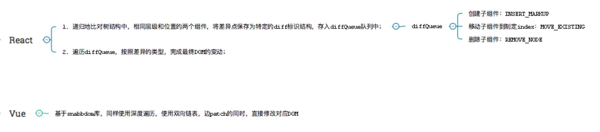
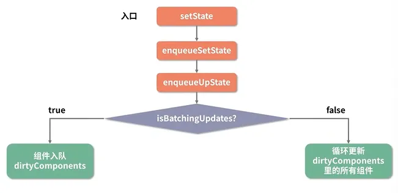
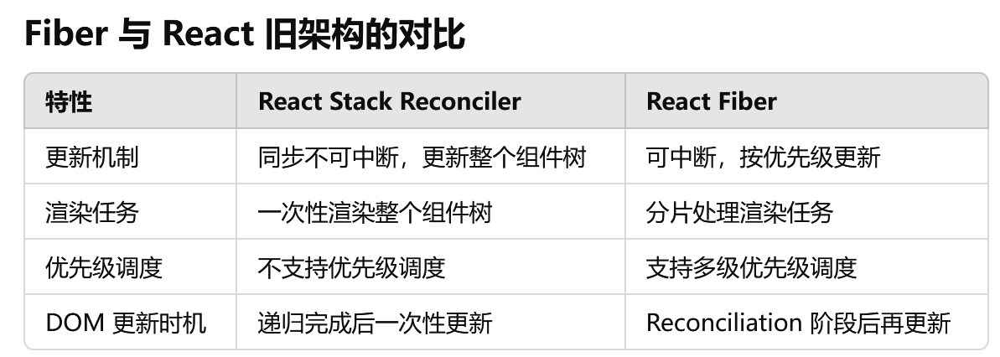

# React/vue

## Vue 与 React

Vue 是一个用于构建用户界面的渐进式、可逐步采用的 JavaScript 框架。轻量级、灵活和强大，建立在一个基于组件的架构上，以组件为中心，有一个强大的双向数据绑定系统，可以轻松地保持数据和用户界面同步。

React 是一个用于构建用户界面的 JavaScript 库。为开发人员提供了一种声明式编程风格，更易于阅读和调试。它还使用虚拟 dom，速度比传统 dom 更快，性能更好。基于组件的方法。

相同点：

1、都使用 virtual dom

2、都使用组件化思想，流程基本一致

3、都是响应式，推崇单向数据流

4、都有成熟的社区，都支持服务端渲染

Vue 和 React 实现原理和流程基本一致，都是使用 Virtual DOM + Diff 算法

Vue 和 React 通用流程：vue template/react jsx -> render 函数 -> 生成 VNode -> 当有变化时，新老 VNode diff -> diff 算法对比，并真正去更新真实 DOM

### virtual dom

1、减少直接操作 dom，数据驱动视图

2、为函数式 UI 编程提供可能

3、可以跨平台，渲染到 dom（web）之外的平台

### 框架的不同点

#### 核心思想不同

vue 早期定位是尽可能降低前端开发门栏，所以推崇灵活易用（渐进式开发体验），数据可变，双向数据绑定（依赖收集）

react 的早期口号是 Rethinking Best Practices，react 推崇函数式编程（纯组件），数据不可变以及单向数据流

- 核心思想不同导致写法差异

vue 推崇 template、单文件 vue（但也可也使用 jsx）

react 推崇 jsx，HOC，all in js

- 核心思想不同导致 api 差异

vue 基于 template 模板+options API，有较多的概念和 api

react 核心只有 virtual dom+diff 算法，api 很少

- 核心思想不同导致社区差异

vue 是官方主导开发和维护

react 只关注底层

- 核心思想不同导致未来升级方向不同

#### 组件实现不同

vue 实现是把 options 挂载到 vue 核心类上，然后再 new Vue({options})拿到实例。所以 options api 中的 this 指向内部 Vue 实例，对用户是不透明的，所以需要文档去说明 this.$slot、this.$xxx 这些 api。另外 Vue 插件都是基于 Vue 原型类基础之上建立的，这也是 Vue 插件使用 Vue.install 的原因，因为要确保第三方库的 Vue 和当前应用的 Vue 对象是同一个。

React 内部实现比较简单，直接定义 render 函数以生成 VNode，而 React 内部使用了四大组件类包装 VNode，不同类型的 VNode 使用相应的组件类处理，职责划分清晰明了（后面的 Diff 算法也非常清晰）。React 类组件都是继承自 React.Component 类，其 this 指向用户自定义的类，对用户来说是透明的。

### 响应式原理不同

vue2 中使用的是`Object.defineProperty()`方法为对象去遍历添加每一个属性的 set 和 get 方法，从而在数据更新时同步更新页面，并重写了数组的方法(push、pop、slice、sort 等)去实现数组的响应式。

```js
// 响应式数据
const vm = {};

// 添加响应式
Object.defineProperty(vm, "a", {
  get: () => {
    console.log("vm.a 被读取了", sourceData.a);
    return sourceData.a;
  },
  set: (newValue) => {
    console.log("vm.a 设置了新值", newValue);

    // 拦截了属性设置值新增的处理
    text = newValue;

    sourceData.a = newValue;
  },
});
```

但这样只劫持了获取和设置的操作，如果添加或删除属性，则不会触发响应，数组使用下标修改元素也无法触发响应式

官方提供了 Vue.set 的方法弥补这一缺陷，或者使用响应式的方法去修改

当对于复杂的状态，需要进行深度遍历才可以实现每一个属性的响应式。

所以会导致初始化时间长，会出现首屏加载慢等问题。 这个是不可避免的。

针对上面的问题，vue3 中实现响应式的方法改为了 Proxy

```js
// 添加响应式函数
function reactive(obj) {
  const observed = new Proxy(obj, {
    get: (target, property, receiver) => {
      console.log(`获取${property}:${target[property]}`);
      return target[property];
    },
    set: (target, property, value, receiver) => {
      console.log(`设置${property}:${value}`);
      return (target[property] = value);
    },
    deleteProperty: (target, property) => {
      console.log(`删除${property}`);
      delete target[property];
    },
  });

  return observed;
}

// 获取响应式状态
const state = reactive({
  a: 1,
});
```

可以拦截对对象的各种操作，get，set，delete 等。并且不需要遍历每一个属性，而是针对对象整体进行操作拦截。

但是 Proxy 是 es6 的新特性，所以对于某个浏览器的兼容性不是很好。

因为响应式是针对原始数据，所以在 vue 中直接修改属性，才会触发响应式，从而更新页面。给状态替换了整个对象, 或者使用结构，则会丢失响应性连接。

```js
let state = reactive({ a: 1 });

state.a = 2; // 触发响应式

const { a } = state;

a = 2; // 丢失a的响应式

state = { a: 1 }; // 丢失整个状态的响应式
```

**react 的数据（状态）驱动**

useState 是 React Hook，允许在组件中添加状态变量，状态变化会引起组件重新渲染。

js 中数据类型分为两种：基本数据类型（Number，String 等），引用数据类型（Object，Array 等） 区别则是常说的栈中存值还是地址。

在 react 中使用的是 Object.is() 方法来判断状态是否是相同值。其对于引用数据类型的判断则是地址是否发生改变。

```js
const handleClick = () => {
    obj.count = obj.count + 1
    // 地址没有变化，没有引起渲染，页面不会更新，没有响应式
    setObj(obj)
}

// 正确写法
setObj({
	...obj
	count: obj.count + 1
})
```

`在vue中，直接修改状态某个属性的值会触发响应式。而在react中必须调用修改状态的方法，对于引用数据类型必须更新成一个新的数据（改地址）`

### diff 算法不同

流程思维都是基于两个假设（使得算法复杂度降为 O(n)）

1、不同的组件产生不同的 DOM 结构。当 type 不相同时，对应 DOM 操作就是直接销毁老的 DOM，创建新的 DOM

2、同一层次的一组子节点，可以通过唯一的 key 区分

两者源码实现上有区别：

- Vue 基于 snabbdom 库，它有较好的速度以及模块机制。Vue Diff 使用双向链表，边对比，边更新 DOM。

- React 主要使用 diff 队列保存需要更新哪些 DOM，得到 patch 树，再统一操作批量更新 DOM



### 事件机制不同

**vue**

- vue 原生事件使用标准 web 事件

- vue 组件自定义事件机制，是父子组件通信基础

- vue 合理利用来 snabbdom 库的模块插件

**react**

- react 原生事件被包装，所有事件都被冒泡到顶层 document 监听，然后在这里合成事件下发。基于这套，可以跨端使用事件机制，而不是和 Web DOM 强绑定。

- react 组件上无事件，父子组件通信使用 props

### React useEffect 和 Vue watch 的区别

都是监听对应状态发生改变去做处理

watch 是靠响应式去触发处理函数，处理函数中也是靠响应式去更新视图

useEffect 是判断当前快照对应状态是否发生改变，或者说，当前快照是否是因为依赖项中的状态变化生成的，去做对应的处理，如果处理函数中再次发生状态的变化，则会继续创建快照，渲染视图

## JSX

jsx 属于 JavaScript 的语法扩展，可以让我们在 js 中编写 html 相关代码，但它同时具备 JavaScript 的全部功能。

编写的 jsx 其实会被 babel 转译为`React.createElement()`调用，`React.createElement()`本质上是创建了一个 React 对象，react 会读取并编译这些对象，用它们构建页面 dom 并实时保持更新。

`react元素经过babel转译--->React.createElement()调用--->react对象--->真实dom`

## 组件

react 中的组件分为函数组件与 class 组件，组件名都是大写

函数组件，接收一些 props，并返回组合后的 dom 结构

class 组件，使用 extends 继承了 Component 类，得到了一个新组件

## props 与 state

react 的数据流动从上往下，传递到每个组件，这里的数据由 props 和 state 构成。

props 就是外部传递给组件的属性，在函数组件中，可以直接通过形参 props 访问，而在 class 组件中，可以通过 this.props 访问到外部传递的属性

props 准则：应该像纯函数那样，只使用传递的属性，而不去修改它

如果父传了属性给子，子要修改，就需要在父提供 props 同时，也提供一个修改 props 的方法过去给子调用，子虽然是调用点，但本质执行的是父的方法，这是可行的

state 是组件内定义的私有属性，在 react 中更官方的解释是状态机，状态的变化会引起视图的变化，所以只需要修改状态，react 会自动帮我们更新视图

## React setState 是异步吗

react 官网对应 setState 的说明：将 setState 认为是一次请求而不是一次立即执行更新组件的命令

为了更可观的性能，react 可能会推迟它，稍后会一次性更新这些组件，react 不会保证在 setState 之后，能够立即拿到改变的结果

以上说明执行 setState 时，有可能是异步（大部门情况下）更新组件（包括重新 render ui 以及及时修改组件 this.state）

**React 为什么要做成大部分 setState 是异步的呢？有哪些情况是进行同步更新组件并且更新 this.state 的呢？**

在组件生命周期或 React 合成事件中，setState 是异步；在 setTimeout 或者原生 dom 事件中，setState 是同步。

假如所有 setState 是同步的，意味着每执行一次 setState 时（有可能一个同步代码中，多次 setState），都重新 vnode diff+dom 修改，这对性能来说是极为不好的，如果是异步，则可以把一个同步代码中的多个 setState 合并成一次组件更新

**更新原理**



生命周期里-此时已经开启了事务，当执行多个 state 时，所有都是在脏数组中，没有同步更新组件，意味着此时组件上的 state 没有更新。这也是为什么上面打印 this.state.count 会是 0

合成事件回调函数里-下发事件时开启了事务，回调函数里执行 setState 都是放在脏数组中，同上

setTimeout 和 DOM 原生事件里，此时没有开启事务，直接同步更新组件 + 修改为最新的 this.state

（并不是 setTimeout 改变了 setState，而是 setTimeout 帮助 setState“逃脱”了 react 对它的管控，只要是在 react 管控下
的 setState，一定是异步的）

### 回调函数写法

回调函数写法可以确保状态更新基于最新的状态，而不是旧的状态

```js
setState(prevState=>newState)
```

当使用回调函数传递给setState，React会确保这个回调接收到的是最新的状态值，避免了多个状态更新之间的竞态条件，这种方式主要用于基于当前的状态来计算下一个状态的场景

:::info
**竞态条件**是并发编程中常见的一种问题，指的是两个或多个操作并发执行时，结果依赖于这些操作执行的顺序，而这种顺序可能是不可控或不可预测的，从而导致程序产生错误的行为或结果

关键点：1、并发执行；2、不确定的执行顺序；3、共享资源

解决办法：1、锁机制；2、状态更新回调；3、事务处理
:::

假设在一个函数中连续多次调用 setState，如果直接传入值的话，后面的 setState 可能会基于之前的状态更新，导致状态更新不符合预期。但使用回调函数可以确保状态总是基于最新的状态值进行更新

## React 合成事件

React 基于浏览器的事件机制自身实现了一套事件机制，包括事件注册、事件的合成、事件冒泡、事件派发生，这套事件机制被称之为合成事件

react 的合成事件有两种绑定方式：驼峰形式书写事件属性名或 props 值为函数的指针而非字符串

### 实现机制

主要对合成事件做了两件事：事件委派和自动绑定

- 事件委派

React 事件代理机制。并不会把事件处理函数直接绑定到真实的节点上，而是把所有事件绑定到结构的最外层，使用一个统一的事件监听器，这个事件监听器上维持了一个映射来保持所有组件内部的事件监听和处理函数

- 自动绑定

每个方法的上下文都指向该组件的实例，即自动绑定 this 为当前组件。在使用 ES6 Class 或纯函数时，这种自动绑定就不存在了，需要手动实现 this 的绑定

> 绑定方法
>
> - bind 方法
>
> - 双冒号语法
>
> - 构造器内声明
>
> - 箭头函数

### 对比原生事件和合成事件

#### 事件传播与阻止事件传播

浏览器原生 DOM 事件传播有三个阶段：

- 事件捕获

- 目标对象本身的事件处理程序调用

- 事件冒泡阶段

React 仅支持冒泡机制。

阻止原生事件传播需要使用 e.preventDefault()，不过对于不支持该方法的浏览器（IE9 以 下），只能使用 e.cancelBubble = true 来阻止。而在 React 合成事件中，只需要使用 e.preventDefault() 即可。

#### 事件类型

React 合成事件的事件类型是 JavaScript 原生事件类型的一个子集

#### 事件绑定方式

绑定浏览器原生事件的方法：

- 直接在 DOM 元素中绑定：`<button onclick="alert(1);">Test</button>`

- 为元素事件属性赋值方式：`el.onclick = e => { console.log(e) }`

- 事件监听函数实现绑定：`el.addEventListener('click', () => {}, false)`

React 合成事件的绑定方式：

`<button onClick={this.handleClick}>Test</button>`

#### 事件对象

原生有兼容性问题

#### 阻止合成事件冒泡

- 阻止合成事件间的冒泡：e.stopPropagation()

- 阻止合成事件与最外层 document 上的事件间的冒泡：e.nativeEvent.stopImmediatePropagation()

- 阻止合成事件与除最外层 document 上的原生事件上的冒泡，需要通过 e.target 判断

```js
componentDidMount() {
    document.body.addEventListener('click', e => {
        if (e.target && e.target.matches('div.code')) {
            return
        }
        this.setState({ active: false })
    })
}
```

## 使用虚拟 DOM 一定会比直接操作真实 DOM 快吗？不一定

虚拟 DOM 并不是比原生 DOM 快，更确切的来说，虚拟 DOM 是比操作不当的原生 DOM 快

实际上，如果对原生 DOM 的操作得当的话，原生 DOM 的性能一定优于虚拟 DOM。

虚拟 DOM 本质上是一个对象

```js
const vNode = {
    key:"d",  //是否有key，有则显示，无则显示null
    props:{
      //标签里是否子元素
      children:[
      {
        ....，
        ref:"null",
        type:'p'},
      ],
      onClick:() => {},  //标签上的事件
      className:"d-class", //标签上的属性
    }
    ref:"null",
    type:"div"
}
```

示例：

```js
// 真实DOM
    <div className="root" key="rootKey" ref="rootRef">
        <h1>昨晚上基金全是绿的，只有我的眼睛是红的</h1>
        <div className="top" onClick={() => console.log("工资一千五，心比美式苦")}>
          <p>今天你站上天台，我卧上轨道，来生我们有说有笑</p>
        </div>
    </div>
// 对应的虚拟DOM
 const VNode = {
  //第一层的div节点
   key:"rootKey",
   props:{
    className:"root"
   }，
   //第二层的h1和div节点
   children:[
    //h1
     {
      children:"昨晚上基金全是绿的，只有我的眼睛是红的",
      type:"h1",
      props:{}
     },
     //div
     {
      type:"div",
      props:{
       className:"top",
       onClick:() => console.log("工资一千五，心比美式苦")
      },
      //div下的p标签
      children:[
        {
          type:"p",
          children:"今天你站上天台，我卧上轨道，来生我们有说有笑"
        }
      ]
     }
   ]，
   ref:"rootRef",
   type:"div"
 }

```

所谓的虚拟 DOM，就是我们真实 DOM 在创建的时候，隐藏在真实 DOM 之下和真实 DOM 所对应的一个对象。这个对象，被我们称为虚拟 DOM

### 虚拟 DOM 为什么存在

其最核心的思想是提升开发效率而非提升性能

虚拟 DOM 的优势在于我们更新节点时候。它会检查哪些节点需要更新。尽量复用已有 DOM，减少 DOM 的删除和重新创建。并且这些操作我们是可以通过自己手动操作 javascript 底层 api 实现的。只是我们手动操作会非常耗费我们的时间和精力。这个工作由虚拟 DOM 代劳，会让我们开发更快速便捷。

### 总结

虚拟 DOM 不一定会比操作原生 DOM 更快。

虚拟 DOM 的优势在于节点进行改动的时候尽量减少开销

React 从来没说过虚拟 DOM 会比原生更快。

框架的本质是提升开发效率，让我们的注意力更集中于数据

## React 的懒加载

React 的懒加载是通过`React.lazy()`和`Suspense`组件来实现的，核心原理是动态引入（即按需加载）组件，以减少首次加载时的资源消耗，提高页面的性能

### 实现原理

1、动态导入（`import()`）

懒加载的核心是 JavaScript 的动态导入，它允许在需要的时候才加载模块，而不是一开始就加载所有模块。动态导入返回一个 Promise，当模块加载完成时，Promise 解析并返回模块的内容

```js
// 普通导入是同步的
import MyComponent from "./MyComponent";

// 动态导入是异步的
const MyComponent = React.lazy(() => import("./MyComponent"));
```

通过 `import()` 函数，模块会被打包成独立的 chunk 文件，只有在真正需要时才会加载这个模块。

2、`React.lazy()`的作用

`React.lazy()`是 React 提供的用于懒加载组件的函数，它接受一个动态导入的函数，并返回一个 React 组件，当这个组件被渲染时，React 会在幕后加载实际的模块

```js
const MyComponent = React.lazy(() => import("./MyComponent"));
```

本质上是一个异步组件，它延迟加载，直到渲染时才加载组件所需的模块

3、`Suspense`组件的作用

由于懒加载组件是异步加载的，因此在组件还未加载完成时，React 需要知道如何处理此时的 UI。Suspense 组件就是用来在异步组件加载完成之前显示一个备用内容（如加载指示器）。它可以包裹`React.lazy()`生成的懒加载组件，并提供加载期间的占位内容

```js
import React, { Suspense } from "react";

const MyComponent = React.lazy(() => import("./MyComponent"));

function App() {
  return (
    <Suspense fallback={<div>Loading...</div>}>
      <MyComponent />
    </Suspense>
  );
}
```

`fallback` 属性指定了在组件加载完成之前显示的内容，当组件加载完成后，`Suspense` 会移除`fallback`并渲染实际组件。

## fiber架构

fiber是为了解决react在渲染性能、可中断渲染和调度任务方面的局限性而设计的，是react 16开始引入的新渲染引擎，主要目的是优化和提升react应用在复杂UI更新中的性能表现

fiber架构的核心思想是将渲染工作拆分成更小的任务快，允许渲染过程被中断，然后在适当的时候恢复。这种机制使得react在渲染复杂组件树时，能够保持界面的流畅性，并有机会处理高优先级任务

### 核心概念

1、fiber节点：每个组件对应一个fiber对象（fiber节点）


2、时间分片（Time Slicing）：将大的渲染任务拆分成更小的单元，并使用时间切片机制来执行这些单元

3、可中断的渲染：fiber支持可中断的渲染

4、优先级调度：为不同类型的更新任务分配不同的优先级


## 参考

[https://blog.3vyd.com/blog/posts-output/2024-04-11-Vue%E4%B8%8EReact%E5%93%8D%E5%BA%94%E5%BC%8F%E5%8C%BA%E5%88%AB/](https://blog.3vyd.com/blog/posts-output/2024-04-11-Vue%E4%B8%8EReact%E5%93%8D%E5%BA%94%E5%BC%8F%E5%8C%BA%E5%88%AB/)

[https://lq782655835.github.io/blogs/vue/diff-vue-vs-react.html](https://lq782655835.github.io/blogs/vue/diff-vue-vs-react.html)

[https://www.ruanyifeng.com/blog/2015/02/mvcmvp_mvvm.html](https://www.ruanyifeng.com/blog/2015/02/mvcmvp_mvvm.html)

[https://zhuanlan.zhihu.com/p/75696114](https://zhuanlan.zhihu.com/p/75696114)

[https://tsejx.github.io/react-guidebook/foundation/advanced-guides/synthetic-event](https://tsejx.github.io/react-guidebook/foundation/advanced-guides/synthetic-event)

[https://juejin.cn/post/7130538545063657486](https://juejin.cn/post/7130538545063657486)
