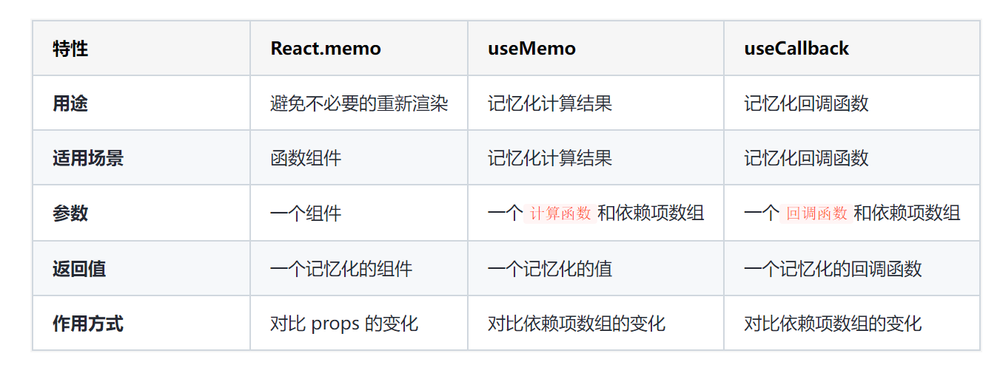

# React 性能优化

## React.memo 优化：函数组件的记忆化

为了避免不必要的重新渲染，可以使用 React.memo 对子组件进行优化

用途：用于函数组件，通过对比组件的 props 变化来避免不必要的重新渲染

工作原理：React.memo 对比组件接收到的 props 是否发生变化。仅当 props 发生变化时，才会重新渲染组件，否则会使用上一次的渲染结果

### 浅层比较

通过`浅层比较 props` 的方式来实现，确保只有在相关数据发生变化时才触发组件的重新渲染。

```js
// Counter 组件
const Counter = ({ value, children }) => {
  console.log("Render: ", children);

  return (
    <div>
      {children}: {value}
    </div>
  );
};

export default React.memo(Counter);
```

### 复杂的数据结构

遇到复杂的数据结构，可以通过 React.memo 的第二个参数传递自定义的比较函数，实现深层比较

```js
const Counter = ({ value, children }) => {
  console.log("Render: ", children);

  return (
    <div>
      {children}: {value}
    </div>
  );
};

const isEqual = (prevProps, nextProps) => {
  if (prevProps.name !== nextProps.name) {
    return false;
  }
  return true;
};

export default React.memo(Counter, isEqual);
```

## useMemo 和 useCallback

使用 useMemo 来记忆化计算结果，同时使用 useCallback 记忆化回调函数。

```js
const App = () => {
  const [count1, setCount1] = useState(0);
  const [count2, setCount2] = useState(0);
  const [active, setActive] = useState(false);

  // 使用 useMemo 记忆化计算结果
  const shouldActivate = React.useMemo(() => count2 > 5, [count2]);

  // 使用 useCallback 记忆化回调函数
  const increaseCounter = React.useCallback(() => {
    setCount1(count1 + 1);
    // 只有在特定条件下才触发状态变化
    if (shouldActivate) {
      setActive(true);
    }
  }, [count1, shouldActivate]);

  return (
    <>
      <button onClick={increaseCounter}>Increase counter</button>
      <Counter value={count1}>Counter 1</Counter>
      <Counter value={count2}>Counter 2</Counter>
      {active && <div>特定条件已触发</div>}
    </>
  );
};
```

### useMemo

用途：用于记忆化计算结果，避免在每次渲染时都重新计算。

工作原理：useMemo 接收一个计算函数和一个依赖项数组。它仅在依赖项数组中的值发生变化时，才会重新计算，并返回记忆化的值。

### useCallback

用途：用于记忆化回调函数，避免在每次渲染时都重新创建回调。

工作原理：useCallback 接收一个回调函数和一个依赖项数组。它仅在依赖项数组中的值发生变化时，才会返回上一次的记忆化的回调函数。



## 合理使用 Context

Context 能够在组件树间跨层级数据传递，正因其这一独特机制，Context 可以绕过 React.memo 或 shouldComponentUpdate 设定的比较过程

也就是说，一旦 Context 的 Value 变动，所有使用 useContext 获取该 Context 的组件会全部 forceUpdate。即使该组件使用了 memo，且 Context 更新的部分 Value 与其无关

为了使组件仅在 context 与其相关的 value 发生更改时重新渲染，将组件分为两个部分。在外层组件中从 context 中读取所需内容，并将其作为 props 传递给使用 memo 优化的子组件

## Fragment

当呈现多个元素而不需要额外的容器元素时，使用 React.Fragment 可以减少 DOM 节点的数量，从而提高呈现性能

```js
const MyComponent = () => {
  return (
    <React.Fragment>
      <div>Element 1</div>
      <div>Element 2</div>
      <div>Element 3</div>
    </React.Fragment>
  );
};
```

## 懒加载

通过 React.lazy 和 React.Suspense 实施代码分割策略，将 React 应用细分为更小的模块，确保在具体需求出现时才按需加载相应的部分

```js
// 定义路由
import { lazy } from "react";
import { createBrowserRouter } from "react-router-dom";

const Login = lazy(() => import("../pages/login"));

const routes = [
  {
    path: "/login",
    element: <Login />,
  },
];

//可传第二个参数，配置base路径 { basename: "/app"}
const router = createBrowserRouter(routes);

export default router;

// 引用路由
import { Suspense } from 'react';
import { RouterProvider } from 'react-router-dom';

import ReactDOM from 'react-dom/client';

import router from './router';

const root = ReactDOM.createRoot(document.getElementById('root') as HTMLElement);

root.render(
  <Suspense fallback={<div>Loading...</div>}>
    <RouterProvider router={router} />
  </Suspense>,
);
```

## 组件卸载时的清理：清理全局监听器、定时器邓

在组件卸载时清理全局监听器、定时器等。防止内存泄漏影响性能

```js
import { useState, useEffect, useRef } from 'react';

function MyComponent() {
  const [count, setCount] = useState(0);
  const timer = useRef<NodeJS.Timeout>();

  useEffect(() => {
    // 定义定时器
    timer.current = setInterval(() => {
      setCount((count) => count + 1);
    }, 1000);

    const handleOnResize = () => {
      console.log('Window resized');
    };

    // 定义监听器
    window.addEventListener('resize', handleOnResize);

    // 在组件卸载时清除定时器和监听器
    return () => {
      clearInterval(timer.current);
      window.removeEventListener('resize', handleOnResize);
    };
  }, []);

  return (
    <div>
      <p>{count}</p>
    </div>
  );
}

export default MyComponent;
```

## 参考

[https://juejin.cn/post/6844903854299938824?searchId=202409061818595A4C1124C8ECCBB7C191](https://juejin.cn/post/6844903854299938824?searchId=202409061818595A4C1124C8ECCBB7C191)

[https://juejin.cn/post/7316321509856755752?searchId=20240906182155ED73E066E10924BC2D23](https://juejin.cn/post/7316321509856755752?searchId=20240906182155ED73E066E10924BC2D23)

[https://juejin.cn/post/7371777383588954175?searchId=20240906182155ED73E066E10924BC2D23](https://juejin.cn/post/7371777383588954175?searchId=20240906182155ED73E066E10924BC2D23)
