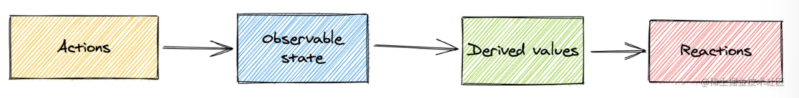
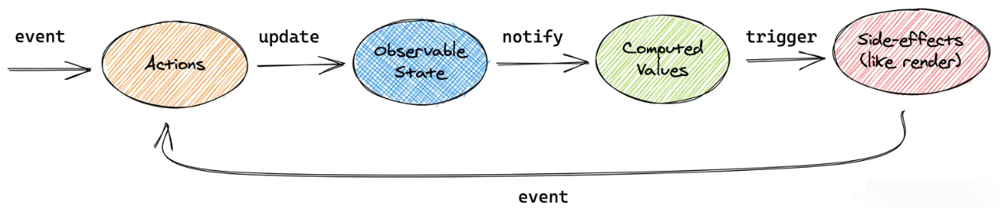

# Redux 和 Mobx

redux 是一个使用叫做 action 的事件来管理和更新应用状态的模式和工具库，以集中式 store 的方式对整个应用使用的状态进行集中管理，其规则确保状态只能以可预测的方式更新。

mobx 通过运用透明的函数式响应代理使状态管理变得简单和可扩展

## Redux

1、action:action  是一个具有  type  字段的普通 JavaScript 对象。你可以将 action 视为描述应用程序中发生了什么的事件。

2、reducer:reducer  是一个函数，接收当前的  state  和一个  action  对象，必要时决定如何更新状态，并返回新状态。

3、store:当前 Redux 应用的状态存在于一个名为  store  的对象中。

**原则**

- 单一数据源。整个应用的  state  被储存在一棵 object tree 中，并且这个 object tree 只存在于唯一一个  store 中。

- State 是只读的。唯一改变 state 的方法就是触发  action，action 是一个用于描述已发生事件的普通对象。

- 使用纯函数来执行修改。为了描述 action 如何改变 state tree ，你需要编写 reducers。

## mobx

1、State(状态): State   是驱动你的应用程序的数据。

2、Actions(动作): Action   是任意可以改变  State   的代码，比如用户事件处理、后端推送数据处理、调度器事件处理等等。

3、Derivations(派生): 任何   来源是 State   并且不需要进一步交互的东西都是 Derivation。Mobx 区分了以下两种 Derivation:

- Computed values,总是可以通过纯函数从当前的可观测 State 中派生。

- Reactions, 当 State 改变时需要自动运行的副作用。

**原则**
单向数据流，利用 action 改变 state，进而更新所有受影响的 view

## 区别

1、数据可变性

Redux 采用函数式编程，使用了纯函数。函数获取输入，返回输出，并且没有其他依赖项，而是纯函数。纯函数始终使用相同的输入生成相同的输出，并且没有任何副作用。

Redux 状态对象通常是不可变的（Immutable）,我们不能直接操作状态对象，而是始终返回一个新状态

MobX 遵循的是面向对象编程原则，可以直接使用新值更新状态对象。

2、store 的区别

store 是应用管理数据的地方，在 Redux 应用中，总是将数据保存在一个全局的 store 中，而 Mobx 则通常按模块将应用状态划分，在多个独立的 store 中管理。

在 mobx 中，可以通过创建一个 RootStore 来实例化所有 stores，并共享引用。这样的方式不仅设置简单，而且很好的支持了强类型。

3、更新过程

Redux：

> 1、点击按钮
>
> 2、dispatch 一个 action 到 Redux store
>
> 3、store 用之前的 state 和当前的 action 再次运行 reducer 函数，并将返回值保存为新的 state
>
> 4、store 通知所有订阅过的 UI，通知 store 发生更新
>
> 5、每个订阅过 store 数据的 UI 组件都会检查它们需要的 state 部分是否被更新
>
> 6、发现数据被更新的每个组件都强制使用新数据重新渲染，紧接着更新网页

Mobx：

> 1、事件调用 actions
>
> 2、修改 state
>
> 3、state 状态的变更会被精确地传送到所有依赖于它们的计算和副作用里
>
> 4、更新用户界面

## 参考

[https://juejin.cn/post/7087338460129787941](https://juejin.cn/post/7087338460129787941)
