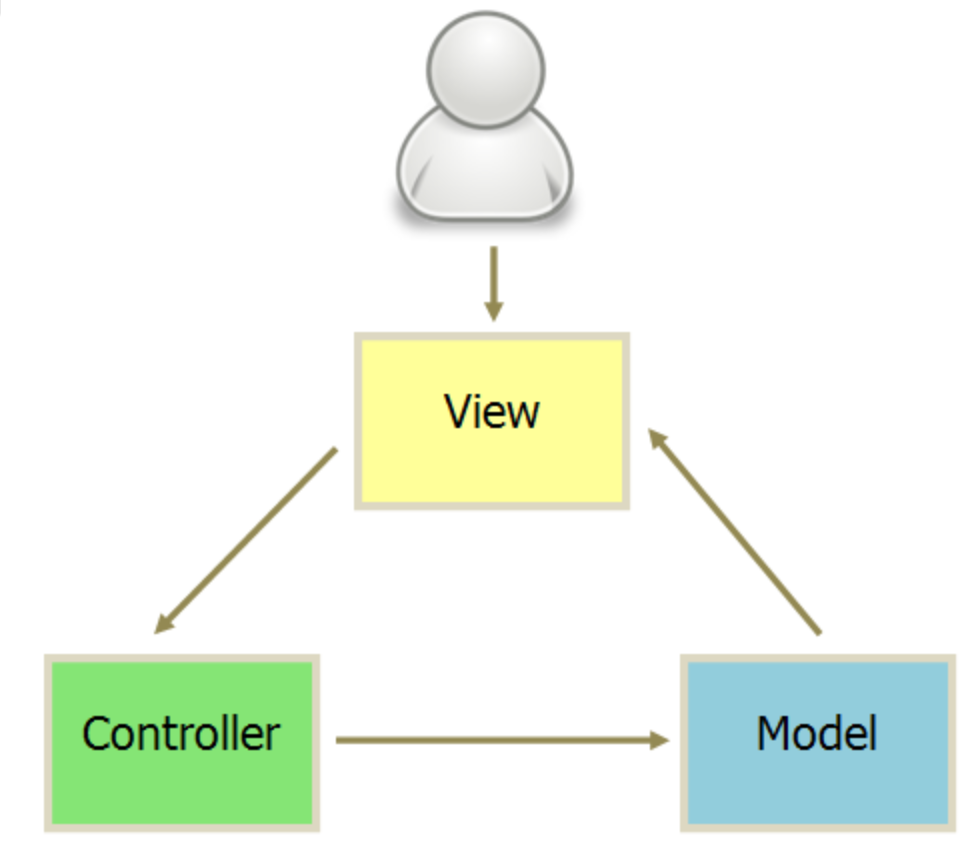
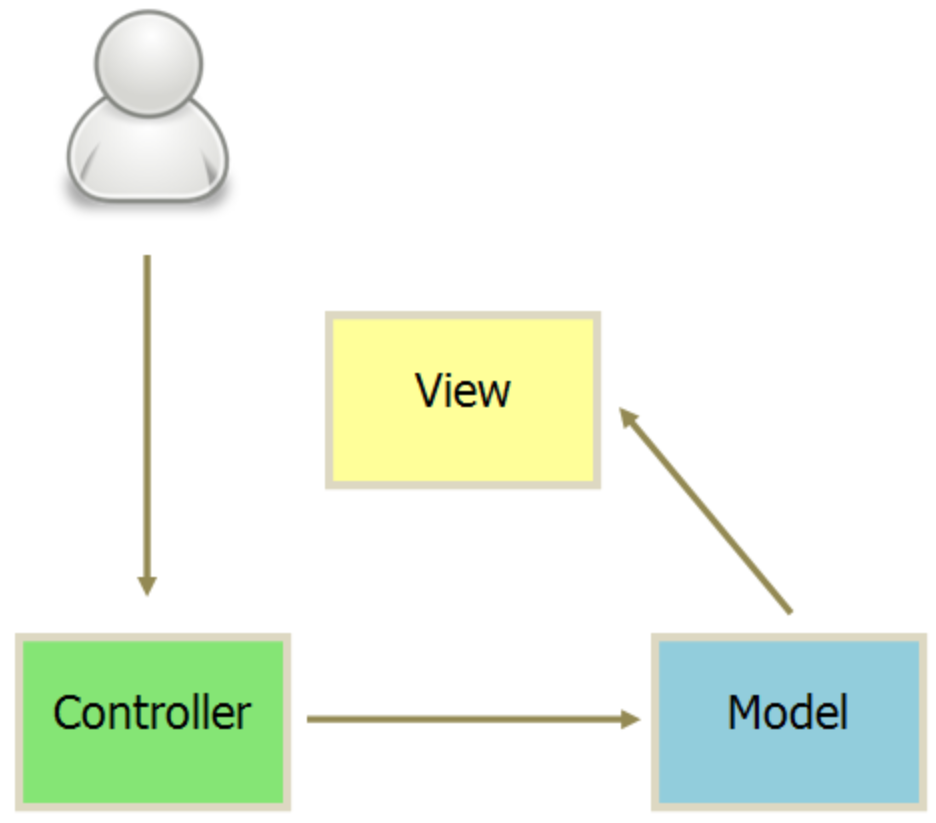
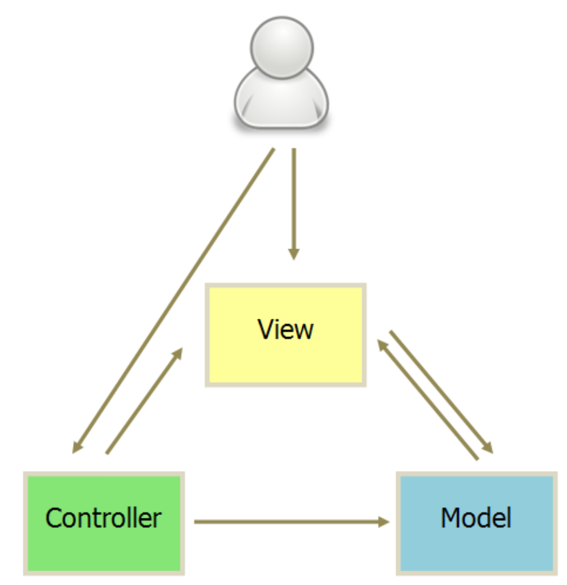
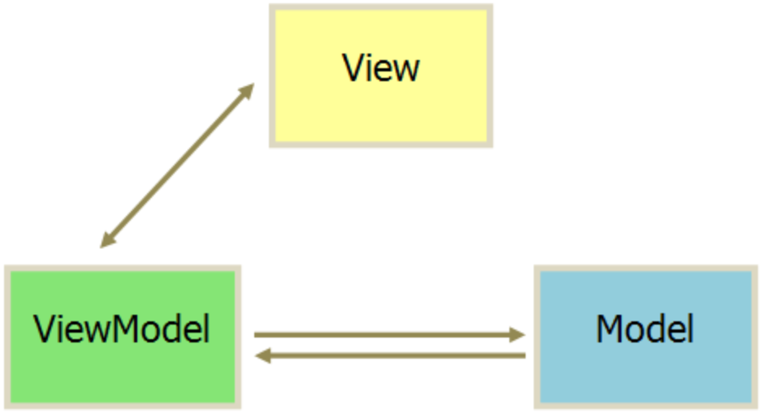
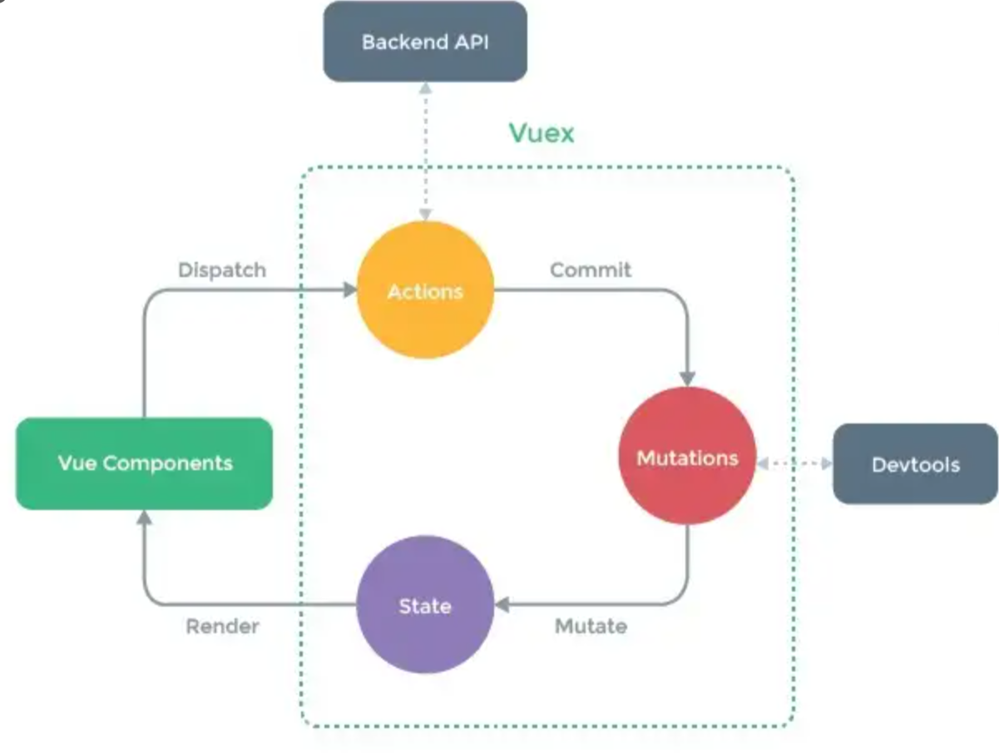
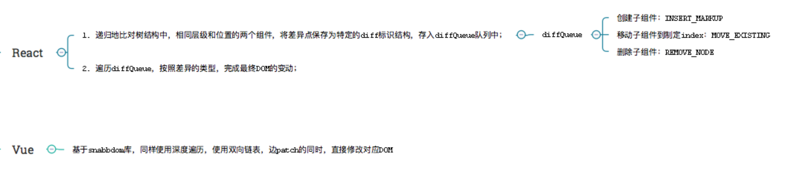
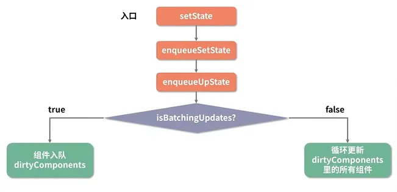

# 汇总 1

## 架构 --- MVC/MVP/MVVM

### MVC

Model-View-Controller 是最常见的软件架构之一

MVC 模式的意思是软件可以分为三个部门

- View 视图：用户界面

- Controller 控制器：业务逻辑

- Model 模型：数据保存


各部分通信都是单向的：

1、View 传送指令到 Controller

2、Controller 完成业务逻辑后，要求 Model 改变状态

3、Model 将新的数据发送到 View，用户得到反馈

#### MVC 互动模式

接收用户指令时，MVC 可以分成两种方式，一种是通过 View 接受指令，传递给 Controller



另一种是直接通过 controller 接受指令



#### 实际项目更加灵活：Backbone



1、用户可以向 View 发送指令（DOM 事件），再由 View 直接要求 Model 改变状态

2、用户也可以直接向 Controller 发送指令（改变 URL 触发 hashChange 事件），再由 Controller 发送给 View

3、`Controller非常薄，只起到路由的作用，而View非常厚，业务逻辑都部署在View。所以，Backbone 索性取消了 Controller，只保留一个 Router（路由器）`

### MVP

MVP 是将 Controller 改为 Presenter，同时改变了通信方向


1、各部分之间的通信，都是双向的

2、View 与 Model 不发生联系，都通过 Presenter 传递

3、View 非常薄，不部署任何业务逻辑，称为"被动视图"（Passive View），即没有任何主动性，而 Presenter 非常厚，所有逻辑都部署在那里

### MVVM

MVVM 模式将 Presenter 改为 ViewModel，基本上与 MVP 一致



唯一的区别是，采用双向绑定 data-binding：View 的变动，自动反映在 ViewModel，反之亦然

### Flux 架构

Flux 是一种架构思想，专门解决软件的结构问题，它跟 MVC 架构是同一类东西，但是更加简洁清晰

**Vuex 和 Redux 都是从 Flux 中衍生出来**

Flux 将一个应用分为四个部分

- View：视图层

- Action（动作）：视图层发出的消息

- Dispatcher（派发器）：用来接收 actions、执行回调函数

- Store（数据层）：用来存放应用的状态，一旦发生变动，就提醒 Views 要更新页面


最大的特点是数据的“单向流动”

1、用户访问 View

2、View 发出用户的 Action

3、Dispatcher 收到 Action，要求 Store 进行相应的更新

4、Store 更新后，发出一个“change”事件

5、View 收到“change”事件后，更新页面

> Flux 单向数据流，在单向数据流下，状态的变化是可预测的：如果 store 中的数据发生了变化，那么一定是由 Dispatcher 派生的 Action 触发的，这样的关系非常有助于 debug 以及避免混乱的数据关系

### Redux

- Store：存储应用 state 以及用于触发 state 更新的 dispatch 方法等，整个应用仅有单一的 store。store 提供几个 API：

> - store.getState()：获取当前 state
>
> - store.dispatch(action)：用于 View 发出 Action
>
> - store.subscribe(listener)：设置监听函数，一旦 state 变化则执行该函数，若把视图更新函数作为 listener 传入，则可触发视图自动渲染

- Action：同 Flux，action 是用于更新 state 的消息对象，由 view 发出

- Reducer：是一个用于改变 state 的纯函数（对于相同的参数返回相同的返回结果，不修改参数，不依赖外部变量），即通过应用状态与 action 推导出新的 state：`(previousState, action)=>newState`，Reducer 返回一个新的 state。


特点：

- 单向数据流

- 单一数据源

- state 是制度的，每次状态更新之后只能返回一个新的 state

- 没有 dispatcher，而是在 store 中继承了 dispatch 方法，`store.dispatch()`是 view 发出 action 的唯一途径

#### Middleware

即中间件，在 Redux 中应用于异步数据流

Redux 的 middleware 是对 store.dispatch()进行了封装之后的方法，可以使 dispatch 传递 action 以外的函数或者 promise，通过 applyMiddleware 方法应用中间件（middleware 链中的最后一个 middleware 开始 dispatch action 时，这个 action 必须是一个普通对象）

```js
const store = createStore(
  reducer,
  // 依次执行
  applyMiddleware(thunk, promise, logger)
);
```

#### Vuex

Vuex 是一个 vue.js 的状态管理模式

- Store：采用单一状态树，每个应用仅有一个 store 实例，在该实例下包含了 state，actions，mutations，getters，modules

- State：Vuex 为单一数据源

- Getter：Getter 的作用与 filters 有一些相似，可以将 state 进行过滤后输出

- Mutation：Mutation 是 vuex 中改变 State 的唯一途径（严格模式下），并且只能是同步操作。Vuex 中通过 store.commit()调用 Mutation

- Action：一些对 state 的异步操作可以放在 action 中，并通过在 action 提交 mutation 变更状态

- Module：当 Store 对象过于庞大时，可根据具体的业务需求分为多个 Module ，每个 Module 都具有自己的 state 、mutation 、action 、getter



#### Mobx

MobX 背后的哲学是:

任何源自应用状态的东西都应该自动地获得

意思就是，当状态改变时，所有应用到状态的地方都会自动更新。

- State: 驱动应用的数据

- Computed values: 计算值。如果你想创建一个基于当前状态的值时，请使用 computed

- Reactions: 反应，当状态改变时自动发生

- Actions: 动作，用于改变 State

- 依赖收集（autoRun）: MobX 中的数据以来基于观察者模式，通过 autoRun 方法添加观察者


## Vue 与 React

Vue 是一个用于构建用户界面的渐进式、可逐步采用的 JavaScript 框架。轻量级、灵活和强大，建立在一个基于组件的架构上，以组件为中心，有一个强大的双向数据绑定系统，可以轻松地保持数据和用户界面同步。

React 是一个用于构建用户界面的 JavaScript 库。为开发人员提供了一种声明式编程风格，更易于阅读和调试。它还使用虚拟 dom，速度比传统 dom 更快，性能更好。基于组件的方法。

相同点：

1、都使用 virtual dom

2、都使用组件化思想，流程基本一致

3、都是响应式，推崇单向数据流

4、都有成熟的社区，都支持服务端渲染

Vue 和 React 实现原理和流程基本一致，都是使用 Virtual DOM + Diff 算法

Vue 和 React 通用流程：vue template/react jsx -> render 函数 -> 生成 VNode -> 当有变化时，新老 VNode diff -> diff 算法对比，并真正去更新真实 DOM

### virtual dom

1、减少直接操作 dom，数据驱动视图

2、为函数式 UI 编程提供可能

3、可以跨平台，渲染到 dom（web）之外的平台

### 框架的不同点

#### 核心思想不同

vue 早期定位是尽可能降低前端开发门栏，所以推崇灵活易用（渐进式开发体验），数据可变，双向数据绑定（依赖收集）

react 的早期口号是 Rethinking Best Practices，react 推崇函数式编程（纯组件），数据不可变以及单向数据流

- 核心思想不同导致写法差异

vue 推崇 template、单文件 vue（但也可也使用 jsx）

react 推崇 jsx，HOC，all in js

- 核心思想不同导致 api 差异

vue 基于 template 模板+options API，有较多的概念和 api

react 核心只有 virtual dom+diff 算法，api 很少

- 核心思想不同导致社区差异

vue 是官方主导开发和维护

react 只关注底层

- 核心思想不同导致未来升级方向不同

#### 组件实现不同

vue 实现是把 options 挂载到 vue 核心类上，然后再 new Vue({options})拿到实例。所以 options api 中的 this 指向内部 Vue 实例，对用户是不透明的，所以需要文档去说明 this.$slot、this.$xxx 这些 api。另外 Vue 插件都是基于 Vue 原型类基础之上建立的，这也是 Vue 插件使用 Vue.install 的原因，因为要确保第三方库的 Vue 和当前应用的 Vue 对象是同一个。

React 内部实现比较简单，直接定义 render 函数以生成 VNode，而 React 内部使用了四大组件类包装 VNode，不同类型的 VNode 使用相应的组件类处理，职责划分清晰明了（后面的 Diff 算法也非常清晰）。React 类组件都是继承自 React.Component 类，其 this 指向用户自定义的类，对用户来说是透明的。

### 响应式原理不同

vue2 中使用的是`Object.defineProperty()`方法为对象去遍历添加每一个属性的 set 和 get 方法，从而在数据更新时同步更新页面，并重写了数组的方法(push、pop、slice、sort 等)去实现数组的响应式。

```js
// 响应式数据
const vm = {};

// 添加响应式
Object.defineProperty(vm, "a", {
  get: () => {
    console.log("vm.a 被读取了", sourceData.a);
    return sourceData.a;
  },
  set: (newValue) => {
    console.log("vm.a 设置了新值", newValue);

    // 拦截了属性设置值新增的处理
    text = newValue;

    sourceData.a = newValue;
  },
});
```

但这样只劫持了获取和设置的操作，如果添加或删除属性，则不会触发响应，数组使用下标修改元素也无法触发响应式

官方提供了 Vue.set 的方法弥补这一缺陷，或者使用响应式的方法去修改

当对于复杂的状态，需要进行深度遍历才可以实现每一个属性的响应式。

所以会导致初始化时间长，会出现首屏加载慢等问题。 这个是不可避免的。

针对上面的问题，vue3 中实现响应式的方法改为了 Proxy

```js
// 添加响应式函数
function reactive(obj) {
  const observed = new Proxy(obj, {
    get: (target, property, receiver) => {
      console.log(`获取${property}:${target[property]}`);
      return target[property];
    },
    set: (target, property, value, receiver) => {
      console.log(`设置${property}:${value}`);
      return (target[property] = value);
    },
    deleteProperty: (target, property) => {
      console.log(`删除${property}`);
      delete target[property];
    },
  });

  return observed;
}

// 获取响应式状态
const state = reactive({
  a: 1,
});
```

可以拦截对对象的各种操作，get，set，delete 等。并且不需要遍历每一个属性，而是针对对象整体进行操作拦截。

但是 Proxy 是 es6 的新特性，所以对于某个浏览器的兼容性不是很好。

因为响应式是针对原始数据，所以在 vue 中直接修改属性，才会触发响应式，从而更新页面。给状态替换了整个对象, 或者使用结构，则会丢失响应性连接。

```js
let state = reactive({ a: 1 });

state.a = 2; // 触发响应式

const { a } = state;

a = 2; // 丢失a的响应式

state = { a: 1 }; // 丢失整个状态的响应式
```

**react 的数据（状态）驱动**

useState 是 React Hook，允许在组件中添加状态变量，状态变化会引起组件重新渲染。

js 中数据类型分为两种：基本数据类型（Number，String 等），引用数据类型（Object，Array 等） 区别则是常说的栈中存值还是地址。

在 react 中使用的是 Object.is() 方法来判断状态是否是相同值。其对于引用数据类型的判断则是地址是否发生改变。

```js
const handleClick = () => {
    obj.count = obj.count + 1
    // 地址没有变化，没有引起渲染，页面不会更新，没有响应式
    setObj(obj)
}

// 正确写法
setObj({
	...obj
	count: obj.count + 1
})
```

`在vue中，直接修改状态某个属性的值会触发响应式。而在react中必须调用修改状态的方法，对于引用数据类型必须更新成一个新的数据（改地址）`

### diff 算法不同

流程思维都是基于两个假设（使得算法复杂度降为 O(n)）

1、不同的组件产生不同的 DOM 结构。当 type 不相同时，对应 DOM 操作就是直接销毁老的 DOM，创建新的 DOM

2、同一层次的一组子节点，可以通过唯一的 key 区分

两者源码实现上有区别：

- Vue 基于 snabbdom 库，它有较好的速度以及模块机制。Vue Diff 使用双向链表，边对比，边更新 DOM。

- React 主要使用 diff 队列保存需要更新哪些 DOM，得到 patch 树，再统一操作批量更新 DOM



### 事件机制不同

**vue**

- vue 原生事件使用标准 web 事件

- vue 组件自定义事件机制，是父子组件通信基础

- vue 合理利用来 snabbdom 库的模块插件

**react**

- react 原生事件被包装，所有事件都被冒泡到顶层 document 监听，然后在这里合成事件下发。基于这套，可以跨端使用事件机制，而不是和 Web DOM 强绑定。

- react 组件上无事件，父子组件通信使用 props

### React useEffect 和 Vue watch 的区别

都是监听对应状态发生改变去做处理

watch 是靠响应式去触发处理函数，处理函数中也是靠响应式去更新视图

useEffect 是判断当前快照对应状态是否发生改变，或者说，当前快照是否是因为依赖项中的状态变化生成的，去做对应的处理，如果处理函数中再次发生状态的变化，则会继续创建快照，渲染视图

## JSX

jsx 属于 JavaScript 的语法扩展，可以让我们在 js 中编写 html 相关代码，但它同时具备 JavaScript 的全部功能。

编写的 jsx 其实会被 babel 转译为`React.createElement()`调用，`React.createElement()`本质上是创建了一个 React 对象，react 会读取并编译这些对象，用它们构建页面 dom 并实时保持更新。

`react元素经过babel转译--->React.createElement()调用--->react对象--->真实dom`

## 组件

react 中的组件分为函数组件与 class 组件，组件名都是大写

函数组件，接收一些 props，并返回组合后的 dom 结构

class 组件，使用 extends 继承了 Component 类，得到了一个新组件

## props 与 state

react 的数据流动从上往下，传递到每个组件，这里的数据由 props 和 state 构成。

props 就是外部传递给组件的属性，在函数组件中，可以直接通过形参 props 访问，而在 class 组件中，可以通过 this.props 访问到外部传递的属性

props 准则：应该像纯函数那样，只使用传递的属性，而不去修改它

如果父传了属性给子，子要修改，就需要在父提供 props 同时，也提供一个修改 props 的方法过去给子调用，子虽然是调用点，但本质执行的是父的方法，这是可行的

state 是组件内定义的私有属性，在 react 中更官方的解释是状态机，状态的变化会引起视图的变化，所以只需要修改状态，react 会自动帮我们更新视图

## React setState 是异步吗

react 官网对应 setState 的说明：将 setState 认为是一次请求而不是一次立即执行更新组件的命令

为了更可观的性能，react 可能会推迟它，稍后会一次性更新这些组件，react 不会保证在 setState 之后，能够立即拿到改变的结果

以上说明执行 setState 时，有可能是异步（大部门情况下）更新组件（包括重新 render ui 以及及时修改组件 this.state）

**React 为什么要做成大部分 setState 是异步的呢？有哪些情况是进行同步更新组件并且更新 this.state 的呢？**

在组件生命周期或 React 合成事件中，setState 是异步；在 setTimeout 或者原生 dom 事件中，setState 是同步。

假如所有 setState 是同步的，意味着每执行一次 setState 时（有可能一个同步代码中，多次 setState），都重新 vnode diff+dom 修改，这对性能来说是极为不好的，如果是异步，则可以把一个同步代码中的多个 setState 合并成一次组件更新

**更新原理**



生命周期里-此时已经开启了事务，当执行多个 state 时，所有都是在脏数组中，没有同步更新组件，意味着此时组件上的 state 没有更新。这也是为什么上面打印 this.state.count 会是 0

合成事件回调函数里-下发事件时开启了事务，回调函数里执行 setState 都是放在脏数组中，同上

setTimeout 和 DOM 原生事件里，此时没有开启事务，直接同步更新组件 + 修改为最新的 this.state

（并不是 setTimeout 改变了 setState，而是 setTimeout 帮助 setState“逃脱”了 react 对它的管控，只要实在 react 管控下
的 setState，一定是异步的）

## React 合成事件

React 基于浏览器的事件机制自身实现了一套事件机制，包括事件注册、事件的合成、事件冒泡、事件派发生，这套事件机制被称之为合成事件

react 的合成事件有两种绑定方式：驼峰形式书写事件属性名或 props 值为函数的指针而非字符串

### 实现机制

主要对合成事件做了两件事：事件委派和自动绑定

- 事件委派

React 事件代理机制。并不会把事件处理函数直接绑定到真实的节点上，而是把所有事件绑定到结构的最外层，使用一个统一的事件监听器，这个事件监听器上维持了一个映射来保持所有组件内部的事件监听和处理函数

- 自动绑定

每个方法的上下文都指向该组件的实例，即自动绑定 this 为当前组件。在使用 ES6 Class 或纯函数时，这种自动绑定就不存在了，需要手动实现 this 的绑定

> 绑定方法
>
> - bind 方法
>
> - 双冒号语法
>
> - 构造器内声明
>
> - 箭头函数

### 对比原生事件和合成事件

#### 事件传播与阻止事件传播

浏览器原生 DOM 事件传播有三个阶段：

- 事件捕获

- 目标对象本身的事件处理程序调用

- 事件冒泡阶段

React 仅支持冒泡机制。

阻止原生事件传播需要使用 e.preventDefault()，不过对于不支持该方法的浏览器（IE9 以 下），只能使用 e.cancelBubble = true 来阻止。而在 React 合成事件中，只需要使用 e.preventDefault() 即可。

#### 事件类型

React 合成事件的事件类型是 JavaScript 原生事件类型的一个子集

#### 事件绑定方式

绑定浏览器原生事件的方法：

- 直接在 DOM 元素中绑定：`<button onclick="alert(1);">Test</button>`

- 为元素事件属性赋值方式：`el.onclick = e => { console.log(e) }`

- 事件监听函数实现绑定：`el.addEventListener('click', () => {}, false)`

React 合成事件的绑定方式：

`<button onClick={this.handleClick}>Test</button>`

#### 事件对象

原生有兼容性问题

#### 阻止合成事件冒泡

- 阻止合成事件间的冒泡：e.stopPropagation()

- 阻止合成事件与最外层 document 上的事件间的冒泡：e.nativeEvent.stopImmediatePropagation()

- 阻止合成事件与除最外层 document 上的原生事件上的冒泡，需要通过 e.target 判断

```js
componentDidMount() {
    document.body.addEventListener('click', e => {
        if (e.target && e.target.matches('div.code')) {
            return
        }
        this.setState({ active: false })
    })
}
```

## 参考

[https://blog.3vyd.com/blog/posts-output/2024-04-11-Vue%E4%B8%8EReact%E5%93%8D%E5%BA%94%E5%BC%8F%E5%8C%BA%E5%88%AB/](https://blog.3vyd.com/blog/posts-output/2024-04-11-Vue%E4%B8%8EReact%E5%93%8D%E5%BA%94%E5%BC%8F%E5%8C%BA%E5%88%AB/)

[https://lq782655835.github.io/blogs/vue/diff-vue-vs-react.html](https://lq782655835.github.io/blogs/vue/diff-vue-vs-react.html)

[https://www.ruanyifeng.com/blog/2015/02/mvcmvp_mvvm.html](https://www.ruanyifeng.com/blog/2015/02/mvcmvp_mvvm.html)

[https://zhuanlan.zhihu.com/p/75696114](https://zhuanlan.zhihu.com/p/75696114)

[https://tsejx.github.io/react-guidebook/foundation/advanced-guides/synthetic-event](https://tsejx.github.io/react-guidebook/foundation/advanced-guides/synthetic-event)
