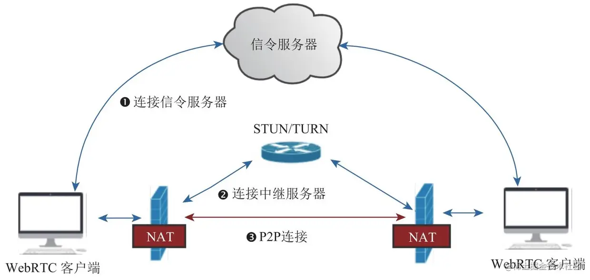
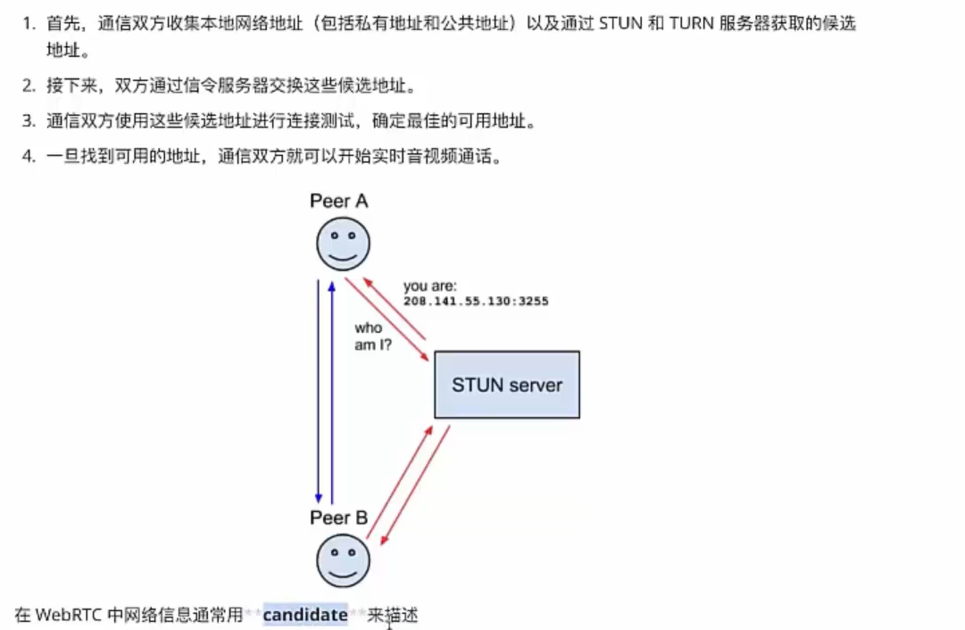
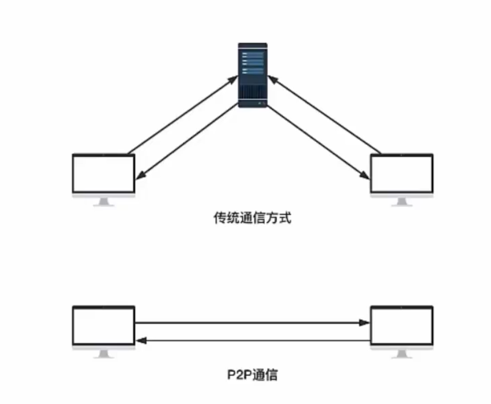
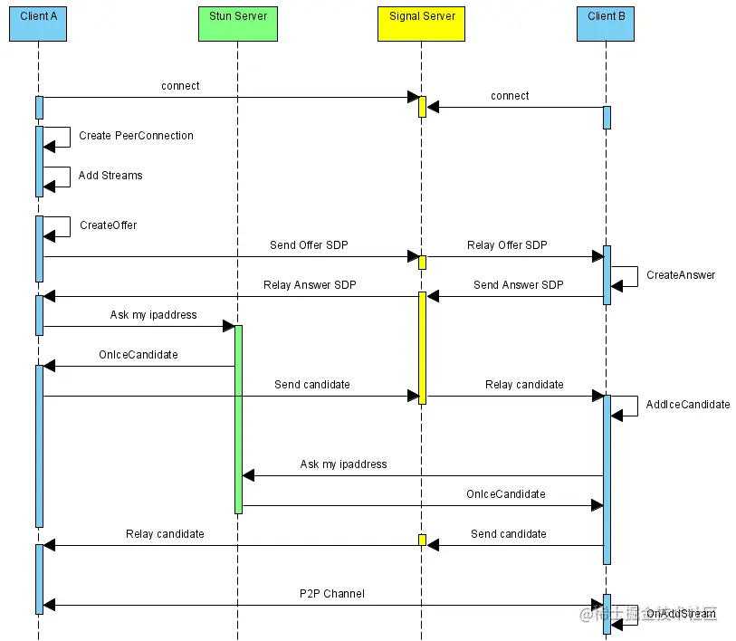
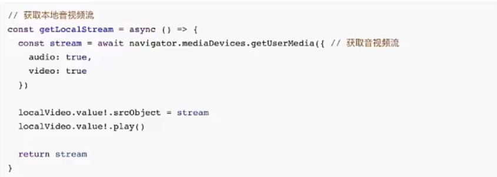
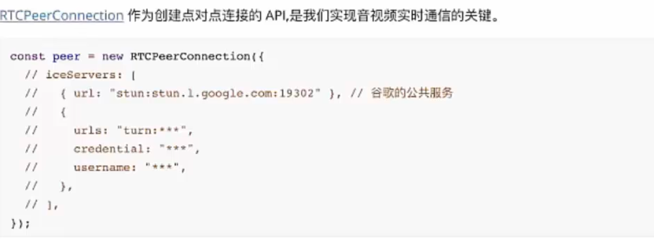
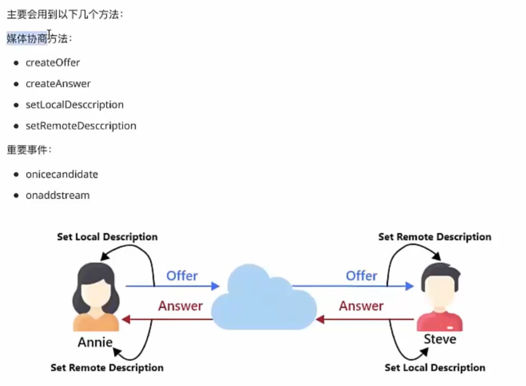
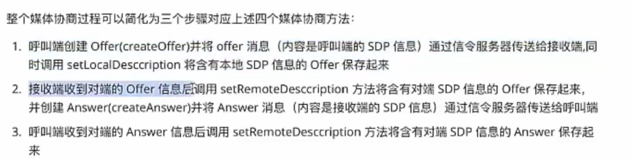
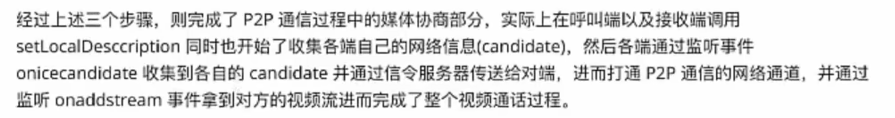
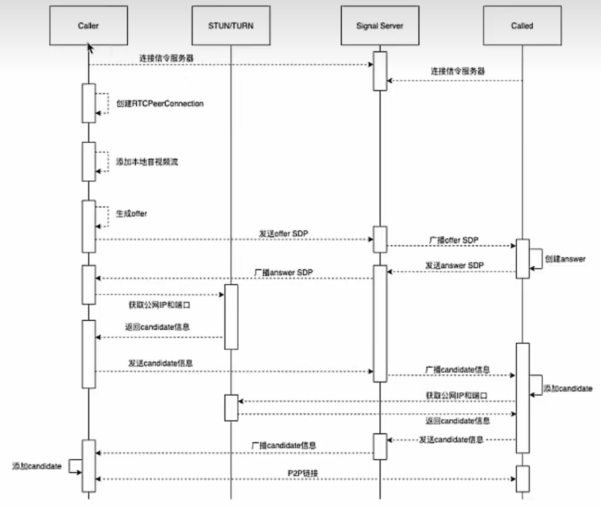

# 在线视频

## WebRTC

WebRTC(Web Real-Time Communications)是一项实时通讯技术，允许网络应用或者站点，在不借助中间媒介的情况下，建立浏览器之间点对点（Peer-to-Peer）的连接，实现视频流和音频流或者其他任意数据的传输。WebRTC包含的这些标准使用户在无需安装任何插件或者第三方的软件的情况下，创建点对点的数据分享或电话会议成为可能

### 应用场景

- 点对点视频聊天

- 多人视频会议

- 在线教育

- 直播

### WebRTC架构



> 通过WebRTC提供的API获取各端的媒体信息SDP以及网络信息candidate，并通过信令服务器交换，进而建立了两端的连接通道完成实现时视频语音通话

1、WebRTC客户端：负责生产/消费音视频数据，位于NAT之间，属于内网

2、NAT：Network Address Translation，网络地址转换，将内网IP地址转换为公网IP地址，用于跨越NAT的通信

3、信令服务器：用于传输SDP、candidate等信令数据

:::info

- 信令服务器signaling server：不仅可以交换彼此的媒体信息和网络信息，同样也可以管理房间信息


- SDP：Session Description Protocol，会话描述协议，用于描述媒体流的信息，比如音视频流的编解码格式、网络类型、媒体流的地址等

- ICE协议：Interactive Connectivity Establishment，交互式连接建立协议，用于在NAT穿越时，获取对方的地址信息
:::


:::info
ICE工作原理：


:::

4、STUN/TURN服务器（中继服务器）：

- STUN：用于位于NAT内的设备找到自己的公网地址。WebRTC客户端通过给处于公网的STUN服务器发送请求来获取自己的公网地址信息，以及是否能够被（穿过路由器）访问

- TURN：对于无法通过STUN服务器进行内网穿越的“对称型NAT”，可以借助TURN服务器作为中继服务器，通过TURN服务器对数据进行转发

### 点对点通信原理



1、客户端与信令服务器连接（双方需要通过信令服务器来了解对方的一些必要的信息）

2、与STUN建立连接，获得自己的外网IP地址和端口，以及是否能够进行内网穿越。不支持内网穿越的情况下需要连接TURN服务器进行中继通信。

3、WebRTC客户端拿到自己的外网IP地址和端口后，通过信令服务器将自己的信息交换给对方，当双方都获取到对方的地址后，就可以尝试NAT穿越，进行P2P连接了


### WebRTC实现点对点通信

1、检测本地音视频设备，采集音视频

2、通过信令服务器与对方建立连接

3、创建RTCPeerConnection对象

- 绑定音视频数据

- 进行媒体协商

- 交换candidate信息

4、音视频数据传输与渲染



### 常见API

#### 音视频采集`getUserMedia`


#### 核心对象RTCPeerConnection






## 实现

### 前端搭建

```shell
# 1、vue3+ts
npm create vite@latest webrtc-client -- --template vue-ts

# 2、引入tailwindcss
npm install -D tailwindcss postcss autoprefixer
npx tailwindcss init -p
```

:::tip
[tailwindcss使用](https://www.tailwindcss.cn/docs/installation)
:::

3、`tailwind.config.js`配置文件添加所有模板文件的路径

```js
/** @type {import('tailwindcss').Config} */
modules.exports = {
  content: [
    "./index.html",
    "./src/**/*.(vue,js,ts,jsx,tsx)",
  ],
  theme: {
    extend: {},
  },
  plugins: [],
}
```

连接信令服务器，需要安装`socket.io-client`

```js
<script setup lang="ts">
  // App.vue
  import { ref, onMounted, onUnmounted } from 'vue'
	import { io, Socket } from "socket.io-client";
  
  // ...
  const socket = ref<Socket>() // Socket实例
  
  onMounted(() => {
    const sock = io('localhost:3000'); // 对应服务的端口
    
    // 连接成功
    sock.on('connectionSuccess', () => {
      console.log('连接成功')
    });
    
    socket.value = sock;
  })
  
  // ...
</script>
```


### 后端搭建

创建`webrtc-server`文件夹，执行`npm init`

安装socket.io

```shell
npm install socket.io nodemon
```

编写`index.js`

```js
const socket = require('socket.io');
const http = require('http');

const server = http.createServer()

const io = socket(server, {
  cors: {
    origin: '*' // 配置跨域
  }
});

io.on('connection', sock => {
  console.log('连接成功...')
  // 向客户端发送连接成功的消息
  sock.emit('connectionSuccess');
})

server.listen(3000, () => {
  console.log('服务器启动成功');
});
```

### 整体思路

1、前端连接信令服务器

2、发起视频请求，连接成功加入房间

> 假设A是发起方，B是接收方

3、A发起视频请求通知B

> - A发起请求，通过信令服务器通知B
> 
> - B同意视频请求，并通过信令服务器通知A

4、开始交换SDP信息和candidate信息

> - A创建RTCPeerConnection，添加本地音视频流，生成offer，并且通过信令服务器将offer发送给B
> 
> - B收到A的offer
> 
> - B需要创建自己的RTCPeerConnection，添加本地音视频流，设置远端描述信息，生成answer，并通过信令服务器发送给A
> 
> - A收到B的answer
> 
> - A获取candidate信息并通过信令服务器发送candidate给B
> 
> - B添加A的candidate信息
> 
> - B获取candidate信息并通过信令服务器发送给A
> 
> - A添加B的candidate信息
>
> - A和B进行P2P通信流

5、挂断视频

> 恢复初始状态

### 其他库实现peerjs

[https://peerjs.com/docs/#start](https://peerjs.com/docs/#start)


## 参考

[https://juejin.cn/post/7071994793710075911](https://juejin.cn/post/7071994793710075911)

[https://www.bilibili.com/video/BV1Dc411Z71W/?spm_id_from=333.337.search-card.all.click&vd_source=c2b84cb781f449de214223923517efb2](https://www.bilibili.com/video/BV1Dc411Z71W/?spm_id_from=333.337.search-card.all.click&vd_source=c2b84cb781f449de214223923517efb2)

[https://blog.csdn.net/itcast_cn/article/details/131459604](https://blog.csdn.net/itcast_cn/article/details/131459604)