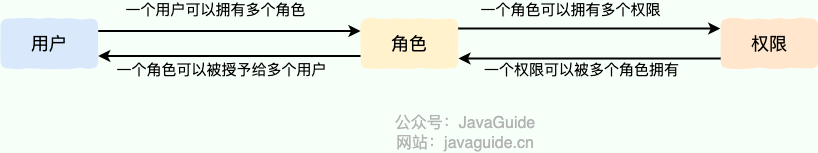

# 认证授权

## 认证Authentication
验证身份的凭据（例如用户名/用户ID和密码），通过这个凭据，系统得以知道你就是你，也就是说系统存在这个用户

## 授权Authorization
授权发生在认证之后，授权主要管理访问系统的权限，比如有些特定资源只能具有特定权限的人才能访问，比如admin，有些对系统资源操作，比如删除、添加、更新只能特定人具有

## RBAC模型

系统权限控制最常采用的访问控制模型就是RBAC模型

RBAC即`基于角色的权限访问控制（Role-Based Access Control）`，这是一种通过角色关联权限，角色同时又关联用户的授权的方式

一个用户可以拥有若干角色，每一个角色又可以被分配若干权限，这样就构成“用户-角色-权限”的授权模型。在这种模型中，用户与角色、角色与权限之间构成了多对多的关系




RBAC模型中，权限与角色相关联，用户通过成为包含特定角色的成员而得到这些角色的权限，这就极大地简化了权限的管理

## Cookie和Session

Cookie 和 Session 都是用来跟踪浏览器用户身份的会话方式，但是两者的应用场景不太一样。

Cookie 存放在客户端，一般用来保存用户信息

Session 的主要作用就是通过服务端记录用户的状态

Cookie 数据保存在客户端(浏览器端)，Session 数据保存在服务器端。相对来说 Session 安全性更高。如果使用 Cookie 的一些敏感信息不要写入 Cookie 中，最好能将 Cookie 信息加密然后使用到的时候再去服务器端解密。

### session-cookie身份验证
通过 SessionID 来实现特定的用户，SessionID 一般会选择存放在 Redis 中

使用 Session 的时候需要注意下面几个点：

- 依赖 Session 的关键业务一定要确保客户端开启了 Cookie

- 注意 Session 的过期时间

#### 没有cookie，session怎么用

一般是通过 Cookie 来保存 SessionID ，假如使用了 Cookie 保存 SessionID 的方案的话， 如果客户端禁用了 Cookie，那么 Session 就无法正常工作

但是，并不是没有 Cookie 之后就不能用 Session 了，比如可以将 SessionID 放在请求的 url 里面`https://javaguide.cn/?Session_id=xxx` 。这种方案的话可行，但是安全性和用户体验感降低。当然，为了安全也可以对 SessionID 进行一次加密之后再传入后端。

## JWT
JWT(JSON Web Token)是目前最流行的跨域认证解决方案，是一种基于Token的认证授权机制。

JWT本身也是Token，一种规范化之后的JSON结构的Token。

JWT自身包含了身份认证所需要的所有信息，因此，服务器不需要存储session信息。增加了系统的可用性和伸缩性，大大减轻了服务端的压力

使用 JWT 认证可以有效避免 CSRF 攻击，因为 JWT 一般是存在在 localStorage 中，使用 JWT 进行身份验证的过程中是不会涉及到 Cookie 的

### JWT的组成

本质是一组字符串，通过`.`切分成三个为Base64编码的部分：

- Header(头部)：描述JWT的元数据，定义了生成签名的算法以及`Token`的类型。Header被Base64Url编码后成为JWT的第一部分

> - `typ`（Type）：令牌类型，也就是JWT 
> 
> - `alg`（Algorithm）：签名算法，比如HS256

```
{
  "alg": "HS256",
  "typ": "JWT"
}
```

- Payload(载荷)：用来存放实际需要传递的数据，包含声明（claims），如sub（subject，主题）、jti（JWT ID）。payload被Base64Url编码后成为JWT的第二部分

> claims分为三种类型：
> 
> - Registered claims（注册声明）：预定义的声明
> 
> - Public claims（公有声明）：JWT签发方可以自定义的声明
> 
> - Private claims（私有声明）：JWT签发方因为项目需要而自定义的声明，更符合实际项目场景使用

```
下面是一些常见的注册声明：
iss（issuer）：JWT 签发方。
iat（issued at time）：JWT 签发时间。
sub（subject）：JWT 主题。
aud（audience）：JWT 接收方。
exp（expiration time）：JWT 的过期时间。
nbf（not before time）：JWT 生效时间，早于该定义的时间的 JWT 不能被接受处理。
jti（JWT ID）：JWT 唯一标识。
```

- Signature(签名)：服务器通过payload、header和一个密钥secret使用Header里面指定的签名算法生，生成的签名会成为JWT的第三部分


### JWT身份认证
服务器通过payload、header和secret创建JWT并将JWT发送给客户端。客户端接收到JWT之后，会将其保存在cookie或者localstorage里面，以后客户端发出的所有请求都会携带这个令牌

### JWT优势

1、无状态：不需要存储session信息，但也会导致不可控（比如想要在JWT有效期内废弃一个JWT或者更改它的权限的话，并不会立即生效，通常需要等到有效期过后才可以）

2、有效避免CSRF攻击：使用 JWT 进行身份验证不需要依赖 Cookie ，因此可以避免 CSRF 攻击

3、适合移动端应用：

> session不适合移动端：
> 
> - 状态管理：移动端应用通常是无状态的
> 
> - 兼容性：移动端应用通常会面向多个平台，如iOS、Android、Web。每个平台对session的管理和存储方式可能不同，可能导致跨平台兼容性的问题
> 
> - 安全性：移动设备通常处于不受信任的网络环境，存在数据泄露和攻击的风险

4、单点登录友好

### JWT问题及解决方案

1、注销后JWT仍然有效：

- 将JWT存入数据库：存到redis，如果需要让某个JWT失效，直接从redis删除即可

- 黑名单机制：在内存数据库如redis维护一个黑名单，如果想让某个JWT失效的话就直接将这个JWT加入到黑名单即可

- 修改密钥：为每个用户都创建一个专属密钥，如果想让某个JWT失效，直接修改对应用户的密钥即可

- 保持令牌的有效期短并经常轮换

2、JWT的续签问题：

> session认证的做法：假如 Session 的有效期 30 分钟，如果 30 分钟内用户有访问，就把 Session 有效期延长 30 分钟

- 类似session认证中的做法：假设服务端给的 JWT 有效期设置为 30 分钟，服务端每次进行校验时，如果发现 JWT 的有效期马上快过期了，服务端就重新生成 JWT 给客户端。客户端每次请求都检查新旧 JWT，如果不一致，则更新本地的 JWT。这种做法的问题是仅仅在快过期的时候请求才会更新 JWT ，对客户端不是很友好。

- 每次请求都返回新的JWT

- JWT有效期设置到半夜

- 用户登录返回两个JWT：

> - 第一个是 accessJWT ，它的过期时间 JWT 本身的过期时间比如半个小时
> 
> - 另外一个是 refreshJWT 它的过期时间更长一点比如为 1 天
> 
> refreshJWT 只用来获取 accessJWT，不容易被泄露
> 

3、JWT体积太大

- 尽量减少JWT Payload（载荷）中的信息，只保留必要的用户和权限信息

- 在传输JWT之前，使用压缩算法对JWT进行压缩以减少体积

- 在某些情况下，使用传统的token可能更合适

## SSO
SSO(Single Sign On)，单点登录。SSO是在多个应用系统中，用户只需要登录一次就可以访问所有相互信任的应用系统

### 实现

#### 单点登录


#### 单点登出


#### 支持跨域单点登录


#### 支持跨域单点登出


## OAuth2.0

OAuth 是一个行业的标准授权协议，主要用来授权第三方应用获取有限的权限。而 OAuth 2.0 是对 OAuth 1.0 的完全重新设计，OAuth 2.0 更快，更容易实现，OAuth 1.0 已经被废弃


## 权限系统设计

### 基于角色的访问控制RBAC

基于角色的访问控制（Role-Based Access Control，RBAC）

#### 原理

通过分析用户的实际情况，基于共同的职责和需求，授予他们不同角色，这种`用户->角色->权限`间的关系，可以不用再单独管理单个用户权限，用户从授予的角色里面获取所需的权限


### 基于属性的访问控制ABAC
基于属性的访问控制（Attribute-Bassed Access Control，ABAC）是一种比RBAC模型更加`灵活的授权模型`，原理是通过各种属性来动态判断一个操作是否可以被允许

思想是基于用户、访问的数据的属性、以及各种环境因素去动态计算用户是否有权限进行操作

#### 原理

一个操作是否被允许是基于对象、资源、操作和环境信息共同动态计算决定的

- 对象：对象是当前请求访问资源的用户。用户的属性包括ID、个人资源、角色，部门和组织成员身份等

- 资源：资源是当前用户要访问的资产或对象，例如文件、数据、服务器、甚至API

- 操作：操作是用户视图对资源进行的操作。常见的操作包括“读取”，“写入”，“编辑”，“复制”和“删除”

- 环境：环境是每个访问请求的上下文，环境属性包含访问的时间和位置，对象的设备，通信协议和加密强度等。


## 参考
[https://javaguide.cn/system-design/security/basis-of-authority-certification.html](https://javaguide.cn/system-design/security/basis-of-authority-certification.html)